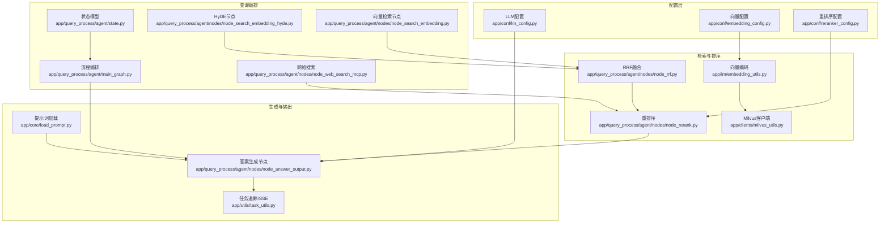
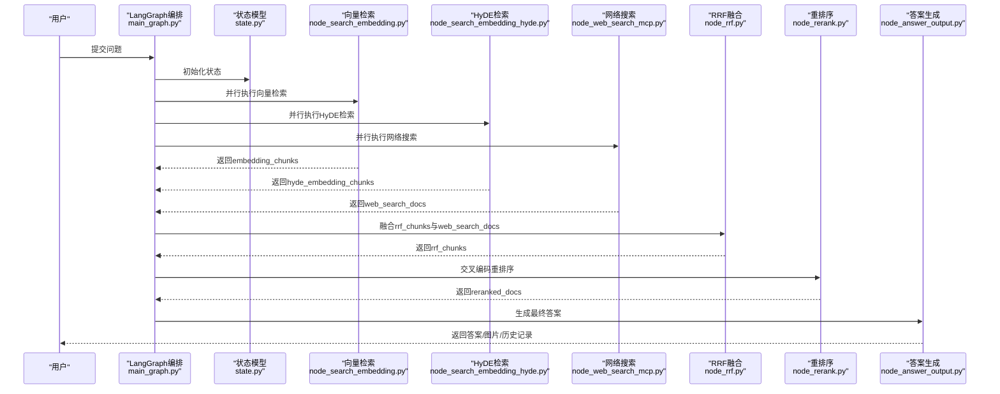
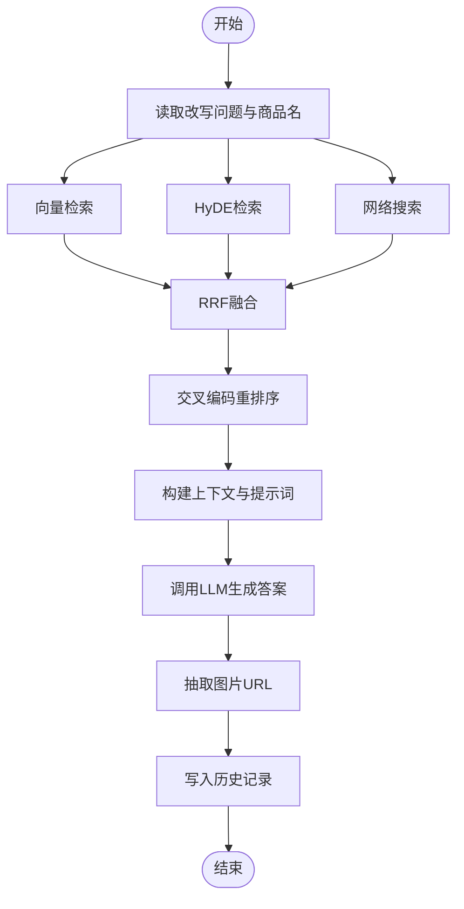
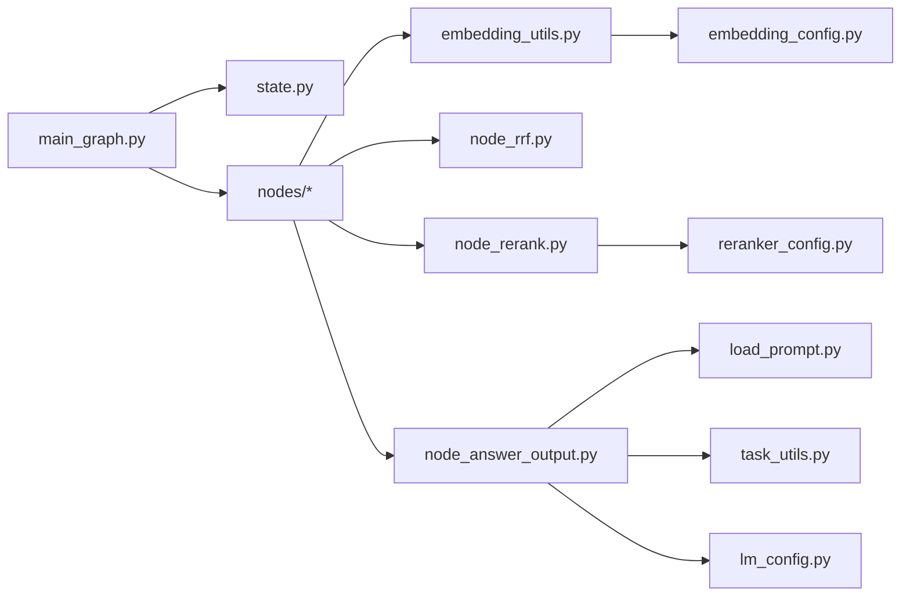

# LLM推理引擎

<cite>
**本文引用的文件**
- [app/conf/lm_config.py](file://app/conf/lm_config.py)
- [app/conf/embedding_config.py](file://app/conf/embedding_config.py)
- [app/conf/reranker_config.py](file://app/conf/reranker_config.py)
- [app/lm/embedding_utils.py](file://app/lm/embedding_utils.py)
- [app/lm/reranker_utils.py](file://app/lm/reranker_utils.py)
- [app/query_process/agent/state.py](file://app/query_process/agent/state.py)
- [app/query_process/agent/main_graph.py](file://app/query_process/agent/main_graph.py)
- [app/query_process/agent/nodes/node_search_embedding.py](file://app/query_process/agent/nodes/node_search_embedding.py)
- [app/query_process/agent/nodes/node_search_embedding_hyde.py](file://app/query_process/agent/nodes/node_search_embedding_hyde.py)
- [app/query_process/agent/nodes/node_web_search_mcp.py](file://app/query_process/agent/nodes/node_web_search_mcp.py)
- [app/query_process/agent/nodes/node_rrf.py](file://app/query_process/agent/nodes/node_rrf.py)
- [app/query_process/agent/nodes/node_rerank.py](file://app/query_process/agent/nodes/node_rerank.py)
- [app/query_process/agent/nodes/node_answer_output.py](file://app/query_process/agent/nodes/node_answer_output.py)
- [app/core/load_prompt.py](file://app/core/load_prompt.py)
- [app/utils/task_utils.py](file://app/utils/task_utils.py)
</cite>

## 目录
1. [简介](#简介)
2. [项目结构](#项目结构)
3. [核心组件](#核心组件)
4. [架构总览](#架构总览)
5. [详细组件分析](#详细组件分析)
6. [依赖分析](#依赖分析)
7. [性能考虑](#性能考虑)
8. [故障排查指南](#故障排查指南)
9. [结论](#结论)
10. [附录](#附录)

## 简介
本文件面向“LLM推理引擎”的技术文档，围绕以下目标展开：  
- LLM配置管理：模型选择、参数设置与资源分配  
- 提示词工程最佳实践：上下文构建、指令设计与输出格式化  
- 答案生成完整流程：从检索结果整合到最终回答输出  
- LLM调用的错误处理与重试策略  
- 模型性能优化：批处理与缓存策略  
- 配置示例与调用路径指引，以及常见问题解决方案  

该引擎采用LangGraph编排查询流程，结合向量检索（Milvus）、HyDE增强、跨源RRF融合、交叉编码重排序与最终答案生成，形成完整的RAG推理闭环。

## 项目结构
项目以功能域划分模块，核心链路由LangGraph定义，节点按职责拆分，配置通过dotenv集中注入，提示词模板统一管理，工具层负责任务状态与SSE推送。

图表来源
- [app/conf/lm_config.py:1-27](file://app/conf/lm_config.py#L1-L27)
- [app/conf/embedding_config.py:1-24](file://app/conf/embedding_config.py#L1-L24)
- [app/conf/reranker_config.py:1-21](file://app/conf/reranker_config.py#L1-L21)
- [app/lm/embedding_utils.py:1-108](file://app/lm/embedding_utils.py#L1-L108)
- [app/query_process/agent/nodes/node_rrf.py:1-124](file://app/query_process/agent/nodes/node_rrf.py#L1-L124)
- [app/query_process/agent/nodes/node_rerank.py:1-267](file://app/query_process/agent/nodes/node_rerank.py#L1-L267)
- [app/query_process/agent/nodes/node_search_embedding.py:1-94](file://app/query_process/agent/nodes/node_search_embedding.py#L1-L94)
- [app/query_process/agent/nodes/node_search_embedding_hyde.py:1-118](file://app/query_process/agent/nodes/node_search_embedding_hyde.py#L1-L118)
- [app/query_process/agent/nodes/node_web_search_mcp.py:1-113](file://app/query_process/agent/nodes/node_web_search_mcp.py#L1-L113)
- [app/query_process/agent/nodes/node_answer_output.py:1-352](file://app/query_process/agent/nodes/node_answer_output.py#L1-L352)
- [app/core/load_prompt.py:1-43](file://app/core/load_prompt.py#L1-L43)
- [app/utils/task_utils.py:1-187](file://app/utils/task_utils.py#L1-L187)

章节来源
- [app/query_process/agent/main_graph.py:1-47](file://app/query_process/agent/main_graph.py#L1-L47)
- [app/query_process/agent/state.py:1-97](file://app/query_process/agent/state.py#L1-L97)

## 核心组件
- 配置管理
  - LLM配置：基础URL、API Key、视觉语言模型、通用LLM模型、温度等，均来自环境变量注入。
  - 向量配置：BGE-M3本地路径、设备、半精度开关等。
  - 重排序配置：交叉编码器路径、设备、半精度开关等。
- 检索与排序
  - 向量编码：单例模式加载BGE-M3，生成稠密+稀疏混合向量，适配Milvus IP内积检索。
  - RRF融合：对同源多路召回结果进行倒排融合与加权排序。
  - 重排序：基于交叉编码器对候选文档进行精确打分与Top-K截断。
- 查询编排
  - 状态模型：定义会话ID、原始问题、检索/排序中间态、最终答案、改写问题、历史、是否流式等字段。
  - 流程编排：LangGraph定义节点与条件边，支持并行检索与条件分流。
- 生成与输出
  - 提示词工程：统一加载模板并渲染变量，构建上下文、历史与商品名等。
  - 答案生成：支持流式SSE与非流式结果写入，抽取图片链接，持久化对话历史。

章节来源
- [app/conf/lm_config.py:11-27](file://app/conf/lm_config.py#L11-L27)
- [app/conf/embedding_config.py:9-24](file://app/conf/embedding_config.py#L9-L24)
- [app/conf/reranker_config.py:9-21](file://app/conf/reranker_config.py#L9-L21)
- [app/lm/embedding_utils.py:5-108](file://app/lm/embedding_utils.py#L5-L108)
- [app/query_process/agent/nodes/node_rrf.py:50-76](file://app/query_process/agent/nodes/node_rrf.py#L50-L76)
- [app/query_process/agent/nodes/node_rerank.py:68-160](file://app/query_process/agent/nodes/node_rerank.py#L68-L160)
- [app/query_process/agent/state.py:5-49](file://app/query_process/agent/state.py#L5-L49)
- [app/core/load_prompt.py:5-28](file://app/core/load_prompt.py#L5-L28)
- [app/query_process/agent/nodes/node_answer_output.py:105-134](file://app/query_process/agent/nodes/node_answer_output.py#L105-L134)

## 架构总览
下图展示从用户问题到最终答案输出的端到端流程，涵盖检索、融合、重排序与生成各环节。

图表来源
- [app/query_process/agent/main_graph.py:12-47](file://app/query_process/agent/main_graph.py#L12-L47)
- [app/query_process/agent/state.py:35-68](file://app/query_process/agent/state.py#L35-L68)
- [app/query_process/agent/nodes/node_search_embedding.py:12-72](file://app/query_process/agent/nodes/node_search_embedding.py#L12-L72)
- [app/query_process/agent/nodes/node_search_embedding_hyde.py:70-92](file://app/query_process/agent/nodes/node_search_embedding_hyde.py#L70-L92)
- [app/query_process/agent/nodes/node_web_search_mcp.py:54-90](file://app/query_process/agent/nodes/node_web_search_mcp.py#L54-L90)
- [app/query_process/agent/nodes/node_rrf.py:50-76](file://app/query_process/agent/nodes/node_rrf.py#L50-L76)
- [app/query_process/agent/nodes/node_rerank.py:162-208](file://app/query_process/agent/nodes/node_rerank.py#L162-L208)
- [app/query_process/agent/nodes/node_answer_output.py:214-249](file://app/query_process/agent/nodes/node_answer_output.py#L214-L249)

## 详细组件分析

### 配置管理与资源分配
- LLM配置
  - 通过环境变量注入基础URL、API Key、模型名与温度，保证多环境一致性与安全性。
  - 适用于通用LLM调用与HyDE生成。
- 向量配置
  - BGE-M3本地路径、设备与半精度开关，支持CPU/GPU切换与混合精度加速。
  - 单例模式避免重复初始化，提升批量处理效率。
- 重排序配置
  - 交叉编码器路径、设备与半精度开关，保障重排序性能与稳定性。

章节来源
- [app/conf/lm_config.py:11-27](file://app/conf/lm_config.py#L11-L27)
- [app/conf/embedding_config.py:9-24](file://app/conf/embedding_config.py#L9-L24)
- [app/conf/reranker_config.py:9-21](file://app/conf/reranker_config.py#L9-L21)
- [app/lm/embedding_utils.py:5-48](file://app/lm/embedding_utils.py#L5-L48)
- [app/lm/reranker_utils.py:6-14](file://app/lm/reranker_utils.py#L6-L14)

### 提示词工程最佳实践
- 上下文构建
  - 从重排序后的文档中拼接文本、来源、标题与分数，控制上下文字符上限，避免超出模型上下文窗口。
  - 合并历史对话，按角色拼接，同样受字符上限约束。
- 指令设计
  - 使用统一模板加载器，按需渲染变量，确保提示词可维护与可复用。
- 输出格式化
  - 答案生成后抽取图片URL，支持SSE流式与非流式两种输出形态，便于前端展示。

章节来源
- [app/query_process/agent/nodes/node_answer_output.py:38-102](file://app/query_process/agent/nodes/node_answer_output.py#L38-L102)
- [app/core/load_prompt.py:5-28](file://app/core/load_prompt.py#L5-L28)

### 答案生成完整流程
- 检索阶段
  - 向量检索：生成问题向量，混合查询Milvus，返回切片列表。
  - HyDE检索：先生成假设性答案，再对“问题+假设性答案”进行向量检索。
  - 网络搜索：调用外部搜索引擎补充信息。
- 融合与重排序
  - RRF融合：对同源召回结果进行倒排融合与加权排序。
  - 重排序：交叉编码器对候选文档打分，动态Top-K截断。
- 生成与输出
  - 构建提示词，调用LLM生成答案；支持流式SSE与非流式结果写入；抽取图片URL并持久化历史。

图表来源
- [app/query_process/agent/nodes/node_search_embedding.py:12-72](file://app/query_process/agent/nodes/node_search_embedding.py#L12-L72)
- [app/query_process/agent/nodes/node_search_embedding_hyde.py:70-92](file://app/query_process/agent/nodes/node_search_embedding_hyde.py#L70-L92)
- [app/query_process/agent/nodes/node_web_search_mcp.py:54-90](file://app/query_process/agent/nodes/node_web_search_mcp.py#L54-L90)
- [app/query_process/agent/nodes/node_rrf.py:50-76](file://app/query_process/agent/nodes/node_rrf.py#L50-L76)
- [app/query_process/agent/nodes/node_rerank.py:162-208](file://app/query_process/agent/nodes/node_rerank.py#L162-L208)
- [app/query_process/agent/nodes/node_answer_output.py:214-249](file://app/query_process/agent/nodes/node_answer_output.py#L214-L249)

章节来源
- [app/query_process/agent/nodes/node_search_embedding.py:12-72](file://app/query_process/agent/nodes/node_search_embedding.py#L12-L72)
- [app/query_process/agent/nodes/node_search_embedding_hyde.py:70-92](file://app/query_process/agent/nodes/node_search_embedding_hyde.py#L70-L92)
- [app/query_process/agent/nodes/node_web_search_mcp.py:54-90](file://app/query_process/agent/nodes/node_web_search_mcp.py#L54-L90)
- [app/query_process/agent/nodes/node_rrf.py:50-76](file://app/query_process/agent/nodes/node_rrf.py#L50-L76)
- [app/query_process/agent/nodes/node_rerank.py:162-208](file://app/query_process/agent/nodes/node_rerank.py#L162-L208)
- [app/query_process/agent/nodes/node_answer_output.py:214-249](file://app/query_process/agent/nodes/node_answer_output.py#L214-L249)

### LLM调用的错误处理与重试策略
- 错误传播
  - 向量编码与模型初始化异常向上抛出，由调用方捕获并决定重试/降级。
- 重试策略
  - 网络搜索节点内置最大重试次数，连接、工具列举与调用均在finally中清理资源，避免泄漏。
- 任务追踪与SSE
  - 通过任务工具记录节点运行/完成状态，配合SSE推送进度与结果，便于前端感知与重试触发。

章节来源
- [app/lm/embedding_utils.py:46-48](file://app/lm/embedding_utils.py#L46-L48)
- [app/query_process/agent/nodes/node_web_search_mcp.py:34-51](file://app/query_process/agent/nodes/node_web_search_mcp.py#L34-L51)
- [app/utils/task_utils.py:68-109](file://app/utils/task_utils.py#L68-L109)

### 模型性能优化
- 批处理
  - 向量编码返回稠密+稀疏混合向量，适配批量输入，减少多次往返开销。
- 缓存与单例
  - BGE-M3与重排序模型采用单例模式，避免重复初始化与显存占用。
- 资源分配
  - 通过配置项选择设备与半精度，兼顾速度与精度；在GPU可用时优先使用CUDA。
- Top-K与断崖截断
  - 重排序阶段采用动态Top-K与断崖阈值，减少无效文档参与生成，降低LLM调用成本。

章节来源
- [app/lm/embedding_utils.py:51-96](file://app/lm/embedding_utils.py#L51-L96)
- [app/lm/reranker_utils.py:6-14](file://app/lm/reranker_utils.py#L6-L14)
- [app/query_process/agent/nodes/node_rerank.py:100-160](file://app/query_process/agent/nodes/node_rerank.py#L100-L160)

## 依赖分析
- 组件耦合
  - LangGraph编排与节点解耦，状态模型贯穿全链路，便于扩展新节点。
  - 检索与排序模块依赖Milvus客户端与嵌入模型，重排序依赖交叉编码器。
- 外部依赖
  - Milvus：混合向量检索与排序。
  - 外部搜索：百炼MCPServerStreamableHTTP。
  - LLM：通用LLM与HyDE生成。

图表来源
- [app/query_process/agent/main_graph.py:12-47](file://app/query_process/agent/main_graph.py#L12-L47)
- [app/query_process/agent/state.py:35-68](file://app/query_process/agent/state.py#L35-L68)
- [app/query_process/agent/nodes/node_answer_output.py:38-102](file://app/query_process/agent/nodes/node_answer_output.py#L38-L102)
- [app/core/load_prompt.py:5-28](file://app/core/load_prompt.py#L5-L28)
- [app/utils/task_utils.py:68-109](file://app/utils/task_utils.py#L68-L109)
- [app/conf/embedding_config.py:9-24](file://app/conf/embedding_config.py#L9-L24)
- [app/conf/reranker_config.py:9-21](file://app/conf/reranker_config.py#L9-L21)
- [app/conf/lm_config.py:11-27](file://app/conf/lm_config.py#L11-L27)

## 性能考虑
- 向量编码
  - 使用单例与批量输入，避免重复初始化与多次I/O。
  - 半精度与设备选择直接影响吞吐与延迟。
- 检索与排序
  - RRF融合与交叉编码重排序在Top-K截断后显著降低LLM输入规模。
- 生成阶段
  - 流式SSE可提前感知部分结果，改善用户体验；非流式适合一次性结果聚合。
- 任务与监控
  - 通过任务追踪与SSE推送，实现端到端可观测性，便于定位瓶颈。

## 故障排查指南
- 向量模型初始化失败
  - 现象：初始化异常并抛出。
  - 排查：检查本地模型路径、设备可用性与半精度开关；查看日志详细信息。
- 重排序模型加载失败
  - 现象：重排序节点报错。
  - 排查：确认交叉编码器路径、设备与半精度配置正确。
- 网络搜索超时或失败
  - 现象：MCPServer调用异常。
  - 排查：检查基础URL、API Key、超时设置与最大重试次数；确保finally中资源清理。
- 上下文过长
  - 现象：生成结果质量下降或截断。
  - 排查：降低上下文字符上限或减少Top-K数量。
- 任务状态异常
  - 现象：SSE进度不更新或结果缺失。
  - 排查：检查任务追踪内存态与SSE推送队列；确认节点运行/完成状态同步。

章节来源
- [app/lm/embedding_utils.py:46-48](file://app/lm/embedding_utils.py#L46-L48)
- [app/lm/reranker_utils.py:6-14](file://app/lm/reranker_utils.py#L6-L14)
- [app/query_process/agent/nodes/node_web_search_mcp.py:34-51](file://app/query_process/agent/nodes/node_web_search_mcp.py#L34-L51)
- [app/query_process/agent/nodes/node_answer_output.py:13-13](file://app/query_process/agent/nodes/node_answer_output.py#L13-L13)
- [app/utils/task_utils.py:68-109](file://app/utils/task_utils.py#L68-L109)

## 结论
本推理引擎通过LangGraph编排、多路检索与重排序、统一提示词工程与SSE流式输出，实现了高效稳定的RAG推理流程。配置层以dotenv集中注入，组件层以单例与Top-K截断优化性能，错误处理与任务追踪保障可观测性与可维护性。建议在生产环境中结合硬件能力合理配置设备与半精度，持续监控任务状态与SSE推送，以获得最佳吞吐与体验。

## 附录
- 配置示例（环境变量）
  - LLM相关：OPENAI_BASE_URL、OPENAI_API_KEY、VL_MODEL、LLM_DEFAULT_MODEL、LLM_DEFAULT_TEMPERATURE
  - 向量相关：BGE_M3_PATH、BGE_M3、BGE_DEVICE、BGE_FP16
  - 重排序相关：BGE_RERANKER_LARGE、BGE_RERANKER_DEVICE、BGE_RERANKER_FP16
  - 网络搜索相关：BAILIAN_MCP_BASE_URL、BAILIAN_API_KEY
- 调用路径指引
  - 检索：向量检索节点 → RRF融合 → 重排序 → 答案生成
  - HyDE：答案生成节点 → 向量编码 → 混合查询 → RRF融合
  - 网络搜索：MCPServerStreamableHTTP → 结果解析 → RRF融合
- 常见问题
  - 模型加载失败：检查路径与设备；启用半精度需确认驱动支持
  - 上下文超限：减少Top-K或裁剪历史
  - 网络不稳定：增加重试次数与超时时间