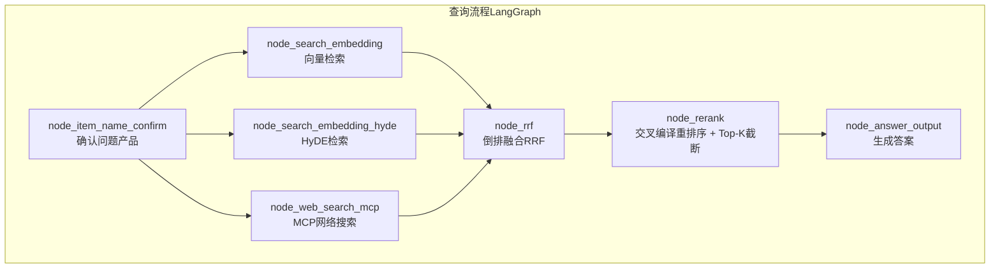
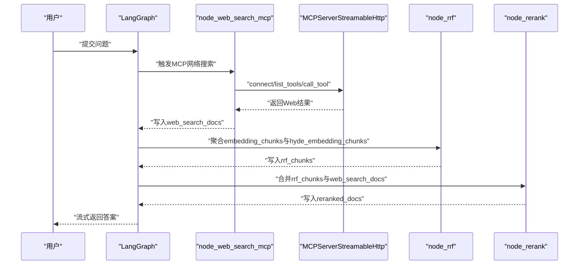
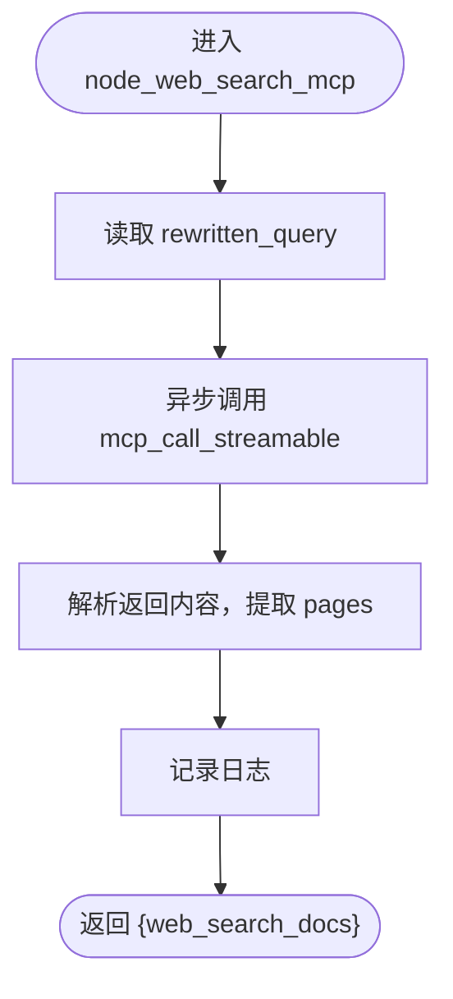
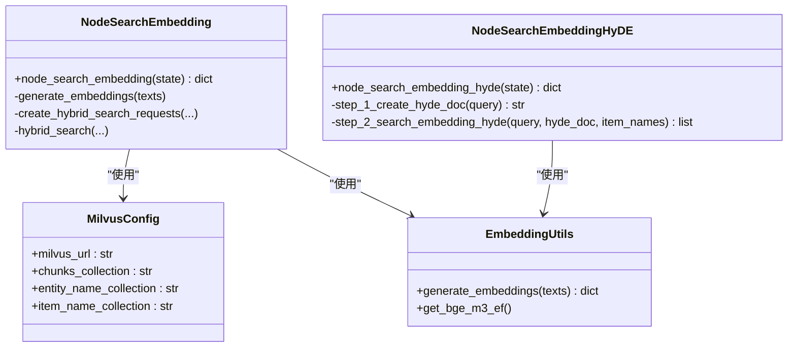
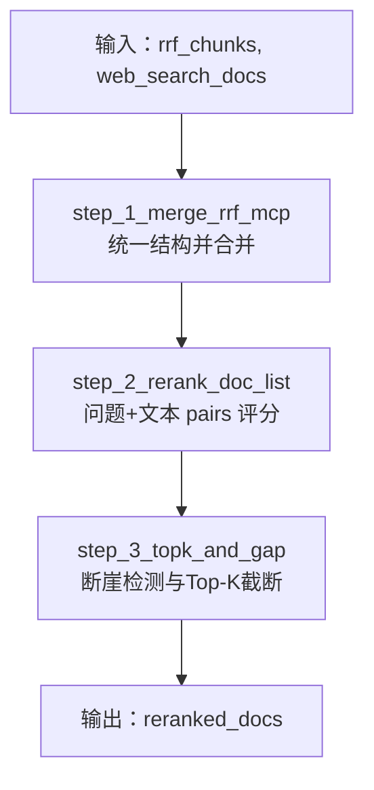

# 外部搜索集成

<cite>
**本文引用的文件**
- [node_web_search_mcp.py](file://app/query_process/agent/nodes/node_web_search_mcp.py)
- [bailian_mcp_config.py](file://app/conf/bailian_mcp_config.py)
- [main_graph.py](file://app/query_process/agent/main_graph.py)
- [state.py](file://app/query_process/agent/state.py)
- [node_rrf.py](file://app/query_process/agent/nodes/node_rrf.py)
- [node_rerank.py](file://app/query_process/agent/nodes/node_rerank.py)
- [reranker_utils.py](file://app/lm/reranker_utils.py)
- [reranker_config.py](file://app/conf/reranker_config.py)
- [node_search_embedding.py](file://app/query_process/agent/nodes/node_search_embedding.py)
- [node_search_embedding_hyde.py](file://app/query_process/agent/nodes/node_search_embedding_hyde.py)
- [milvus_config.py](file://app/conf/milvus_config.py)
- [embedding_utils.py](file://app/lm/embedding_utils.py)
- [task_utils.py](file://app/utils/task_utils.py)
- [logger.py](file://app/core/logger.py)
- [sse_utils.py](file://app/utils/sse_utils.py)
</cite>

## 目录
1. [简介](#简介)
2. [项目结构](#项目结构)
3. [核心组件](#核心组件)
4. [架构总览](#架构总览)
5. [详细组件分析](#详细组件分析)
6. [依赖分析](#依赖分析)
7. [性能考虑](#性能考虑)
8. [故障排除指南](#故障排除指南)
9. [结论](#结论)
10. [附录](#附录)

## 简介
本文件面向外部搜索集成的技术文档，聚焦于MCP（Model Context Protocol）网络搜索在RAG查询流程中的实现与集成。文档涵盖以下要点：
- MCP网络搜索的调用机制与配置
- 多源信息融合策略（RRF同源融合 + Web结果合并 + 交叉编译重排序）
- 外部搜索与内部向量检索的协同工作方式
- 搜索结果过滤与排序的实现方法
- 具体集成示例与可用性监控、降级策略建议

## 项目结构
外部搜索集成位于查询流程的Agent子系统中，采用LangGraph编排节点，形成“问题确认 → 多路检索 → 融合排序 → 重排序与Top-K截断 → 答案生成”的链路。

图表来源
- [main_graph.py:12-47](file://app/query_process/agent/main_graph.py#L12-L47)

章节来源
- [main_graph.py:1-47](file://app/query_process/agent/main_graph.py#L1-L47)
- [state.py:5-49](file://app/query_process/agent/state.py#L5-L49)

## 核心组件
- MCP网络搜索节点：负责调用外部MCP服务发起网络搜索，并将结果注入状态供后续融合。
- 配置模块：提供MCP服务地址与鉴权信息的读取。
- 多路检索节点：向量检索与HyDE检索，产出本地召回结果。
- RRF融合节点：对同源多路结果进行倒排融合排序。
- 重排序节点：将RRF结果与Web结果合并，使用交叉编译模型重排序，并基于断崖阈值进行Top-K截断。
- 工具与基础设施：任务状态跟踪、日志、SSE流式推送、向量嵌入与Milvus配置。

章节来源
- [node_web_search_mcp.py:16-91](file://app/query_process/agent/nodes/node_web_search_mcp.py#L16-L91)
- [bailian_mcp_config.py:10-18](file://app/conf/bailian_mcp_config.py#L10-L18)
- [node_rrf.py:50-76](file://app/query_process/agent/nodes/node_rrf.py#L50-L76)
- [node_rerank.py:24-208](file://app/query_process/agent/nodes/node_rerank.py#L24-L208)
- [node_search_embedding.py:12-72](file://app/query_process/agent/nodes/node_search_embedding.py#L12-L72)
- [node_search_embedding_hyde.py:70-92](file://app/query_process/agent/nodes/node_search_embedding_hyde.py#L70-L92)
- [task_utils.py:68-109](file://app/utils/task_utils.py#L68-L109)
- [logger.py:46-83](file://app/core/logger.py#L46-L83)
- [sse_utils.py:43-98](file://app/utils/sse_utils.py#L43-L98)

## 架构总览
外部搜索与内部向量检索协同工作，形成“同源（向量/HyDE）+ 异源（Web）”的多源召回，随后进行RRF融合与交叉编译重排序，最终输出高质量的上下文用于答案生成。

图表来源
- [node_web_search_mcp.py:16-51](file://app/query_process/agent/nodes/node_web_search_mcp.py#L16-L51)
- [node_rrf.py:50-76](file://app/query_process/agent/nodes/node_rrf.py#L50-L76)
- [node_rerank.py:162-208](file://app/query_process/agent/nodes/node_rerank.py#L162-L208)
- [main_graph.py:26-45](file://app/query_process/agent/main_graph.py#L26-L45)

## 详细组件分析

### MCP网络搜索节点（node_web_search_mcp）
- 职责：以异步方式调用MCP服务，执行“bailian_web_search”工具，解析返回的页面列表并写入状态。
- 关键行为：
  - 读取MCP基础URL与API Key（来自配置模块）
  - 创建可流式的MCPServer对象，建立连接、列举工具、调用工具并清理资源
  - 解析返回的JSON文本，提取pages作为web_search_docs
  - 记录任务状态并返回结果字典
- 输入输出：
  - 输入：state["rewritten_query"]
  - 输出：{"web_search_docs": [...]}
- 异常与超时：连接超时参数与最大重试次数在构造函数中设定；最终通过cleanup保证资源释放

图表来源
- [node_web_search_mcp.py:54-91](file://app/query_process/agent/nodes/node_web_search_mcp.py#L54-L91)

章节来源
- [node_web_search_mcp.py:16-91](file://app/query_process/agent/nodes/node_web_search_mcp.py#L16-L91)
- [bailian_mcp_config.py:10-18](file://app/conf/bailian_mcp_config.py#L10-L18)

### MCP调用实现（mcp_call_streamable）
- 职责：封装MCPServerStreamableHttp的生命周期，连接、列举工具、调用工具、清理。
- 关键点：
  - 通过配置对象传入URL与Authorization头
  - 调用工具名为“bailian_web_search”，参数包含query与count
  - 返回结果经JSON解析后交由节点处理

章节来源
- [node_web_search_mcp.py:16-51](file://app/query_process/agent/nodes/node_web_search_mcp.py#L16-L51)

### 配置模块（bailian_mcp_config）
- 职责：从环境变量读取MCP服务地址与API Key，封装为McpConfig对象。
- 关键点：使用dotenv加载.env；字段名与MCP调用处保持一致。

章节来源
- [bailian_mcp_config.py:10-18](file://app/conf/bailian_mcp_config.py#L10-L18)

### 多路检索（向量与HyDE）
- 向量检索节点：
  - 生成问题的稠密/稀疏混合向量
  - 构造混合查询请求，限定item_name范围，调用Milvus混合检索
  - 返回embedding_chunks
- HyDE检索节点：
  - 以提示词引导LLM生成假设性答案
  - 将“问题+假设性答案”拼接后生成混合向量并检索
  - 返回hyde_embedding_chunks

图表来源
- [node_search_embedding.py:12-72](file://app/query_process/agent/nodes/node_search_embedding.py#L12-L72)
- [node_search_embedding_hyde.py:70-92](file://app/query_process/agent/nodes/node_search_embedding_hyde.py#L70-L92)
- [milvus_config.py:12-26](file://app/conf/milvus_config.py#L12-L26)
- [embedding_utils.py:51-96](file://app/lm/embedding_utils.py#L51-L96)

章节来源
- [node_search_embedding.py:12-72](file://app/query_process/agent/nodes/node_search_embedding.py#L12-L72)
- [node_search_embedding_hyde.py:70-92](file://app/query_process/agent/nodes/node_search_embedding_hyde.py#L70-L92)
- [milvus_config.py:12-26](file://app/conf/milvus_config.py#L12-L26)
- [embedding_utils.py:51-96](file://app/lm/embedding_utils.py#L51-L96)

### RRF同源融合（node_rrf）
- 职责：对同源多路召回结果（向量/HyDE）进行倒排融合排序，得到rrf_chunks。
- 关键点：
  - 为每路结果按rank计算RRF得分并加权融合
  - 去重保留chunk_id，最终按得分降序取Top-K

章节来源
- [node_rrf.py:7-48](file://app/query_process/agent/nodes/node_rrf.py#L7-L48)
- [node_rrf.py:50-76](file://app/query_process/agent/nodes/node_rrf.py#L50-L76)

### 重排序与Top-K截断（node_rerank）
- 职责：将RRF结果与Web结果合并，使用交叉编译模型重排序，并基于断崖阈值截断Top-K。
- 关键流程：
  - step_1_merge_rrf_mcp：将rrf_chunks与web_search_docs合并为统一结构
  - step_2_rerank_doc_list：以重写问题与候选文本对构建pairs，调用交叉编译模型compute_score并归一化
  - step_3_topk_and_gap：双指针扫描相邻分数差，依据绝对阈值与相对阈值决定截断位置
- 输出：reranked_docs

图表来源
- [node_rerank.py:24-208](file://app/query_process/agent/nodes/node_rerank.py#L24-L208)

章节来源
- [node_rerank.py:24-208](file://app/query_process/agent/nodes/node_rerank.py#L24-L208)

### 交叉编译重排序模型
- 模型封装：通过reranker_utils获取FlagReranker单例，配置来自reranker_config。
- 关键点：设备选择、是否半精度、模型路径均来自环境变量。

章节来源
- [reranker_utils.py:6-14](file://app/lm/reranker_utils.py#L6-L14)
- [reranker_config.py:9-21](file://app/conf/reranker_config.py#L9-L21)

### 任务状态与流式输出
- 任务状态：task_utils维护每个session的任务运行/完成列表与状态，支持中文节点名映射与SSE推送。
- 流式输出：sse_utils提供SSE事件打包、队列管理与生成器，结合task_push_queue实时推送进度。

章节来源
- [task_utils.py:68-109](file://app/utils/task_utils.py#L68-L109)
- [task_utils.py:174-179](file://app/utils/task_utils.py#L174-L179)
- [sse_utils.py:43-98](file://app/utils/sse_utils.py#L43-L98)

## 依赖分析
- 组件耦合：
  - MCP节点依赖配置模块与MCP客户端库
  - 向量与HyDE节点依赖Milvus客户端与嵌入工具
  - RRF与Rerank节点依赖状态结构与嵌入/重排序工具
- 外部依赖：
  - MCP服务（百炼Web搜索工具）
  - Milvus向量数据库
  - 交叉编译重排序模型（FlagReranker）

```mermaid
graph LR
MCP["node_web_search_mcp"] --> CFG["bailian_mcp_config"]
MCP --> MCPPkg["MCPServerStreamableHttp"]
EMB["node_search_embedding"] --> MILVUS["milvus_config"]
EMB --> EMBU["embedding_utils"]
HYDE["node_search_embedding_hyde"] --> EMBU
RRF["node_rrf"] --> STATE["state.py"]
RERANK["node_rerank"] --> STATE
RERANK --> RERANKU["reranker_utils"]
RERANKU --> RERANKCFG["reranker_config"]
```

图表来源
- [node_web_search_mcp.py:9-13](file://app/query_process/agent/nodes/node_web_search_mcp.py#L9-L13)
- [node_search_embedding.py:4-10](file://app/query_process/agent/nodes/node_search_embedding.py#L4-L10)
- [node_search_embedding_hyde.py:6-13](file://app/query_process/agent/nodes/node_search_embedding_hyde.py#L6-L13)
- [node_rrf.py:1-4](file://app/query_process/agent/nodes/node_rrf.py#L1-L4)
- [node_rerank.py:6-10](file://app/query_process/agent/nodes/node_rerank.py#L6-L10)
- [reranker_utils.py:1-2](file://app/lm/reranker_utils.py#L1-L2)
- [reranker_config.py:2-7](file://app/conf/reranker_config.py#L2-L7)

章节来源
- [node_web_search_mcp.py:9-13](file://app/query_process/agent/nodes/node_web_search_mcp.py#L9-L13)
- [node_search_embedding.py:4-10](file://app/query_process/agent/nodes/node_search_embedding.py#L4-L10)
- [node_search_embedding_hyde.py:6-13](file://app/query_process/agent/nodes/node_search_embedding_hyde.py#L6-L13)
- [node_rrf.py:1-4](file://app/query_process/agent/nodes/node_rrf.py#L1-L4)
- [node_rerank.py:6-10](file://app/query_process/agent/nodes/node_rerank.py#L6-L10)
- [reranker_utils.py:1-2](file://app/lm/reranker_utils.py#L1-L2)
- [reranker_config.py:2-7](file://app/conf/reranker_config.py#L2-L7)

## 性能考虑
- 异步调用：MCP调用采用异步方式，降低等待阻塞，提升并发能力。
- 单例模型：嵌入与重排序模型均采用单例缓存，避免重复初始化带来的开销。
- 归一化与混合检索：嵌入向量启用L2归一化，适配Milvus内积检索，提升检索效率。
- Top-K动态截断：基于断崖阈值的Top-K截断减少无效上下文，提升生成质量与速度。
- 日志与SSE：异步日志与SSE推送支持可观测性，便于性能监控与问题定位。

## 故障排除指南
- MCP调用失败
  - 检查MCP基础URL与API Key是否正确配置
  - 查看连接超时与重试参数设置
  - 确认工具名称与参数格式符合服务端要求
- Web结果为空
  - 确认rewritten_query语义清晰，必要时调整提示词或预处理
  - 检查网络连通性与代理设置
- 重排序异常
  - 确认交叉编译模型路径与设备配置正确
  - 检查输入文本与问题pairs是否为空或异常
- 任务状态与流式输出
  - 检查SSE队列是否存在与客户端是否断开
  - 确认任务状态推送逻辑与中文节点名映射

章节来源
- [node_web_search_mcp.py:16-51](file://app/query_process/agent/nodes/node_web_search_mcp.py#L16-L51)
- [bailian_mcp_config.py:10-18](file://app/conf/bailian_mcp_config.py#L10-L18)
- [reranker_utils.py:6-14](file://app/lm/reranker_utils.py#L6-L14)
- [sse_utils.py:54-98](file://app/utils/sse_utils.py#L54-L98)
- [task_utils.py:174-179](file://app/utils/task_utils.py#L174-L179)

## 结论
本方案通过MCP网络搜索与内部向量检索的协同，实现了“同源+异源”的多源召回；借助RRF融合与交叉编译重排序，有效提升了检索质量与上下文相关性；配合任务状态与SSE流式输出，提供了良好的可观测性与用户体验。建议在生产环境中结合可用性监控与降级策略，确保在外部服务不稳定时仍能提供稳定的服务。

## 附录

### 外部搜索服务配置清单
- MCP基础URL：从环境变量读取
- API Key：从环境变量读取
- 工具名称：bailian_web_search
- 请求参数：query、count

章节来源
- [bailian_mcp_config.py:10-18](file://app/conf/bailian_mcp_config.py#L10-L18)
- [node_web_search_mcp.py:42-48](file://app/query_process/agent/nodes/node_web_search_mcp.py#L42-L48)

### 多源信息融合策略
- 同源融合（RRF）：对向量与HyDE结果进行倒排融合，保留去重后的高分片段
- 异源融合（Web）：将MCP返回的页面列表统一结构后与RRF结果合并
- 重排序与Top-K：使用交叉编译模型对合并后的候选项进行精排，并基于断崖阈值截断

章节来源
- [node_rrf.py:7-48](file://app/query_process/agent/nodes/node_rrf.py#L7-L48)
- [node_rerank.py:24-208](file://app/query_process/agent/nodes/node_rerank.py#L24-L208)

### 外部服务可用性监控与降级策略
- 可用性监控
  - 通过日志记录MCP调用耗时、成功率与错误类型
  - 使用SSE推送任务进度，便于前端感知服务状态
- 降级策略
  - 当MCP调用失败或超时时，回退至仅使用本地向量与HyDE结果
  - 适当降低Web搜索的count或调整重排序阈值，减少外部依赖

章节来源
- [logger.py:46-83](file://app/core/logger.py#L46-L83)
- [task_utils.py:174-179](file://app/utils/task_utils.py#L174-L179)