# 提示词系统

<cite>
**本文档引用的文件**
- [load_prompt.py](file://app/core/load_prompt.py)
- [answer_out.prompt](file://prompts/answer_out.prompt)
- [hyde_prompt.prompt](file://prompts/hyde_prompt.prompt)
- [image_summary.prompt](file://prompts/image_summary.prompt)
- [item_name_recognition.prompt](file://prompts/item_name_recognition.prompt)
- [product_recognition_system.prompt](file://prompts/product_recognition_system.prompt)
- [main_graph.py](file://app/query_process/agent/main_graph.py)
- [state.py](file://app/query_process/agent/state.py)
- [node_answer_output.py](file://app/query_process/agent/nodes/node_answer_output.py)
- [node_item_name_confirm.py](file://app/query_process/agent/nodes/node_item_name_confirm.py)
- [node_rerank.py](file://app/query_process/agent/nodes/node_rerank.py)
- [main_graph.py](file://app/import_process/agent/main_graph.py)
- [state.py](file://app/import_process/agent/state.py)
- [node_entry.py](file://app/import_process/agent/nodes/node_entry.py)
- [node_pdf_to_md.py](file://app/import_process/agent/nodes/node_pdf_to_md.py)
- [node_document_split.py](file://app/import_process/agent/nodes/node_document_split.py)
- [path_util.py](file://app/utils/path_util.py)
- [logger.py](file://app/core/logger.py)
- [pyproject.toml](file://pyproject.toml)
- [docker-compose.yml](file://docker-compose.yml)
</cite>

## 目录
1. [简介](#简介)
2. [项目结构](#项目结构)
3. [核心组件](#核心组件)
4. [架构概览](#架构概览)
5. [详细组件分析](#详细组件分析)
6. [依赖关系分析](#依赖关系分析)
7. [性能考量](#性能考量)
8. [故障排查指南](#故障排查指南)
9. [结论](#结论)

## 简介
本项目是一个基于 LangGraph 的提示词系统，结合 RAG（检索增强生成）与多路检索策略，提供从知识库导入到问答生成的完整流程。系统通过统一的提示词模板管理与渲染机制，支持多种提示词类型的动态组装与变量替换，同时具备完善的日志记录、任务跟踪与错误处理能力。系统分为两条主线：
- 导入流程：将 PDF/MD 文档转换为结构化内容，进行切片、向量化并导入 Milvus 向量数据库，随后进行知识图谱导入。
- 查询流程：对用户问题进行商品名识别与重写，采用混合检索（向量 + 网络搜索）与重排序，最终由大模型生成答案并支持图片抽取与历史记录存储。

## 项目结构
项目采用模块化组织，核心目录包括：
- app/core：核心工具与提示词加载
- app/query_process：查询流程（LangGraph 图、节点、状态）
- app/import_process：导入流程（LangGraph 图、节点、状态）
- prompts：提示词模板文件
- app/utils：通用工具（路径、任务、SSE 等）
- app/lm：语言模型与重排序工具
- app/clients：外部服务客户端（Milvus、MongoDB、MinIO 等）
- volumes：Docker 持久化卷
- docker-compose.yml：容器编排配置

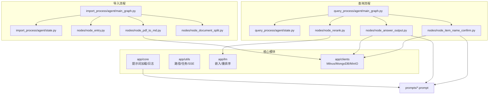

**图表来源**
- [main_graph.py:1-47](file://app/query_process/agent/main_graph.py#L1-L47)
- [main_graph.py:1-134](file://app/import_process/agent/main_graph.py#L1-L134)
- [load_prompt.py:1-43](file://app/core/load_prompt.py#L1-L43)

**章节来源**
- [pyproject.toml:1-38](file://pyproject.toml#L1-L38)
- [docker-compose.yml:1-56](file://docker-compose.yml#L1-L56)

## 核心组件
- 提示词加载器：负责从 prompts 目录读取模板文件，支持变量占位符渲染，提供统一的提示词装配能力。
- LangGraph 图与状态：分别定义查询与导入两条主流程的节点编排与状态流转。
- 节点实现：涵盖商品名识别、重写、混合检索、重排序、答案生成、图片抽取与历史记录等关键环节。
- 工具与客户端：路径解析、日志记录、任务跟踪、SSE 推送、嵌入与重排序模型、Milvus/MongoDB/MinIO 客户端等。

**章节来源**
- [load_prompt.py:1-43](file://app/core/load_prompt.py#L1-L43)
- [state.py:1-97](file://app/query_process/agent/state.py#L1-L97)
- [state.py:1-99](file://app/import_process/agent/state.py#L1-L99)

## 架构概览
系统采用分层架构：
- 表现层：FastAPI 服务（未在本节展开）
- 流程编排层：LangGraph StateGraph 定义节点与边，实现流程控制与状态传递。
- 业务逻辑层：各节点实现具体功能，包括提示词渲染、检索、重排序、生成与后处理。
- 数据与服务层：向量数据库（Milvus）、文档存储（MongoDB）、对象存储（MinIO）、外部 API（MinerU）等。

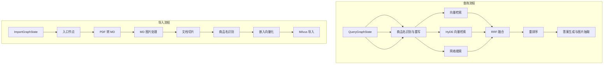

**图表来源**
- [main_graph.py:1-47](file://app/query_process/agent/main_graph.py#L1-L47)
- [main_graph.py:1-134](file://app/import_process/agent/main_graph.py#L1-L134)

## 详细组件分析

### 提示词系统与模板管理
- 统一加载：通过提示词加载器读取 prompts 目录下的模板文件，支持变量占位符渲染，便于在不同节点中复用与定制。
- 模板类型：
  - 答案生成：answer_out.prompt，用于最终答案生成的提示词模板，包含参考内容、历史对话、相关商品与用户问题等字段。
  - HyDE：hyde_prompt.prompt，用于生成假设性回答范文，提升向量检索质量。
  - 图片摘要：image_summary.prompt，用于生成图片标题的简要总结。
  - 商品名识别：item_name_recognition.prompt，用于从文件名与正文切片中识别商品名称。
  - 商品识别系统：product_recognition_system.prompt，作为商品识别专家的角色提示。

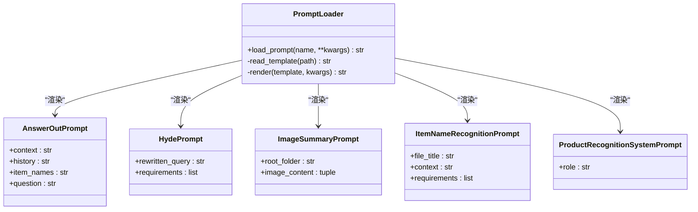

**图表来源**
- [load_prompt.py:1-43](file://app/core/load_prompt.py#L1-L43)
- [answer_out.prompt:1-22](file://prompts/answer_out.prompt#L1-L22)
- [hyde_prompt.prompt:1-8](file://prompts/hyde_prompt.prompt#L1-L8)
- [image_summary.prompt:1-2](file://prompts/image_summary.prompt#L1-L2)
- [item_name_recognition.prompt:1-10](file://prompts/item_name_recognition.prompt#L1-L10)
- [product_recognition_system.prompt:1-1](file://prompts/product_recognition_system.prompt#L1-L1)

**章节来源**
- [load_prompt.py:1-43](file://app/core/load_prompt.py#L1-L43)
- [answer_out.prompt:1-22](file://prompts/answer_out.prompt#L1-L22)
- [hyde_prompt.prompt:1-8](file://prompts/hyde_prompt.prompt#L1-L8)
- [image_summary.prompt:1-2](file://prompts/image_summary.prompt#L1-L2)
- [item_name_recognition.prompt:1-10](file://prompts/item_name_recognition.prompt#L1-L10)
- [product_recognition_system.prompt:1-1](file://prompts/product_recognition_system.prompt#L1-L1)

### 查询流程：LangGraph 图与状态
- 图结构：定义节点（商品名识别、向量检索、HyDE 检索、网络搜索、RRF 融合、重排序、答案生成）与边，支持条件路由与并行分支。
- 状态结构：QueryGraphState 统一承载检索中间结果、排序结果、生成提示词与最终答案，以及会话、历史、重写问题与流式标记等辅助信息。

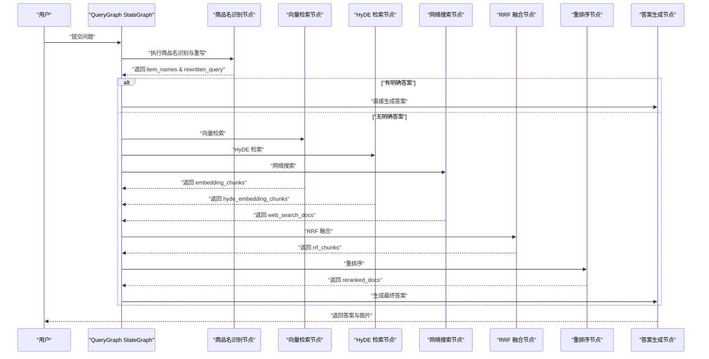

**图表来源**
- [main_graph.py:1-47](file://app/query_process/agent/main_graph.py#L1-L47)
- [state.py:1-97](file://app/query_process/agent/state.py#L1-L97)

**章节来源**
- [main_graph.py:1-47](file://app/query_process/agent/main_graph.py#L1-L47)
- [state.py:1-97](file://app/query_process/agent/state.py#L1-L97)

### 导入流程：LangGraph 图与状态
- 图结构：入口节点根据文件类型选择 PDF 或 MD 路径，后续依次执行 PDF 转 MD、MD 图片处理、文档切片、商品名识别、嵌入向量化与 Milvus 导入。
- 状态结构：ImportGraphState 定义任务 ID、文件路径、内容数据、切片列表与向量化内容等字段，支持默认状态创建与覆盖。

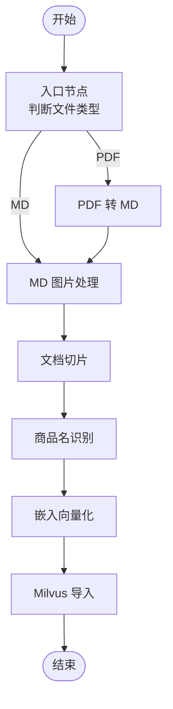

**图表来源**
- [main_graph.py:1-134](file://app/import_process/agent/main_graph.py#L1-L134)
- [state.py:1-99](file://app/import_process/agent/state.py#L1-L99)

**章节来源**
- [main_graph.py:1-134](file://app/import_process/agent/main_graph.py#L1-L134)
- [state.py:1-99](file://app/import_process/agent/state.py#L1-L99)

### 节点实现与处理逻辑

#### 答案生成与图片抽取（node_answer_output）
- 功能要点：
  - 检查状态中是否已有答案，支持流式（SSE）与非流式两种输出模式。
  - 从重排序结果中拼装上下文，限制提示词长度，生成最终提示词。
  - 调用大模型生成答案，抽取本地与网络来源中的图片链接，写入历史记录。
- 关键流程：

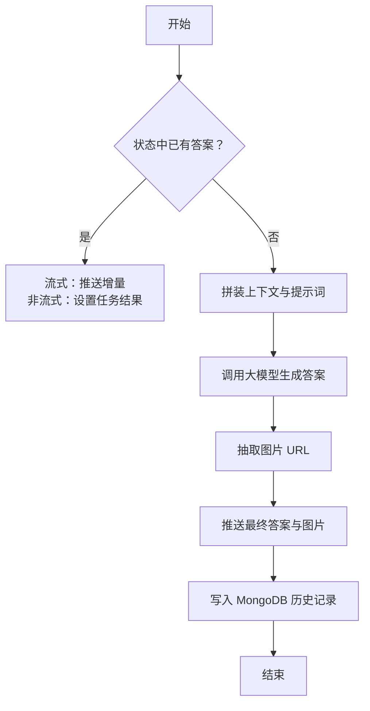

**图表来源**
- [node_answer_output.py:1-352](file://app/query_process/agent/nodes/node_answer_output.py#L1-L352)

**章节来源**
- [node_answer_output.py:1-352](file://app/query_process/agent/nodes/node_answer_output.py#L1-L352)

#### 商品名识别与重写（node_item_name_confirm）
- 功能要点：
  - 从历史对话与当前问题中提取商品名并重写问题，提升检索召回。
  - 对提取的商品名进行向量数据库混合检索，按分数区分“确定”与“可选”集合。
  - 若仅有“确定”集合，则进入下一阶段；若有“可选”集合或无匹配，则直接给出引导性答案。
- 关键流程：

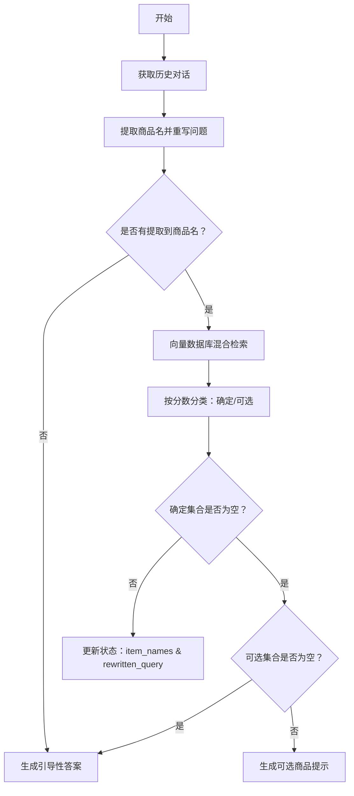

**图表来源**
- [node_item_name_confirm.py:1-316](file://app/query_process/agent/nodes/node_item_name_confirm.py#L1-L316)

**章节来源**
- [node_item_name_confirm.py:1-316](file://app/query_process/agent/nodes/node_item_name_confirm.py#L1-L316)

#### 重排序与 TopK 选择（node_rerank）
- 功能要点：
  - 合并 RRF 与网络搜索结果，统一为文档列表。
  - 使用交叉编码器模型对候选文档进行精确打分与排序。
  - 基于断崖阈值与动态 TopK 规则，自动选择合适的候选数量。
- 关键流程：

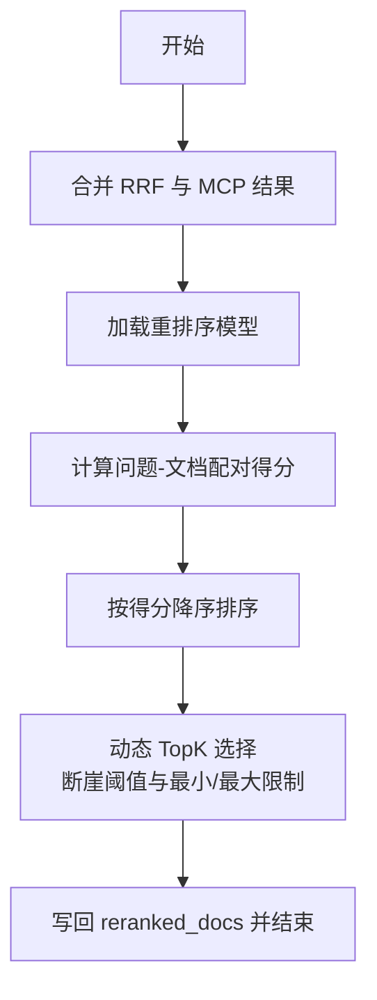

**图表来源**
- [node_rerank.py:1-267](file://app/query_process/agent/nodes/node_rerank.py#L1-L267)

**章节来源**
- [node_rerank.py:1-267](file://app/query_process/agent/nodes/node_rerank.py#L1-L267)

#### PDF 转 MD（node_pdf_to_md）
- 功能要点：
  - 与外部 MinerU 服务交互，上传 PDF 并轮询获取解析结果。
  - 下载并解压返回的 ZIP 包，定位目标 MD 文件，统一命名并读取内容。
- 关键流程：

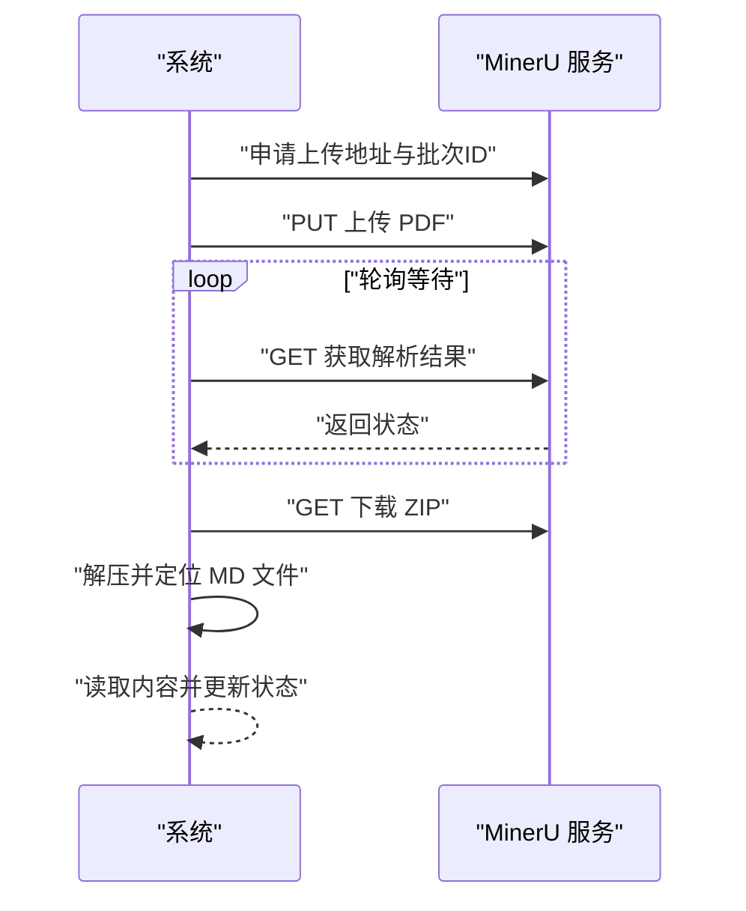

**图表来源**
- [node_pdf_to_md.py:1-318](file://app/import_process/agent/nodes/node_pdf_to_md.py#L1-L318)

**章节来源**
- [node_pdf_to_md.py:1-318](file://app/import_process/agent/nodes/node_pdf_to_md.py#L1-L318)

#### 文档切片（node_document_split）
- 功能要点：
  - 基于 Markdown 标题层级进行语义粗切，再对过长段落进行细粒度切分与短块合并。
  - 生成包含元数据（标题、父标题、片段编号）的切片列表，并备份至本地。
- 关键流程：

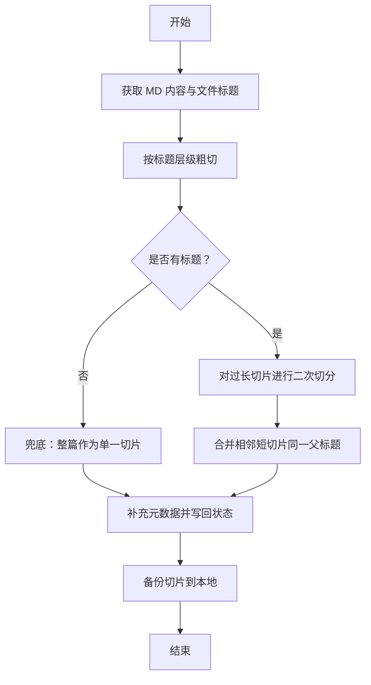

**图表来源**
- [node_document_split.py:1-255](file://app/import_process/agent/nodes/node_document_split.py#L1-L255)

**章节来源**
- [node_document_split.py:1-255](file://app/import_process/agent/nodes/node_document_split.py#L1-L255)

## 依赖关系分析
- 语言与框架：FastAPI、LangGraph、Loguru、Pydantic、NumPy、Pandas、OpenAI LangChain 生态等。
- 数据与存储：Milvus（向量数据库）、MongoDB（对话历史）、MinIO（对象存储）、Neo4j（知识图谱，未在本节展开）。
- 外部服务：MinerU（PDF 解析）、OpenAI/LangChain 模型服务（未在本节展开）。

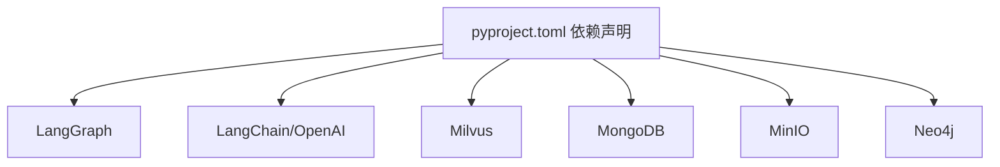

**图表来源**
- [pyproject.toml:1-38](file://pyproject.toml#L1-L38)

**章节来源**
- [pyproject.toml:1-38](file://pyproject.toml#L1-L38)
- [docker-compose.yml:1-56](file://docker-compose.yml#L1-L56)

## 性能考量
- 提示词长度控制：在答案生成阶段对上下文长度进行限制，避免超出模型上下文窗口。
- 动态 TopK 与断崖检测：在重排序阶段通过断崖阈值与动态 TopK 规则，减少无效候选，提高检索效率。
- 并行与条件路由：查询流程中向量检索、HyDE 检索与网络搜索并行执行，缩短整体延迟。
- 日志与任务跟踪：统一日志配置与任务状态上报，便于性能监控与问题定位。

## 故障排查指南
- 提示词加载失败：检查提示词文件是否存在与路径是否正确，确认变量占位符与渲染参数一致。
- PDF 转 MD 失败：检查 MinerU 接口状态、上传地址与轮询逻辑，关注超时与错误码处理。
- 向量检索异常：核对 Milvus 集合名称、向量维度与索引配置，确保嵌入模型输出格式正确。
- 答案生成异常：检查历史对话与上下文拼装逻辑，确认提示词模板字段齐全。
- 日志定位：利用统一日志工具的堆栈穿透修复，准确定位业务模块调用位置。

**章节来源**
- [logger.py:1-109](file://app/core/logger.py#L1-L109)
- [node_pdf_to_md.py:1-318](file://app/import_process/agent/nodes/node_pdf_to_md.py#L1-L318)
- [node_answer_output.py:1-352](file://app/query_process/agent/nodes/node_answer_output.py#L1-L352)

## 结论
本提示词系统通过统一的模板管理与渲染机制，结合 LangGraph 的流程编排能力，实现了从知识导入到问答生成的完整闭环。系统在提示词装配、检索融合、重排序与答案生成等关键环节均提供了清晰的扩展点与优化空间，能够满足复杂场景下的 RAG 应用需求。建议在生产环境中进一步完善模型配置、缓存策略与监控告警体系，以提升稳定性与性能表现。