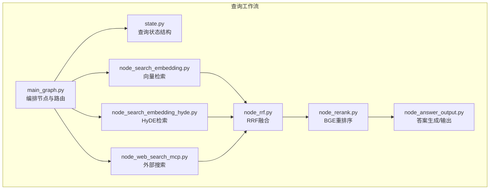
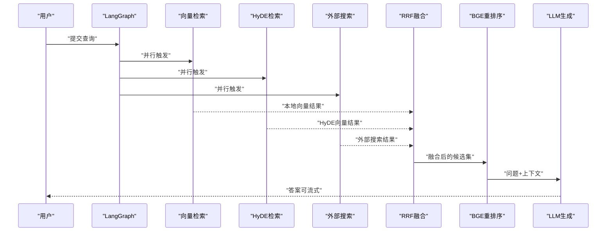
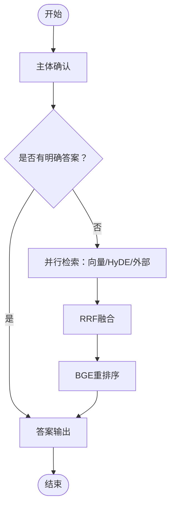
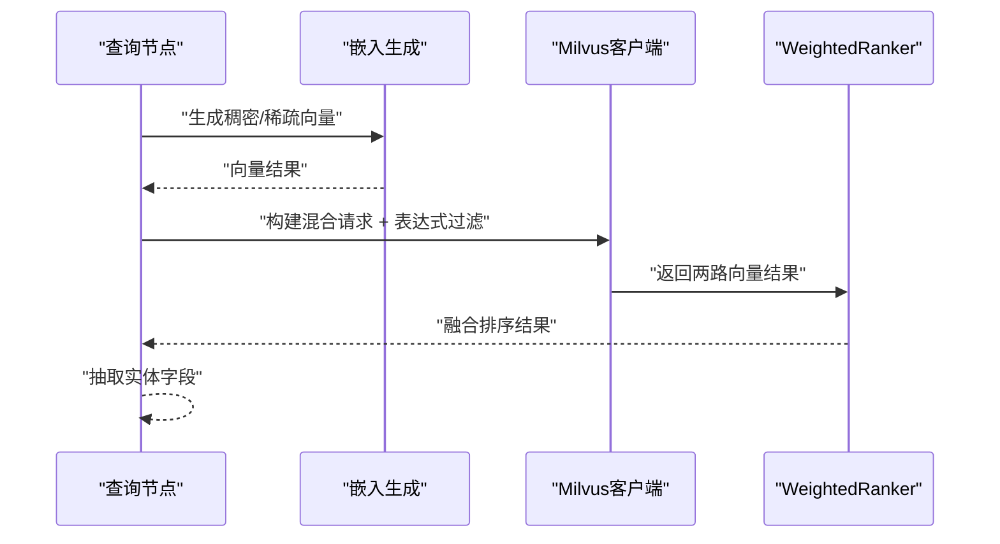
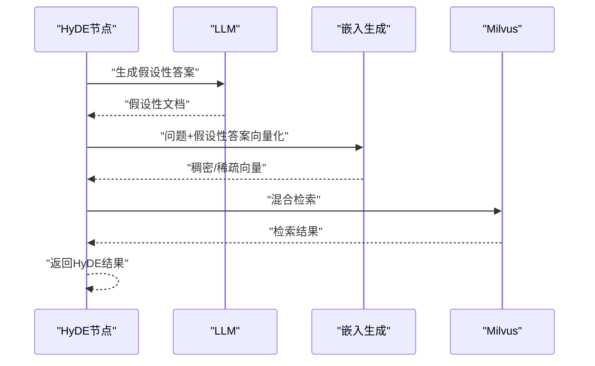
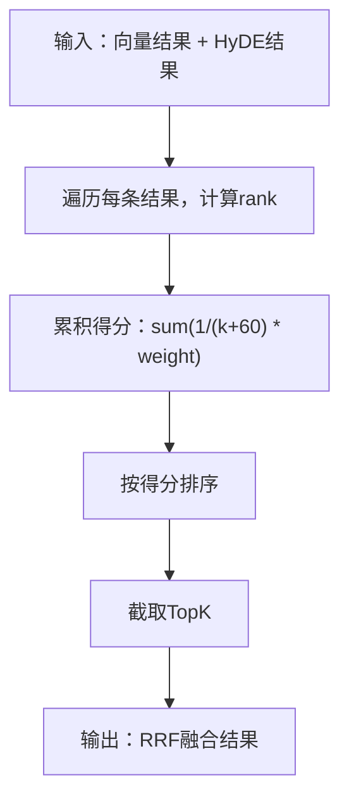
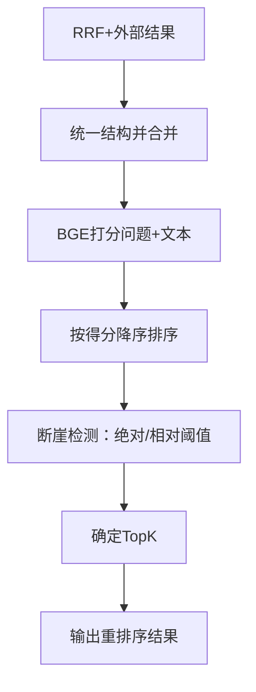
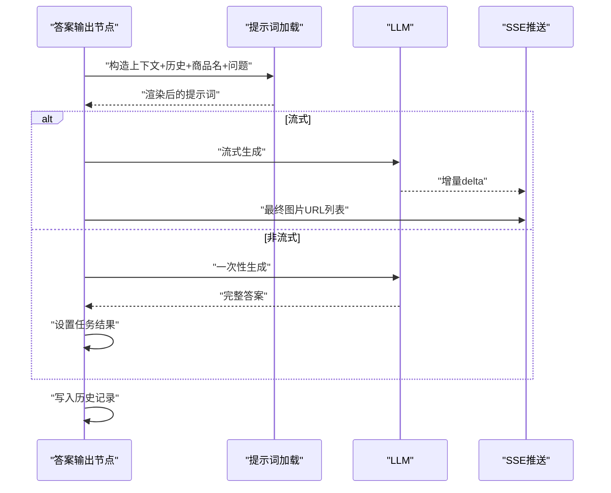
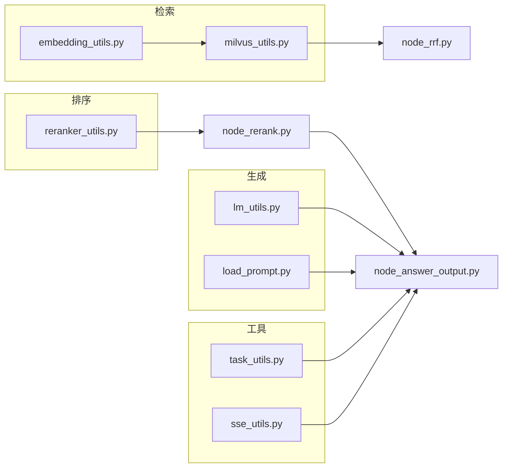

# 查询处理系统

<cite>
**本文引用的文件**
- [main_graph.py](file://app/query_process/agent/main_graph.py)
- [state.py](file://app/query_process/agent/state.py)
- [node_search_embedding.py](file://app/query_process/agent/nodes/node_search_embedding.py)
- [node_search_embedding_hyde.py](file://app/query_process/agent/nodes/node_search_embedding_hyde.py)
- [node_rrf.py](file://app/query_process/agent/nodes/node_rrf.py)
- [node_rerank.py](file://app/query_process/agent/nodes/node_rerank.py)
- [node_web_search_mcp.py](file://app/query_process/agent/nodes/node_web_search_mcp.py)
- [node_answer_output.py](file://app/query_process/agent/nodes/node_answer_output.py)
- [embedding_utils.py](file://app/lm/embedding_utils.py)
- [reranker_utils.py](file://app/lm/reranker_utils.py)
- [milvus_utils.py](file://app/clients/milvus_utils.py)
- [milvus_config.py](file://app/conf/milvus_config.py)
- [reranker_config.py](file://app/conf/reranker_config.py)
- [task_utils.py](file://app/utils/task_utils.py)
- [sse_utils.py](file://app/utils/sse_utils.py)
- [load_prompt.py](file://app/core/load_prompt.py)
- [lm_utils.py](file://app/lm/lm_utils.py)
</cite>

## 目录
1. [简介](#简介)
2. [项目结构](#项目结构)
3. [核心组件](#核心组件)
4. [架构总览](#架构总览)
5. [详细组件分析](#详细组件分析)
6. [依赖关系分析](#依赖关系分析)
7. [性能考量](#性能考量)
8. [故障排查指南](#故障排查指南)
9. [结论](#结论)
10. [附录](#附录)

## 简介
本文件面向查询处理系统，系统以LangGraph编排查询工作流，采用并行检索与条件路由策略，结合混合向量检索、HyDE（Hypothetical Document Embeddings）增强召回、RRF（Reciprocal Rank Fusion）融合排序、BGE重排序模型精排、外部网络搜索与知识图谱集成、以及LLM推理与答案生成。文档重点涵盖：
- 查询工作流的并行处理与条件路由
- 语义搜索与HyDE实现
- BGE重排序算法原理与参数调优
- RRF融合策略与排序质量评估
- LLM推理与提示词工程、输出格式化
- 外部搜索与知识图谱集成
- 查询性能优化与缓存策略

## 项目结构
查询处理系统主要位于 app/query_process 目录，围绕“状态驱动的有向无环图（DAG）”组织节点与流程。核心目录与文件如下：
- agent：工作流编排与状态定义
  - main_graph.py：定义节点、边与条件路由
  - state.py：定义查询状态结构与默认值
  - nodes：各处理节点实现
- lm：语言模型与嵌入工具
  - embedding_utils.py：BGE-M3混合向量生成
  - reranker_utils.py：BGE重排序模型加载
  - lm_utils.py：LLM客户端与缓存
- clients：外部服务客户端
  - milvus_utils.py：Milvus混合检索
  - neo4j_utils.py：知识图谱客户端（文件存在）
- conf：配置
  - milvus_config.py、reranker_config.py、lm_config.py 等
- utils：通用工具
  - task_utils.py：任务追踪与SSE推送
  - sse_utils.py：SSE事件与流式输出
  - 其他辅助工具

图表来源
- [main_graph.py:12-47](file://app/query_process/agent/main_graph.py#L12-L47)
- [state.py:5-69](file://app/query_process/agent/state.py#L5-L69)

章节来源
- [main_graph.py:1-47](file://app/query_process/agent/main_graph.py#L1-L47)
- [state.py:1-97](file://app/query_process/agent/state.py#L1-L97)

## 核心组件
- 查询状态（QueryGraphState）
  - 保存会话ID、原始问题、中间与最终结果、辅助信息（商品名、改写问题、历史、流式标记等）
  - 提供默认状态创建与深拷贝复制，避免状态污染
- LangGraph编排
  - 节点：主体确认、向量检索、HyDE检索、外部搜索、RRF融合、BGE重排序、答案输出
  - 条件路由：主体确认后并行触发多路检索，汇聚后进入排序与生成
- 并行处理与条件路由
  - 主体确认节点后，同时触发向量检索、HyDE检索与外部搜索，三路结果汇聚
  - 若主体确认阶段已有明确答案，直接进入答案输出节点

章节来源
- [state.py:5-69](file://app/query_process/agent/state.py#L5-L69)
- [main_graph.py:26-44](file://app/query_process/agent/main_graph.py#L26-L44)

## 架构总览
系统采用“并行检索 + 条件路由 + 多路融合 + 精排 + 生成”的流水线式架构。核心链路：
- 输入问题经主体识别与改写，触发并行检索（向量、HyDE、外部）
- 同源（向量/HyDE）使用RRF融合，跨源（本地/外部）统一整合
- BGE交叉编码器进行精排，动态TopK截断
- LLM基于提示词生成最终答案，支持流式SSE输出与历史记录持久化

图表来源
- [main_graph.py:26-44](file://app/query_process/agent/main_graph.py#L26-L44)
- [node_rrf.py:50-76](file://app/query_process/agent/nodes/node_rrf.py#L50-L76)
- [node_rerank.py:162-208](file://app/query_process/agent/nodes/node_rerank.py#L162-L208)
- [node_answer_output.py:214-249](file://app/query_process/agent/nodes/node_answer_output.py#L214-L249)

## 详细组件分析

### 查询工作流与条件路由
- 节点编排
  - 起点：主体确认节点
  - 并行分支：向量检索、HyDE检索、外部搜索
  - 汇聚：RRF融合 → BGE重排序 → 答案输出
- 条件路由
  - 主体确认阶段若已有明确答案，直接进入答案输出
  - 否则三路并行，汇聚后统一处理

图表来源
- [main_graph.py:26-44](file://app/query_process/agent/main_graph.py#L26-L44)

章节来源
- [main_graph.py:12-47](file://app/query_process/agent/main_graph.py#L12-L47)

### 语义搜索与混合向量检索
- 混合向量生成
  - 使用BGE-M3生成稠密+稀疏混合向量，开启原生L2归一化，适配Milvus内积检索
  - 单例模式避免重复加载，支持CPU/GPU与半精度加速
- Milvus混合检索
  - 构建稠密/稀疏AnnSearchRequest，WeightedRanker融合，支持表达式过滤（如按商品名）
  - 可配置归一化评分与权重，控制向量融合比例
- 检索参数
  - 向量维度、metric类型、limit、输出字段等在节点中集中配置

图表来源
- [node_search_embedding.py:12-72](file://app/query_process/agent/nodes/node_search_embedding.py#L12-L72)
- [embedding_utils.py:51-96](file://app/lm/embedding_utils.py#L51-L96)
- [milvus_utils.py:117-195](file://app/clients/milvus_utils.py#L117-L195)

章节来源
- [embedding_utils.py:1-108](file://app/lm/embedding_utils.py#L1-L108)
- [milvus_utils.py:1-198](file://app/clients/milvus_utils.py#L1-L198)
- [node_search_embedding.py:12-72](file://app/query_process/agent/nodes/node_search_embedding.py#L12-L72)

### Hypothetical Document Embeddings（HyDE）
- 流程
  - 使用LLM根据改写问题生成“假设性答案”
  - 将“问题+假设性答案”拼接后生成向量，进行混合检索
- 优势
  - 通过假设性文档增强语义匹配，提升召回质量
- 节点实现
  - 分步函数：生成假设性文档、混合检索、返回结果

图表来源
- [node_search_embedding_hyde.py:70-92](file://app/query_process/agent/nodes/node_search_embedding_hyde.py#L70-L92)
- [lm_utils.py:17-73](file://app/lm/lm_utils.py#L17-L73)

章节来源
- [node_search_embedding_hyde.py:16-92](file://app/query_process/agent/nodes/node_search_embedding_hyde.py#L16-L92)
- [lm_utils.py:1-99](file://app/lm/lm_utils.py#L1-L99)

### RRF（Reciprocal Rank Fusion）融合策略
- 同源融合
  - 对向量检索与HyDE检索结果进行加权融合，使用倒数排名公式累积得分
  - 支持权重动态调整，避免单一来源主导
- TopK截断
  - 保留融合后的前K条结果，作为后续重排序输入

图表来源
- [node_rrf.py:7-48](file://app/query_process/agent/nodes/node_rrf.py#L7-L48)

章节来源
- [node_rrf.py:50-76](file://app/query_process/agent/nodes/node_rrf.py#L50-L76)

### BGE重排序与动态TopK截断
- 精排流程
  - 合并RRF结果与外部搜索结果，统一为文本+来源+标题+URL结构
  - 使用BGE交叉编码器对“问题+文本”成对打分，归一化后排序
- 动态TopK与断崖检测
  - 设定硬上限与最小值，基于绝对分差与相对分差阈值进行断崖检测
  - 双指针扫描，遇到断崖即截断，确保TopK质量

图表来源
- [node_rerank.py:24-208](file://app/query_process/agent/nodes/node_rerank.py#L24-L208)
- [reranker_utils.py:6-14](file://app/lm/reranker_utils.py#L6-L14)
- [reranker_config.py:10-21](file://app/conf/reranker_config.py#L10-L21)

章节来源
- [node_rerank.py:162-208](file://app/query_process/agent/nodes/node_rerank.py#L162-L208)
- [reranker_utils.py:1-14](file://app/lm/reranker_utils.py#L1-L14)
- [reranker_config.py:1-21](file://app/conf/reranker_config.py#L1-L21)

### 外部搜索与知识图谱集成
- 外部搜索
  - 通过百炼MCPServer调用网络搜索工具，异步获取页面列表（标题、摘要、URL）
  - 结果以统一结构接入RRF融合
- 知识图谱
  - 客户端工具文件存在，可在后续扩展中接入查询与结果融合

章节来源
- [node_web_search_mcp.py:54-90](file://app/query_process/agent/nodes/node_web_search_mcp.py#L54-L90)

### LLM推理与答案生成（提示词工程与输出格式化）
- 提示词加载
  - 通过模板文件加载并渲染变量，支持上下文、历史、商品名、问题等占位符
- 上下文构造
  - 从重排序结果中抽取文本、来源、标题、得分，限制上下文字符数
  - 历史消息按角色拼接，同样受长度限制
- 生成与输出
  - 支持流式（SSE）与非流式两种模式
  - 流式：逐块推送增量，最终推送图片URL列表
  - 非流式：一次性设置任务结果
- 图片提取
  - 从本地文本正则提取与外部URL判断，去重后返回

图表来源
- [node_answer_output.py:214-249](file://app/query_process/agent/nodes/node_answer_output.py#L214-L249)
- [load_prompt.py:5-28](file://app/core/load_prompt.py#L5-L28)
- [lm_utils.py:17-73](file://app/lm/lm_utils.py#L17-L73)
- [sse_utils.py:43-98](file://app/utils/sse_utils.py#L43-L98)

章节来源
- [node_answer_output.py:16-249](file://app/query_process/agent/nodes/node_answer_output.py#L16-L249)
- [load_prompt.py:1-43](file://app/core/load_prompt.py#L1-L43)
- [lm_utils.py:1-99](file://app/lm/lm_utils.py#L1-L99)
- [sse_utils.py:1-108](file://app/utils/sse_utils.py#L1-L108)

### 任务追踪与SSE流式输出
- 任务追踪
  - 维护运行中/已完成节点列表、任务状态与结果
  - 节点开始与结束时更新状态，必要时推送进度
- SSE事件
  - 支持ready、progress、delta、final、error等事件
  - 生成器异步拉取队列消息，客户端断开自动清理

章节来源
- [task_utils.py:68-187](file://app/utils/task_utils.py#L68-L187)
- [sse_utils.py:1-108](file://app/utils/sse_utils.py#L1-L108)

## 依赖关系分析
- 组件耦合
  - 节点间通过状态结构解耦，仅依赖状态字段与工具函数
  - 检索相关依赖Milvus客户端与嵌入工具，排序依赖BGE重排序模型
- 外部依赖
  - Milvus：向量检索与混合融合
  - 百炼MCPServer：外部搜索
  - LangChain ChatOpenAI：LLM推理
  - FlagReranker：交叉编码重排序

图表来源
- [milvus_utils.py:1-198](file://app/clients/milvus_utils.py#L1-L198)
- [embedding_utils.py:1-108](file://app/lm/embedding_utils.py#L1-L108)
- [reranker_utils.py:1-14](file://app/lm/reranker_utils.py#L1-L14)
- [lm_utils.py:1-99](file://app/lm/lm_utils.py#L1-L99)
- [load_prompt.py:1-43](file://app/core/load_prompt.py#L1-L43)
- [task_utils.py:1-187](file://app/utils/task_utils.py#L1-L187)
- [sse_utils.py:1-108](file://app/utils/sse_utils.py#L1-L108)

章节来源
- [milvus_utils.py:1-198](file://app/clients/milvus_utils.py#L1-L198)
- [embedding_utils.py:1-108](file://app/lm/embedding_utils.py#L1-L108)
- [reranker_utils.py:1-14](file://app/lm/reranker_utils.py#L1-L14)
- [lm_utils.py:1-99](file://app/lm/lm_utils.py#L1-L99)
- [load_prompt.py:1-43](file://app/core/load_prompt.py#L1-L43)
- [task_utils.py:1-187](file://app/utils/task_utils.py#L1-L187)
- [sse_utils.py:1-108](file://app/utils/sse_utils.py#L1-L108)

## 性能考量
- 模型与向量化
  - BGE-M3单例加载，避免重复初始化；半精度与设备选择影响吞吐与延迟
  - Milvus混合检索使用WeightedRanker融合，合理设置权重与归一化可提升稳定性
- 排序与截断
  - BGE重排序支持归一化打分，断崖检测减少无效候选，提高TopK质量
  - 动态TopK上限与最小值可平衡召回与质量
- 并行与路由
  - 主体确认后三路并行，缩短端到端时延；条件路由避免无效分支
- 流式输出
  - SSE增量推送降低首屏等待时间；队列与异步生成器避免阻塞
- 缓存策略
  - LLM客户端缓存键（模型名+JSON模式）避免重复初始化
  - Milvus客户端单例复用连接，减少握手成本

章节来源
- [embedding_utils.py:8-48](file://app/lm/embedding_utils.py#L8-L48)
- [milvus_utils.py:10-31](file://app/clients/milvus_utils.py#L10-L31)
- [node_rerank.py:14-21](file://app/query_process/agent/nodes/node_rerank.py#L14-L21)
- [lm_utils.py:12-73](file://app/lm/lm_utils.py#L12-L73)
- [task_utils.py:68-109](file://app/utils/task_utils.py#L68-L109)
- [sse_utils.py:54-98](file://app/utils/sse_utils.py#L54-L98)

## 故障排查指南
- Milvus连接与检索
  - 检查MILVUS_URL与集合配置；确认表达式过滤与limit设置
  - 观察混合检索返回结构，定位ranker权重与归一化参数
- 向量生成与格式
  - 确认BGE-M3模型路径、设备与半精度配置；关注稀疏向量索引与权重的可序列化性
- LLM与提示词
  - 核对API密钥与基础地址；检查提示词模板文件存在与占位符渲染
- 重排序与断崖
  - 若TopK过少，检查断崖阈值设置；确认归一化开关与问题+文本对齐
- SSE与任务状态
  - 确认会话队列创建与清理；客户端断开时生成器会自动退出

章节来源
- [milvus_config.py:12-26](file://app/conf/milvus_config.py#L12-L26)
- [milvus_utils.py:16-31](file://app/clients/milvus_utils.py#L16-L31)
- [embedding_utils.py:36-48](file://app/lm/embedding_utils.py#L36-L48)
- [load_prompt.py:15-28](file://app/core/load_prompt.py#L15-L28)
- [node_rerank.py:100-160](file://app/query_process/agent/nodes/node_rerank.py#L100-L160)
- [task_utils.py:174-187](file://app/utils/task_utils.py#L174-L187)
- [sse_utils.py:54-108](file://app/utils/sse_utils.py#L54-L108)

## 结论
该查询处理系统通过LangGraph实现清晰的并行检索与条件路由，结合混合向量检索、HyDE增强、RRF融合与BGE精排，形成高质量的检索-排序-生成闭环。系统具备良好的扩展性：外部搜索与知识图谱集成预留接口，SSE流式输出与任务追踪完善，模型与客户端缓存提升性能。建议在生产环境中持续优化断崖阈值、向量权重与设备配置，以获得更稳定的吞吐与更低的延迟。

## 附录
- 配置要点
  - Milvus：连接地址、集合名、表达式过滤
  - BGE重排序：模型路径、设备、半精度开关
  - LLM：模型名、API密钥、基础地址、温度与JSON输出模式
- 状态字段参考
  - 会话ID、原始问题、改写问题、商品名、历史、流式标记
  - 中间结果：向量检索、HyDE检索、外部搜索、RRF融合、重排序
  - 最终结果：提示词、答案、图片URL列表