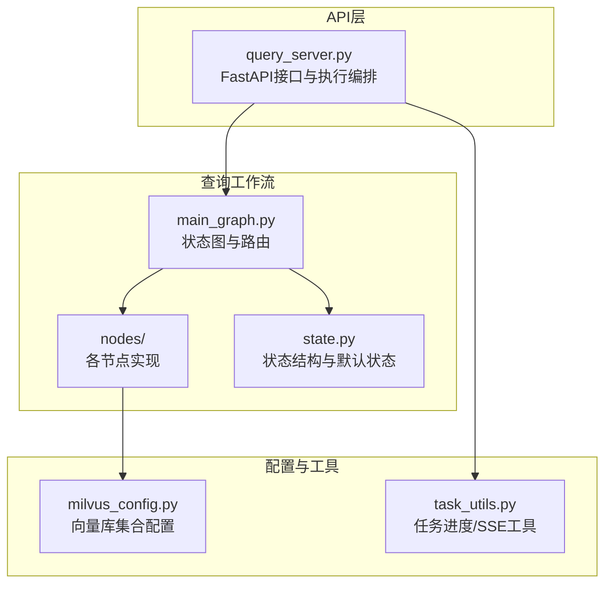
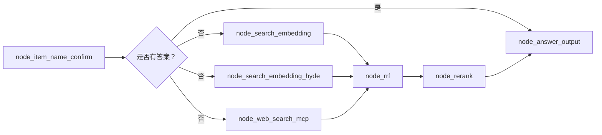
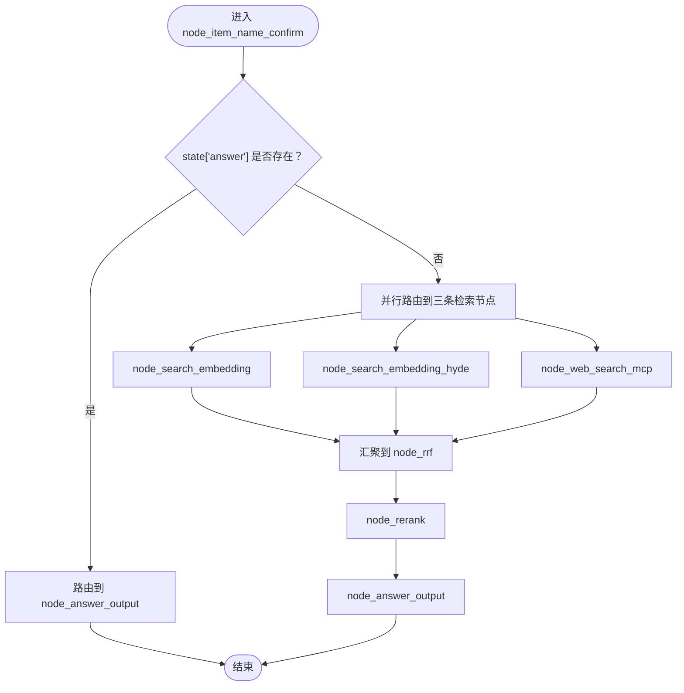
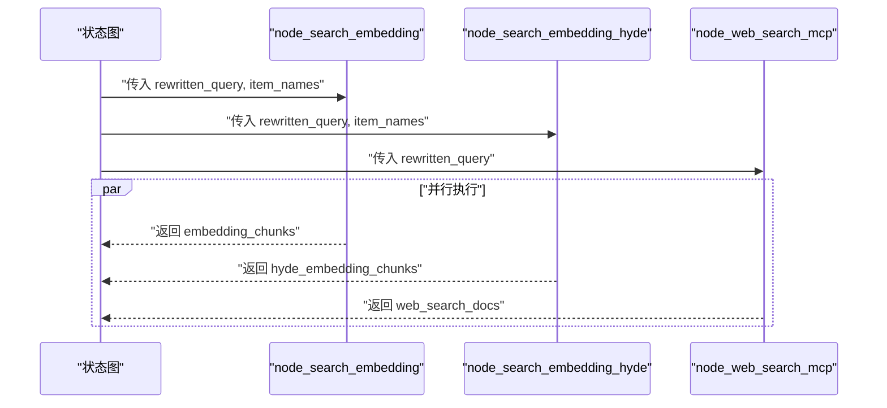
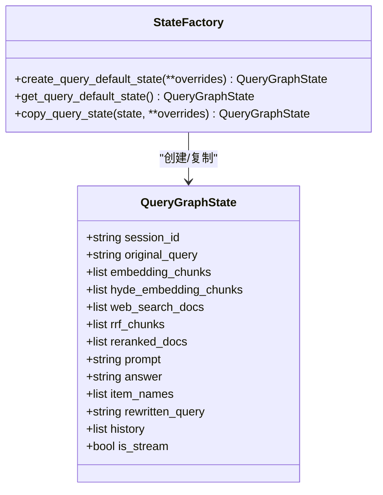
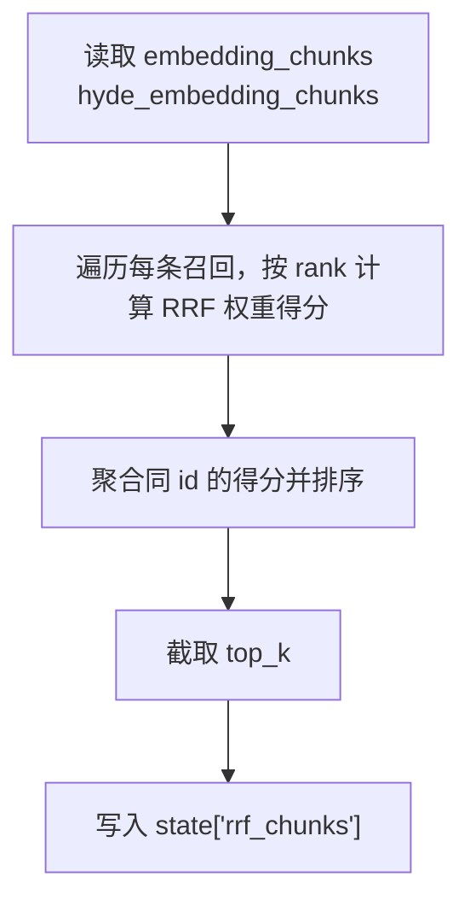
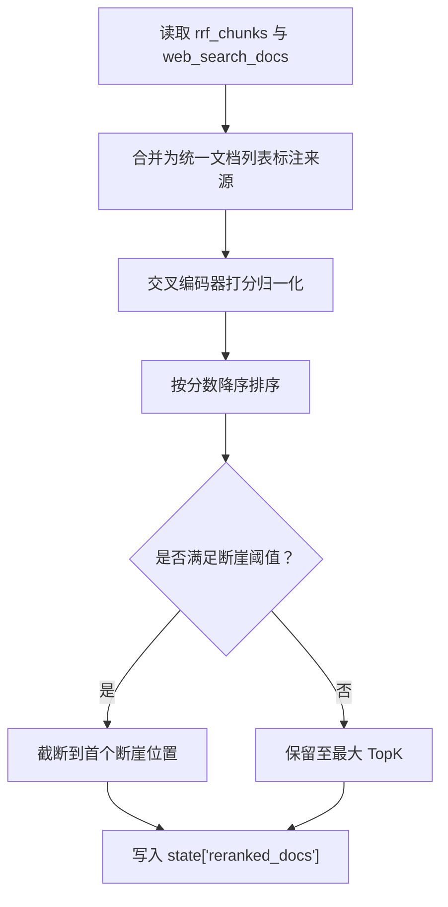
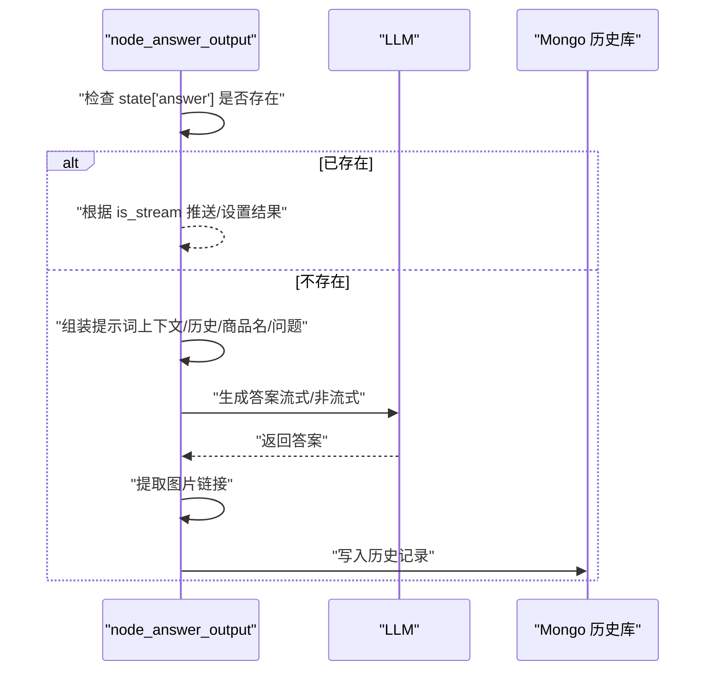
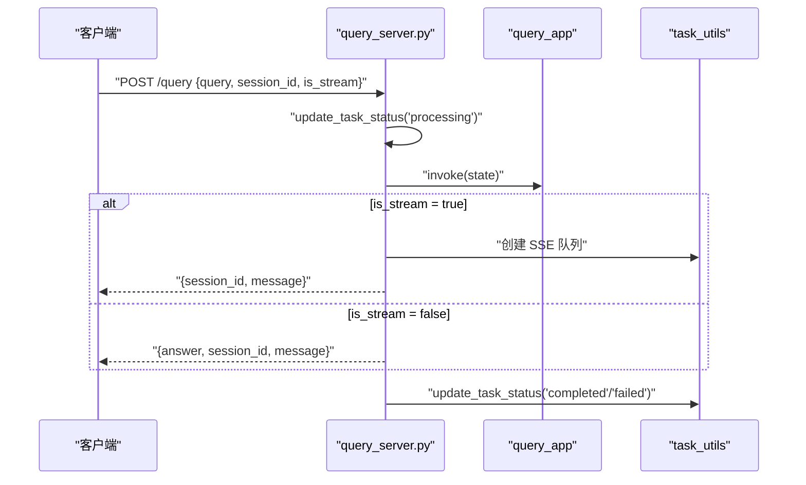
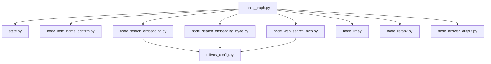

# 查询工作流架构

<cite>
**本文引用的文件**
- [main_graph.py](file://app/query_process/agent/main_graph.py)
- [state.py](file://app/query_process/agent/state.py)
- [node_item_name_confirm.py](file://app/query_process/agent/nodes/node_item_name_confirm.py)
- [node_search_embedding.py](file://app/query_process/agent/nodes/node_search_embedding.py)
- [node_search_embedding_hyde.py](file://app/query_process/agent/nodes/node_search_embedding_hyde.py)
- [node_web_search_mcp.py](file://app/query_process/agent/nodes/node_web_search_mcp.py)
- [node_rrf.py](file://app/query_process/agent/nodes/node_rrf.py)
- [node_rerank.py](file://app/query_process/agent/nodes/node_rerank.py)
- [node_answer_output.py](file://app/query_process/agent/nodes/node_answer_output.py)
- [milvus_config.py](file://app/conf/milvus_config.py)
- [task_utils.py](file://app/utils/task_utils.py)
- [query_server.py](file://app/query_process/api/query_server.py)
</cite>

## 目录
1. [简介](#简介)
2. [项目结构](#项目结构)
3. [核心组件](#核心组件)
4. [架构总览](#架构总览)
5. [详细组件分析](#详细组件分析)
6. [依赖分析](#依赖分析)
7. [性能考量](#性能考量)
8. [故障排查指南](#故障排查指南)
9. [结论](#结论)
10. [附录](#附录)

## 简介
本文件面向查询工作流的架构与实现，围绕基于 LangGraph 的状态机设计展开，系统性阐述节点间条件路由机制、并行处理策略、状态管理与数据流转、关键决策分支 route_after_node_item_name_confirm 的规则与执行路径，以及并行节点 node_search_embedding、node_search_embedding_hyde、node_web_search_mcp 的协同工作机制。同时提供调试与性能优化的最佳实践，帮助开发者快速理解与维护该工作流。

## 项目结构
查询工作流位于 app/query_process/agent 下，采用“按功能模块划分”的组织方式：
- main_graph.py：定义状态图、节点注册、条件边与控制流
- nodes/：各节点实现，分别承担“实体确认、向量检索、HyDE检索、网络搜索、RRF融合、重排序、答案输出”
- state.py：定义 QueryGraphState 的 TypedDict 结构与默认状态工厂
- api/query_server.py：对外提供查询接口，编排 LangGraph 执行与 SSE 推送
- conf/milvus_config.py：向量数据库集合配置
- utils/task_utils.py：任务进度跟踪与 SSE 推送

图表来源
- [main_graph.py:12-47](file://app/query_process/agent/main_graph.py#L12-L47)
- [state.py:5-97](file://app/query_process/agent/state.py#L5-L97)
- [query_server.py:56-112](file://app/query_process/agent/api/query_server.py#L56-L112)
- [milvus_config.py:14-26](file://app/conf/milvus_config.py#L14-L26)
- [task_utils.py:68-109](file://app/utils/task_utils.py#L68-L109)

章节来源
- [main_graph.py:12-47](file://app/query_process/agent/main_graph.py#L12-L47)
- [state.py:5-97](file://app/query_process/agent/state.py#L5-L97)
- [query_server.py:56-112](file://app/query_process/agent/api/query_server.py#L56-L112)

## 核心组件
- 状态图与路由
  - 使用 StateGraph 注册节点与边，设置入口节点为 node_item_name_confirm
  - 条件边 route_after_node_item_name_confirm 决定下一步走向：若已有 answer 则直接进入 node_answer_output；否则并行进入 node_search_embedding、node_search_embedding_hyde、node_web_search_mcp
- 状态结构 QueryGraphState
  - 包含会话标识、原始问题、中间检索结果、融合与重排序结果、最终答案、改写问题、历史、是否流式等字段
  - 提供默认状态与深拷贝复制函数，保证状态隔离与可测试性
- 节点职责
  - node_item_name_confirm：抽取并确认商品名、重写问题、必要时直接给出答案
  - node_search_embedding / node_search_embedding_hyde：向量检索（普通与 HyDE）
  - node_web_search_mcp：外部网络搜索
  - node_rrf：同源多路召回的倒排融合（RRF）
  - node_rerank：跨源融合与交叉编码器重排序
  - node_answer_output：生成最终答案、图片提取、历史记录落库、SSE 推送

章节来源
- [main_graph.py:12-47](file://app/query_process/agent/main_graph.py#L12-L47)
- [state.py:5-97](file://app/query_process/agent/state.py#L5-L97)
- [node_item_name_confirm.py:218-290](file://app/query_process/agent/nodes/node_item_name_confirm.py#L218-L290)
- [node_search_embedding.py:12-72](file://app/query_process/agent/nodes/node_search_embedding.py#L12-L72)
- [node_search_embedding_hyde.py:70-92](file://app/query_process/agent/nodes/node_search_embedding_hyde.py#L70-L92)
- [node_web_search_mcp.py:54-90](file://app/query_process/agent/nodes/node_web_search_mcp.py#L54-L90)
- [node_rrf.py:50-76](file://app/query_process/agent/nodes/node_rrf.py#L50-L76)
- [node_rerank.py:162-208](file://app/query_process/agent/nodes/node_rerank.py#L162-L208)
- [node_answer_output.py:214-249](file://app/query_process/agent/nodes/node_answer_output.py#L214-L249)

## 架构总览
查询工作流采用“条件路由 + 并行执行 + 融合重排”的流水线设计。核心流程如下：
- 入口节点 node_item_name_confirm：抽取商品名、重写问题、必要时直接输出答案
- 条件路由 route_after_node_item_name_confirm：若有 answer 则短路至答案输出；否则三条并行路径同时启动
- 并行路径：
  - 向量检索（普通与 HyDE）
  - 外部网络搜索
- 融合与重排：
  - RRF 同源融合（向量与 HyDE）
  - 重排序（交叉编码器）+ 断崖截断策略
- 答案生成与输出：根据 reranked_docs 生成最终答案，支持流式 SSE 与非流式结果回传

图表来源
- [main_graph.py:26-45](file://app/query_process/agent/main_graph.py#L26-L45)

## 详细组件分析

### 条件分支与路由：route_after_node_item_name_confirm
- 决策规则
  - 若 state["answer"] 存在，则路由到 node_answer_output（短路）
  - 否则并行路由到 node_search_embedding、node_search_embedding_hyde、node_web_search_mcp
- 执行路径
  - 短路路径：直接进入 node_answer_output，跳过并行检索
  - 并行路径：三条检索同时进行，互不影响；随后汇聚到 node_rrf 进行同源融合，再由 node_rerank 进行跨源重排

图表来源
- [main_graph.py:26-45](file://app/query_process/agent/main_graph.py#L26-L45)

章节来源
- [main_graph.py:26-45](file://app/query_process/agent/main_graph.py#L26-L45)

### 并行节点协同：node_search_embedding、node_search_embedding_hyde、node_web_search_mcp
- node_search_embedding
  - 输入：rewritten_query、item_names
  - 行为：对改写问题生成稠密/稀疏向量，混合检索 chunks 集合，返回 embedding_chunks
- node_search_embedding_hyde
  - 输入：rewritten_query、item_names
  - 行为：先由 LLM 生成假设性答案，再对 “问题+假设性答案” 向量化检索，返回 hyde_embedding_chunks
- node_web_search_mcp
  - 输入：rewritten_query
  - 行为：调用外部 MCP 网络搜索工具，返回 web_search_docs
- 协同机制
  - 三者并行执行，互不阻塞
  - 通过状态字段承载各自结果，后续由 node_rrf 与 node_rerank 汇聚处理

图表来源
- [main_graph.py:16-21](file://app/query_process/agent/main_graph.py#L16-L21)
- [node_search_embedding.py:12-72](file://app/query_process/agent/nodes/node_search_embedding.py#L12-L72)
- [node_search_embedding_hyde.py:70-92](file://app/query_process/agent/nodes/node_search_embedding_hyde.py#L70-L92)
- [node_web_search_mcp.py:54-90](file://app/query_process/agent/nodes/node_web_search_mcp.py#L54-L90)

章节来源
- [node_search_embedding.py:12-72](file://app/query_process/agent/nodes/node_search_embedding.py#L12-L72)
- [node_search_embedding_hyde.py:70-92](file://app/query_process/agent/nodes/node_search_embedding_hyde.py#L70-L92)
- [node_web_search_mcp.py:54-90](file://app/query_process/agent/nodes/node_web_search_mcp.py#L54-L90)

### 状态管理与数据流转：QueryGraphState
- 字段概览
  - 会话与输入：session_id、original_query、is_stream
  - 中间结果：embedding_chunks、hyde_embedding_chunks、web_search_docs
  - 融合与重排：rrf_chunks、reranked_docs
  - 生成与辅助：prompt、answer、item_names、rewritten_query、history
- 默认状态与复制
  - 提供默认状态与深拷贝复制函数，避免共享引用导致的状态污染
- 数据流向
  - 各节点仅写入自身负责的字段，下游节点通过 state 读取上游结果
  - node_rrf 仅消费 embedding_chunks 与 hyde_embedding_chunks
  - node_rerank 消费 rrf_chunks 与 web_search_docs
  - node_answer_output 消费 reranked_docs 与 history 等

图表来源
- [state.py:5-97](file://app/query_process/agent/state.py#L5-L97)

章节来源
- [state.py:5-97](file://app/query_process/agent/state.py#L5-L97)

### RRF 同源融合：node_rrf
- 输入：embedding_chunks、hyde_embedding_chunks
- 算法：对同源多路召回进行倒排融合（RRF），按 rank 计算加权得分，取 top_k
- 输出：rrf_chunks 写入状态

图表来源
- [node_rrf.py:7-48](file://app/query_process/agent/nodes/node_rrf.py#L7-L48)

章节来源
- [node_rrf.py:50-76](file://app/query_process/agent/nodes/node_rrf.py#L50-L76)

### 重排序与跨源融合：node_rerank
- 跨源融合：将 rrf_chunks（本地）与 web_search_docs（网络）合并为统一文档列表
- 重排序：以 rewritten_query 与文本对调用交叉编码器打分，归一化后排序
- 断崖截断：基于绝对阈值与相对阈值的双指针策略，动态确定 TopK
- 输出：reranked_docs 写入状态

图表来源
- [node_rerank.py:24-160](file://app/query_process/agent/nodes/node_rerank.py#L24-L160)

章节来源
- [node_rerank.py:162-208](file://app/query_process/agent/nodes/node_rerank.py#L162-L208)

### 答案生成与输出：node_answer_output
- 短路检查：若 state["answer"] 已存在，直接根据 is_stream 推送或设置结果
- 上下文组装：从 reranked_docs 与 history 拼装提示词，限制上下文长度
- 生成答案：调用 LLM 生成最终答案，支持流式 SSE 与非流式结果
- 图片提取：从本地与网络结果中提取图片链接
- 历史记录：将用户问题与助手答案写入历史库

图表来源
- [node_answer_output.py:16-249](file://app/query_process/agent/nodes/node_answer_output.py#L16-L249)

章节来源
- [node_answer_output.py:214-249](file://app/query_process/agent/nodes/node_answer_output.py#L214-L249)

### API 编排与执行：query_server.py
- 接口
  - GET /chat.html：返回前端页面
  - POST /query：发起查询，支持同步与异步（流式）
  - GET /stream/{session_id}：SSE 长连接
  - GET /history/{session_id}、DELETE /history/{session_id}：历史查询与清理
- 执行流程
  - 初始化 QueryGraphState
  - 调用 query_app.invoke(state) 执行工作流
  - 流式场景通过 task_utils 推送进度与结果

图表来源
- [query_server.py:56-112](file://app/query_process/agent/api/query_server.py#L56-L112)
- [task_utils.py:68-109](file://app/utils/task_utils.py#L68-L109)

章节来源
- [query_server.py:56-112](file://app/query_process/agent/api/query_server.py#L56-L112)
- [task_utils.py:68-109](file://app/utils/task_utils.py#L68-L109)

## 依赖分析
- 组件耦合
  - main_graph.py 仅依赖各节点函数与 QueryGraphState 类型，耦合度低
  - 各节点内部依赖工具模块（嵌入、向量检索、历史库、SSE 等），但彼此独立
- 外部依赖
  - 向量库：Milvus（集合名称由 milvus_config.py 提供）
  - 外部搜索：MCP 工具（百炼网络搜索）
  - LLM：用于实体抽取、问题重写、HyDE 假设性答案、最终答案生成
- 潜在风险
  - 并行节点均依赖外部系统，需关注超时与失败重试
  - RRF 与重排序依赖向量质量与检索表达式，需持续优化

图表来源
- [main_graph.py:12-47](file://app/query_process/agent/main_graph.py#L12-L47)
- [milvus_config.py:14-26](file://app/conf/milvus_config.py#L14-L26)

章节来源
- [main_graph.py:12-47](file://app/query_process/agent/main_graph.py#L12-L47)
- [milvus_config.py:14-26](file://app/conf/milvus_config.py#L14-L26)

## 性能考量
- 并行策略
  - 三条检索并行执行，显著降低端到端延迟；建议为每条路径设置独立超时与重试
- 检索优化
  - 控制 RRF 与重排序的 TopK，避免过多无效文档参与后续处理
  - 合理设置向量检索的 limit 与过滤表达式，减少无关召回
- 重排序成本
  - 交叉编码器打分较昂贵，建议结合断崖截断策略动态减少样本数
- 上下文长度
  - 限制提示词上下文长度，避免 LLM 调用超时或费用过高
- 流式输出
  - 流式场景下及时推送进度与增量答案，提升用户体验

## 故障排查指南
- 常见问题定位
  - 答案为空：检查 node_item_name_confirm 是否正确设置 answer 或 item_names/rewritten_query
  - 检索无结果：核对 milvus_config 的集合名称与权限，确认表达式过滤条件
  - 外部搜索失败：检查 MCP 配置与鉴权头，确认网络连通性
  - 重排序异常：确认 reranked_docs 是否为空或分数异常
- 调试建议
  - 使用 query_server 的 /history/{session_id} 接口查看历史记录
  - 通过 /stream/{session_id} 观察进度与中间结果
  - 在各节点函数中增加日志，定位数据缺失或类型错误
- 任务状态与进度
  - 通过 task_utils 的任务队列与 SSE 推送，实时掌握节点执行状态

章节来源
- [node_item_name_confirm.py:218-290](file://app/query_process/agent/nodes/node_item_name_confirm.py#L218-L290)
- [node_search_embedding.py:12-72](file://app/query_process/agent/nodes/node_search_embedding.py#L12-L72)
- [node_web_search_mcp.py:54-90](file://app/query_process/agent/nodes/node_web_search_mcp.py#L54-L90)
- [node_rerank.py:162-208](file://app/query_process/agent/nodes/node_rerank.py#L162-L208)
- [task_utils.py:68-109](file://app/utils/task_utils.py#L68-L109)

## 结论
该查询工作流以 LangGraph 为核心，通过条件路由与并行执行实现高效检索，借助 RRF 与交叉编码器重排序提升召回质量与相关性，最终由 LLM 生成自然语言答案并支持流式输出。状态机设计清晰、节点职责明确、数据流转可控，具备良好的扩展性与可维护性。建议在生产环境中强化超时与重试、监控与告警，并持续优化检索表达式与重排序策略以获得更优效果。

## 附录
- 关键配置
  - Milvus 集合名称：由 milvus_config.py 提供
- API 快速参考
  - POST /query：发起查询（支持同步/异步）
  - GET /stream/{session_id}：SSE 实时进度与结果
  - GET /history/{session_id}、DELETE /history/{session_id}：历史查询与清理