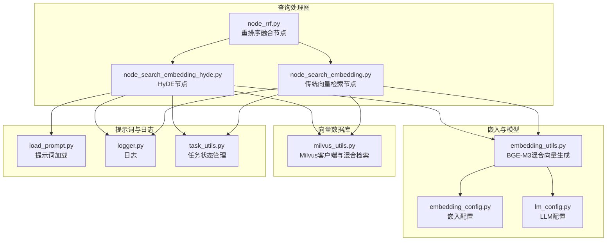
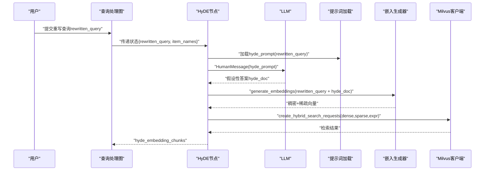
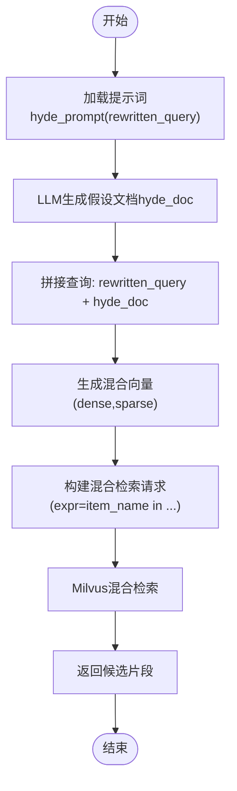
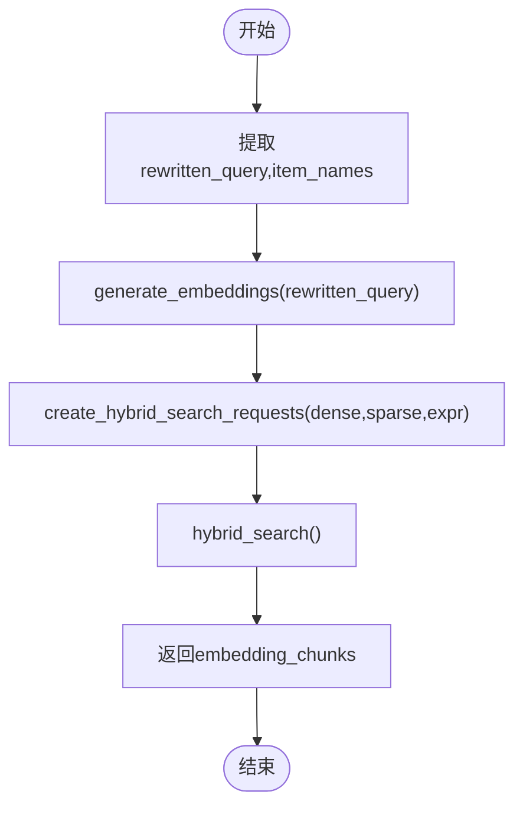
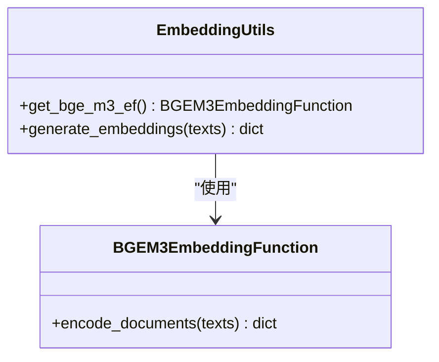
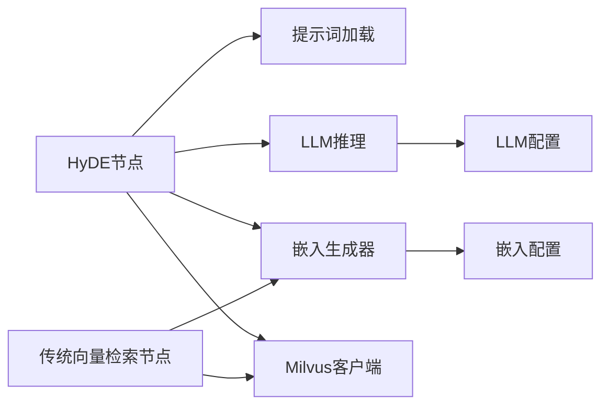

# HyDE假设文档搜索

<cite>
**本文引用的文件**   
- [node_search_embedding_hyde.py](file://app/query_process/agent/nodes/node_search_embedding_hyde.py)
- [node_search_embedding.py](file://app/query_process/agent/nodes/node_search_embedding.py)
- [embedding_utils.py](file://app/lm/embedding_utils.py)
- [embedding_config.py](file://app/conf/embedding_config.py)
- [lm_config.py](file://app/conf/lm_config.py)
- [milvus_utils.py](file://app/clients/milvus_utils.py)
- [load_prompt.py](file://app/core/load_prompt.py)
- [logger.py](file://app/core/logger.py)
- [task_utils.py](file://app/utils/task_utils.py)
- [node_rrf.py](file://app/query_process/agent/nodes/node_rrf.py)
- [kb-learning-journey.md](file://kb-learning-journey.md)
</cite>

## 目录
1. [简介](#简介)
2. [项目结构](#项目结构)
3. [核心组件](#核心组件)
4. [架构总览](#架构总览)
5. [详细组件分析](#详细组件分析)
6. [依赖关系分析](#依赖关系分析)
7. [性能考量](#性能考量)
8. [故障排查指南](#故障排查指南)
9. [结论](#结论)
10. [附录](#附录)

## 简介
本文件面向HyDE（Hypothetical Document Embeddings）假设文档搜索的技术文档，系统阐述以下内容：
- HyDE核心原理：将自然语言查询改写为“假设性答案”文档，并将其与原始查询拼接后生成向量，从而提升向量检索的召回质量。
- 查询改写机制：通过提示词工程与LLM推理生成高质量假设文档，保证上下文相关性与语义一致性。
- HyDE与传统向量搜索的差异与优势：在模糊查询与长尾问题上的表现更优，能有效缓解查询与答案在向量空间中的语义鸿沟。
- 实现流程：从查询改写到假设文档生成，再到混合向量检索的完整链路。
- 参数调优与效果评估：提供ranker权重、温度系数、提示词设计等关键参数的调优建议与评估方法。

## 项目结构
本项目采用“查询处理图（LangGraph）+ 节点（Nodes）”的模块化组织方式，HyDE相关能力位于查询处理图的节点层，配合嵌入生成、Milvus客户端与提示词加载模块协同工作。

图表来源
- [node_search_embedding_hyde.py:1-118](file://app/query_process/agent/nodes/node_search_embedding_hyde.py#L1-L118)
- [node_search_embedding.py:1-94](file://app/query_process/agent/nodes/node_search_embedding.py#L1-L94)
- [embedding_utils.py:1-108](file://app/lm/embedding_utils.py#L1-L108)
- [embedding_config.py:1-24](file://app/conf/embedding_config.py#L1-L24)
- [lm_config.py:1-27](file://app/conf/lm_config.py#L1-L27)
- [milvus_utils.py](file://app/clients/milvus_utils.py)
- [load_prompt.py](file://app/core/load_prompt.py)
- [logger.py](file://app/core/logger.py)
- [task_utils.py](file://app/utils/task_utils.py)
- [node_rrf.py:87-124](file://app/query_process/agent/nodes/node_rrf.py#L87-L124)

章节来源
- [node_search_embedding_hyde.py:1-118](file://app/query_process/agent/nodes/node_search_embedding_hyde.py#L1-L118)
- [node_search_embedding.py:1-94](file://app/query_process/agent/nodes/node_search_embedding.py#L1-L94)
- [embedding_utils.py:1-108](file://app/lm/embedding_utils.py#L1-L108)
- [embedding_config.py:1-24](file://app/conf/embedding_config.py#L1-L24)
- [lm_config.py:1-27](file://app/conf/lm_config.py#L1-L27)
- [milvus_utils.py](file://app/clients/milvus_utils.py)
- [load_prompt.py](file://app/core/load_prompt.py)
- [logger.py](file://app/core/logger.py)
- [task_utils.py](file://app/utils/task_utils.py)
- [node_rrf.py:87-124](file://app/query_process/agent/nodes/node_rrf.py#L87-L124)

## 核心组件
- HyDE节点（node_search_embedding_hyde.py）
  - 功能：基于重写查询生成假设性答案，拼接后向量化并在Milvus中进行混合检索，返回候选片段。
  - 关键步骤：提示词加载、LLM生成假设文档、拼接查询、向量化、混合检索、结果处理。
- 传统向量检索节点（node_search_embedding.py）
  - 功能：对重写查询进行向量化并在Milvus中进行混合检索，作为HyDE的对照基线。
- 嵌入生成器（embedding_utils.py）
  - 功能：基于BGE-M3模型生成稠密+稀疏混合向量，支持单例模式与L2归一化，适配Milvus内积检索。
- Milvus客户端（milvus_utils.py）
  - 功能：封装混合检索请求构建与执行，支持稠密/稀疏向量与表达式过滤。
- 提示词加载（load_prompt.py）
  - 功能：按模板键加载提示词，支持动态注入变量（如rewritten_query）。
- 日志与任务状态（logger.py、task_utils.py）
  - 功能：统一记录流程日志与任务状态变更，便于可观测性与排障。

章节来源
- [node_search_embedding_hyde.py:16-92](file://app/query_process/agent/nodes/node_search_embedding_hyde.py#L16-L92)
- [node_search_embedding.py:12-72](file://app/query_process/agent/nodes/node_search_embedding.py#L12-L72)
- [embedding_utils.py:51-96](file://app/lm/embedding_utils.py#L51-L96)
- [milvus_utils.py](file://app/clients/milvus_utils.py)
- [load_prompt.py](file://app/core/load_prompt.py)
- [logger.py](file://app/core/logger.py)
- [task_utils.py](file://app/utils/task_utils.py)

## 架构总览
HyDE在查询处理图中以独立节点存在，与传统向量检索节点并行，随后由融合节点（如RRF）进行重排序整合。整体流程如下：

图表来源
- [node_search_embedding_hyde.py:16-68](file://app/query_process/agent/nodes/node_search_embedding_hyde.py#L16-L68)
- [load_prompt.py](file://app/core/load_prompt.py)
- [embedding_utils.py:51-96](file://app/lm/embedding_utils.py#L51-L96)
- [milvus_utils.py](file://app/clients/milvus_utils.py)

## 详细组件分析

### HyDE节点（node_search_embedding_hyde.py）
- 步骤一：生成假设文档
  - 使用提示词模板“hyde_prompt”，将重写查询作为变量注入，构造LLM消息，调用推理得到假设性答案。
  - 关键点：提示词工程直接影响假设文档质量；应强调“请以标准答案形式回答该问题”“不要包含引导性语言”等约束。
- 步骤二：混合检索
  - 将重写查询与假设文档拼接为最终查询字符串，生成稠密+稀疏混合向量。
  - 构建混合检索请求，结合item_names表达式过滤，调用Milvus执行检索并返回候选片段。
- 质量控制
  - 上下文相关性：通过rewritten_query与hyde_doc的组合增强语义覆盖。
  - 语义一致性：建议在提示词中加入“与问题高度相关”“避免臆测”等约束；必要时引入后处理校验（如相似度阈值、关键词匹配）。

图表来源
- [node_search_embedding_hyde.py:16-68](file://app/query_process/agent/nodes/node_search_embedding_hyde.py#L16-L68)
- [load_prompt.py](file://app/core/load_prompt.py)
- [embedding_utils.py:51-96](file://app/lm/embedding_utils.py#L51-L96)
- [milvus_utils.py](file://app/clients/milvus_utils.py)

章节来源
- [node_search_embedding_hyde.py:16-92](file://app/query_process/agent/nodes/node_search_embedding_hyde.py#L16-L92)

### 传统向量检索节点（node_search_embedding.py）
- 输入：重写查询rewritten_query与明确的item_names。
- 处理：对重写查询生成混合向量，构建表达式过滤条件，执行混合检索。
- 输出：候选片段集合，供后续融合或重排序使用。

图表来源
- [node_search_embedding.py:26-67](file://app/query_process/agent/nodes/node_search_embedding.py#L26-L67)
- [embedding_utils.py:51-96](file://app/lm/embedding_utils.py#L51-L96)
- [milvus_utils.py](file://app/clients/milvus_utils.py)

章节来源
- [node_search_embedding.py:12-72](file://app/query_process/agent/nodes/node_search_embedding.py#L12-L72)

### 嵌入生成器（embedding_utils.py）
- 单例模式：避免重复初始化BGE-M3模型，降低资源消耗。
- 混合向量：返回稠密向量与稀疏向量（索引+权重字典），并进行L2归一化以适配Milvus内积检索。
- 类型安全：将稀疏索引与权重转换为Python原生类型，确保可序列化与稳定运行。

图表来源
- [embedding_utils.py:8-48](file://app/lm/embedding_utils.py#L8-L48)
- [embedding_utils.py:51-96](file://app/lm/embedding_utils.py#L51-L96)

章节来源
- [embedding_utils.py:1-108](file://app/lm/embedding_utils.py#L1-L108)
- [embedding_config.py:1-24](file://app/conf/embedding_config.py#L1-L24)
- [lm_config.py:1-27](file://app/conf/lm_config.py#L1-L27)

### 提示词加载（load_prompt.py）
- 模板键：hyde_prompt
- 注入变量：rewritten_query
- 作用：将用户意图转化为结构化、可检索的假设文档，提升检索质量。

章节来源
- [node_search_embedding_hyde.py:24-34](file://app/query_process/agent/nodes/node_search_embedding_hyde.py#L24-L34)
- [load_prompt.py](file://app/core/load_prompt.py)

### 日志与任务状态（logger.py、task_utils.py）
- 日志：记录HyDE生成、向量化、检索等关键步骤，便于定位问题。
- 任务状态：在节点开始与结束时登记运行/完成任务，便于监控与追踪。

章节来源
- [node_search_embedding_hyde.py:77-89](file://app/query_process/agent/nodes/node_search_embedding_hyde.py#L77-L89)
- [logger.py](file://app/core/logger.py)
- [task_utils.py](file://app/utils/task_utils.py)

## 依赖关系分析
- HyDE节点依赖链
  - 提示词加载 → LLM推理 → 嵌入生成 → Milvus混合检索 → 结果返回
- 与传统向量检索的关系
  - HyDE与传统向量检索并行执行，随后由融合节点（如RRF）整合结果，形成最终候选集。
- 配置与环境
  - LLM与嵌入模型均通过配置文件加载，支持本地路径与远程模型仓库，设备与半精度开关可调。

图表来源
- [node_search_embedding_hyde.py:16-68](file://app/query_process/agent/nodes/node_search_embedding_hyde.py#L16-L68)
- [node_search_embedding.py:26-67](file://app/query_process/agent/nodes/node_search_embedding.py#L26-L67)
- [embedding_utils.py:51-96](file://app/lm/embedding_utils.py#L51-L96)
- [embedding_config.py:18-24](file://app/conf/embedding_config.py#L18-L24)
- [lm_config.py:20-26](file://app/conf/lm_config.py#L20-L26)
- [milvus_utils.py](file://app/clients/milvus_utils.py)
- [load_prompt.py](file://app/core/load_prompt.py)

章节来源
- [node_search_embedding_hyde.py:1-118](file://app/query_process/agent/nodes/node_search_embedding_hyde.py#L1-L118)
- [node_search_embedding.py:1-94](file://app/query_process/agent/nodes/node_search_embedding.py#L1-L94)
- [embedding_utils.py:1-108](file://app/lm/embedding_utils.py#L1-L108)
- [embedding_config.py:1-24](file://app/conf/embedding_config.py#L1-L24)
- [lm_config.py:1-27](file://app/conf/lm_config.py#L1-L27)
- [milvus_utils.py](file://app/clients/milvus_utils.py)
- [load_prompt.py](file://app/core/load_prompt.py)

## 性能考量
- 模型与设备
  - BGE-M3单例初始化，减少重复加载开销；设备选择（CPU/GPU）与半精度开关影响吞吐与延迟。
- 向量化策略
  - 混合向量（稠密+稀疏）在召回与排序之间取得平衡；L2归一化适配Milvus内积检索，提升检索效率。
- 检索参数
  - 表达式过滤（item_names）缩小搜索空间，降低无关噪声；ranker权重（如0.9:0.1）影响稠密与稀疏贡献比例。
- LLM推理
  - 温度系数影响生成多样性；提示词设计决定假设文档质量，进而影响检索效果。

章节来源
- [embedding_utils.py:100-108](file://app/lm/embedding_utils.py#L100-L108)
- [node_search_embedding.py:47-50](file://app/query_process/agent/nodes/node_search_embedding.py#L47-L50)
- [lm_config.py:20-26](file://app/conf/lm_config.py#L20-L26)

## 故障排查指南
- 常见问题
  - 假设文档为空或无意义：检查提示词模板与LLM配置；适当提高温度或调整提示词约束。
  - 向量生成异常：确认嵌入模型路径与设备设置；检查输入文本类型与长度。
  - Milvus检索无结果：核对表达式过滤条件与集合名称；检查ranker权重与limit设置。
- 排查步骤
  - 查看日志：定位具体失败环节（提示词加载、LLM推理、向量化、检索）。
  - 回归验证：分别单独执行HyDE与传统向量检索，对比结果差异。
  - 参数微调：逐步调整温度、ranker权重与提示词，观察召回变化。

章节来源
- [logger.py](file://app/core/logger.py)
- [node_search_embedding_hyde.py:33,67](file://app/query_process/agent/nodes/node_search_embedding_hyde.py#L33,L67)
- [node_search_embedding.py:67](file://app/query_process/agent/nodes/node_search_embedding.py#L67)

## 结论
HyDE通过“假设性答案”的生成与拼接，有效弥合了查询与答案在向量空间中的语义差距，在模糊查询与长尾问题上显著提升召回质量。结合BGE-M3混合向量与Milvus混合检索，以及合理的ranker权重与提示词工程，可在实际业务中获得稳定且可扩展的检索效果。建议在生产环境中持续监控日志、迭代提示词，并结合业务指标进行参数调优与效果评估。

## 附录

### HyDE与传统向量搜索的差异与优势
- 差异
  - HyDE增加一次LLM生成假设文档的过程，将“问题+假设答案”拼接后向量化检索。
  - 传统向量检索仅对重写查询进行向量化与检索。
- 优势
  - 更高的召回：在语义不明显或长尾问题上，假设文档能提供更强的语义锚点。
  - 更稳定的排序：混合向量与ranker权重可进一步提升排序稳定性。

章节来源
- [kb-learning-journey.md:318-326](file://kb-learning-journey.md#L318-L326)
- [node_search_embedding_hyde.py:70-76](file://app/query_process/agent/nodes/node_search_embedding_hyde.py#L70-L76)
- [node_search_embedding.py:12-22](file://app/query_process/agent/nodes/node_search_embedding.py#L12-L22)

### 实现代码示例（路径指引）
- HyDE节点主流程
  - [node_search_embedding_hyde.py:70-92](file://app/query_process/agent/nodes/node_search_embedding_hyde.py#L70-L92)
- 假设文档生成
  - [node_search_embedding_hyde.py:16-34](file://app/query_process/agent/nodes/node_search_embedding_hyde.py#L16-L34)
- 混合检索
  - [node_search_embedding_hyde.py:37-68](file://app/query_process/agent/nodes/node_search_embedding_hyde.py#L37-L68)
- 传统向量检索
  - [node_search_embedding.py:12-72](file://app/query_process/agent/nodes/node_search_embedding.py#L12-L72)
- 嵌入生成
  - [embedding_utils.py:51-96](file://app/lm/embedding_utils.py#L51-L96)
- RRF融合对比测试
  - [node_rrf.py:87-124](file://app/query_process/agent/nodes/node_rrf.py#L87-L124)

### 参数调优指南
- 提示词工程
  - 明确指令：要求以标准答案形式回答，避免引导性语言与外部链接。
  - 上下文约束：强调与rewritten_query高度相关，避免臆测。
- LLM温度系数
  - 低温度：更确定性，适合严格问答；高温度：更多样性，需更强后处理。
- Ranker权重
  - 稠密权重较高（如0.9）：偏向语义近似；稀疏权重较高（如0.1）：偏向关键词匹配。
- 表达式过滤
  - item_names精确过滤：减少跨文档噪声；模糊匹配时建议先确认实体名。

章节来源
- [node_search_embedding_hyde.py:24-29](file://app/query_process/agent/nodes/node_search_embedding_hyde.py#L24-L29)
- [node_search_embedding.py:34-50](file://app/query_process/agent/nodes/node_search_embedding.py#L34-L50)
- [lm_config.py:20-26](file://app/conf/lm_config.py#L20-L26)
- [kb-learning-journey.md:134-157](file://kb-learning-journey.md#L134-L157)

### 效果评估方法
- 指标体系
  - 召回率：HyDE与传统向量检索的候选数量对比。
  - 准确率：人工标注相关性，统计Top-K命中率。
  - 用户满意度：通过A/B测试比较两种方案在真实场景下的反馈。
- 方法建议
  - 对比测试：在同一组查询上同时运行HyDE与传统向量检索，记录候选数量与命中情况。
  - 深度分析：对召回不足的案例进行提示词与ranker权重的针对性优化。

章节来源
- [node_rrf.py:87-124](file://app/query_process/agent/nodes/node_rrf.py#L87-L124)
- [kb-learning-journey.md:318-326](file://kb-learning-journey.md#L318-L326)