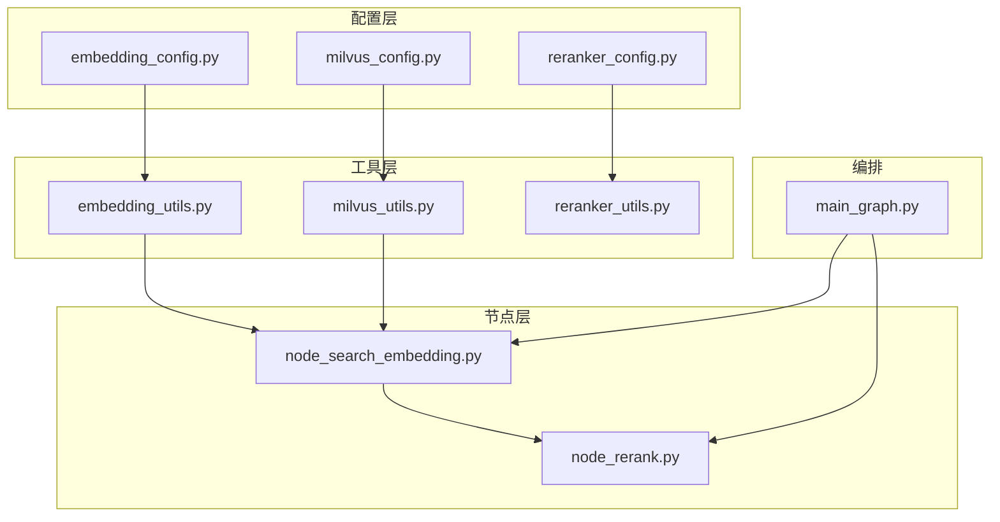
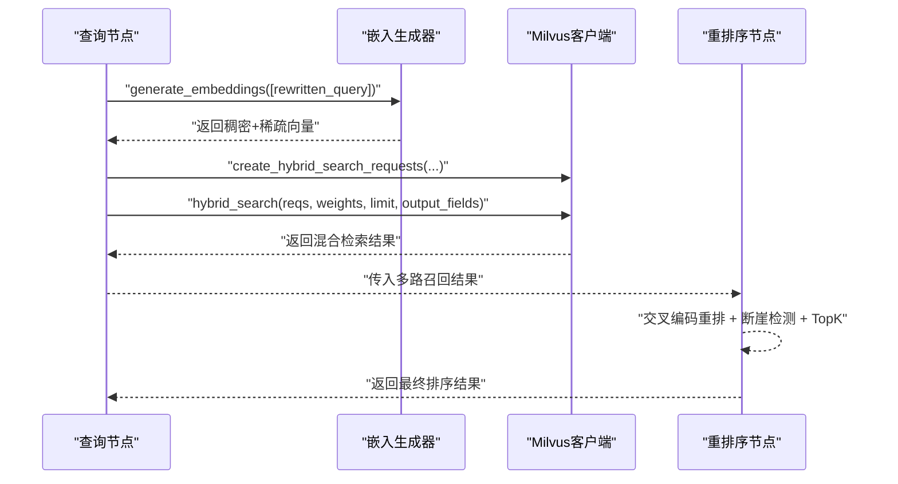
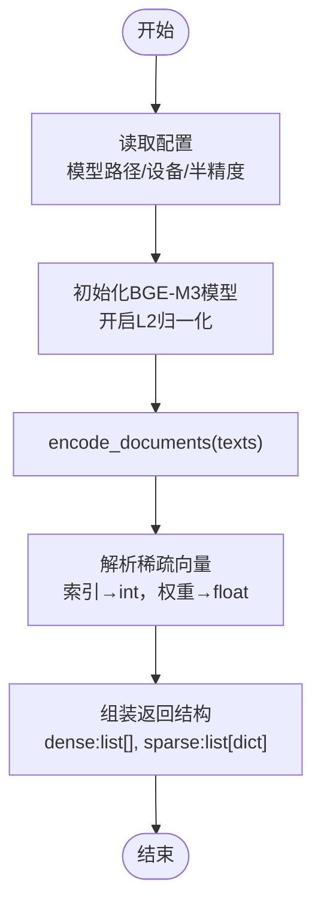
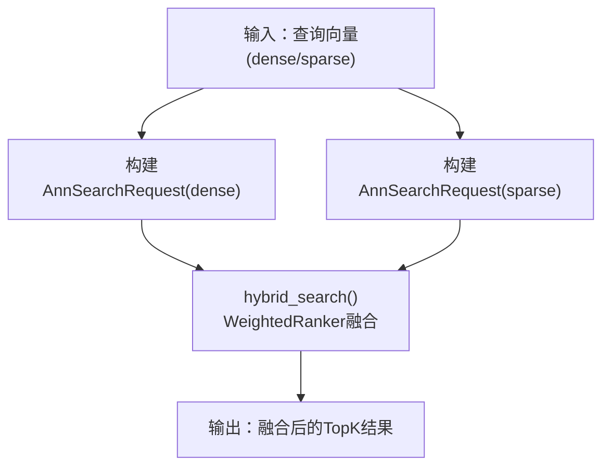
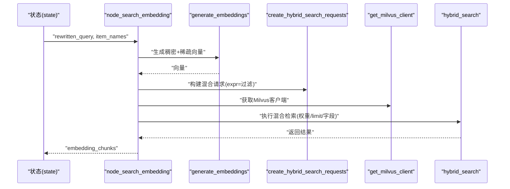
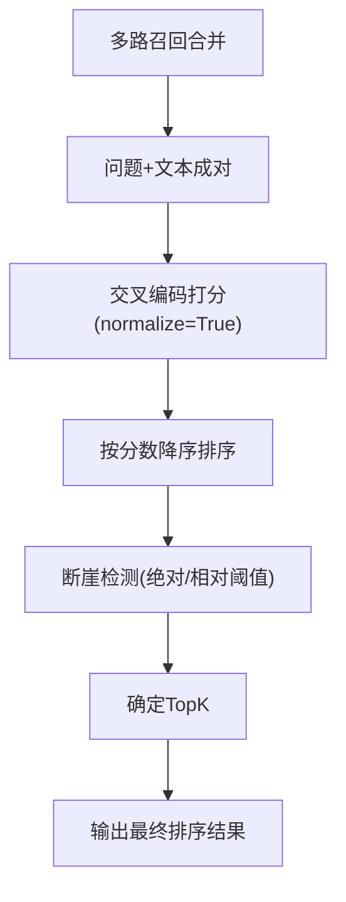
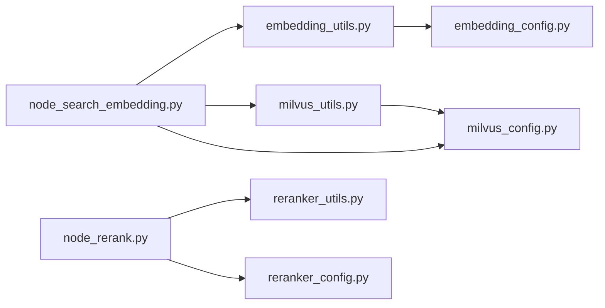

# 向量相似度搜索

<cite>
**本文引用的文件**
- [embedding_utils.py](file://app/lm/embedding_utils.py)
- [embedding_config.py](file://app/conf/embedding_config.py)
- [milvus_utils.py](file://app/clients/milvus_utils.py)
- [milvus_config.py](file://app/conf/milvus_config.py)
- [node_search_embedding.py](file://app/query_process/agent/nodes/node_search_embedding.py)
- [main_graph.py](file://app/query_process/agent/main_graph.py)
- [reranker_utils.py](file://app/lm/reranker_utils.py)
- [reranker_config.py](file://app/conf/reranker_config.py)
- [node_rerank.py](file://app/query_process/agent/nodes/node_rerank.py)
- [format_utils.py](file://app/utils/format_utils.py)
- [pyproject.toml](file://pyproject.toml)
</cite>

## 目录
1. [简介](#简介)
2. [项目结构](#项目结构)
3. [核心组件](#核心组件)
4. [架构总览](#架构总览)
5. [详细组件分析](#详细组件分析)
6. [依赖关系分析](#依赖关系分析)
7. [性能考量](#性能考量)
8. [故障排查指南](#故障排查指南)
9. [结论](#结论)
10. [附录](#附录)

## 简介
本文件面向“向量相似度搜索”的技术实现，围绕以下目标展开：
- 基于BGE-M3嵌入模型的向量相似度计算原理与实现，涵盖稠密向量（余弦相似度）与稀疏向量（内积）的适配。
- 向量检索完整流程：从查询文本生成向量，到Milvus混合检索与结果融合排序。
- Milvus查询接口使用要点：索引选择、查询参数配置、性能优化策略。
- 相似度阈值与参数调节：如何根据场景调整权重、TopK、断崖阈值等以获得更佳检索效果。
- 代码示例路径：提供可直接定位到实现的文件与行号，便于快速查阅与集成。

## 项目结构
本项目采用“配置-工具-节点-图编排”的分层组织方式：
- 配置层：embedding_config、milvus_config、reranker_config，集中管理模型与Milvus的环境变量与默认值。
- 工具层：embedding_utils（BGE-M3嵌入）、milvus_utils（Milvus客户端与混合检索）、reranker_utils（交叉编码重排序）。
- 节点层：query_process/agent/nodes 下的各节点，串联检索、融合与重排。
- 图编排：main_graph.py 定义查询流程的节点与路由。

图表来源
- [embedding_config.py:1-24](file://app/conf/embedding_config.py#L1-L24)
- [milvus_config.py:1-26](file://app/conf/milvus_config.py#L1-L26)
- [reranker_config.py:1-21](file://app/conf/reranker_config.py#L1-L21)
- [embedding_utils.py:1-108](file://app/lm/embedding_utils.py#L1-L108)
- [milvus_utils.py:1-198](file://app/clients/milvus_utils.py#L1-L198)
- [reranker_utils.py:1-14](file://app/lm/reranker_utils.py#L1-L14)
- [node_search_embedding.py:1-94](file://app/query_process/agent/nodes/node_search_embedding.py#L1-L94)
- [node_rerank.py:1-267](file://app/query_process/agent/nodes/node_rerank.py#L1-L267)
- [main_graph.py:1-47](file://app/query_process/agent/main_graph.py#L1-L47)

章节来源
- [pyproject.toml:1-36](file://pyproject.toml#L1-L36)

## 核心组件
- BGE-M3嵌入生成器：负责将文本编码为稠密+稀疏混合向量，并进行L2归一化以适配Milvus内积检索。
- Milvus客户端与混合检索：封装Milvus连接、构建AnnSearchRequest、执行WeightedRanker融合。
- 查询节点：将重写后的查询转换为向量，构造过滤条件，调用混合检索并返回结果。
- 重排序节点：对多路召回结果进行交叉编码重排与TopK截断，含断崖检测策略。

章节来源
- [embedding_utils.py:8-48](file://app/lm/embedding_utils.py#L8-L48)
- [milvus_utils.py:10-31](file://app/clients/milvus_utils.py#L10-L31)
- [milvus_utils.py:117-155](file://app/clients/milvus_utils.py#L117-L155)
- [milvus_utils.py:158-198](file://app/clients/milvus_utils.py#L158-L198)
- [node_search_embedding.py:12-72](file://app/query_process/agent/nodes/node_search_embedding.py#L12-L72)
- [node_rerank.py:68-160](file://app/query_process/agent/nodes/node_rerank.py#L68-L160)

## 架构总览
整体流程从“查询重写”开始，经“向量生成”、“Milvus混合检索”、“重排与TopK截断”，最终进入“回答输出”。其中，向量相似度计算采用：
- 稠密向量：余弦相似度（COSINE）
- 稀疏向量：内积（IP）

图表来源
- [node_search_embedding.py:30-51](file://app/query_process/agent/nodes/node_search_embedding.py#L30-L51)
- [milvus_utils.py:117-155](file://app/clients/milvus_utils.py#L117-L155)
- [milvus_utils.py:158-198](file://app/clients/milvus_utils.py#L158-L198)
- [node_rerank.py:162-208](file://app/query_process/agent/nodes/node_rerank.py#L162-L208)

## 详细组件分析

### BGE嵌入与相似度适配
- 模型初始化与单例：通过单例避免重复加载，支持本地路径与远程模型仓库两种方式；启用L2归一化，使内积（IP）等价于余弦相似度。
- 向量生成：返回稠密向量（列表）与稀疏向量（字典列表），并确保类型可序列化。
- 相似度指标：
  - 稠密向量：COSINE（余弦相似度）
  - 稀疏向量：IP（内积）

图表来源
- [embedding_utils.py:8-48](file://app/lm/embedding_utils.py#L8-L48)
- [embedding_utils.py:51-96](file://app/lm/embedding_utils.py#L51-L96)

章节来源
- [embedding_utils.py:100-108](file://app/lm/embedding_utils.py#L100-L108)
- [embedding_config.py:18-24](file://app/conf/embedding_config.py#L18-L24)

### Milvus混合检索与参数配置
- 客户端单例：避免重复建立连接，提升性能与稳定性。
- AnnSearchRequest构建：分别针对稠密与稀疏向量字段，设置metric_type、expr过滤、limit等。
- 混合搜索：使用WeightedRanker对两路结果进行加权融合，支持归一化评分后再融合，避免量级差异影响权重效果。
- 查询参数建议：
  - metric_type：稠密=COSINE，稀疏=IP
  - expr：按业务字段（如item_name）进行过滤
  - limit：结合召回质量与下游重排成本综合设置
  - search_params：可选ef、topk等，依据Milvus索引类型与数据规模调优

图表来源
- [milvus_utils.py:117-155](file://app/clients/milvus_utils.py#L117-L155)
- [milvus_utils.py:158-198](file://app/clients/milvus_utils.py#L158-L198)

章节来源
- [milvus_utils.py:10-31](file://app/clients/milvus_utils.py#L10-L31)
- [milvus_config.py:21-26](file://app/conf/milvus_config.py#L21-L26)

### 查询节点：从向量到结果
- 输入：重写后的查询与明确的主体项（item_names）。
- 处理：
  - 生成向量
  - 构造expr过滤条件（item_name in [...]）
  - 调用混合检索，设置ranker_weights、limit、output_fields
- 输出：embedding_chunks（包含chunk_id、content、title等字段）

图表来源
- [node_search_embedding.py:28-72](file://app/query_process/agent/nodes/node_search_embedding.py#L28-L72)
- [milvus_utils.py:117-155](file://app/clients/milvus_utils.py#L117-L155)
- [milvus_utils.py:158-198](file://app/clients/milvus_utils.py#L158-L198)

章节来源
- [node_search_embedding.py:12-72](file://app/query_process/agent/nodes/node_search_embedding.py#L12-L72)

### 重排序与TopK截断
- 融合多路召回（本地向量、Web搜索等）为统一文档列表。
- 使用交叉编码模型对“问题+候选文本”成对打分，归一化到[0,1]范围。
- 断崖检测：基于绝对差与相对比例阈值，动态确定TopK，避免低分噪声干扰。
- 输出：按分数降序排列的最终文档列表。

图表来源
- [node_rerank.py:68-97](file://app/query_process/agent/nodes/node_rerank.py#L68-L97)
- [node_rerank.py:100-160](file://app/query_process/agent/nodes/node_rerank.py#L100-L160)

章节来源
- [reranker_utils.py:6-14](file://app/lm/reranker_utils.py#L6-L14)
- [reranker_config.py:16-21](file://app/conf/reranker_config.py#L16-L21)
- [node_rerank.py:162-208](file://app/query_process/agent/nodes/node_rerank.py#L162-L208)

## 依赖关系分析
- 模块依赖：
  - embedding_utils 依赖 embedding_config 与日志记录。
  - milvus_utils 依赖 milvus_config 与日志记录。
  - node_search_embedding 依赖 embedding_utils、milvus_utils、milvus_config。
  - node_rerank 依赖 reranker_utils、reranker_config、日志与任务工具。
- 外部依赖：
  - PyMilvus、pymilvus-model、FlagEmbedding、torch等。

图表来源
- [embedding_utils.py:1-3](file://app/lm/embedding_utils.py#L1-L3)
- [milvus_utils.py:1-4](file://app/clients/milvus_utils.py#L1-L4)
- [node_search_embedding.py:4-10](file://app/query_process/agent/nodes/node_search_embedding.py#L4-L10)
- [node_rerank.py:1-10](file://app/query_process/agent/nodes/node_rerank.py#L1-L10)

章节来源
- [pyproject.toml:9-35](file://pyproject.toml#L9-L35)

## 性能考量
- 模型加载与缓存
  - BGE-M3嵌入生成器采用单例，避免重复初始化，显著降低延迟与内存占用。
  - Milvus客户端同样采用单例，减少连接开销。
- 向量生成
  - L2归一化使内积与余弦相似度等价，便于使用Milvus IP索引，提高检索速度。
  - 稀疏向量解析时将索引与权重转为Python原生类型，保证序列化与接口交互的稳定性。
- 检索参数
  - metric_type：稠密=COSINE，稀疏=IP，与建库一致可避免额外转换。
  - expr过滤：尽量使用高选择性的字段（如item_name），减少扫描范围。
  - limit：结合下游重排成本与召回质量，合理设置，避免过多无效候选。
  - search_params：根据索引类型（如IVF/SIVF/HNSW等）与数据规模调整ef、topk等参数。
- 重排阶段
  - 交叉编码打分可显著提升相关性，但成本较高，建议在较小TopK上进行，或采用断崖检测减少无效计算。

章节来源
- [embedding_utils.py:100-108](file://app/lm/embedding_utils.py#L100-L108)
- [milvus_utils.py:130-135](file://app/clients/milvus_utils.py#L130-L135)
- [node_search_embedding.py:47-51](file://app/query_process/agent/nodes/node_search_embedding.py#L47-L51)
- [node_rerank.py:100-160](file://app/query_process/agent/nodes/node_rerank.py#L100-L160)

## 故障排查指南
- BGE模型初始化失败
  - 现象：日志报错“BGE-M3模型初始化失败”。
  - 排查：检查模型路径与设备配置是否正确；确认网络可达或本地路径可用；必要时关闭半精度尝试。
  - 参考位置：[embedding_utils.py:46-48](file://app/lm/embedding_utils.py#L46-L48)
- Milvus连接异常
  - 现象：日志报错“Milvus客户端连接失败/异常”。
  - 排查：确认MILVUS_URL环境变量；检查网络连通性；验证集合名称配置。
  - 参考位置：[milvus_utils.py:22-31](file://app/clients/milvus_utils.py#L22-L31)
- 混合检索无结果或结果质量差
  - 现象：hybrid_search返回空或相关性不佳。
  - 排查：检查expr过滤条件是否过于严格；确认ranker_weights与norm_score设置；适当增大limit观察效果。
  - 参考位置：[milvus_utils.py:158-198](file://app/clients/milvus_utils.py#L158-L198)
- 重排后TopK过少或过多
  - 现象：断崖检测导致截断过早或过晚。
  - 排查：调整断崖绝对阈值与相对阈值；或放宽/收紧normalize策略。
  - 参考位置：[node_rerank.py:100-160](file://app/query_process/agent/nodes/node_rerank.py#L100-L160)

## 结论
本方案以BGE-M3为核心嵌入模型，结合Milvus的混合向量检索与WeightedRanker融合，在保证性能的同时提升了召回质量。通过合理的参数配置与断崖检测策略，可在不同业务场景下取得稳定、可控的检索效果。建议在生产环境中持续监控日志与性能指标，按需微调权重、TopK与过滤条件，以获得最佳体验。

## 附录
- 环境变量与配置
  - Embedding：BGE_M3_PATH、BGE_DEVICE、BGE_FP16
  - Milvus：MILVUS_URL、CHUNKS_COLLECTION、ITEM_NAME_COLLECTION
  - 重排序：BGE_RERANKER_LARGE、BGE_RERANKER_DEVICE、BGE_RERANKER_FP16
- 关键实现参考路径
  - 向量生成与归一化：[embedding_utils.py:36-48](file://app/lm/embedding_utils.py#L36-L48)
  - 混合检索请求构建：[milvus_utils.py:117-155](file://app/clients/milvus_utils.py#L117-L155)
  - 混合检索执行与融合：[milvus_utils.py:158-198](file://app/clients/milvus_utils.py#L158-L198)
  - 查询节点调用链：[node_search_embedding.py:30-51](file://app/query_process/agent/nodes/node_search_embedding.py#L30-L51)
  - 重排与TopK截断：[node_rerank.py:68-160](file://app/query_process/agent/nodes/node_rerank.py#L68-L160)