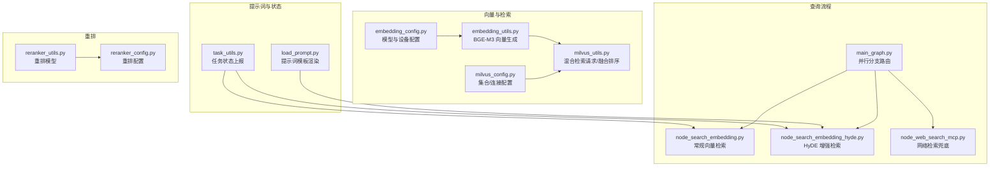
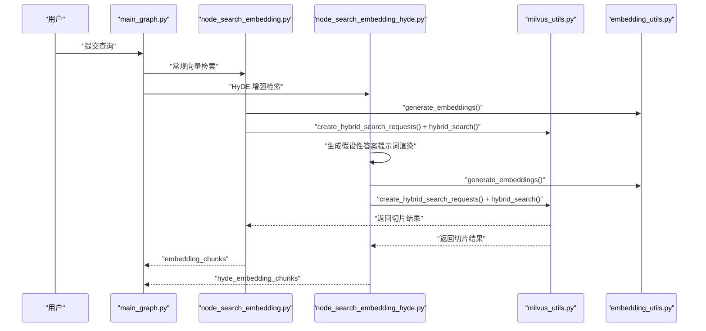
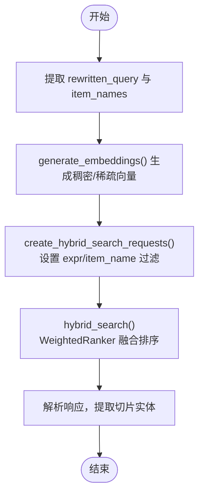
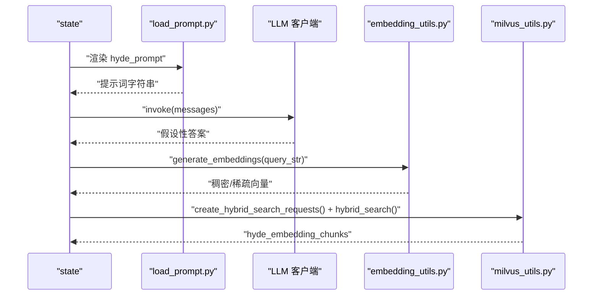
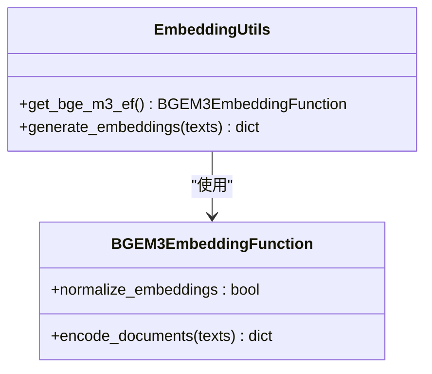
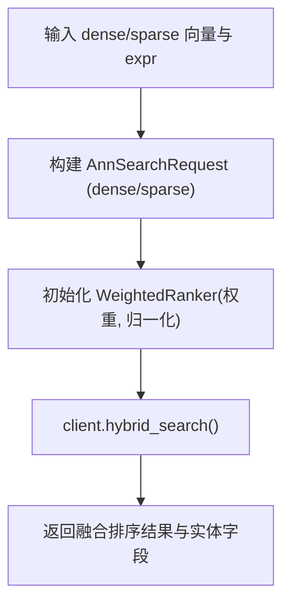
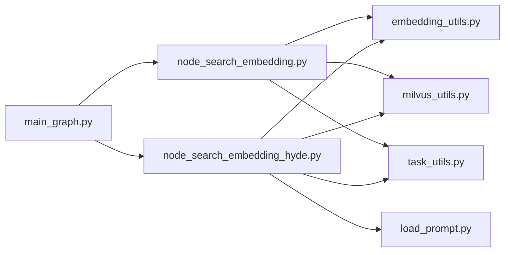

# 语义搜索模块

<cite>
**本文引用的文件**
- [node_search_embedding.py](file://app/query_process/agent/nodes/node_search_embedding.py)
- [node_search_embedding_hyde.py](file://app/query_process/agent/nodes/node_search_embedding_hyde.py)
- [embedding_utils.py](file://app/lm/embedding_utils.py)
- [milvus_utils.py](file://app/clients/milvus_utils.py)
- [embedding_config.py](file://app/conf/embedding_config.py)
- [milvus_config.py](file://app/conf/milvus_config.py)
- [load_prompt.py](file://app/core/load_prompt.py)
- [main_graph.py](file://app/query_process/agent/main_graph.py)
- [task_utils.py](file://app/utils/task_utils.py)
- [reranker_utils.py](file://app/lm/reranker_utils.py)
- [reranker_config.py](file://app/conf/reranker_config.py)
</cite>

## 目录
1. [简介](#简介)
2. [项目结构](#项目结构)
3. [核心组件](#核心组件)
4. [架构总览](#架构总览)
5. [详细组件分析](#详细组件分析)
6. [依赖分析](#依赖分析)
7. [性能考虑](#性能考虑)
8. [故障排查指南](#故障排查指南)
9. [结论](#结论)
10. [附录](#附录)

## 简介
本文件面向语义搜索模块的技术文档，聚焦混合向量检索与 Hypothetical Document Embeddings（HyDE）增强检索的实现原理与工程实践。内容涵盖：
- 向量相似度计算与检索策略（稠密/稀疏双模态融合）
- HyDE 的假设文档生成与查询改写机制
- 搜索参数调优（相似度阈值、召回率、权重与输出字段）
- 不同策略的适用场景与性能特征
- 搜索结果质量评估指标与优化建议
- 具体代码示例与配置参数说明

## 项目结构
语义搜索模块位于查询流程的早期阶段，负责将用户问题转化为高质量的检索信号，并在 Milvus 中执行混合向量检索。主要文件组织如下：
- 查询图与路由：定义并行检索分支（传统向量检索、HyDE 增强检索、网络检索）
- 检索节点：分别实现常规向量检索与 HyDE 增强检索
- 向量化工具：基于 BGE-M3 生成稠密与稀疏混合向量
- Milvus 客户端：构建混合检索请求、执行融合排序与结果返回
- 配置管理：Embedding、Milvus、重排器等配置项
- 提示词加载：HyDE 使用的提示词模板渲染
- 任务状态：检索节点的运行状态上报与流式推送

图表来源
- [main_graph.py:28-47](file://app/query_process/agent/main_graph.py#L28-L47)
- [node_search_embedding.py:12-72](file://app/query_process/agent/nodes/node_search_embedding.py#L12-L72)
- [node_search_embedding_hyde.py:70-92](file://app/query_process/agent/nodes/node_search_embedding_hyde.py#L70-L92)
- [embedding_utils.py:51-96](file://app/lm/embedding_utils.py#L51-L96)
- [milvus_utils.py:117-198](file://app/clients/milvus_utils.py#L117-L198)
- [milvus_config.py:12-26](file://app/conf/milvus_config.py#L12-L26)
- [embedding_config.py:9-24](file://app/conf/embedding_config.py#L9-L24)
- [load_prompt.py:5-28](file://app/core/load_prompt.py#L5-L28)
- [task_utils.py:71-109](file://app/utils/task_utils.py#L71-L109)
- [reranker_utils.py:6-14](file://app/lm/reranker_utils.py#L6-L14)
- [reranker_config.py:9-21](file://app/conf/reranker_config.py#L9-L21)

章节来源
- [main_graph.py:28-47](file://app/query_process/agent/main_graph.py#L28-L47)

## 核心组件
- 常规向量检索节点：接收重写后的查询与明确的实体名，生成稠密/稀疏向量，构造混合检索请求，调用 Milvus 执行融合排序并返回切片结果。
- HyDE 增强检索节点：先用 LLM 生成“假设性答案”，将“重写问题 + 假设性答案”拼接后向量化，再进行混合检索，以提升召回。
- 向量生成工具：基于 BGE-M3 模型生成混合向量，开启原生 L2 归一化以适配 Milvus 内积检索；对稀疏向量进行字典化以便序列化与 Milvus 存储。
- Milvus 客户端：提供 Milvus 单例连接、混合检索请求构建、融合排序（WeightedRanker）与结果返回。
- 配置管理：Embedding 与 Milvus 的路径、设备、半精度开关等；重排器配置。
- 提示词加载：按模板名加载并渲染 HyDE 提示词，供 LLM 生成假设性答案。
- 任务状态：检索节点开始与结束时上报运行状态，支持流式进度推送。

章节来源
- [node_search_embedding.py:12-72](file://app/query_process/agent/nodes/node_search_embedding.py#L12-L72)
- [node_search_embedding_hyde.py:70-92](file://app/query_process/agent/nodes/node_search_embedding_hyde.py#L70-L92)
- [embedding_utils.py:51-96](file://app/lm/embedding_utils.py#L51-L96)
- [milvus_utils.py:117-198](file://app/clients/milvus_utils.py#L117-L198)
- [embedding_config.py:9-24](file://app/conf/embedding_config.py#L9-L24)
- [milvus_config.py:12-26](file://app/conf/milvus_config.py#L12-L26)
- [load_prompt.py:5-28](file://app/core/load_prompt.py#L5-L28)
- [task_utils.py:71-109](file://app/utils/task_utils.py#L71-L109)

## 架构总览
查询流程采用 LangGraph 并行分支策略：在确认实体名后，同时触发常规向量检索、HyDE 增强检索与网络检索，随后进入重排与最终回答生成阶段。

图表来源
- [main_graph.py:28-47](file://app/query_process/agent/main_graph.py#L28-L47)
- [node_search_embedding.py:12-72](file://app/query_process/agent/nodes/node_search_embedding.py#L12-L72)
- [node_search_embedding_hyde.py:70-92](file://app/query_process/agent/nodes/node_search_embedding_hyde.py#L70-L92)
- [embedding_utils.py:51-96](file://app/lm/embedding_utils.py#L51-L96)
- [milvus_utils.py:117-198](file://app/clients/milvus_utils.py#L117-L198)

## 详细组件分析

### 常规向量检索节点（node_search_embedding）
- 输入：重写后的查询与明确的实体名列表
- 处理：
  - 生成混合向量（稠密/稀疏）
  - 构建混合检索请求（限定实体名过滤表达式）
  - 调用 Milvus 执行融合排序，返回切片实体
- 输出：embedding_chunks 列表，包含 chunk_id、内容与标题等字段

图表来源
- [node_search_embedding.py:12-72](file://app/query_process/agent/nodes/node_search_embedding.py#L12-L72)
- [embedding_utils.py:51-96](file://app/lm/embedding_utils.py#L51-L96)
- [milvus_utils.py:117-198](file://app/clients/milvus_utils.py#L117-L198)

章节来源
- [node_search_embedding.py:12-72](file://app/query_process/agent/nodes/node_search_embedding.py#L12-L72)

### HyDE 增强检索节点（node_search_embedding_hyde）
- 输入：重写后的查询与实体名列表
- 处理：
  - 使用提示词模板渲染 HyDE 提示词，调用 LLM 生成假设性答案
  - 将“重写问题 + 假设性答案”拼接后向量化
  - 构建混合检索请求并执行融合排序
- 输出：hyde_embedding_chunks 列表

图表来源
- [node_search_embedding_hyde.py:70-92](file://app/query_process/agent/nodes/node_search_embedding_hyde.py#L70-L92)
- [load_prompt.py:5-28](file://app/core/load_prompt.py#L5-L28)
- [embedding_utils.py:51-96](file://app/lm/embedding_utils.py#L51-L96)
- [milvus_utils.py:117-198](file://app/clients/milvus_utils.py#L117-L198)

章节来源
- [node_search_embedding_hyde.py:70-92](file://app/query_process/agent/nodes/node_search_embedding_hyde.py#L70-L92)

### 向量生成工具（embedding_utils）
- 功能：BGE-M3 模型单例加载与混合向量生成，开启原生 L2 归一化以适配 Milvus 内积检索
- 关键点：
  - 稀疏向量索引与权重转换为 Python 原生类型，保证 JSON 序列化与 Milvus 存储兼容
  - 返回格式与 Milvus 取值逻辑契合（dense 嵌套列表、sparse 字典列表）

图表来源
- [embedding_utils.py:51-96](file://app/lm/embedding_utils.py#L51-L96)

章节来源
- [embedding_utils.py:51-96](file://app/lm/embedding_utils.py#L51-L96)

### Milvus 客户端（milvus_utils）
- 功能：Milvus 单例连接、混合检索请求构建、融合排序与结果返回
- 关键点：
  - 稠密向量默认 COSINE，稀疏向量默认 IP，适配 BGE-M3 向量类型
  - WeightedRanker 支持归一化评分与自定义权重，提升融合稳定性
  - 支持输出字段定制与 limit 控制

图表来源
- [milvus_utils.py:117-198](file://app/clients/milvus_utils.py#L117-L198)

章节来源
- [milvus_utils.py:117-198](file://app/clients/milvus_utils.py#L117-L198)

### 配置管理
- Embedding 配置：模型路径、设备、半精度开关
- Milvus 配置：服务地址、集合名称
- 重排器配置：模型路径、设备、半精度开关

章节来源
- [embedding_config.py:9-24](file://app/conf/embedding_config.py#L9-L24)
- [milvus_config.py:12-26](file://app/conf/milvus_config.py#L12-L26)
- [reranker_config.py:9-21](file://app/conf/reranker_config.py#L9-L21)

## 依赖分析
- 查询图与节点耦合：常规检索与 HyDE 检索并行，均依赖向量生成与 Milvus 客户端
- 向量生成与 Milvus：embedding_utils 与 milvus_utils 为检索节点的底层依赖
- 提示词与 LLM：HyDE 节点依赖提示词加载与 LLM 客户端（外部集成）
- 任务状态：检索节点通过 task_utils 上报运行状态

图表来源
- [main_graph.py:28-47](file://app/query_process/agent/main_graph.py#L28-L47)
- [node_search_embedding.py:12-72](file://app/query_process/agent/nodes/node_search_embedding.py#L12-L72)
- [node_search_embedding_hyde.py:70-92](file://app/query_process/agent/nodes/node_search_embedding_hyde.py#L70-L92)
- [embedding_utils.py:51-96](file://app/lm/embedding_utils.py#L51-L96)
- [milvus_utils.py:117-198](file://app/clients/milvus_utils.py#L117-L198)
- [load_prompt.py:5-28](file://app/core/load_prompt.py#L5-L28)
- [task_utils.py:71-109](file://app/utils/task_utils.py#L71-L109)

章节来源
- [main_graph.py:28-47](file://app/query_process/agent/main_graph.py#L28-L47)

## 性能考虑
- 向量生成
  - BGE-M3 模型单例加载，避免重复初始化开销
  - 原生 L2 归一化，适配 Milvus 内积检索，减少二次归一化成本
  - 稀疏向量字典化，降低序列化与存储开销
- Milvus 混合检索
  - WeightedRanker 权重与归一化可调，平衡稠密/稀疏贡献
  - limit 控制返回规模，结合输出字段裁剪减少网络与下游压力
- HyDE 成本
  - 额外一次 LLM 推理与一次向量生成，适合召回敏感场景
  - 建议在实体名模糊或问题抽象性强时启用

[本节为通用性能讨论，不直接分析具体文件]

## 故障排查指南
- Milvus 连接失败
  - 检查 MILVUS_URL 环境变量是否正确
  - 查看连接日志与异常栈，确认 URI 格式与可达性
- 向量生成异常
  - 确认 texts 非空且为列表
  - 检查模型路径、设备与半精度配置
- 混合检索无结果
  - 校验 expr 过滤条件与集合字段类型
  - 调整 limit 与权重，尝试 norm_score 归一化
- HyDE 无结果或质量差
  - 检查提示词模板是否存在与渲染参数
  - 适当增加 limit 或调整权重，观察融合效果

章节来源
- [milvus_utils.py:10-31](file://app/clients/milvus_utils.py#L10-L31)
- [embedding_utils.py:58-61](file://app/lm/embedding_utils.py#L58-L61)
- [milvus_utils.py:158-198](file://app/clients/milvus_utils.py#L158-L198)
- [load_prompt.py:15-18](file://app/core/load_prompt.py#L15-L18)

## 结论
本模块通过 BGE-M3 混合向量与 Milvus 融合排序实现了高效的语义检索，并以 HyDE 增强召回能力。工程上通过单例模型、原生归一化与字典化稀疏向量等手段优化性能与稳定性；通过可调权重与输出字段控制召回与质量。建议在召回敏感场景启用 HyDE，并结合实体名过滤与重排进一步提升最终回答质量。

[本节为总结性内容，不直接分析具体文件]

## 附录

### 搜索参数调优方法
- 相似度阈值与归一化
  - 使用 norm_score 归一化评分后再融合，避免评分量级差异导致权重失衡
- 召回率优化
  - 提高 limit，扩大候选集；调整 ranker_weights，增大稀疏向量权重以提升语义覆盖
  - 在 HyDE 中拼接更丰富的假设性答案，提升检索覆盖面
- 输出字段裁剪
  - 仅返回必要字段，减少网络与下游处理开销

章节来源
- [milvus_utils.py:174-178](file://app/clients/milvus_utils.py#L174-L178)
- [milvus_utils.py:158-198](file://app/clients/milvus_utils.py#L158-L198)
- [node_search_embedding_hyde.py:45-48](file://app/query_process/agent/nodes/node_search_embedding_hyde.py#L45-L48)

### 不同策略的适用场景与性能特征
- 常规向量检索
  - 场景：实体名明确、问题具体、对速度敏感
  - 特征：单次向量生成与检索，延迟低
- HyDE 增强检索
  - 场景：实体名模糊、问题抽象、召回敏感
  - 特征：多一次 LLM 推理与向量生成，召回提升但延迟增加

章节来源
- [node_search_embedding.py:12-72](file://app/query_process/agent/nodes/node_search_embedding.py#L12-L72)
- [node_search_embedding_hyde.py:70-92](file://app/query_process/agent/nodes/node_search_embedding_hyde.py#L70-L92)

### 搜索结果质量评估指标与优化建议
- 指标
  - 召回率（Recall）、精确率（Precision）、F1 值
  - 用户点击/采纳率、人工评估得分
- 优化建议
  - 结合实体名过滤与重排（如 BGE 重排器）提升排序质量
  - 动态调整权重与 limit，依据业务反馈迭代
  - 对 HyDE 的提示词模板进行 A/B 测试，选择最佳版本

章节来源
- [reranker_utils.py:6-14](file://app/lm/reranker_utils.py#L6-L14)
- [reranker_config.py:9-21](file://app/conf/reranker_config.py#L9-L21)

### 配置参数说明（摘录）
- Embedding 配置
  - bge_m3_path：本地模型路径
  - bge_device：运行设备（cuda:0/cpu）
  - bge_fp16：是否开启半精度
- Milvus 配置
  - milvus_url：服务端连接地址
  - chunks_collection：切片集合名称
  - item_name_collection：实体名集合名称
- 重排器配置
  - bge_reranker_large：本地模型路径
  - bge_reranker_device：设备
  - bge_reranker_fp16：是否开启半精度

章节来源
- [embedding_config.py:18-24](file://app/conf/embedding_config.py#L18-L24)
- [milvus_config.py:21-26](file://app/conf/milvus_config.py#L21-L26)
- [reranker_config.py:16-21](file://app/conf/reranker_config.py#L16-L21)