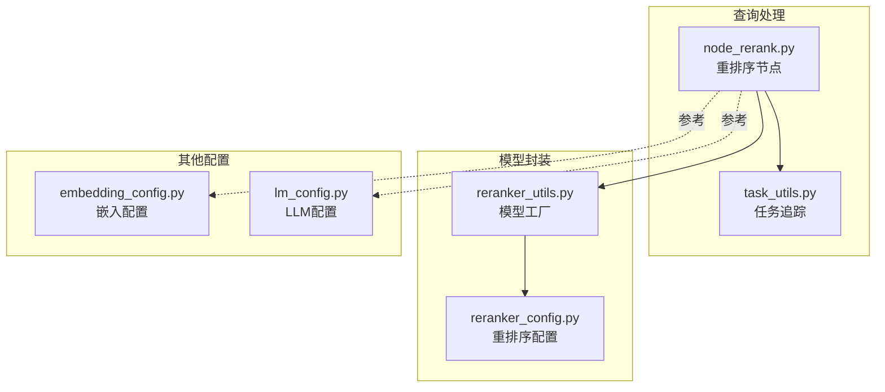
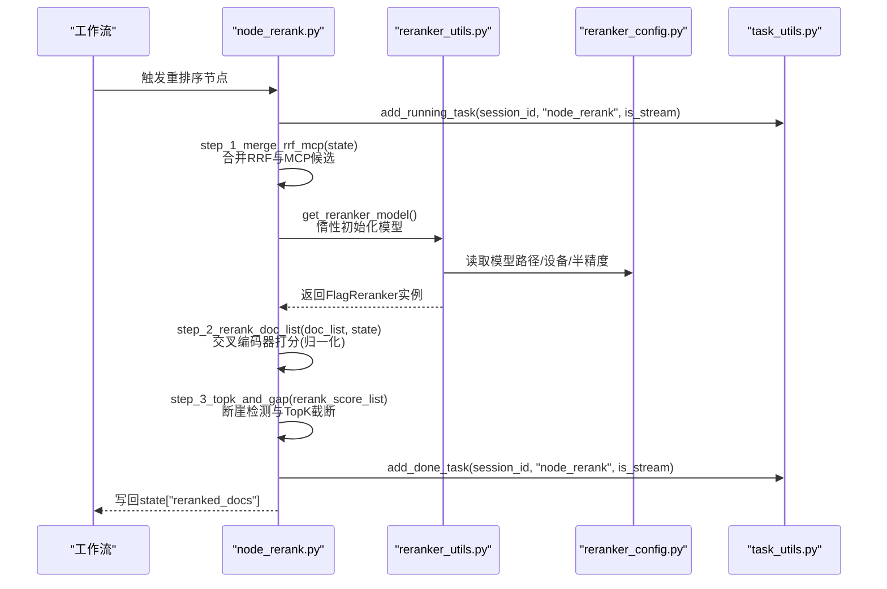
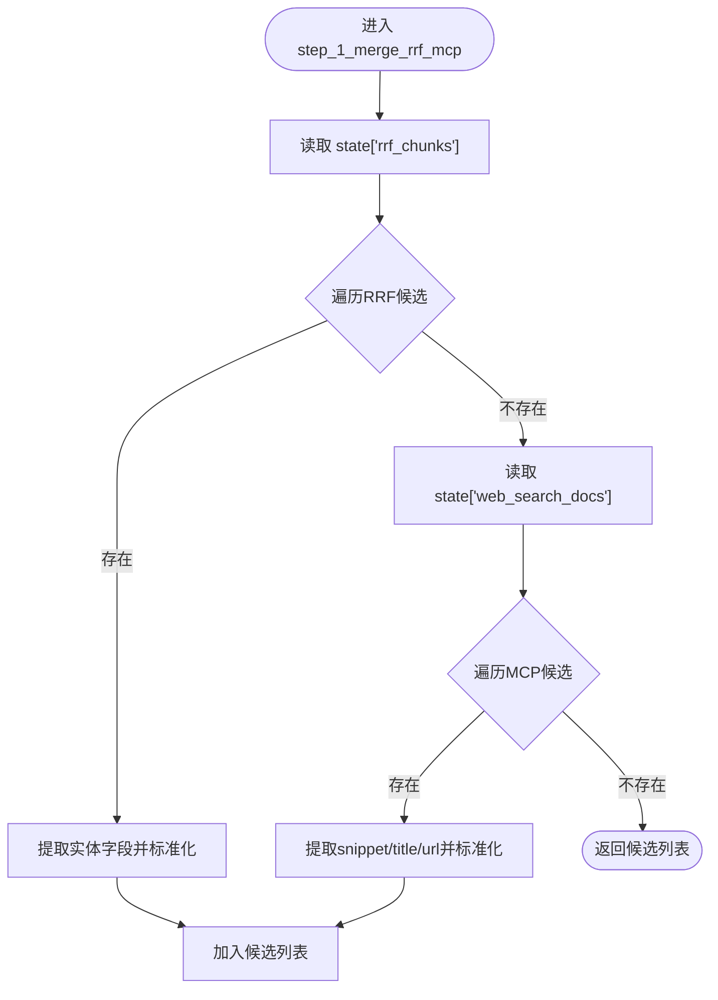
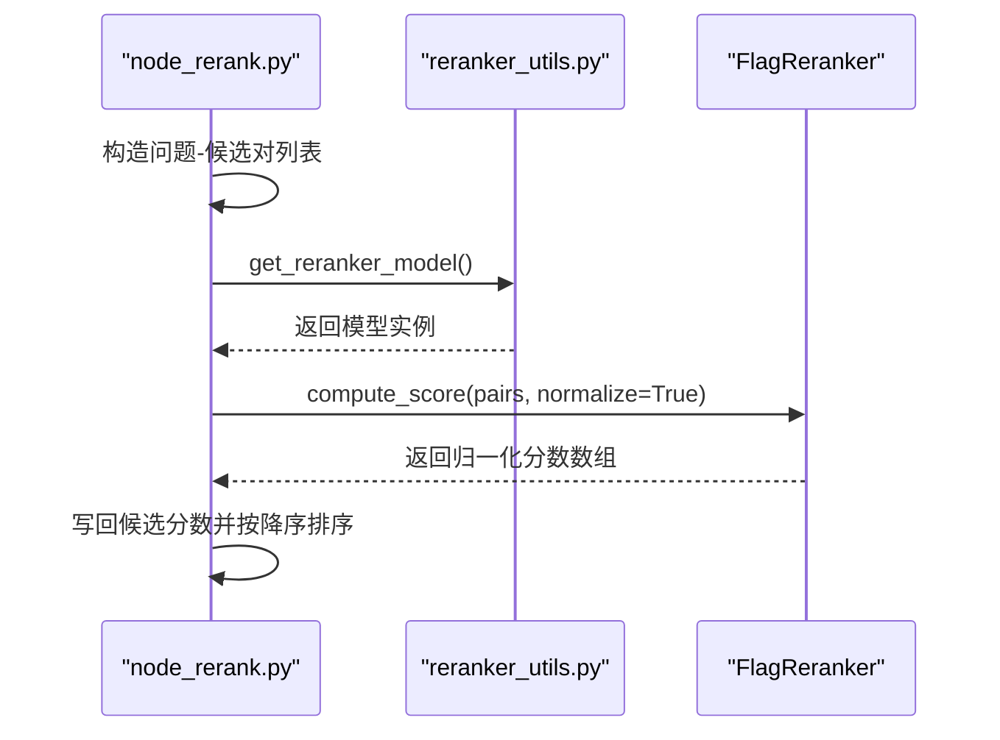
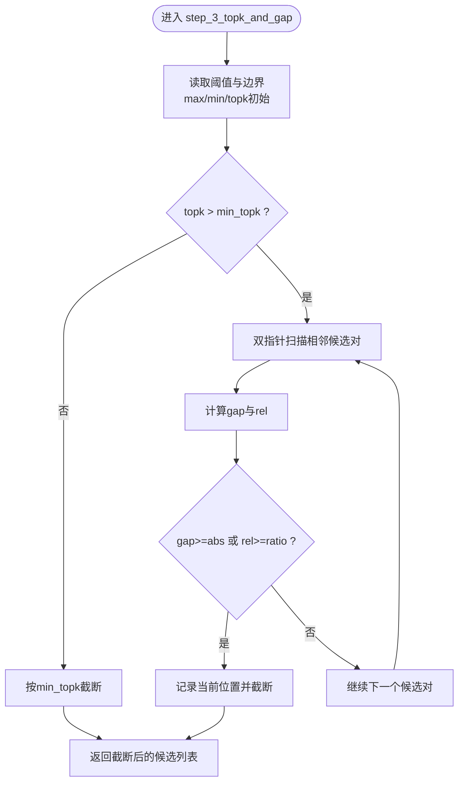
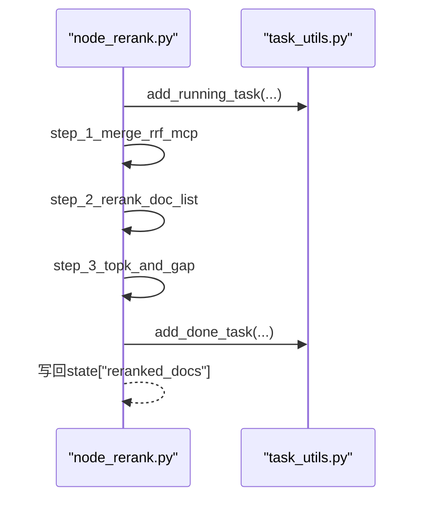
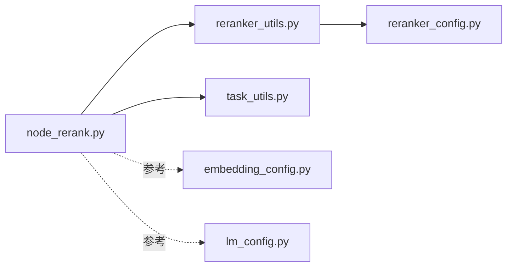

# BGE重排序算法

<cite>
**本文引用的文件**
- [app/query_process/agent/nodes/node_rerank.py](file://app/query_process/agent/nodes/node_rerank.py)
- [app/lm/reranker_utils.py](file://app/lm/reranker_utils.py)
- [app/conf/reranker_config.py](file://app/conf/reranker_config.py)
- [app/utils/task_utils.py](file://app/utils/task_utils.py)
- [app/conf/embedding_config.py](file://app/conf/embedding_config.py)
- [app/conf/lm_config.py](file://app/conf/lm_config.py)
</cite>

## 目录
1. [简介](#简介)
2. [项目结构](#项目结构)
3. [核心组件](#核心组件)
4. [架构总览](#架构总览)
5. [详细组件分析](#详细组件分析)
6. [依赖分析](#依赖分析)
7. [性能考虑](#性能考虑)
8. [故障排查指南](#故障排查指南)
9. [结论](#结论)
10. [附录](#附录)

## 简介
本文件面向BGE Cross-Encoder重排序算法的技术文档，聚焦于重排序节点的三步流程：数据合并、精确打分与断崖检测。文档还涵盖重排序参数配置（RERANK_MAX_TOPK、RERANK_MIN_TOPK、RERANK_GAP_RATIO、RERANK_GAP_ABS）、归一化评分机制与分数范围控制、性能优化策略与最佳实践，并提供基于仓库代码的实现分析与使用示例。

## 项目结构
围绕重排序功能的相关文件组织如下：
- 重排序节点：负责合并多路候选、调用交叉编码器进行精确打分、执行断崖检测与TopK截断
- 重排序模型封装：统一管理FlagReranker实例与设备/精度配置
- 配置层：集中管理BGE重排序模型路径、设备与半精度开关
- 任务追踪：为重排序节点提供运行状态上报与流式推送

图表来源
- [app/query_process/agent/nodes/node_rerank.py:162-208](file://app/query_process/agent/nodes/node_rerank.py#L162-L208)
- [app/lm/reranker_utils.py:6-14](file://app/lm/reranker_utils.py#L6-L14)
- [app/conf/reranker_config.py:16-21](file://app/conf/reranker_config.py#L16-L21)
- [app/utils/task_utils.py:68-109](file://app/utils/task_utils.py#L68-L109)

章节来源
- [app/query_process/agent/nodes/node_rerank.py:162-208](file://app/query_process/agent/nodes/node_rerank.py#L162-L208)
- [app/lm/reranker_utils.py:6-14](file://app/lm/reranker_utils.py#L6-L14)
- [app/conf/reranker_config.py:16-21](file://app/conf/reranker_config.py#L16-L21)
- [app/utils/task_utils.py:68-109](file://app/utils/task_utils.py#L68-L109)

## 核心组件
- 重排序节点（node_rerank.py）
  - 职责：合并RRF与MCP多路候选，调用交叉编码器进行精确打分，执行断崖检测与TopK截断，将结果写回状态
  - 关键常量：RERANK_MAX_TOPK、RERANK_MIN_TOPK、RERANK_GAP_RATIO、RERANK_GAP_ABS
- 重排序模型工厂（reranker_utils.py）
  - 职责：延迟初始化FlagReranker实例，按配置选择设备与半精度
- 重排序配置（reranker_config.py）
  - 职责：从环境变量读取模型路径、设备与半精度开关
- 任务追踪（task_utils.py）
  - 职责：记录节点运行/完成状态，支持流式进度推送

章节来源
- [app/query_process/agent/nodes/node_rerank.py:14-21](file://app/query_process/agent/nodes/node_rerank.py#L14-L21)
- [app/query_process/agent/nodes/node_rerank.py:162-208](file://app/query_process/agent/nodes/node_rerank.py#L162-L208)
- [app/lm/reranker_utils.py:6-14](file://app/lm/reranker_utils.py#L6-L14)
- [app/conf/reranker_config.py:16-21](file://app/conf/reranker_config.py#L16-L21)
- [app/utils/task_utils.py:68-109](file://app/utils/task_utils.py#L68-L109)

## 架构总览
重排序节点在LangGraph工作流中作为独立节点，串联“多路候选合并—精确打分—断崖检测与TopK截断”，并通过任务追踪模块上报进度。

图表来源
- [app/query_process/agent/nodes/node_rerank.py:162-208](file://app/query_process/agent/nodes/node_rerank.py#L162-L208)
- [app/lm/reranker_utils.py:6-14](file://app/lm/reranker_utils.py#L6-L14)
- [app/conf/reranker_config.py:16-21](file://app/conf/reranker_config.py#L16-L21)
- [app/utils/task_utils.py:68-109](file://app/utils/task_utils.py#L68-L109)

## 详细组件分析

### 数据合并（step_1_merge_rrf_mcp）
- 输入：state中包含RRF候选与MCP网页候选
- 输出：统一结构的候选列表，包含文本、标题、来源与URL等字段
- 行为要点：
  - 遍历RRF候选，提取实体信息并标准化字段
  - 遍历MCP候选，提取片段、标题与URL
  - 统一为统一字典结构，便于后续打分与排序

图表来源
- [app/query_process/agent/nodes/node_rerank.py:24-65](file://app/query_process/agent/nodes/node_rerank.py#L24-L65)

章节来源
- [app/query_process/agent/nodes/node_rerank.py:24-65](file://app/query_process/agent/nodes/node_rerank.py#L24-L65)

### 精确打分（step_2_rerank_doc_list）
- 输入：候选列表与重写后的查询
- 输出：每个候选的交叉编码器打分，按分数降序排列
- 关键点：
  - 构造问题-候选对列表
  - 调用compute_score并启用normalize=True，将分数缩放到[0,1]区间
  - 将分数写回候选并排序

图表来源
- [app/query_process/agent/nodes/node_rerank.py:68-97](file://app/query_process/agent/nodes/node_rerank.py#L68-L97)
- [app/lm/reranker_utils.py:6-14](file://app/lm/reranker_utils.py#L6-L14)

章节来源
- [app/query_process/agent/nodes/node_rerank.py:68-97](file://app/query_process/agent/nodes/node_rerank.py#L68-L97)
- [app/lm/reranker_utils.py:6-14](file://app/lm/reranker_utils.py#L6-L14)

### 断崖检测与TopK截断（step_3_topk_and_gap）
- 输入：按分数降序排列的候选列表
- 输出：根据断崖阈值与TopK约束截断后的最终候选
- 核心逻辑：
  - 计算动态TopK：min(最大TopK, 列表长度)，且至少保留最小TopK
  - 双指针扫描相邻候选对，计算绝对断崖gap与相对断崖rel
  - 当gap≥绝对阈值或rel≥相对阈值时，停止并截断到当前位置
  - 截断后返回最终候选列表

图表来源
- [app/query_process/agent/nodes/node_rerank.py:100-160](file://app/query_process/agent/nodes/node_rerank.py#L100-L160)

章节来源
- [app/query_process/agent/nodes/node_rerank.py:100-160](file://app/query_process/agent/nodes/node_rerank.py#L100-L160)

### 重排序节点主流程（node_rerank）
- 职责：串联上述三步，写回state["reranked_docs"]
- 任务追踪：在开始与结束分别上报运行/完成状态

图表来源
- [app/query_process/agent/nodes/node_rerank.py:162-208](file://app/query_process/agent/nodes/node_rerank.py#L162-L208)
- [app/utils/task_utils.py:68-109](file://app/utils/task_utils.py#L68-L109)

章节来源
- [app/query_process/agent/nodes/node_rerank.py:162-208](file://app/query_process/agent/nodes/node_rerank.py#L162-L208)
- [app/utils/task_utils.py:68-109](file://app/utils/task_utils.py#L68-L109)

## 依赖分析
- node_rerank.py依赖：
  - reranker_utils.py：获取FlagReranker实例
  - reranker_config.py：读取模型路径、设备与半精度
  - task_utils.py：任务运行/完成状态上报
- reranker_utils.py依赖：
  - reranker_config.py：读取配置
- 配置层：
  - reranker_config.py：重排序模型配置
  - embedding_config.py：嵌入模型配置（参考）
  - lm_config.py：LLM配置（参考）

图表来源
- [app/query_process/agent/nodes/node_rerank.py:6-10](file://app/query_process/agent/nodes/node_rerank.py#L6-L10)
- [app/lm/reranker_utils.py:1-2](file://app/lm/reranker_utils.py#L1-L2)
- [app/conf/reranker_config.py:16-21](file://app/conf/reranker_config.py#L16-L21)
- [app/utils/task_utils.py:68-109](file://app/utils/task_utils.py#L68-L109)

章节来源
- [app/query_process/agent/nodes/node_rerank.py:6-10](file://app/query_process/agent/nodes/node_rerank.py#L6-L10)
- [app/lm/reranker_utils.py:1-2](file://app/lm/reranker_utils.py#L1-L2)
- [app/conf/reranker_config.py:16-21](file://app/conf/reranker_config.py#L16-L21)
- [app/utils/task_utils.py:68-109](file://app/utils/task_utils.py#L68-L109)

## 性能考虑
- 模型加载与缓存
  - 模型采用惰性初始化并全局缓存，避免重复实例化带来的开销
- 设备与半精度
  - 通过配置选择GPU/CPU与半精度，可在显存受限时降低内存占用
- 归一化打分
  - 启用normalize=True将分数缩放至[0,1]，有利于跨路候选的公平比较与断崖检测
- TopK与断崖阈值
  - 合理设置RERANK_MAX_TOPK与RERANK_MIN_TOPK，结合RERANK_GAP_RATIO与RERANK_GAP_ABS，可快速过滤低质量候选，减少下游处理成本
- 流式进度
  - 通过任务追踪模块上报进度，提升用户体验与可观测性

章节来源
- [app/lm/reranker_utils.py:6-14](file://app/lm/reranker_utils.py#L6-L14)
- [app/query_process/agent/nodes/node_rerank.py:84-87](file://app/query_process/agent/nodes/node_rerank.py#L84-L87)
- [app/query_process/agent/nodes/node_rerank.py:124-127](file://app/query_process/agent/nodes/node_rerank.py#L124-L127)
- [app/utils/task_utils.py:68-109](file://app/utils/task_utils.py#L68-L109)

## 故障排查指南
- 模型未正确加载
  - 检查环境变量是否正确设置（模型路径、设备、半精度开关）
  - 确认模型路径指向有效模型或仓库标识
- 打分异常或全零
  - 确认compute_score传入了正确的“问题-候选”对
  - 检查normalize参数是否启用
- TopK截断过严或过松
  - 调整RERANK_MAX_TOPK、RERANK_MIN_TOPK、RERANK_GAP_RATIO与RERANK_GAP_ABS
  - 结合业务场景验证断崖阈值是否合理
- 任务状态未更新
  - 确认add_running_task与add_done_task调用位置与session_id正确

章节来源
- [app/conf/reranker_config.py:16-21](file://app/conf/reranker_config.py#L16-L21)
- [app/lm/reranker_utils.py:6-14](file://app/lm/reranker_utils.py#L6-L14)
- [app/query_process/agent/nodes/node_rerank.py:84-87](file://app/query_process/agent/nodes/node_rerank.py#L84-L87)
- [app/query_process/agent/nodes/node_rerank.py:124-127](file://app/query_process/agent/nodes/node_rerank.py#L124-L127)
- [app/utils/task_utils.py:68-109](file://app/utils/task_utils.py#L68-L109)

## 结论
本实现以清晰的三步流程完成多路候选的精确重排序：先合并候选，再交叉编码器打分，最后基于断崖检测与TopK约束进行截断。通过配置化的模型参数与阈值，系统在准确性与效率之间取得平衡，并提供了完善的任务追踪能力以支撑生产环境的可观测性。

## 附录

### 参数配置与调优建议
- RERANK_MAX_TOPK
  - 作用：动态TopK上限，限制最终输出数量
  - 调优：根据下游检索规模与资源预算设定，建议从较小值逐步增大
- RERANK_MIN_TOPK
  - 作用：保证至少输出的候选数量
  - 调优：结合召回质量与业务SLA，避免过低导致信息不足
- RERANK_GAP_RATIO
  - 作用：相对断崖阈值，衡量相邻候选间的分数比例变化
  - 调优：在高召回场景可适当提高以更严格地过滤
- RERANK_GAP_ABS
  - 作用：绝对断崖阈值，直接衡量相邻候选的分数差
  - 调优：配合normalize后的分数范围，通常设置为0.1~0.5区间

章节来源
- [app/query_process/agent/nodes/node_rerank.py:14-21](file://app/query_process/agent/nodes/node_rerank.py#L14-L21)
- [app/query_process/agent/nodes/node_rerank.py:124-127](file://app/query_process/agent/nodes/node_rerank.py#L124-L127)

### 归一化评分机制与分数范围控制
- 归一化策略
  - 启用normalize=True后，交叉编码器输出分数被缩放到[0,1]区间
  - 有助于消除不同来源分数尺度差异，提升断崖检测稳定性
- 分数范围控制
  - 通过断崖阈值与TopK边界共同控制最终输出规模与质量

章节来源
- [app/query_process/agent/nodes/node_rerank.py:84-87](file://app/query_process/agent/nodes/node_rerank.py#L84-L87)
- [app/query_process/agent/nodes/node_rerank.py:124-127](file://app/query_process/agent/nodes/node_rerank.py#L124-L127)

### 使用示例（基于仓库提供的本地测试）
- 示例入口：node_rerank.py中的本地测试块
- 输入数据：RRF候选与MCP网页候选
- 预期行为：完成合并、打分、断崖检测与TopK截断，并输出最终排名摘要

章节来源
- [app/query_process/agent/nodes/node_rerank.py:211-266](file://app/query_process/agent/nodes/node_rerank.py#L211-L266)