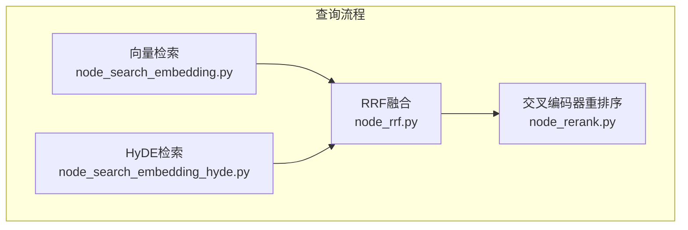
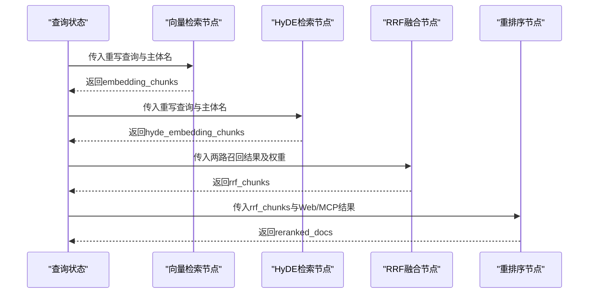
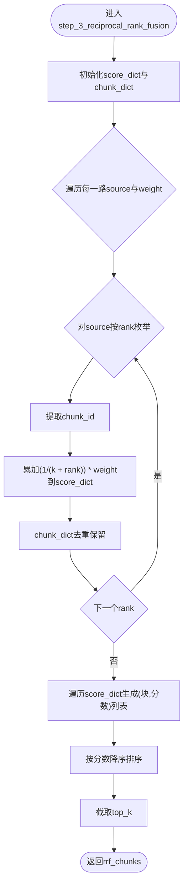
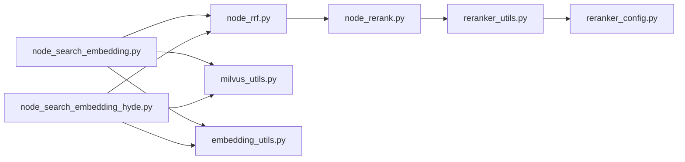

# RRF融合算法

<cite>
**本文引用的文件**
- [node_rrf.py](file://app/query_process/agent/nodes/node_rrf.py)
- [node_search_embedding.py](file://app/query_process/agent/nodes/node_search_embedding.py)
- [node_search_embedding_hyde.py](file://app/query_process/agent/nodes/node_search_embedding_hyde.py)
- [node_rerank.py](file://app/query_process/agent/nodes/node_rerank.py)
- [milvus_utils.py](file://app/clients/milvus_utils.py)
- [embedding_utils.py](file://app/lm/embedding_utils.py)
- [embedding_config.py](file://app/conf/embedding_config.py)
- [reranker_utils.py](file://app/lm/reranker_utils.py)
- [reranker_config.py](file://app/conf/reranker_config.py)
- [task_utils.py](file://app/utils/task_utils.py)
- [kb-learning-journey.md](file://kb-learning-journey.md)
</cite>

## 目录
1. [简介](#简介)
2. [项目结构](#项目结构)
3. [核心组件](#核心组件)
4. [架构总览](#架构总览)
5. [详细组件分析](#详细组件分析)
6. [依赖分析](#依赖分析)
7. [性能考量](#性能考量)
8. [故障排查指南](#故障排查指南)
9. [结论](#结论)
10. [附录](#附录)

## 简介
本文件系统性阐述本项目中的RRF（Reciprocal Rank Fusion，倒数排名融合）融合算法实现与工程实践，覆盖以下要点：
- 数学原理与递归排名融合机制
- 多路搜索来源的融合策略与权重分配
- 倒数排名公式、融合系数调节与最终排序计算
- 多路结果的统一处理流程与去重机制
- RRF参数调优指南与效果评估方法
- 算法实现代码定位与融合效果对比分析

## 项目结构
RRF相关能力位于查询流程的Agent节点层，围绕“向量召回（含HyDE）+ RRF融合 + Cross-Encoder精排”的流水线组织：
- 向量召回：embedding与HyDE两条同源路
- 融合：RRF按排名聚合，统一score并排序
- 精排：Cross-Encoder对融合结果进行细粒度重排序

图表来源
- [node_rrf.py:50-76](file://app/query_process/agent/nodes/node_rrf.py#L50-L76)
- [node_search_embedding.py:12-72](file://app/query_process/agent/nodes/node_search_embedding.py#L12-L72)
- [node_search_embedding_hyde.py:70-92](file://app/query_process/agent/nodes/node_search_embedding_hyde.py#L70-L92)
- [node_rerank.py:162-208](file://app/query_process/agent/nodes/node_rerank.py#L162-L208)

章节来源
- [node_rrf.py:50-76](file://app/query_process/agent/nodes/node_rrf.py#L50-L76)
- [node_search_embedding.py:12-72](file://app/query_process/agent/nodes/node_search_embedding.py#L12-L72)
- [node_search_embedding_hyde.py:70-92](file://app/query_process/agent/nodes/node_search_embedding_hyde.py#L70-L92)
- [node_rerank.py:162-208](file://app/query_process/agent/nodes/node_rerank.py#L162-L208)

## 核心组件
- RRF融合节点：负责将多路同源召回结果按排名进行融合，统一score并排序，输出rrf_chunks
- 向量检索节点：基于BGE-M3稠密/稀疏混合向量，通过Milvus混合检索获取召回结果
- HyDE检索节点：先由LLM生成假设性答案，再与原问题拼接进行向量检索
- 重排序节点：对RRF结果进行Cross-Encoder打分与Top-K截断

章节来源
- [node_rrf.py:7-48](file://app/query_process/agent/nodes/node_rrf.py#L7-L48)
- [node_search_embedding.py:12-72](file://app/query_process/agent/nodes/node_search_embedding.py#L12-L72)
- [node_search_embedding_hyde.py:70-92](file://app/query_process/agent/nodes/node_search_embedding_hyde.py#L70-L92)
- [node_rerank.py:82-97](file://app/query_process/agent/nodes/node_rerank.py#L82-L97)

## 架构总览
RRF在召回与精排之间的位置决定了其职责：将来自不同检索通道（向量、HyDE）的同源结果进行统一融合，消除不同通道的分数量纲差异，再交由精排模型进一步细化。

图表来源
- [node_rrf.py:50-76](file://app/query_process/agent/nodes/node_rrf.py#L50-L76)
- [node_search_embedding.py:12-72](file://app/query_process/agent/nodes/node_search_embedding.py#L12-L72)
- [node_search_embedding_hyde.py:70-92](file://app/query_process/agent/nodes/node_search_embedding_hyde.py#L70-L92)
- [node_rerank.py:162-208](file://app/query_process/agent/nodes/node_rerank.py#L162-L208)

## 详细组件分析

### RRF融合算法实现
- 输入：多路同源召回结果，每路带有一个权重
- 融合策略：按各路内部的rank位置进行倒数排名融合，统一score后再排序
- 去重机制：以chunk_id为键，同一chunk仅保留一份
- 输出：按融合score降序排列的rrf_chunks

图表来源
- [node_rrf.py:7-48](file://app/query_process/agent/nodes/node_rrf.py#L7-L48)

章节来源
- [node_rrf.py:7-48](file://app/query_process/agent/nodes/node_rrf.py#L7-L48)

### 多路搜索来源与统一处理
- 同源路：embedding_chunks、hyde_embedding_chunks
- 统一处理：将两路结果合并，按各自内部rank参与融合
- 去重：以chunk_id为键，避免重复块影响最终score

章节来源
- [node_rrf.py:63-70](file://app/query_process/agent/nodes/node_rrf.py#L63-L70)
- [node_rrf.py:30-35](file://app/query_process/agent/nodes/node_rrf.py#L30-L35)

### 倒数排名公式与融合系数
- 公式形式：对每条召回块，按其在该路的rank位置计算贡献分，累加到score_dict
- 融合系数：每路权重weight可调，用于平衡不同来源的重要性
- 常数k：示例实现中采用60作为平滑常数，避免极低rank导致的过大权重

章节来源
- [node_rrf.py:31-32](file://app/query_process/agent/nodes/node_rrf.py#L31-L32)
- [node_rrf.py:67-70](file://app/query_process/agent/nodes/node_rrf.py#L67-L70)

### 与向量检索的衔接
- 向量检索使用BGE-M3混合向量，通过Milvus混合检索获取召回
- 检索参数与输出字段在节点中明确配置，保证后续RRF输入的一致性

章节来源
- [node_search_embedding.py:36-51](file://app/query_process/agent/nodes/node_search_embedding.py#L36-L51)
- [milvus_utils.py:117-155](file://app/clients/milvus_utils.py#L117-L155)
- [embedding_utils.py:51-85](file://app/lm/embedding_utils.py#L51-L85)
- [embedding_config.py:9-24](file://app/conf/embedding_config.py#L9-L24)

### 与HyDE检索的衔接
- HyDE先由LLM生成假设性答案，再与原问题拼接进行向量检索
- 检索同样使用BGE-M3混合向量与Milvus混合检索

章节来源
- [node_search_embedding_hyde.py:16-34](file://app/query_process/agent/nodes/node_search_embedding_hyde.py#L16-L34)
- [node_search_embedding_hyde.py:37-68](file://app/query_process/agent/nodes/node_search_embedding_hyde.py#L37-L68)

### 与重排序的衔接
- RRF之后，将本地召回与Web/MCP结果合并，交由Cross-Encoder进行精排
- 精排采用归一化打分，并结合断崖检测与Top-K截断

章节来源
- [node_rerank.py:82-97](file://app/query_process/agent/nodes/node_rerank.py#L82-L97)
- [node_rerank.py:100-160](file://app/query_process/agent/nodes/node_rerank.py#L100-L160)
- [reranker_utils.py:6-14](file://app/lm/reranker_utils.py#L6-L14)
- [reranker_config.py:9-21](file://app/conf/reranker_config.py#L9-L21)

## 依赖分析
- RRF依赖：向量检索与HyDE检索提供的同源召回结果
- 向量检索依赖：BGE-M3嵌入生成、Milvus混合检索客户端
- 重排序依赖：Cross-Encoder模型与配置

图表来源
- [node_rrf.py:63-70](file://app/query_process/agent/nodes/node_rrf.py#L63-L70)
- [node_search_embedding.py:36-51](file://app/query_process/agent/nodes/node_search_embedding.py#L36-L51)
- [node_search_embedding_hyde.py:50-64](file://app/query_process/agent/nodes/node_search_embedding_hyde.py#L50-L64)
- [milvus_utils.py:158-198](file://app/clients/milvus_utils.py#L158-L198)
- [embedding_utils.py:51-85](file://app/lm/embedding_utils.py#L51-L85)
- [node_rerank.py:162-208](file://app/query_process/agent/nodes/node_rerank.py#L162-L208)
- [reranker_utils.py:6-14](file://app/lm/reranker_utils.py#L6-L14)
- [reranker_config.py:9-21](file://app/conf/reranker_config.py#L9-L21)

章节来源
- [node_rrf.py:63-70](file://app/query_process/agent/nodes/node_rrf.py#L63-L70)
- [node_search_embedding.py:36-51](file://app/query_process/agent/nodes/node_search_embedding.py#L36-L51)
- [node_search_embedding_hyde.py:50-64](file://app/query_process/agent/nodes/node_search_embedding_hyde.py#L50-L64)
- [milvus_utils.py:158-198](file://app/clients/milvus_utils.py#L158-L198)
- [embedding_utils.py:51-85](file://app/lm/embedding_utils.py#L51-L85)
- [node_rerank.py:162-208](file://app/query_process/agent/nodes/node_rerank.py#L162-L208)
- [reranker_utils.py:6-14](file://app/lm/reranker_utils.py#L6-L14)
- [reranker_config.py:9-21](file://app/conf/reranker_config.py#L9-L21)

## 性能考量
- RRF复杂度：对每路按rank遍历，总体近似O(N)，N为所有召回块数
- 去重成本：以chunk_id为键的字典操作，均摊O(1)
- 排序成本：对score_dict项排序，O(M log M)，M为唯一块数
- 混合检索成本：Milvus混合检索受向量维度、索引类型与查询参数影响
- 精排成本：Cross-Encoder打分与Top-K截断，成本与输入规模线性相关

## 故障排查指南
- RRF结果为空
  - 检查两路召回是否为空：embedding_chunks与hyde_embedding_chunks
  - 检查chunk_id提取逻辑是否正确
- 融合score异常
  - 检查权重weight是否合理设置
  - 检查常数k（示例实现中为60）是否需要调整
- 排序异常
  - 检查排序key是否为score且降序
  - 检查Top-K截断是否符合预期
- 任务状态与进度
  - 使用任务工具记录running/done状态，便于定位卡顿环节

章节来源
- [node_rrf.py:46-47](file://app/query_process/agent/nodes/node_rrf.py#L46-L47)
- [task_utils.py:68-109](file://app/utils/task_utils.py#L68-L109)

## 结论
本项目的RRF融合算法以“按rank融合、统一score、去重排序”为核心，有效解决了多路同源召回结果的分数量纲差异问题。配合HyDE增强召回与Cross-Encoder精排，形成从召回、融合到精排的完整链路。参数（权重、常数k、Top-K）与评估指标（断崖阈值、归一化分数）共同决定最终效果，建议在实际业务中结合数据分布与评测指标进行迭代优化。

## 附录

### RRF参数调优指南
- 权重weight
  - 用于平衡不同来源的重要性，建议通过A/B实验在多组候选值间评估
- 常数k
  - 示例实现中采用60，用于平滑rank对score的影响；较小k更敏感于前排，较大k更平滑
- Top-K
  - 控制最终输出规模，建议结合下游任务吞吐与质量目标设定

章节来源
- [node_rrf.py:31-32](file://app/query_process/agent/nodes/node_rrf.py#L31-L32)
- [node_rrf.py:67-70](file://app/query_process/agent/nodes/node_rrf.py#L67-L70)
- [node_rerank.py:124-160](file://app/query_process/agent/nodes/node_rerank.py#L124-L160)

### 效果评估方法
- 人工评估：抽取样本，对比RRF前后排序变化与相关性
- 归一化分数：Cross-Encoder输出分数可归一化，便于跨来源比较
- 断崖检测：基于绝对差与相对比例的Top-K截断，提升结果稳定性

章节来源
- [node_rerank.py:82-97](file://app/query_process/agent/nodes/node_rerank.py#L82-L97)
- [node_rerank.py:100-160](file://app/query_process/agent/nodes/node_rerank.py#L100-L160)

### 算法实现代码定位
- RRF融合：[node_rrf.py:7-48](file://app/query_process/agent/nodes/node_rrf.py#L7-L48)
- 向量检索：[node_search_embedding.py:12-72](file://app/query_process/agent/nodes/node_search_embedding.py#L12-L72)
- HyDE检索：[node_search_embedding_hyde.py:70-92](file://app/query_process/agent/nodes/node_search_embedding_hyde.py#L70-L92)
- 重排序：[node_rerank.py:82-97](file://app/query_process/agent/nodes/node_rerank.py#L82-L97)

章节来源
- [node_rrf.py:7-48](file://app/query_process/agent/nodes/node_rrf.py#L7-L48)
- [node_search_embedding.py:12-72](file://app/query_process/agent/nodes/node_search_embedding.py#L12-L72)
- [node_search_embedding_hyde.py:70-92](file://app/query_process/agent/nodes/node_search_embedding_hyde.py#L70-L92)
- [node_rerank.py:82-97](file://app/query_process/agent/nodes/node_rerank.py#L82-L97)