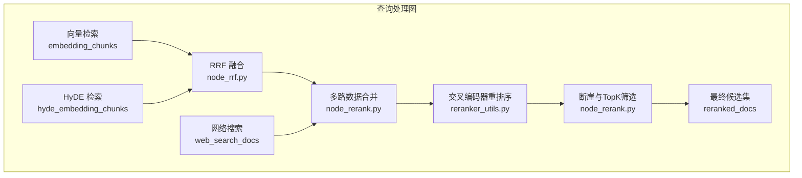
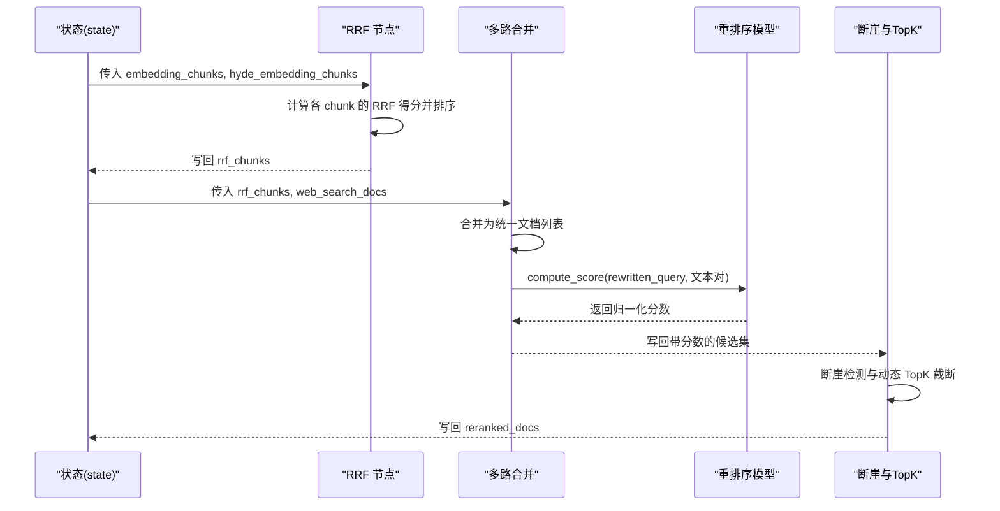
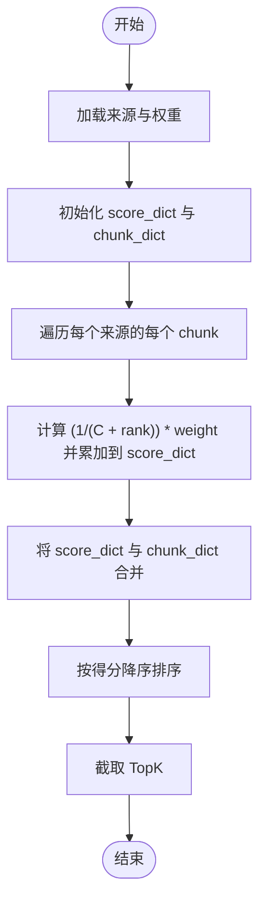
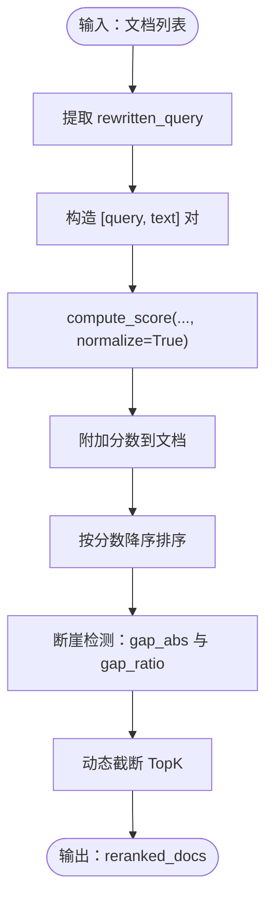
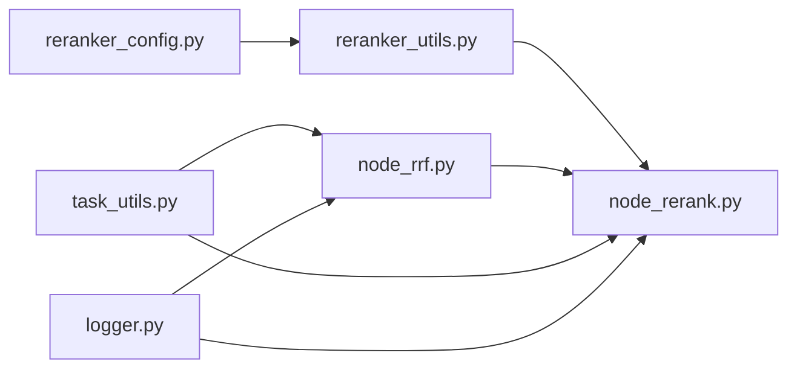

# 重排序与融合算法

<cite>
**本文引用的文件**
- [app/conf/reranker_config.py](file://app/conf/reranker_config.py)
- [app/lm/reranker_utils.py](file://app/lm/reranker_utils.py)
- [app/query_process/agent/nodes/node_rrf.py](file://app/query_process/agent/nodes/node_rrf.py)
- [app/query_process/agent/nodes/node_rerank.py](file://app/query_process/agent/nodes/node_rerank.py)
- [app/utils/task_utils.py](file://app/utils/task_utils.py)
- [app/core/logger.py](file://app/core/logger.py)
- [kb-learning-journey.md](file://kb-learning-journey.md)
</cite>

## 目录
1. [引言](#引言)
2. [项目结构](#项目结构)
3. [核心组件](#核心组件)
4. [架构总览](#架构总览)
5. [详细组件分析](#详细组件分析)
6. [依赖分析](#依赖分析)
7. [性能考虑](#性能考虑)
8. [故障排查指南](#故障排查指南)
9. [结论](#结论)
10. [附录](#附录)

## 引言
本技术文档聚焦于检索增强生成（RAG）流程中的“重排序与融合算法”。围绕以下目标展开：
- 深入解释 BGE 重排序（Cross-Encoder）的工作原理与策略，包括交叉编码器的使用方式与重排序流程。
- 详述 RRF（Reciprocal Rank Fusion）融合算法的数学原理与实现细节，并给出不同融合权重的配置方法与效果对比思路。
- 解释排序质量评估指标（如 NDCG、Precision@K）的计算方法与在本项目中的实践建议。
- 提供重排序参数调优指南与性能优化建议。
- 给出可复用的算法实现代码路径与使用示例。

## 项目结构
本项目在查询处理图中采用“多路召回 + RRF 融合 + Cross-Encoder 精排”的流水线设计。关键文件与职责如下：
- 融合与重排序节点：node_rrf.py、node_rerank.py
- 重排序模型封装：reranker_utils.py、reranker_config.py
- 任务状态与日志：task_utils.py、logger.py
- 设计说明与背景：kb-learning-journey.md

图表来源
- [app/query_process/agent/nodes/node_rrf.py:50-76](file://app/query_process/agent/nodes/node_rrf.py#L50-L76)
- [app/query_process/agent/nodes/node_rerank.py:162-208](file://app/query_process/agent/nodes/node_rerank.py#L162-L208)
- [app/lm/reranker_utils.py:6-14](file://app/lm/reranker_utils.py#L6-L14)

章节来源
- [app/query_process/agent/nodes/node_rrf.py:50-76](file://app/query_process/agent/nodes/node_rrf.py#L50-L76)
- [app/query_process/agent/nodes/node_rerank.py:162-208](file://app/query_process/agent/nodes/node_rerank.py#L162-L208)
- [app/lm/reranker_utils.py:6-14](file://app/lm/reranker_utils.py#L6-L14)

## 核心组件
- RRF 融合节点：将多路召回结果（如向量检索与 HyDE）按“排名”进行加权融合，得到统一的融合排序。
- 重排序节点：将 RRF 后的候选集与重写后的查询进行成对打分，得到归一化的相关性分数，并进行断崖检测与动态 TopK 截断。
- 重排序模型封装：提供 FlagReranker 的懒加载与配置注入，支持设备与半精度选项。
- 任务与日志：在节点执行前后维护任务状态与进度推送，便于可观测性与调试。

章节来源
- [app/query_process/agent/nodes/node_rrf.py:7-48](file://app/query_process/agent/nodes/node_rrf.py#L7-L48)
- [app/query_process/agent/nodes/node_rerank.py:68-97](file://app/query_process/agent/nodes/node_rerank.py#L68-L97)
- [app/lm/reranker_utils.py:6-14](file://app/lm/reranker_utils.py#L6-L14)
- [app/utils/task_utils.py:71-109](file://app/utils/task_utils.py#L71-L109)
- [app/core/logger.py:46-59](file://app/core/logger.py#L46-L59)

## 架构总览
下图展示了从多路召回、RRF 融合、到交叉编码器重排序与断崖 TopK 的完整流程。

图表来源
- [app/query_process/agent/nodes/node_rrf.py:50-76](file://app/query_process/agent/nodes/node_rrf.py#L50-L76)
- [app/query_process/agent/nodes/node_rerank.py:24-65](file://app/query_process/agent/nodes/node_rerank.py#L24-L65)
- [app/query_process/agent/nodes/node_rerank.py:68-97](file://app/query_process/agent/nodes/node_rerank.py#L68-L97)
- [app/query_process/agent/nodes/node_rerank.py:100-160](file://app/query_process/agent/nodes/node_rerank.py#L100-L160)

## 详细组件分析

### RRF（Reciprocal Rank Fusion）融合算法
- 数学原理与实现要点
  - 对每个来源的检索结果，按其“排名”进行融合，而非直接使用分数。这解决了不同来源分数量纲不一致的问题。
  - 本实现采用形如 (1.0/(C + rank)) 的权重衰减函数，其中 C 为常数，用于控制排名越靠前的增益越大、衰减越慢。注：代码中使用了常数项以避免除零风险。
  - 权重可配置，支持对不同来源（如向量与 HyDE）赋予不同权重，从而体现领域偏好或质量差异。
- 关键实现路径
  - 融合与排序：见 [step_3_reciprocal_rank_fusion:7-48](file://app/query_process/agent/nodes/node_rrf.py#L7-L48)
  - 节点入口与调用：见 [node_rrf:50-76](file://app/query_process/agent/nodes/node_rrf.py#L50-L76)
- 常数 C 的影响
  - C 越小，排名靠前的增益越大，融合更偏向高排名；C 越大，衰减越快，融合更平滑。
  - 可通过实验对比不同 C 值（例如 10、60、200）对召回稳定性与多样性的影响。
- 去重策略
  - 以 chunk_id 作为键聚合，同一 chunk_id 的得分累加，保证去重与一致性。

图表来源
- [app/query_process/agent/nodes/node_rrf.py:7-48](file://app/query_process/agent/nodes/node_rrf.py#L7-L48)

章节来源
- [app/query_process/agent/nodes/node_rrf.py:7-48](file://app/query_process/agent/nodes/node_rrf.py#L7-L48)
- [app/query_process/agent/nodes/node_rrf.py:50-76](file://app/query_process/agent/nodes/node_rrf.py#L50-L76)
- [kb-learning-journey.md:335-343](file://kb-learning-journey.md#L335-L343)

### BGE 重排序（Cross-Encoder）算法
- 工作原理
  - 使用交叉编码器对“查询-文档”成对进行细粒度相关性建模，输出归一化分数，用于精排。
  - 本实现将重写后的查询与候选文本组成成对列表，调用 compute_score 并启用 normalize 以获得 0~1 区间的分数。
- 关键实现路径
  - 懒加载与配置注入：见 [get_reranker_model:6-14](file://app/lm/reranker_utils.py#L6-L14)
  - 重排序打分与排序：见 [step_2_rerank_doc_list:68-97](file://app/query_process/agent/nodes/node_rerank.py#L68-L97)
- 断崖与动态 TopK
  - 在重排序后，使用相邻分数差值的绝对阈值与相对阈值进行断崖检测，动态决定 TopK 截断长度，兼顾召回质量与效率。
  - 关键实现路径：见 [step_3_topk_and_gap:100-160](file://app/query_process/agent/nodes/node_rerank.py#L100-L160)

图表来源
- [app/query_process/agent/nodes/node_rerank.py:68-97](file://app/query_process/agent/nodes/node_rerank.py#L68-L97)
- [app/query_process/agent/nodes/node_rerank.py:100-160](file://app/query_process/agent/nodes/node_rerank.py#L100-L160)
- [app/lm/reranker_utils.py:6-14](file://app/lm/reranker_utils.py#L6-L14)

章节来源
- [app/lm/reranker_utils.py:6-14](file://app/lm/reranker_utils.py#L6-L14)
- [app/query_process/agent/nodes/node_rerank.py:68-97](file://app/query_process/agent/nodes/node_rerank.py#L68-L97)
- [app/query_process/agent/nodes/node_rerank.py:100-160](file://app/query_process/agent/nodes/node_rerank.py#L100-L160)

### 多路数据合并与最终输出
- 合并策略
  - 将 RRF 结果与网络搜索结果统一为包含 text、title、source、url/chunk_id 等字段的文档列表，便于后续重排序与可视化。
- 输出字段
  - 最终写回 state["reranked_docs"]，包含 score、text、title、source、url/chunk_id 等，供后续回答生成与展示使用。

章节来源
- [app/query_process/agent/nodes/node_rerank.py:24-65](file://app/query_process/agent/nodes/node_rerank.py#L24-L65)
- [app/query_process/agent/nodes/node_rerank.py:162-208](file://app/query_process/agent/nodes/node_rerank.py#L162-L208)

## 依赖分析
- 组件耦合
  - node_rrf 仅依赖状态中的 embedding_chunks 与 hyde_embedding_chunks，耦合度低，便于扩展其他来源。
  - node_rerank 依赖 reranker_utils 提供的共享模型实例，避免重复初始化。
- 外部依赖
  - 重排序模型依赖 FlagReranker，设备与半精度通过 reranker_config 注入。
- 任务与日志
  - 节点执行前后通过 task_utils 维护任务状态，配合 logger 输出关键信息。

图表来源
- [app/conf/reranker_config.py:9-21](file://app/conf/reranker_config.py#L9-L21)
- [app/lm/reranker_utils.py:1-14](file://app/lm/reranker_utils.py#L1-L14)
- [app/query_process/agent/nodes/node_rerank.py:6-8](file://app/query_process/agent/nodes/node_rerank.py#L6-L8)
- [app/query_process/agent/nodes/node_rrf.py:1-4](file://app/query_process/agent/nodes/node_rrf.py#L1-L4)
- [app/utils/task_utils.py:71-109](file://app/utils/task_utils.py#L71-L109)
- [app/core/logger.py:46-59](file://app/core/logger.py#L46-L59)

章节来源
- [app/conf/reranker_config.py:9-21](file://app/conf/reranker_config.py#L9-L21)
- [app/lm/reranker_utils.py:1-14](file://app/lm/reranker_utils.py#L1-L14)
- [app/query_process/agent/nodes/node_rerank.py:6-8](file://app/query_process/agent/nodes/node_rerank.py#L6-L8)
- [app/query_process/agent/nodes/node_rrf.py:1-4](file://app/query_process/agent/nodes/node_rrf.py#L1-L4)
- [app/utils/task_utils.py:71-109](file://app/utils/task_utils.py#L71-L109)
- [app/core/logger.py:46-59](file://app/core/logger.py#L46-L59)

## 性能考虑
- 重排序模型加载
  - 采用懒加载与单例模式，避免重复初始化带来的开销。
  - 设备与半精度可通过配置切换，平衡速度与精度。
- 重排序打分
  - compute_score 支持批量打分，建议在候选规模可控前提下一次性处理，减少多次调用的开销。
- 断崖与 TopK
  - 动态 TopK 可有效降低下游生成负担；合理设置断崖阈值，避免过度截断导致信息丢失。
- 日志与任务状态
  - 通过任务状态与日志，可在生产环境中快速定位瓶颈与异常。

章节来源
- [app/lm/reranker_utils.py:6-14](file://app/lm/reranker_utils.py#L6-L14)
- [app/query_process/agent/nodes/node_rerank.py:100-160](file://app/query_process/agent/nodes/node_rerank.py#L100-L160)
- [app/utils/task_utils.py:71-109](file://app/utils/task_utils.py#L71-L109)
- [app/core/logger.py:46-59](file://app/core/logger.py#L46-L59)

## 故障排查指南
- 重排序分数异常
  - 现象：全部为 0 或极低分。
  - 排查：检查 rewritten_query 是否为空；确认 normalize=True；验证候选文本非空。
  - 参考实现：[step_2_rerank_doc_list:68-97](file://app/query_process/agent/nodes/node_rerank.py#L68-L97)
- 模型加载失败
  - 现象：初始化模型时报错。
  - 排查：确认 BGE_RERANKER_LARGE、BGE_RERANKER_DEVICE、BGE_RERANKER_FP16 环境变量正确；检查模型路径与设备可用性。
  - 参考实现：[get_reranker_model:6-14](file://app/lm/reranker_utils.py#L6-L14)、[reranker_config:16-21](file://app/conf/reranker_config.py#L16-L21)
- 融合权重无效
  - 现象：RRF 后排序不稳定或偏向某一路。
  - 排查：检查 source_with_weight 的权重设置；尝试不同 C 值与权重组合。
  - 参考实现：[step_3_reciprocal_rank_fusion:7-48](file://app/query_process/agent/nodes/node_rrf.py#L7-L48)
- 进度与日志
  - 使用任务状态接口与日志输出定位节点执行情况。
  - 参考实现：[add_running_task/add_done_task:71-109](file://app/utils/task_utils.py#L71-L109)、[logger 初始化:46-59](file://app/core/logger.py#L46-L59)

章节来源
- [app/query_process/agent/nodes/node_rerank.py:68-97](file://app/query_process/agent/nodes/node_rerank.py#L68-L97)
- [app/lm/reranker_utils.py:6-14](file://app/lm/reranker_utils.py#L6-L14)
- [app/conf/reranker_config.py:16-21](file://app/conf/reranker_config.py#L16-L21)
- [app/query_process/agent/nodes/node_rrf.py:7-48](file://app/query_process/agent/nodes/node_rrf.py#L7-L48)
- [app/utils/task_utils.py:71-109](file://app/utils/task_utils.py#L71-L109)
- [app/core/logger.py:46-59](file://app/core/logger.py#L46-L59)

## 结论
本方案通过“RRF 融合 + Cross-Encoder 精排”的两阶段流程，有效解决了多路召回分数量纲不一致与粗召回质量参差的问题。RRF 以排名为基础进行加权融合，Cross-Encoder 则提供细粒度相关性建模与归一化分数。结合断崖检测与动态 TopK，既提升排序质量，又兼顾效率与稳定性。建议在实际部署中结合业务场景对 C 值、权重与阈值进行系统性调优，并持续关注日志与任务状态以保障可观测性。

## 附录

### 排序质量评估指标与计算方法
- NDCG（Normalized Discounted Cumulative Gain）
  - 计算步骤：对排序列表按相关性打分进行累积增益（折扣累积），再与理想排序的增益比值得到归一化分数。
  - 适用场景：衡量排序质量的整体分布，尤其关注高排名相关性。
- Precision@K
  - 计算步骤：取前 K 个结果中相关样本的比例。
  - 适用场景：强调前 K 名的检索准确性，适合问答与检索任务的早期截断评估。
- 在本项目中的应用建议
  - 可在离线评估阶段对 reranked_docs 的 score 进行 NDCG 与 Precision@K 计算，以指导 RRF 权重与断崖阈值的调优。
  - 由于本项目未内置评估脚本，建议在外部工具中对 reranked_docs 的 score 与人工标注的相关性标签进行计算。

章节来源
- [app/query_process/agent/nodes/node_rerank.py:68-97](file://app/query_process/agent/nodes/node_rerank.py#L68-L97)
- [app/query_process/agent/nodes/node_rrf.py:7-48](file://app/query_process/agent/nodes/node_rrf.py#L7-L48)

### 融合权重配置与效果对比思路
- 权重来源
  - 向量检索与 HyDE 检索：通过 source_with_weight 设置不同权重，观察对最终排序的影响。
- 对比方法
  - 固定其他参数，分别尝试权重组合（如 1:1、2:1、1:2），记录 reranked_docs 的 NDCG 与 Precision@K。
  - 观察断崖阈值对 TopK 截断的影响，选择在质量与效率之间折中的配置。
- 常数 C 的敏感性
  - 通过对比不同 C 值（如 10、60、200）下的排序稳定性与多样性，选择最符合业务需求的设置。

章节来源
- [app/query_process/agent/nodes/node_rrf.py:67-70](file://app/query_process/agent/nodes/node_rrf.py#L67-L70)
- [app/query_process/agent/nodes/node_rrf.py:32-32](file://app/query_process/agent/nodes/node_rrf.py#L32-L32)

### 重排序参数调优指南
- Cross-Encoder 模型
  - 设备与半精度：在 GPU 可用时启用半精度以提升吞吐；在精度优先时关闭半精度。
  - 模型路径：确保 BGE_RERANKER_LARGE 指向有效模型。
- 断崖与 TopK
  - gap_abs：绝对分差阈值，建议从 0.3~0.5 范围内搜索。
  - gap_ratio：相对分差阈值，建议从 0.1~0.3 范围内搜索。
  - RERANK_MAX_TOPK/RERANK_MIN_TOPK：根据下游生成成本与质量需求设定上下界。
- RRF
  - 权重：根据来源质量与业务偏好设置，建议通过 A/B 对比评估。
  - 常数 C：根据排名敏感度调整，较小 C 更强调高排名，较大 C 更平滑。

章节来源
- [app/conf/reranker_config.py:16-21](file://app/conf/reranker_config.py#L16-L21)
- [app/lm/reranker_utils.py:6-14](file://app/lm/reranker_utils.py#L6-L14)
- [app/query_process/agent/nodes/node_rerank.py:14-21](file://app/query_process/agent/nodes/node_rerank.py#L14-L21)
- [app/query_process/agent/nodes/node_rrf.py:32-32](file://app/query_process/agent/nodes/node_rrf.py#L32-L32)

### 使用示例（代码路径）
- RRF 节点本地测试
  - 参考路径：[node_rrf 本地测试入口:81-124](file://app/query_process/agent/nodes/node_rrf.py#L81-L124)
- 重排序节点本地测试
  - 参考路径：[node_rerank 本地测试入口:211-267](file://app/query_process/agent/nodes/node_rerank.py#L211-L267)

章节来源
- [app/query_process/agent/nodes/node_rrf.py:81-124](file://app/query_process/agent/nodes/node_rrf.py#L81-L124)
- [app/query_process/agent/nodes/node_rerank.py:211-267](file://app/query_process/agent/nodes/node_rerank.py#L211-L267)