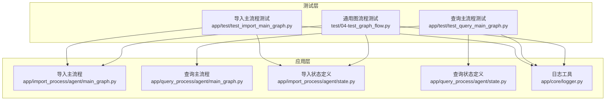
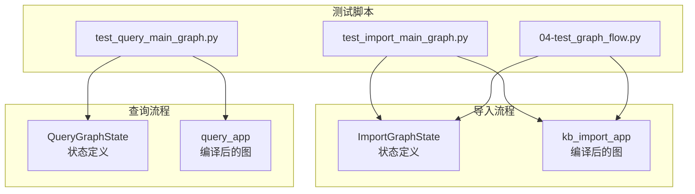
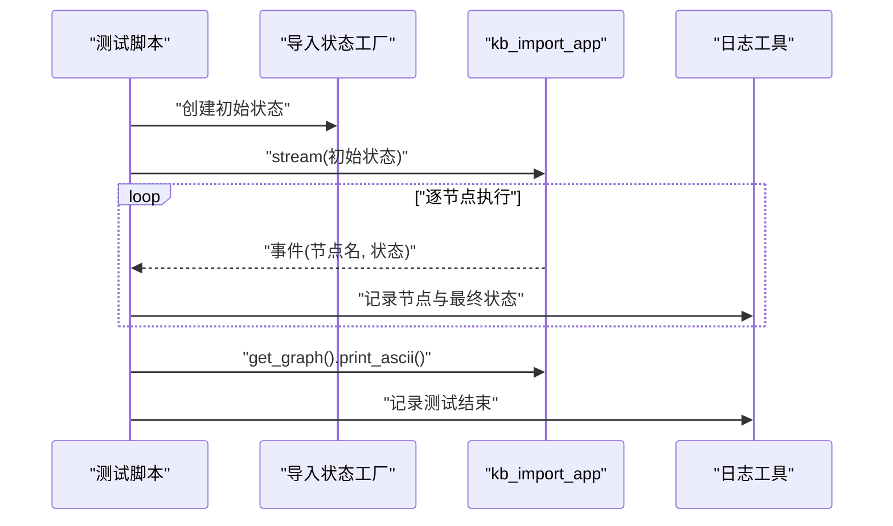
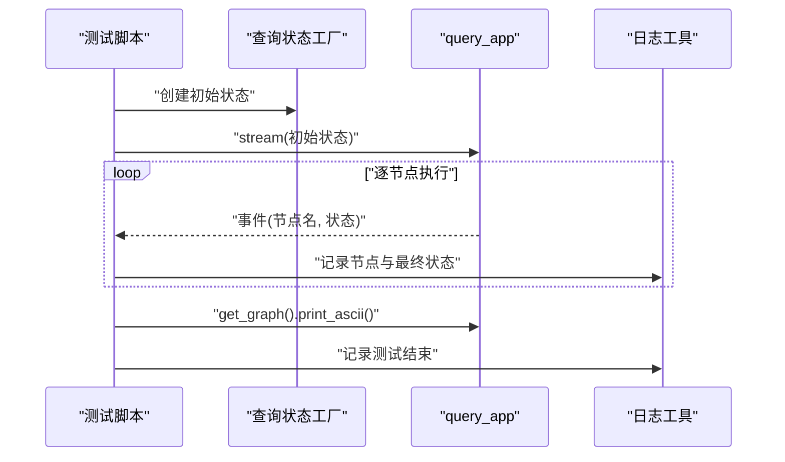
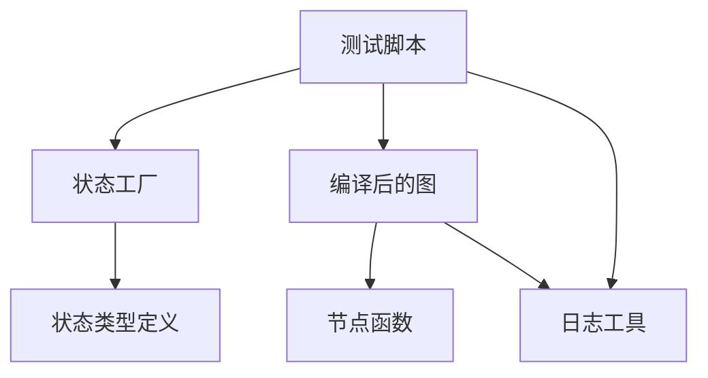

# 单元测试

<cite>
**本文引用的文件**
- [app/test/test_import_main_graph.py](file://app/test/test_import_main_graph.py)
- [app/test/test_query_main_graph.py](file://app/test/test_query_main_graph.py)
- [test/04-test_graph_flow.py](file://test/04-test_graph_flow.py)
- [app/import_process/agent/main_graph.py](file://app/import_process/agent/main_graph.py)
- [app/query_process/agent/main_graph.py](file://app/query_process/agent/main_graph.py)
- [app/import_process/agent/state.py](file://app/import_process/agent/state.py)
- [app/query_process/agent/state.py](file://app/query_process/agent/state.py)
- [app/core/logger.py](file://app/core/logger.py)
</cite>

## 目录
1. [简介](#简介)
2. [项目结构](#项目结构)
3. [核心组件](#核心组件)
4. [架构总览](#架构总览)
5. [详细组件分析](#详细组件分析)
6. [依赖分析](#依赖分析)
7. [性能考虑](#性能考虑)
8. [故障排查指南](#故障排查指南)
9. [结论](#结论)
10. [附录](#附录)

## 简介
本文件面向单元测试与集成测试场景，聚焦两条主流程的测试实现：导入主流程与查询主流程。文档涵盖以下要点：
- 导入主流程测试与查询主流程测试的具体实现方式
- 测试用例设计原则与覆盖范围（LangGraph工作流的状态管理、节点执行、错误处理）
- 测试数据准备与模拟对象使用建议
- 断言最佳实践与测试结果验证方法
- 测试环境配置与执行命令
- 如何编写新测试用例与维护既有测试

## 项目结构
本项目在应用层提供两条LangGraph主流程，并配套基础测试脚本；另有独立的test目录包含若干辅助测试脚本。

图表来源
- [app/test/test_import_main_graph.py:1-27](file://app/test/test_import_main_graph.py#L1-L27)
- [app/test/test_query_main_graph.py:1-26](file://app/test/test_query_main_graph.py#L1-L26)
- [test/04-test_graph_flow.py:1-26](file://test/04-test_graph_flow.py#L1-L26)
- [app/import_process/agent/main_graph.py:1-134](file://app/import_process/agent/main_graph.py#L1-L134)
- [app/query_process/agent/main_graph.py:1-47](file://app/query_process/agent/main_graph.py#L1-L47)
- [app/import_process/agent/state.py:1-99](file://app/import_process/agent/state.py#L1-L99)
- [app/query_process/agent/state.py:1-97](file://app/query_process/agent/state.py#L1-L97)
- [app/core/logger.py:1-95](file://app/core/logger.py#L1-L95)

章节来源
- [app/test/test_import_main_graph.py:1-27](file://app/test/test_import_main_graph.py#L1-L27)
- [app/test/test_query_main_graph.py:1-26](file://app/test/test_query_main_graph.py#L1-L26)
- [test/04-test_graph_flow.py:1-26](file://test/04-test_graph_flow.py#L1-L26)
- [app/import_process/agent/main_graph.py:1-134](file://app/import_process/agent/main_graph.py#L1-L134)
- [app/query_process/agent/main_graph.py:1-47](file://app/query_process/agent/main_graph.py#L1-L47)
- [app/import_process/agent/state.py:1-99](file://app/import_process/agent/state.py#L1-L99)
- [app/query_process/agent/state.py:1-97](file://app/query_process/agent/state.py#L1-L97)
- [app/core/logger.py:1-95](file://app/core/logger.py#L1-L95)

## 核心组件
- 导入主流程（kb_import_app）：基于LangGraph构建的状态图，包含入口节点与一系列处理节点，根据输入文件类型选择分支路径，最终汇聚到Milvus入库。
- 查询主流程（query_app）：基于LangGraph构建的状态图，从商品名确认开始，多路检索（普通向量、HyDE向量、网络搜索）汇聚到RFF融合与重排序，最后生成答案。
- 状态定义：
  - 导入状态（ImportGraphState）：包含任务ID、流程控制标记、路径信息、内容数据、数据库相关字段等。
  - 查询状态（QueryGraphState）：包含会话ID、原始问题、检索中间结果、排序结果、生成结果、辅助信息等。
- 日志工具（logger）：基于loguru封装，支持.env控制台/文件输出、异步安全、中文友好、自动清理等。

章节来源
- [app/import_process/agent/main_graph.py:1-134](file://app/import_process/agent/main_graph.py#L1-L134)
- [app/query_process/agent/main_graph.py:1-47](file://app/query_process/agent/main_graph.py#L1-L47)
- [app/import_process/agent/state.py:1-99](file://app/import_process/agent/state.py#L1-L99)
- [app/query_process/agent/state.py:1-97](file://app/query_process/agent/state.py#L1-L97)
- [app/core/logger.py:1-95](file://app/core/logger.py#L1-L95)

## 架构总览
下图展示两条主流程的编译产物（kb_import_app、query_app）与状态定义之间的关系，以及测试脚本对它们的调用方式。

图表来源
- [app/import_process/agent/main_graph.py:1-134](file://app/import_process/agent/main_graph.py#L1-L134)
- [app/query_process/agent/main_graph.py:1-47](file://app/query_process/agent/main_graph.py#L1-L47)
- [app/import_process/agent/state.py:1-99](file://app/import_process/agent/state.py#L1-L99)
- [app/query_process/agent/state.py:1-97](file://app/query_process/agent/state.py#L1-L97)
- [app/test/test_import_main_graph.py:1-27](file://app/test/test_import_main_graph.py#L1-L27)
- [app/test/test_query_main_graph.py:1-26](file://app/test/test_query_main_graph.py#L1-L26)
- [test/04-test_graph_flow.py:1-26](file://test/04-test_graph_flow.py#L1-L26)

## 详细组件分析

### 导入主流程测试（test_import_main_graph.py）
- 目标：验证导入主流程从入口到Milvus入库的端到端执行，输出最终状态并打印图结构。
- 实现要点：
  - 使用导入状态工厂创建初始状态，传入本地文件路径等必要字段。
  - 通过kb_import_app.stream迭代执行，逐节点输出节点名与最终状态。
  - 使用logger记录中间结果与图结构ASCII打印。
- 断言建议：
  - 对最终状态的关键键进行存在性与类型断言（例如chunks为列表、item_name非空等）。
  - 对核心指标断言（如切片数量、向量化标记、Milvus入库标记等）。
  - 对异常路径断言（当输入文件类型不匹配时应终止于END）。
- 错误处理：
  - 在流式执行过程中捕获异常并记录堆栈，便于定位具体节点问题。

图表来源
- [app/test/test_import_main_graph.py:1-27](file://app/test/test_import_main_graph.py#L1-L27)
- [app/import_process/agent/main_graph.py:1-134](file://app/import_process/agent/main_graph.py#L1-L134)
- [app/import_process/agent/state.py:1-99](file://app/import_process/agent/state.py#L1-L99)
- [app/core/logger.py:1-95](file://app/core/logger.py#L1-L95)

章节来源
- [app/test/test_import_main_graph.py:1-27](file://app/test/test_import_main_graph.py#L1-L27)
- [app/import_process/agent/main_graph.py:1-134](file://app/import_process/agent/main_graph.py#L1-L134)
- [app/import_process/agent/state.py:1-99](file://app/import_process/agent/state.py#L1-L99)
- [app/core/logger.py:1-95](file://app/core/logger.py#L1-L95)

### 查询主流程测试（test_query_main_graph.py）
- 目标：验证查询主流程从商品名确认到答案输出的端到端执行，输出最终状态并打印图结构。
- 实现要点：
  - 使用查询状态工厂创建初始状态，传入会话ID与原始查询等必要字段。
  - 通过query_app.stream迭代执行，逐节点输出节点名与最终状态。
  - 使用logger记录中间结果与图结构ASCII打印。
- 断言建议：
  - 对最终状态的关键键进行存在性与类型断言（例如reranked_docs为列表、answer非空等）。
  - 对条件路由断言（当answer已存在时应直接进入答案输出节点）。
  - 对多路检索汇聚断言（RRF与重排序后的文档集合应非空）。
- 错误处理：
  - 在流式执行过程中捕获异常并记录堆栈，便于定位具体节点问题。

图表来源
- [app/test/test_query_main_graph.py:1-26](file://app/test/test_query_main_graph.py#L1-L26)
- [app/query_process/agent/main_graph.py:1-47](file://app/query_process/agent/main_graph.py#L1-L47)
- [app/query_process/agent/state.py:1-97](file://app/query_process/agent/state.py#L1-L97)
- [app/core/logger.py:1-95](file://app/core/logger.py#L1-L95)

章节来源
- [app/test/test_query_main_graph.py:1-26](file://app/test/test_query_main_graph.py#L1-L26)
- [app/query_process/agent/main_graph.py:1-47](file://app/query_process/agent/main_graph.py#L1-L47)
- [app/query_process/agent/state.py:1-97](file://app/query_process/agent/state.py#L1-L97)
- [app/core/logger.py:1-95](file://app/core/logger.py#L1-L95)

### 通用图流程测试（04-test_graph_flow.py）
- 目标：与导入主流程测试类似，但位于独立的test目录，便于通用流程验证。
- 实现要点：
  - 使用导入状态工厂创建初始状态，传入本地文件路径等必要字段。
  - 通过kb_import_app.stream迭代执行，逐节点输出节点名与最终状态。
  - 使用logger记录中间结果与图结构ASCII打印。
- 断言建议：
  - 与导入主流程测试一致，针对最终状态的关键键与核心指标进行断言。
  - 对异常路径断言（当输入文件类型不匹配时应终止于END）。

图表来源
- [test/04-test_graph_flow.py:1-26](file://test/04-test_graph_flow.py#L1-L26)
- [app/import_process/agent/main_graph.py:1-134](file://app/import_process/agent/main_graph.py#L1-L134)
- [app/import_process/agent/state.py:1-99](file://app/import_process/agent/state.py#L1-L99)
- [app/core/logger.py:1-95](file://app/core/logger.py#L1-L95)

章节来源
- [test/04-test_graph_flow.py:1-26](file://test/04-test_graph_flow.py#L1-L26)
- [app/import_process/agent/main_graph.py:1-134](file://app/import_process/agent/main_graph.py#L1-L134)
- [app/import_process/agent/state.py:1-99](file://app/import_process/agent/state.py#L1-L99)
- [app/core/logger.py:1-95](file://app/core/logger.py#L1-L95)

### LangGraph工作流的状态管理测试
- 设计原则：
  - 使用TypedDict定义状态结构，确保字段类型与默认值清晰。
  - 提供状态工厂函数（create_default_state/create_query_default_state）以支持覆盖与深拷贝，避免全局状态污染。
  - 在测试中构造最小可用状态，仅包含必要字段，减少外部依赖。
- 覆盖范围：
  - 正常路径：输入文件类型匹配，节点顺序正确，最终状态包含预期键。
  - 条件路由：根据状态字段决定分支走向（如导入流程的PDF/MD分支、查询流程的answer存在与否）。
  - 异常路径：输入文件类型不匹配、检索结果为空、生成答案失败等。
- 断言建议：
  - 对状态键的存在性与类型断言。
  - 对核心指标断言（如切片数量、向量化标记、Milvus入库标记、检索结果数量等）。
  - 对条件路由断言（根据状态字段判断下一节点）。

章节来源
- [app/import_process/agent/state.py:1-99](file://app/import_process/agent/state.py#L1-L99)
- [app/query_process/agent/state.py:1-97](file://app/query_process/agent/state.py#L1-L97)

### 节点执行测试
- 设计原则：
  - 将每个节点封装为独立函数，便于单元测试。
  - 在测试中直接调用节点函数，传入最小状态，断言输出状态与副作用。
  - 对条件路由节点，提供不同输入状态以覆盖所有分支。
- 覆盖范围：
  - 入口节点：根据输入文件类型设置流程控制标记。
  - 文本处理节点：PDF转MD、MD图片抽取、文档切分、主体名称识别。
  - 向量化节点：BGE嵌入生成，生成dense/sparse向量。
  - Milvus入库节点：将向量化结果写入Milvus，生成chunk_id。
  - 查询节点：商品名确认、多路检索、RRF融合、重排序、答案输出。
- 断言建议：
  - 对节点输出状态的关键键进行存在性与类型断言。
  - 对条件路由节点，断言下一节点选择正确。
  - 对外部依赖（如文件系统、向量化服务、Milvus）进行模拟。

章节来源
- [app/import_process/agent/main_graph.py:1-134](file://app/import_process/agent/main_graph.py#L1-L134)
- [app/query_process/agent/main_graph.py:1-47](file://app/query_process/agent/main_graph.py#L1-L47)

### 错误处理测试
- 设计原则：
  - 在流式执行中捕获异常并记录堆栈，便于定位具体节点问题。
  - 对异常路径进行断言（如输入文件类型不匹配时应终止于END）。
  - 对外部依赖异常（如文件不存在、网络超时、Milvus连接失败）进行模拟与断言。
- 覆盖范围：
  - 输入校验：文件路径、会话ID、原始查询等。
  - 外部依赖：文件系统、向量化服务、Milvus、网络搜索。
  - 节点内部：解析失败、切分失败、向量化失败、入库失败。
- 断言建议：
  - 对异常消息与堆栈进行断言。
  - 对最终状态中的错误标记进行断言（如错误描述、重试次数等）。

章节来源
- [app/import_process/agent/main_graph.py:1-134](file://app/import_process/agent/main_graph.py#L1-L134)
- [app/query_process/agent/main_graph.py:1-47](file://app/query_process/agent/main_graph.py#L1-L47)
- [app/core/logger.py:1-95](file://app/core/logger.py#L1-L95)

## 依赖分析
- 组件耦合：
  - 测试脚本依赖状态工厂与编译后的图对象。
  - 图对象依赖各节点函数与状态定义。
  - 日志工具被测试脚本与图对象共同依赖。
- 外部依赖：
  - LangGraph：状态图编译与流式执行。
  - 外部服务：向量化服务、Milvus、网络搜索。
- 潜在循环依赖：
  - 当前结构未见循环依赖，但需注意状态定义与节点函数之间的单向依赖。

图表来源
- [app/test/test_import_main_graph.py:1-27](file://app/test/test_import_main_graph.py#L1-L27)
- [app/test/test_query_main_graph.py:1-26](file://app/test/test_query_main_graph.py#L1-L26)
- [test/04-test_graph_flow.py:1-26](file://test/04-test_graph_flow.py#L1-L26)
- [app/import_process/agent/main_graph.py:1-134](file://app/import_process/agent/main_graph.py#L1-L134)
- [app/query_process/agent/main_graph.py:1-47](file://app/query_process/agent/main_graph.py#L1-L47)
- [app/import_process/agent/state.py:1-99](file://app/import_process/agent/state.py#L1-L99)
- [app/query_process/agent/state.py:1-97](file://app/query_process/agent/state.py#L1-L97)
- [app/core/logger.py:1-95](file://app/core/logger.py#L1-L95)

章节来源
- [app/test/test_import_main_graph.py:1-27](file://app/test/test_import_main_graph.py#L1-L27)
- [app/test/test_query_main_graph.py:1-26](file://app/test/test_query_main_graph.py#L1-L26)
- [test/04-test_graph_flow.py:1-26](file://test/04-test_graph_flow.py#L1-L26)
- [app/import_process/agent/main_graph.py:1-134](file://app/import_process/agent/main_graph.py#L1-L134)
- [app/query_process/agent/main_graph.py:1-47](file://app/query_process/agent/main_graph.py#L1-L47)
- [app/import_process/agent/state.py:1-99](file://app/import_process/agent/state.py#L1-L99)
- [app/query_process/agent/state.py:1-97](file://app/query_process/agent/state.py#L1-L97)
- [app/core/logger.py:1-95](file://app/core/logger.py#L1-L95)

## 性能考虑
- 流式执行：使用stream模式逐节点输出，便于观察执行进度与定位瓶颈。
- 日志开销：在高并发或高频节点执行场景下，适当降低日志级别或关闭文件输出以减少I/O开销。
- 外部依赖：对外部服务（向量化、Milvus、网络搜索）进行限流与超时控制，避免阻塞主流程。
- 状态体积：避免在状态中存储大对象（如完整文档内容），仅存储必要字段以降低序列化与传输成本。

## 故障排查指南
- 日志配置：
  - 通过.env控制台/文件输出开关与级别，确保日志可见且结构化。
  - 使用logger.trace/debug/info/success/warning/error等不同级别区分问题严重程度。
- 异常定位：
  - 在流式执行中捕获异常并记录堆栈，结合节点名与最终状态快速定位问题。
  - 对外部依赖异常进行分类处理（文件不存在、网络超时、Milvus连接失败等）。
- 状态核验：
  - 对最终状态的关键键进行断言，确保流程按预期推进。
  - 对核心指标进行断言（如切片数量、向量化标记、Milvus入库标记、检索结果数量等）。

章节来源
- [app/core/logger.py:1-95](file://app/core/logger.py#L1-L95)
- [app/import_process/agent/main_graph.py:1-134](file://app/import_process/agent/main_graph.py#L1-L134)
- [app/query_process/agent/main_graph.py:1-47](file://app/query_process/agent/main_graph.py#L1-L47)

## 结论
本文件提供了导入主流程与查询主流程的单元测试实现与设计指导，强调了状态管理、节点执行与错误处理的测试策略。通过合理的测试数据准备、断言与日志配置，可以有效保障LangGraph工作流的稳定性与可靠性。建议在新增节点或修改流程时同步更新测试用例，并持续优化性能与可观测性。

## 附录
- 测试环境配置与执行命令
  - 环境变量：通过.env配置日志输出开关与级别，确保测试期间日志可见。
  - 执行命令示例（以Python脚本形式运行测试）：
    - python app/test/test_import_main_graph.py
    - python app/test/test_query_main_graph.py
    - python test/04-test_graph_flow.py
  - 注意事项：
    - 确保测试文件路径与会话ID等参数符合预期。
    - 在执行前检查外部依赖（向量化服务、Milvus、网络搜索）是否可用。
    - 对于需要图形可视化的场景，可安装相关依赖以打印图结构ASCII。
- 编写新测试用例与维护既有测试
  - 新增测试用例步骤：
    - 明确测试目标与覆盖范围（状态管理、节点执行、错误处理）。
    - 准备最小可用状态，仅包含必要字段。
    - 编写断言逻辑，覆盖正常路径、条件路由与异常路径。
    - 使用logger记录关键信息，便于问题定位。
  - 维护既有测试：
    - 随着节点功能变更同步更新测试断言。
    - 对新增节点补充单元测试，确保覆盖率。
    - 定期审查日志配置与输出，保持可观测性。