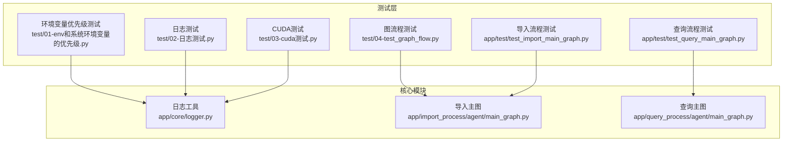
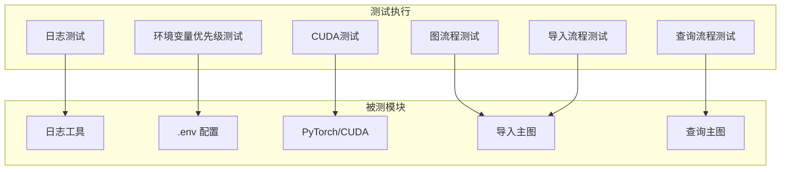
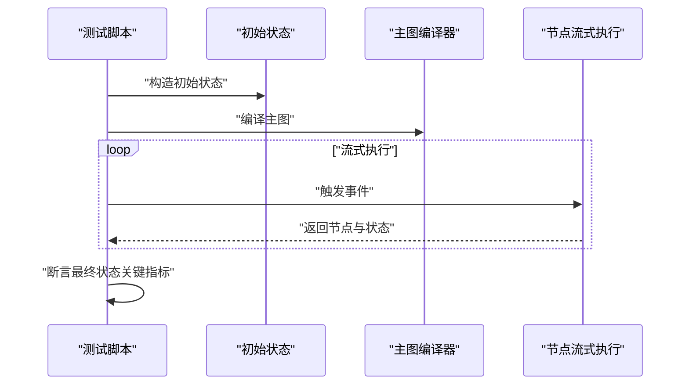
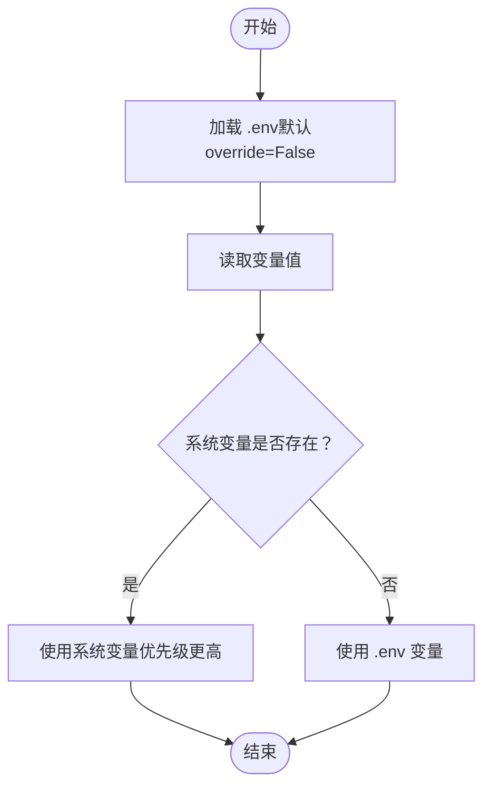
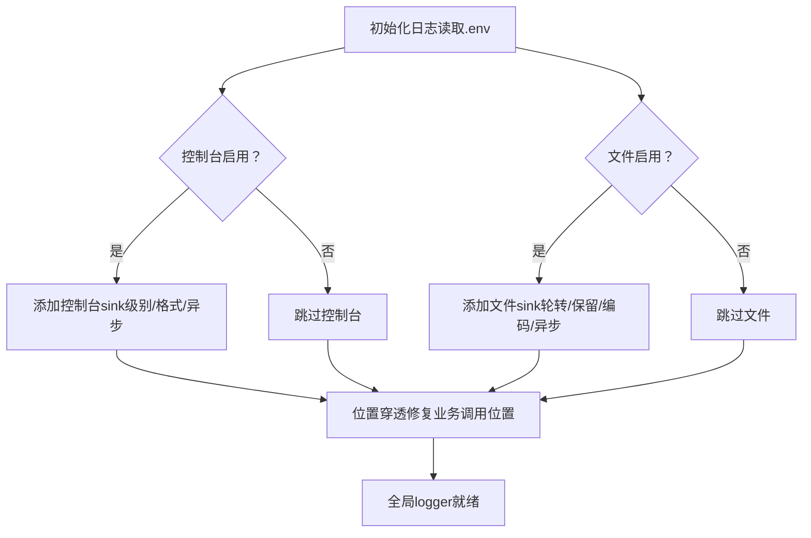
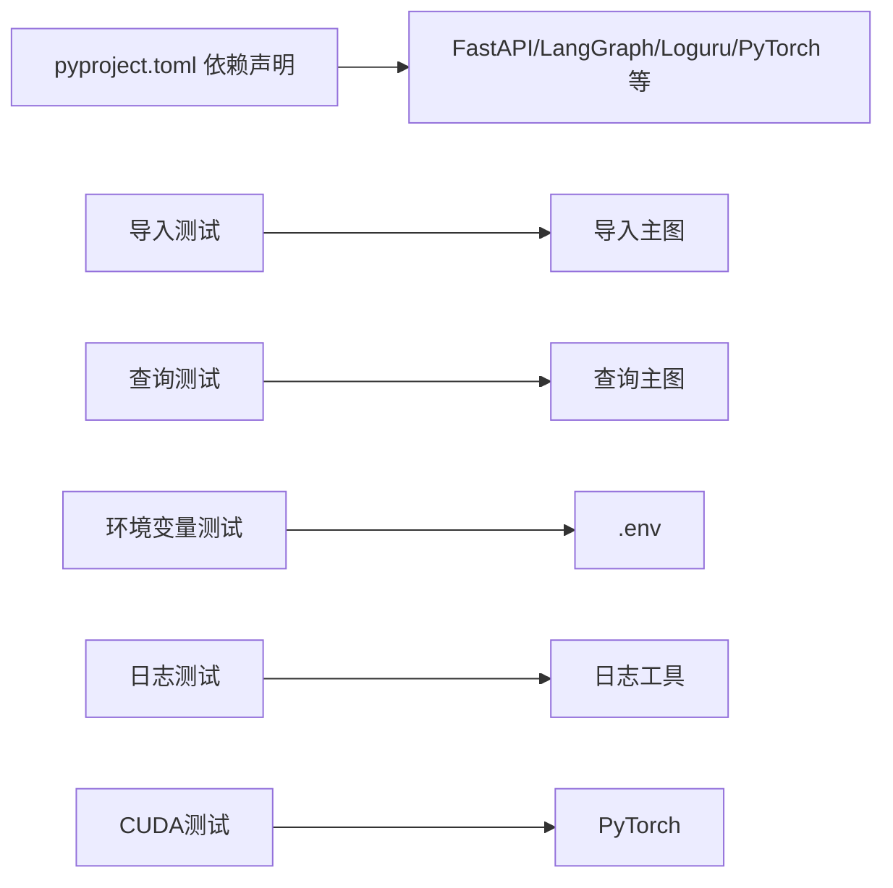

# 测试与质量保证

<cite>
**本文引用的文件**
- [pyproject.toml](file://pyproject.toml)
- [logger.py](file://app/core/logger.py)
- [01-env和系统环境变量的优先级.py](file://test/01-env和系统环境变量的优先级.py)
- [02-日志测试.py](file://test/02-日志测试.py)
- [03-cuda测试.py](file://test/03-cuda测试.py)
- [04-test_graph_flow.py](file://test/04-test_graph_flow.py)
- [test_import_main_graph.py](file://app/test/test_import_main_graph.py)
- [test_query_main_graph.py](file://app/test/test_query_main_graph.py)
- [main_graph.py（导入）](file://app/import_process/agent/main_graph.py)
- [main_graph.py（查询）](file://app/query_process/agent/main_graph.py)
</cite>

## 目录
1. [引言](#引言)
2. [项目结构](#项目结构)
3. [核心组件](#核心组件)
4. [架构总览](#架构总览)
5. [详细组件分析](#详细组件分析)
6. [依赖分析](#依赖分析)
7. [性能考虑](#性能考虑)
8. [故障排查指南](#故障排查指南)
9. [结论](#结论)
10. [附录](#附录)

## 引言
本文件系统性梳理本项目的测试与质量保证体系，覆盖单元测试组织、导入与查询流程测试、系统测试（集成/性能/回归）、环境变量优先级、日志与CUDA专项测试、测试设计原则与覆盖率、持续集成与自动化测试配置思路、测试数据准备与管理策略、测试结果分析与问题定位方法，以及代码质量检查与静态分析工具使用建议。

## 项目结构
项目采用“功能域+分层”的组织方式：
- app：核心业务模块，包含导入流程、查询流程、客户端封装、配置、核心工具（日志）等
- test：顶层脚本测试集合，覆盖环境变量优先级、日志、CUDA、图流程等
- app/test：导入/查询主流程的端到端测试样例
- pyproject.toml：项目依赖与工具配置入口

图表来源
- [pyproject.toml:1-36](file://pyproject.toml#L1-L36)
- [logger.py:1-109](file://app/core/logger.py#L1-L109)
- [01-env和系统环境变量的优先级.py:1-18](file://test/01-env和系统环境变量的优先级.py#L1-L18)
- [02-日志测试.py:1-56](file://test/02-日志测试.py#L1-L56)
- [03-cuda测试.py:1-8](file://test/03-cuda测试.py#L1-L8)
- [04-test_graph_flow.py:1-26](file://test/04-test_graph_flow.py#L1-L26)
- [test_import_main_graph.py:1-27](file://app/test/test_import_main_graph.py#L1-L27)
- [test_query_main_graph.py:1-26](file://app/test/test_query_main_graph.py#L1-L26)
- [main_graph.py（导入）:1-134](file://app/import_process/agent/main_graph.py#L1-L134)
- [main_graph.py（查询）:1-47](file://app/query_process/agent/main_graph.py#L1-L47)

章节来源
- [pyproject.toml:1-36](file://pyproject.toml#L1-L36)

## 核心组件
- 日志系统：基于loguru，支持.env控制台/文件双输出、自动路径与清理、异步安全、位置穿透修复，满足测试与生产一致的日志体验
- 导入主图：以LangGraph构建的导入工作流，包含入口路由与多节点串联，支持PDF→MD→切分→命名识别→向量→Milvus入库
- 查询主图：以LangGraph构建的检索-重排-回答工作流，支持多路检索融合与最终答案输出
- 顶层测试脚本：覆盖环境变量优先级、日志级别/颜色/位置、CUDA可用性、导入/查询主流程的端到端执行

章节来源
- [logger.py:1-109](file://app/core/logger.py#L1-L109)
- [main_graph.py（导入）:1-134](file://app/import_process/agent/main_graph.py#L1-L134)
- [main_graph.py（查询）:1-47](file://app/query_process/agent/main_graph.py#L1-L47)
- [01-env和系统环境变量的优先级.py:1-18](file://test/01-env和系统环境变量的优先级.py#L1-L18)
- [02-日志测试.py:1-56](file://test/02-日志测试.py#L1-L56)
- [03-cuda测试.py:1-8](file://test/03-cuda测试.py#L1-L8)
- [04-test_graph_flow.py:1-26](file://test/04-test_graph_flow.py#L1-L26)
- [test_import_main_graph.py:1-27](file://app/test/test_import_main_graph.py#L1-L27)
- [test_query_main_graph.py:1-26](file://app/test/test_query_main_graph.py#L1-L26)

## 架构总览
下图展示测试与被测模块之间的交互关系，突出日志、环境变量、CUDA、图执行等关键测试点：

图表来源
- [logger.py:1-109](file://app/core/logger.py#L1-L109)
- [01-env和系统环境变量的优先级.py:1-18](file://test/01-env和系统环境变量的优先级.py#L1-L18)
- [02-日志测试.py:1-56](file://test/02-日志测试.py#L1-L56)
- [03-cuda测试.py:1-8](file://test/03-cuda测试.py#L1-L8)
- [04-test_graph_flow.py:1-26](file://test/04-test_graph_flow.py#L1-L26)
- [test_import_main_graph.py:1-27](file://app/test/test_import_main_graph.py#L1-L27)
- [test_query_main_graph.py:1-26](file://app/test/test_query_main_graph.py#L1-L26)
- [main_graph.py（导入）:1-134](file://app/import_process/agent/main_graph.py#L1-L134)
- [main_graph.py（查询）:1-47](file://app/query_process/agent/main_graph.py#L1-L47)

## 详细组件分析

### 单元测试组织与策略
- 导入流程测试
  - 目标：验证从PDF到Milvus入库的完整链路，覆盖节点路由、状态传递、最终指标
  - 方法：构造初始状态，流式执行主图，收集最终状态并断言关键字段（切片数量、向量化完成、入库ID等）
  - 参考路径：[test_import_main_graph.py:1-27](file://app/test/test_import_main_graph.py#L1-L27)，[main_graph.py（导入）:71-134](file://app/import_process/agent/main_graph.py#L71-L134)
- 查询流程测试
  - 目标：验证从意图确认到多路检索、融合、重排、回答的完整链路
  - 方法：构造查询状态，流式执行主图，观察最终状态与图结构
  - 参考路径：[test_query_main_graph.py:1-26](file://app/test/test_query_main_graph.py#L1-L26)，[main_graph.py（查询）:1-47](file://app/query_process/agent/main_graph.py#L1-L47)
- 图流程可视化与可观测性
  - 使用图结构打印ASCII视图辅助定位卡顿/死循环节点
  - 参考路径：[04-test_graph_flow.py:22-24](file://test/04-test_graph_flow.py#L22-L24)，[test_import_main_graph.py:22-24](file://app/test/test_import_main_graph.py#L22-L24)

图表来源
- [test_import_main_graph.py:1-27](file://app/test/test_import_main_graph.py#L1-L27)
- [test_query_main_graph.py:1-26](file://app/test/test_query_main_graph.py#L1-L26)
- [main_graph.py（导入）:65-65](file://app/import_process/agent/main_graph.py#L65-L65)
- [main_graph.py（查询）:47-47](file://app/query_process/agent/main_graph.py#L47-L47)

章节来源
- [test_import_main_graph.py:1-27](file://app/test/test_import_main_graph.py#L1-L27)
- [test_query_main_graph.py:1-26](file://app/test/test_query_main_graph.py#L1-L26)
- [main_graph.py（导入）:1-134](file://app/import_process/agent/main_graph.py#L1-L134)
- [main_graph.py（查询）:1-47](file://app/query_process/agent/main_graph.py#L1-L47)

### 系统测试执行方法
- 集成测试
  - 以主图为入口，串联真实外部组件（如向量化、Milvus、嵌入模型等），验证端到端链路
  - 可结合日志级别与保留策略，确保关键路径可追溯
  - 参考路径：[main_graph.py（导入）:71-134](file://app/import_process/agent/main_graph.py#L71-L134)
- 性能测试
  - 在导入/查询主图上增加计时与吞吐统计（建议在测试脚本中扩展），关注节点耗时分布与瓶颈
  - 结合日志文件轮转与保留策略，避免大体量日志影响性能
  - 参考路径：[logger.py:68-81](file://app/core/logger.py#L68-L81)
- 回归测试
  - 将导入/查询主流程测试作为回归基线，每次变更后运行，确保关键路径不变
  - 参考路径：[test_import_main_graph.py:1-27](file://app/test/test_import_main_graph.py#L1-L27)，[test_query_main_graph.py:1-26](file://app/test/test_query_main_graph.py#L1-L26)

章节来源
- [main_graph.py（导入）:71-134](file://app/import_process/agent/main_graph.py#L71-L134)
- [logger.py:68-81](file://app/core/logger.py#L68-L81)
- [test_import_main_graph.py:1-27](file://app/test/test_import_main_graph.py#L1-L27)
- [test_query_main_graph.py:1-26](file://app/test/test_query_main_graph.py#L1-L26)

### 环境变量优先级测试
- 目标：验证系统环境变量与.env文件的优先级关系，确保配置可控
- 方法：加载.env后读取关键变量；对比override=False/True两种行为
- 参考路径：[01-env和系统环境变量的优先级.py:1-18](file://test/01-env和系统环境变量的优先级.py#L1-L18)

图表来源
- [01-env和系统环境变量的优先级.py:1-18](file://test/01-env和系统环境变量的优先级.py#L1-L18)

章节来源
- [01-env和系统环境变量的优先级.py:1-18](file://test/01-env和系统环境变量的优先级.py#L1-L18)

### 日志测试
- 目标：验证日志级别、颜色、位置、异步安全与文件落盘
- 方法：逐级输出trace/debug/info/success/warning/error/critical，并演示异常自动记录
- 参考路径：[02-日志测试.py:1-56](file://test/02-日志测试.py#L1-L56)，[logger.py:46-83](file://app/core/logger.py#L46-L83)

图表来源
- [logger.py:21-83](file://app/core/logger.py#L21-L83)
- [02-日志测试.py:1-56](file://test/02-日志测试.py#L1-L56)

章节来源
- [logger.py:1-109](file://app/core/logger.py#L1-L109)
- [02-日志测试.py:1-56](file://test/02-日志测试.py#L1-L56)

### CUDA测试
- 目标：验证PyTorch与CUDA可用性，确保推理/向量化能力
- 方法：检查版本、CUDA可用性、设备数与设备名
- 参考路径：[03-cuda测试.py:1-8](file://test/03-cuda测试.py#L1-L8)

章节来源
- [03-cuda测试.py:1-8](file://test/03-cuda测试.py#L1-L8)

### 图流程测试
- 目标：验证导入/查询主图的节点执行顺序、状态流转与最终收敛
- 方法：构造初始状态，流式遍历事件，打印节点与最终状态，必要时打印ASCII图结构
- 参考路径：[04-test_graph_flow.py:1-26](file://test/04-test_graph_flow.py#L1-L26)，[test_import_main_graph.py:1-27](file://app/test/test_import_main_graph.py#L1-L27)，[test_query_main_graph.py:1-26](file://app/test/test_query_main_graph.py#L1-L26)

章节来源
- [04-test_graph_flow.py:1-26](file://test/04-test_graph_flow.py#L1-L26)
- [test_import_main_graph.py:1-27](file://app/test/test_import_main_graph.py#L1-L27)
- [test_query_main_graph.py:1-26](file://app/test/test_query_main_graph.py#L1-L26)

## 依赖分析
- 语言与框架
  - Python >= 3.11，FastAPI、LangGraph、Loguru、PyTorch/Torchaudio/TorchVision、Milvus、MinIO、Mongo等
- 测试与被测模块耦合
  - 测试脚本与主图强耦合（流式执行），与日志工具弱耦合（仅使用logger接口）
  - 环境变量测试独立于业务模块，仅依赖python-dotenv
  - CUDA测试独立于业务模块，仅依赖torch

图表来源
- [pyproject.toml:1-36](file://pyproject.toml#L1-L36)
- [test_import_main_graph.py:1-27](file://app/test/test_import_main_graph.py#L1-L27)
- [test_query_main_graph.py:1-26](file://app/test/test_query_main_graph.py#L1-L26)
- [main_graph.py（导入）:1-134](file://app/import_process/agent/main_graph.py#L1-L134)
- [main_graph.py（查询）:1-47](file://app/query_process/agent/main_graph.py#L1-L47)
- [logger.py:1-109](file://app/core/logger.py#L1-L109)
- [01-env和系统环境变量的优先级.py:1-18](file://test/01-env和系统环境变量的优先级.py#L1-L18)
- [03-cuda测试.py:1-8](file://test/03-cuda测试.py#L1-L8)

章节来源
- [pyproject.toml:1-36](file://pyproject.toml#L1-L36)

## 性能考虑
- 日志性能
  - 启用异步入队与文件轮转，避免I/O阻塞；合理设置保留天数
  - 参考路径：[logger.py:68-81](file://app/core/logger.py#L68-L81)
- 图执行性能
  - 对长链路图进行分段计时与节点耗时统计，定位慢节点
  - 在测试脚本中扩展计时埋点，结合日志输出
- CUDA性能
  - 在具备GPU的CI环境中运行CUDA测试，确保向量化/推理链路可用
  - 参考路径：[03-cuda测试.py:1-8](file://test/03-cuda测试.py#L1-L8)

章节来源
- [logger.py:68-81](file://app/core/logger.py#L68-L81)
- [03-cuda测试.py:1-8](file://test/03-cuda测试.py#L1-L8)

## 故障排查指南
- 环境变量冲突
  - 现象：系统变量覆盖.env变量
  - 处理：明确override参数；在CI中显式注入系统变量；在本地开发中使用.env覆盖
  - 参考路径：[01-env和系统环境变量的优先级.py:1-18](file://test/01-env和系统环境变量的优先级.py#L1-L18)
- 日志不可见或乱码
  - 现象：控制台/文件输出异常、中文乱码
  - 处理：检查.env开关与级别；确认文件编码与路径；启用异步入队
  - 参考路径：[logger.py:25-30](file://app/core/logger.py#L25-L30)，[logger.py:68-81](file://app/core/logger.py#L68-L81)
- CUDA不可用
  - 现象：GPU推理不可用
  - 处理：检查PyTorch安装与CUDA版本匹配；在CI中启用GPU runner
  - 参考路径：[03-cuda测试.py:1-8](file://test/03-cuda测试.py#L1-L8)
- 导入/查询卡顿
  - 现象：节点长时间无输出
  - 处理：打印ASCII图结构；在测试脚本中增加节点计时；检查外部依赖（Milvus/MinIO/Mongo）
  - 参考路径：[04-test_graph_flow.py:22-24](file://test/04-test_graph_flow.py#L22-L24)，[test_import_main_graph.py:22-24](file://app/test/test_import_main_graph.py#L22-L24)

章节来源
- [01-env和系统环境变量的优先级.py:1-18](file://test/01-env和系统环境变量的优先级.py#L1-L18)
- [logger.py:25-30](file://app/core/logger.py#L25-L30)
- [logger.py:68-81](file://app/core/logger.py#L68-L81)
- [03-cuda测试.py:1-8](file://test/03-cuda测试.py#L1-L8)
- [04-test_graph_flow.py:22-24](file://test/04-test_graph_flow.py#L22-L24)
- [test_import_main_graph.py:22-24](file://app/test/test_import_main_graph.py#L22-L24)

## 结论
本项目的测试体系以“日志可观测+环境变量可控+CUDA可用+主图端到端”为核心，形成导入/查询两条主线的回归保障。建议在CI中统一执行环境变量优先级、日志与CUDA测试，并对主图流程增加计时与覆盖率统计，持续提升质量与稳定性。

## 附录

### 测试用例设计原则与覆盖率要求
- 设计原则
  - 分层覆盖：单元（节点）、集成（主图）、系统（端到端）
  - 输入完备：边界值、异常分支、空输入、非法路径
  - 观测可得：日志级别、节点耗时、最终状态字段
- 覆盖率要求（建议）
  - 主图节点：100%执行路径
  - 关键配置：100%环境变量分支
  - 日志：关键路径100%记录
  - CUDA：GPU环境100%可用性校验

### 持续集成与自动化测试配置思路
- CI矩阵
  - 平台：Linux/macOS/Windows
  - Python：3.11+
  - GPU：可选（CUDA测试）
- 步骤建议
  - 安装依赖（参考pyproject.toml）
  - 加载.env（确保系统变量与.env优先级符合预期）
  - 运行日志/CUDA/图流程测试
  - 上传日志与产物（失败快照）

章节来源
- [pyproject.toml:1-36](file://pyproject.toml#L1-L36)

### 测试数据准备与管理策略
- 数据准备
  - 导入测试：准备PDF/MD样本文件，确保路径与权限
  - 查询测试：准备问答样本与期望答案
- 数据管理
  - 本地：项目内doc/sample目录
  - CI：使用受控的最小样本集，避免泄露敏感信息
  - 清理：测试后清理中间文件与日志

### 测试结果分析与问题定位方法
- 日志分析
  - 使用日志级别与位置信息快速定位业务模块
  - 结合文件轮转与保留策略，保留关键失败时刻日志
- 节点定位
  - 通过ASCII图结构与流式事件，定位卡顿/异常节点
- 性能分析
  - 在测试脚本中增加节点计时，输出耗时分布

章节来源
- [logger.py:88-103](file://app/core/logger.py#L88-L103)
- [04-test_graph_flow.py:22-24](file://test/04-test_graph_flow.py#L22-L24)

### 代码质量检查与静态分析工具使用
- 工具建议
  - 类型检查：mypy/pyright
  - 风格检查：ruff/black/isort
  - 安全扫描：bandit
  - 依赖审计：pip-audit
- 集成方式
  - 在CI中增加质量门禁，失败即阻断
  - 与测试并行执行，确保提交前质量达标

[本节为通用实践建议，不直接分析具体文件]