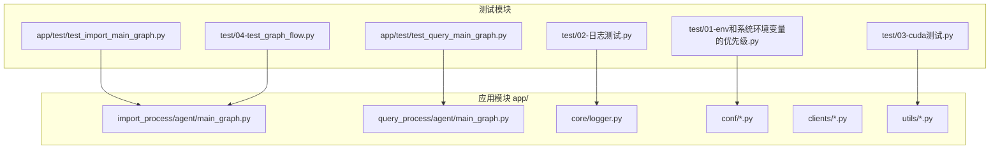
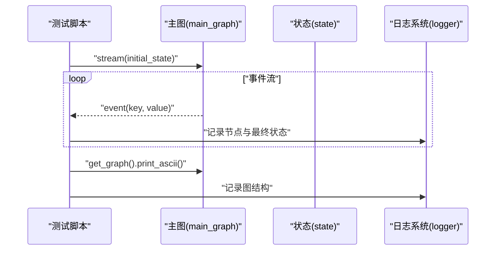
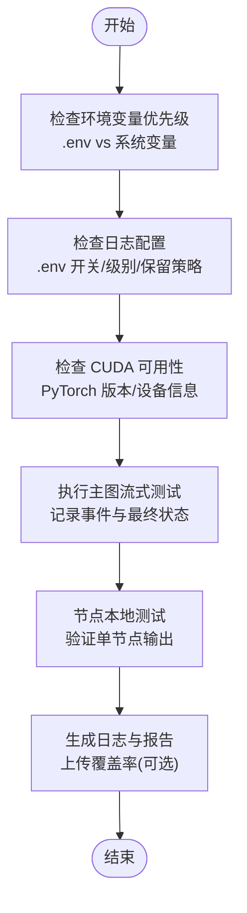
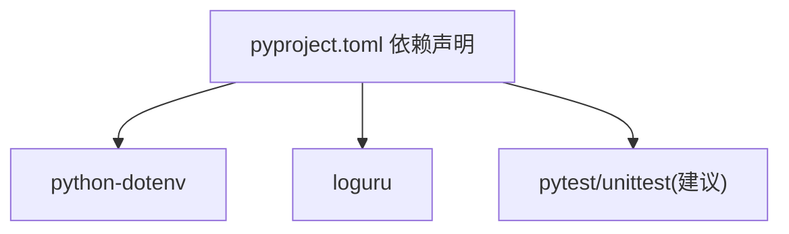

# 测试基础设施

<cite>
**本文引用的文件**
- [pyproject.toml](file://pyproject.toml)
- [app/test/test_import_main_graph.py](file://app/test/test_import_main_graph.py)
- [app/test/test_query_main_graph.py](file://app/test/test_query_main_graph.py)
- [test/01-env和系统环境变量的优先级.py](file://test/01-env和系统环境变量的优先级.py)
- [test/02-日志测试.py](file://test/02-日志测试.py)
- [test/03-cuda测试.py](file://test/03-cuda测试.py)
- [test/04-test_graph_flow.py](file://test/04-test_graph_flow.py)
- [app/core/logger.py](file://app/core/logger.py)
- [app/conf/lm_config.py](file://app/conf/lm_config.py)
- [app/conf/milvus_config.py](file://app/conf/milvus_config.py)
- [app/import_process/agent/nodes/node_document_split.py](file://app/import_process/agent/nodes/node_document_split.py)
</cite>

## 目录
1. [引言](#引言)
2. [项目结构](#项目结构)
3. [核心组件](#核心组件)
4. [架构总览](#架构总览)
5. [详细组件分析](#详细组件分析)
6. [依赖分析](#依赖分析)
7. [性能考虑](#性能考虑)
8. [故障排除指南](#故障排除指南)
9. [结论](#结论)
10. [附录](#附录)

## 引言
本文件系统性梳理本项目的测试基础设施，涵盖测试目录与文件组织、测试用例命名规范与分类方法、测试环境配置与依赖管理、测试数据准备与清理策略、测试工具与框架选择依据、测试覆盖率统计与报告生成、持续集成中的测试执行配置、测试调试与故障排除方法，以及测试最佳实践与代码质量标准。文档面向不同技术背景读者，既提供高层概览也给出代码级映射与来源标注。

## 项目结构
项目采用“应用模块 + 测试模块”的分层组织方式：
- 应用代码位于 app/ 下，包含导入与查询主流程、客户端工具、配置、核心工具等。
- 测试代码分为两类：
  - app/test/：针对应用主流程（导入/查询）的端到端流式执行测试。
  - test/：独立的环境变量、日志、CUDA 等基础能力验证脚本。

图表来源
- [app/test/test_import_main_graph.py:1-27](file://app/test/test_import_main_graph.py#L1-L27)
- [app/test/test_query_main_graph.py:1-26](file://app/test/test_query_main_graph.py#L1-L26)
- [test/01-env和系统环境变量的优先级.py:1-18](file://test/01-env和系统环境变量的优先级.py#L1-L18)
- [test/02-日志测试.py:1-56](file://test/02-日志测试.py#L1-L56)
- [test/03-cuda测试.py:1-8](file://test/03-cuda测试.py#L1-L8)
- [test/04-test_graph_flow.py:1-26](file://test/04-test_graph_flow.py#L1-L26)
- [app/core/logger.py:1-95](file://app/core/logger.py#L1-L95)
- [app/conf/lm_config.py:1-26](file://app/conf/lm_config.py#L1-L26)
- [app/conf/milvus_config.py:1-26](file://app/conf/milvus_config.py#L1-L26)

章节来源
- [app/test/test_import_main_graph.py:1-27](file://app/test/test_import_main_graph.py#L1-L27)
- [app/test/test_query_main_graph.py:1-26](file://app/test/test_query_main_graph.py#L1-L26)
- [test/01-env和系统环境变量的优先级.py:1-18](file://test/01-env和系统环境变量的优先级.py#L1-L18)
- [test/02-日志测试.py:1-56](file://test/02-日志测试.py#L1-L56)
- [test/03-cuda测试.py:1-8](file://test/03-cuda测试.py#L1-L8)
- [test/04-test_graph_flow.py:1-26](file://test/04-test_graph_flow.py#L1-L26)

## 核心组件
- 日志基础设施：基于 loguru 的全局 logger，支持 .env 控制台/文件双输出、自动路径与自动清理、中文友好、异步安全、位置穿透。
- 配置管理：通过 dataclass 读取 .env 环境变量，集中管理 LLM、Milvus 等外部服务配置。
- 主流程测试：导入/查询主图的流式执行测试，验证状态流转与最终输出。
- 基础能力测试：环境变量优先级、日志级别展示、CUDA 可用性等。

章节来源
- [app/core/logger.py:1-95](file://app/core/logger.py#L1-L95)
- [app/conf/lm_config.py:1-26](file://app/conf/lm_config.py#L1-L26)
- [app/conf/milvus_config.py:1-26](file://app/conf/milvus_config.py#L1-L26)
- [app/test/test_import_main_graph.py:1-27](file://app/test/test_import_main_graph.py#L1-L27)
- [app/test/test_query_main_graph.py:1-26](file://app/test/test_query_main_graph.py#L1-L26)
- [test/01-env和系统环境变量的优先级.py:1-18](file://test/01-env和系统环境变量的优先级.py#L1-L18)
- [test/02-日志测试.py:1-56](file://test/02-日志测试.py#L1-L56)
- [test/03-cuda测试.py:1-8](file://test/03-cuda测试.py#L1-L8)

## 架构总览
测试执行链路从测试脚本出发，调用应用主图或配置模块，借助日志系统输出执行过程与最终状态，从而形成闭环验证。

图表来源
- [app/test/test_import_main_graph.py:10-26](file://app/test/test_import_main_graph.py#L10-L26)
- [app/test/test_query_main_graph.py:9-26](file://app/test/test_query_main_graph.py#L9-L26)
- [app/core/logger.py:46-83](file://app/core/logger.py#L46-L83)

## 详细组件分析

### 测试目录与文件组织
- app/test/：存放与应用主流程强相关的测试，分别针对导入与查询主图，便于快速验证端到端流程。
- test/：存放独立的基础能力测试，如环境变量优先级、日志级别、CUDA 可用性等，便于快速诊断环境问题。

命名规范与分类方法
- 文件名以序号前缀（两位数字）+ 功能描述，体现测试类型与优先级，例如“01-”“02-”等。
- 导入/查询主图测试分别独立文件，职责单一，便于定位与维护。
- 基础能力测试独立脚本，便于在 CI 或本地单独执行。

章节来源
- [app/test/test_import_main_graph.py:1-27](file://app/test/test_import_main_graph.py#L1-L27)
- [app/test/test_query_main_graph.py:1-26](file://app/test/test_query_main_graph.py#L1-L26)
- [test/01-env和系统环境变量的优先级.py:1-18](file://test/01-env和系统环境变量的优先级.py#L1-L18)
- [test/02-日志测试.py:1-56](file://test/02-日志测试.py#L1-L56)
- [test/03-cuda测试.py:1-8](file://test/03-cuda测试.py#L1-L8)
- [test/04-test_graph_flow.py:1-26](file://test/04-test_graph_flow.py#L1-L26)

### 测试环境配置与依赖管理
- Python 版本要求：>=3.11。
- 依赖管理：通过项目配置声明 FastAPI、LangChain、LangGraph、PyMongo、PyMilvus、MinIO、Torch/Torchaudio/Torchvision、Uvicorn 等。
- 环境变量加载：.env 通过 python-dotenv 在运行时加载，支持 override 参数控制 .env 与系统环境变量的优先级。
- 日志配置：.env 控制台/文件输出开关、级别、保留策略，自动创建 logs 目录并按日期轮转。

章节来源
- [pyproject.toml:1-36](file://pyproject.toml#L1-L36)
- [test/01-env和系统环境变量的优先级.py:1-18](file://test/01-env和系统环境变量的优先级.py#L1-L18)
- [app/core/logger.py:21-83](file://app/core/logger.py#L21-L83)

### 测试数据准备、存储与清理策略
- 测试数据准备：
  - 导入流程测试使用本地 PDF 文件作为输入，通过状态构造器创建初始状态。
  - 查询流程测试使用会话 ID 与原始查询构造初始状态。
- 测试数据存储：
  - 日志文件按日期生成，路径为项目根目录下的 logs 子目录，文件名包含日期。
  - 日志保留策略由 .env 配置项决定。
- 测试数据清理：
  - 日志按配置自动轮转与清理，避免无限增长。
  - 建议在 CI 中对临时生成的日志与中间产物进行周期性清理。

章节来源
- [app/test/test_import_main_graph.py:10-20](file://app/test/test_import_main_graph.py#L10-L20)
- [app/test/test_query_main_graph.py:9-20](file://app/test/test_query_main_graph.py#L9-L20)
- [app/core/logger.py:31-35](file://app/core/logger.py#L31-L35)
- [app/core/logger.py:69-81](file://app/core/logger.py#L69-L81)

### 测试工具与框架选择依据
- 当前测试采用“脚本化测试 + 日志输出”的轻量模式，未引入 pytest/unittest 等测试框架。
- 选择依据：
  - 快速验证：脚本直接调用主图 stream 并输出最终状态，便于快速定位问题。
  - 可观测性：结合日志系统，可输出节点级事件与最终状态，便于人工核验。
  - 可扩展性：若需自动化与断言，可逐步迁移到 pytest/unittest，利用其 fixtures、参数化与报告能力。

章节来源
- [app/test/test_import_main_graph.py:1-27](file://app/test/test_import_main_graph.py#L1-L27)
- [app/test/test_query_main_graph.py:1-26](file://app/test/test_query_main_graph.py#L1-L26)
- [test/02-日志测试.py:1-56](file://test/02-日志测试.py#L1-L56)

### 测试覆盖率统计与报告生成
- 当前仓库未发现覆盖率统计与报告生成配置或脚本。
- 建议：
  - 使用 pytest-cov 或 coverage.py 在 CI 中生成覆盖率报告。
  - 将覆盖率阈值纳入 PR 检查，保证关键路径被覆盖。
  - 结合单元测试与集成测试，分别统计模块级与端到端覆盖率。

[本节为通用建议，不直接分析具体文件，故无章节来源]

### 持续集成中的测试执行配置
- 建议在 CI 中执行以下步骤：
  - 安装依赖（基于项目配置）。
  - 加载 .env 并设置必要环境变量。
  - 执行基础能力测试（环境变量、日志、CUDA）。
  - 执行主流程测试（导入/查询主图）。
  - 生成并上传覆盖率报告（如启用）。
- 产物：
  - 日志文件按日期归档，便于问题回溯。
  - 测试脚本输出最终状态，便于人工核验。

[本节为通用建议，不直接分析具体文件，故无章节来源]

### 测试调试与故障排除
- 环境变量优先级：
  - 默认行为：系统环境变量优先于 .env；如需 .env 覆盖，需显式传入 override=True。
- 日志级别与输出：
  - 通过 .env 控制台/文件开关与级别，结合日志格式定位问题。
  - 使用 logger.exception 自动记录异常堆栈。
- CUDA 可用性：
  - 通过简单脚本检查 PyTorch 版本、CUDA 可用性、设备数量与设备名称。
- 主流程调试：
  - 使用主图 print_ascii 输出图结构，结合事件流日志定位卡顿或异常节点。
  - 在节点内部添加本地测试片段，验证单节点输出。

图表来源
- [test/01-env和系统环境变量的优先级.py:1-18](file://test/01-env和系统环境变量的优先级.py#L1-L18)
- [test/02-日志测试.py:1-56](file://test/02-日志测试.py#L1-L56)
- [test/03-cuda测试.py:1-8](file://test/03-cuda测试.py#L1-L8)
- [app/test/test_import_main_graph.py:14-24](file://app/test/test_import_main_graph.py#L14-L24)
- [app/import_process/agent/nodes/node_document_split.py:337-342](file://app/import_process/agent/nodes/node_document_split.py#L337-L342)

章节来源
- [test/01-env和系统环境变量的优先级.py:1-18](file://test/01-env和系统环境变量的优先级.py#L1-L18)
- [test/02-日志测试.py:1-56](file://test/02-日志测试.py#L1-L56)
- [test/03-cuda测试.py:1-8](file://test/03-cuda测试.py#L1-L8)
- [app/test/test_import_main_graph.py:1-27](file://app/test/test_import_main_graph.py#L1-L27)
- [app/import_process/agent/nodes/node_document_split.py:337-342](file://app/import_process/agent/nodes/node_document_split.py#L337-L342)

### 测试最佳实践与代码质量标准
- 单一职责：每个测试脚本聚焦一个测试目标，便于维护与复用。
- 可重复性：通过 .env 与配置模块集中管理外部依赖参数，确保测试可重复。
- 可观测性：使用结构化日志输出关键事件与最终状态，便于回溯。
- 可扩展性：在需要断言与自动化时，引入 pytest/unittest，配合 fixtures 与参数化。
- 数据治理：对日志与中间产物设定保留策略，避免资源浪费。

[本节为通用建议，不直接分析具体文件，故无章节来源]

## 依赖分析
- 应用依赖：FastAPI、LangChain、LangGraph、PyMongo、PyMilvus、MinIO、Torch/Torchaudio/Torchvision、Uvicorn 等。
- 测试依赖：python-dotenv、loguru、pytest/unittest（建议引入）。
- 配置依赖：dotenv 与 dataclass，集中管理外部服务参数。

图表来源
- [pyproject.toml:9-35](file://pyproject.toml#L9-L35)
- [app/core/logger.py:17-18](file://app/core/logger.py#L17-L18)

章节来源
- [pyproject.toml:1-36](file://pyproject.toml#L1-L36)
- [app/core/logger.py:1-95](file://app/core/logger.py#L1-L95)

## 性能考虑
- 日志异步：启用 enqueue 支持多线程/异步场景，避免日志错乱。
- 日志轮转与保留：按天轮转与按配置保留，降低 IO 压力。
- 测试执行：主图流式测试建议在本地或 CI 中分批执行，避免长时间占用资源。

[本节提供一般性指导，不直接分析具体文件，故无章节来源]

## 故障排除指南
- 环境变量冲突：确认 .env 与系统变量优先级，必要时使用 override=True。
- 日志不可见：检查 .env 中日志开关与级别，确认文件输出目录存在且可写。
- CUDA 不可用：确认 PyTorch 安装与 CUDA 版本匹配，查看设备数量与名称。
- 主图卡顿：使用 print_ascii 输出图结构，结合事件流日志定位异常节点。

章节来源
- [test/01-env和系统环境变量的优先级.py:1-18](file://test/01-env和系统环境变量的优先级.py#L1-L18)
- [app/core/logger.py:58-81](file://app/core/logger.py#L58-L81)
- [test/03-cuda测试.py:1-8](file://test/03-cuda测试.py#L1-L8)
- [app/test/test_import_main_graph.py:22-24](file://app/test/test_import_main_graph.py#L22-L24)

## 结论
本项目的测试基础设施以“脚本化 + 日志可观测”为核心，结合 .env 配置与 dataclass 管理外部依赖，实现了对导入/查询主流程的快速验证。建议在现有基础上引入 pytest/unittest 与覆盖率工具，完善断言与报告体系，并在 CI 中标准化执行流程与产物归档，进一步提升测试效率与质量。

## 附录
- 测试脚本清单与用途
  - app/test/test_import_main_graph.py：导入主图端到端流式测试。
  - app/test/test_query_main_graph.py：查询主图端到端流式测试。
  - test/01-env和系统环境变量的优先级.py：环境变量优先级验证。
  - test/02-日志测试.py：日志级别与输出验证。
  - test/03-cuda测试.py：CUDA 可用性验证。
  - test/04-test_graph_flow.py：导入流程图流式测试。

章节来源
- [app/test/test_import_main_graph.py:1-27](file://app/test/test_import_main_graph.py#L1-L27)
- [app/test/test_query_main_graph.py:1-26](file://app/test/test_query_main_graph.py#L1-L26)
- [test/01-env和系统环境变量的优先级.py:1-18](file://test/01-env和系统环境变量的优先级.py#L1-L18)
- [test/02-日志测试.py:1-56](file://test/02-日志测试.py#L1-L56)
- [test/03-cuda测试.py:1-8](file://test/03-cuda测试.py#L1-L8)
- [test/04-test_graph_flow.py:1-26](file://test/04-test_graph_flow.py#L1-L26)