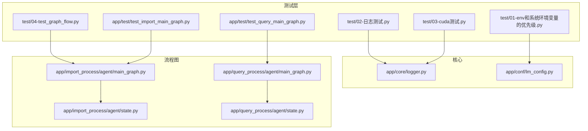
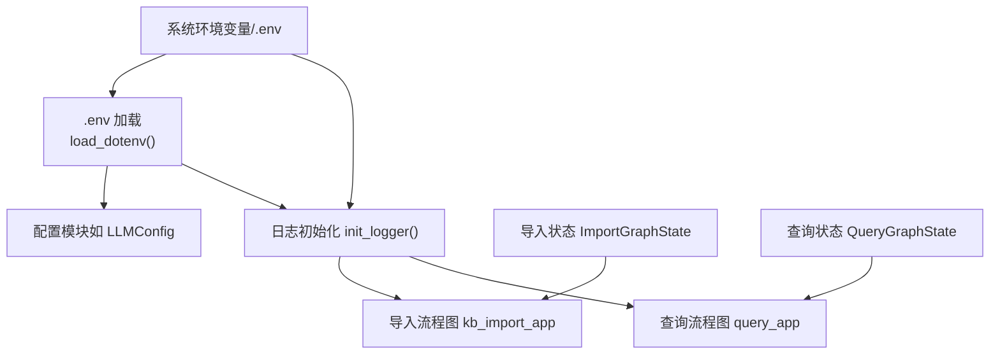
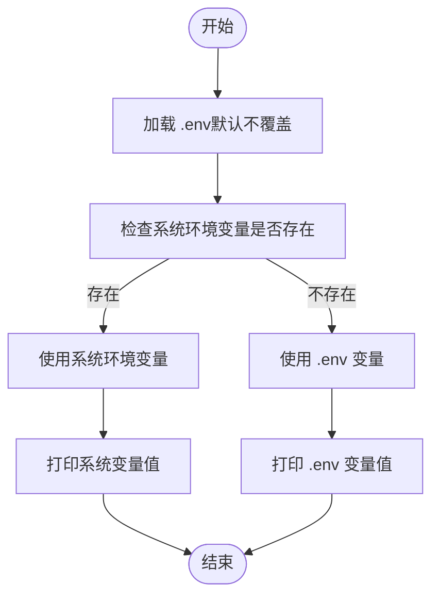
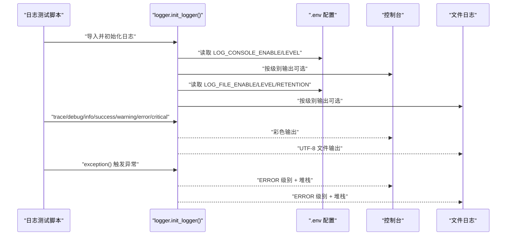
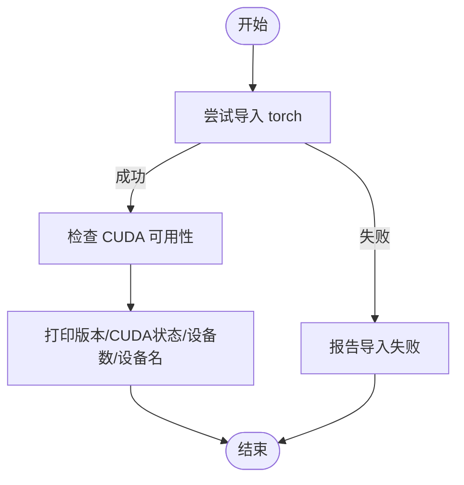
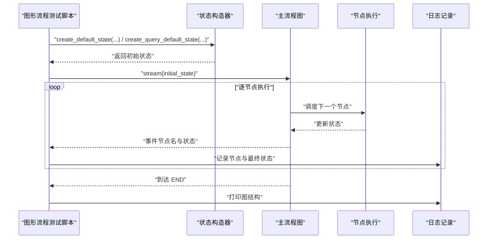
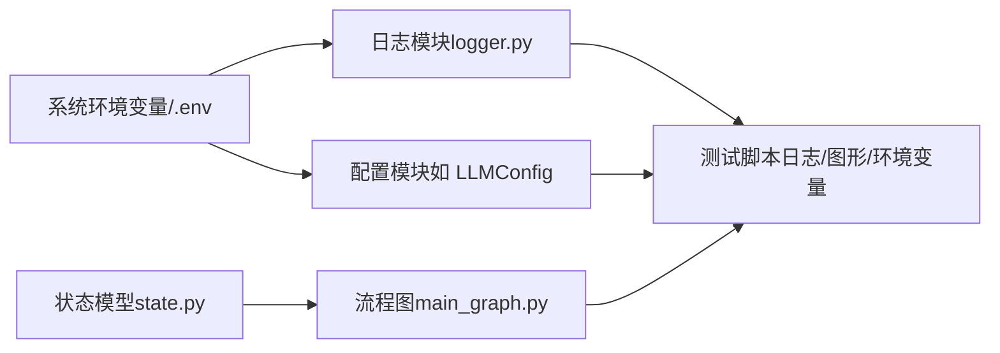

# 系统测试

<cite>
**本文引用的文件**
- [01-env和系统环境变量的优先级.py](file://test/01-env和系统环境变量的优先级.py)
- [02-日志测试.py](file://test/02-日志测试.py)
- [03-cuda测试.py](file://test/03-cuda测试.py)
- [04-test_graph_flow.py](file://test/04-test_graph_flow.py)
- [logger.py](file://app/core/logger.py)
- [lm_config.py](file://app/conf/lm_config.py)
- [main_graph.py（导入流程）](file://app/import_process/agent/main_graph.py)
- [main_graph.py（查询流程）](file://app/query_process/agent/main_graph.py)
- [state.py（导入流程）](file://app/import_process/agent/state.py)
- [state.py（查询流程）](file://app/query_process/agent/state.py)
- [test_import_main_graph.py](file://app/test/test_import_main_graph.py)
- [test_query_main_graph.py](file://app/test/test_query_main_graph.py)
- [pyproject.toml](file://pyproject.toml)
</cite>

## 目录
1. [引言](#引言)
2. [项目结构](#项目结构)
3. [核心组件](#核心组件)
4. [架构总览](#架构总览)
5. [详细组件分析](#详细组件分析)
6. [依赖关系分析](#依赖关系分析)
7. [性能考虑](#性能考虑)
8. [故障排查指南](#故障排查指南)
9. [结论](#结论)
10. [附录](#附录)

## 引言
本文件面向系统测试工程师与开发者，系统化梳理并文档化以下测试能力与验证方法：
- 环境变量优先级测试：验证系统环境变量与配置文件（.env）的优先级规则，并给出可复现实验步骤。
- 日志测试：验证日志级别与输出行为，覆盖TRACE至CRITICAL各层级，以及异常自动记录。
- CUDA测试：验证PyTorch与CUDA可用性检测，指导GPU可用性验证流程。
- 图形流程测试：验证导入与查询主流程图的执行与状态转换，提供端到端验证方案。
- 系统集成测试：给出跨模块（配置、日志、流程图）的集成验证步骤与场景设计。
- 性能基准与压力测试：提供可落地的基准与压力测试实施建议。
- 结果分析与问题诊断：建立测试结果分析与问题定位流程。

## 项目结构
测试相关代码主要分布在以下区域：
- test 目录：独立的单测脚本，便于快速验证特定功能。
- app/test 目录：与应用模块耦合度更高的集成测试样例。
- app/core：日志工具与全局日志初始化。
- app/conf：各类配置从.env读取的实现，体现“系统环境变量 > .env > 代码默认值”的优先级。
- app/import_process 与 app/query_process：主流程图与状态定义，支撑图形流程测试。

图表来源
- [logger.py:1-109](file://app/core/logger.py#L1-L109)
- [lm_config.py:1-27](file://app/conf/lm_config.py#L1-L27)
- [main_graph.py（导入流程）:1-134](file://app/import_process/agent/main_graph.py#L1-L134)
- [main_graph.py（查询流程）:1-47](file://app/query_process/agent/main_graph.py#L1-L47)
- [state.py（导入流程）:1-99](file://app/import_process/agent/state.py#L1-L99)
- [state.py（查询流程）:1-97](file://app/query_process/agent/state.py#L1-L97)

章节来源
- [pyproject.toml:1-36](file://pyproject.toml#L1-L36)

## 核心组件
- 环境变量与配置优先级：由多个配置模块在导入时统一加载.env，结合系统环境变量实现“系统 > .env > 代码默认值”的优先级。
- 日志系统：基于loguru，支持.env控制台/文件双输出、异步安全、自动清理与位置修复。
- 主流程图：导入与查询两条主流程，节点间条件边与静态边构成完整的状态转换。
- 状态模型：TypedDict定义的状态结构，提供默认值与覆盖机制，保障测试可复现。

章节来源
- [lm_config.py:1-27](file://app/conf/lm_config.py#L1-L27)
- [logger.py:1-109](file://app/core/logger.py#L1-L109)
- [main_graph.py（导入流程）:1-134](file://app/import_process/agent/main_graph.py#L1-L134)
- [main_graph.py（查询流程）:1-47](file://app/query_process/agent/main_graph.py#L1-L47)
- [state.py（导入流程）:1-99](file://app/import_process/agent/state.py#L1-L99)
- [state.py（查询流程）:1-97](file://app/query_process/agent/state.py#L1-L97)

## 架构总览
下图展示测试执行与关键组件交互关系，强调环境变量加载、日志初始化、流程图编译与状态传递。

图表来源
- [lm_config.py:1-27](file://app/conf/lm_config.py#L1-L27)
- [logger.py:46-83](file://app/core/logger.py#L46-L83)
- [main_graph.py（导入流程）:65-65](file://app/import_process/agent/main_graph.py#L65-L65)
- [main_graph.py（查询流程）:47-47](file://app/query_process/agent/main_graph.py#L47-L47)
- [state.py（导入流程）:65-90](file://app/import_process/agent/state.py#L65-L90)
- [state.py（查询流程）:55-68](file://app/query_process/agent/state.py#L55-L68)

## 详细组件分析

### 环境变量优先级测试
目标：验证系统环境变量对.env的覆盖优先级；演示如何让.env覆盖系统变量。
- 测试入口：test/01-env和系统环境变量的优先级.py
- 关键点：
  - 默认行为：load_dotenv() 不覆盖已有系统环境变量，系统变量优先级更高。
  - 覆盖行为：传入 override=True 显式允许.env覆盖系统变量。
- 验证步骤（建议）：
  1) 在系统设置 OPENAI_API_KEY=system_val，同时在 .env 设置 OPENAI_API_KEY=dotenv_val。
  2) 运行测试脚本，观察 OPENAI_API_KEY 的读取结果（应为 system_val）。
  3) 将脚本改为 load_dotenv(override=True)，再次运行，观察 OPENAI_API_KEY 的读取结果（应为 dotenv_val）。
- 影响范围：所有配置模块（如 LLMConfig）均通过 os.getenv 读取，受上述优先级影响。

图表来源
- [01-env和系统环境变量的优先级.py:1-18](file://test/01-env和系统环境变量的优先级.py#L1-L18)

章节来源
- [01-env和系统环境变量的优先级.py:1-18](file://test/01-env和系统环境变量的优先级.py#L1-L18)
- [lm_config.py:8-8](file://app/conf/lm_config.py#L8-L8)

### 日志测试
目标：验证日志级别与输出行为，覆盖 TRACE 至 CRITICAL，并验证异常自动记录。
- 测试入口：test/02-日志测试.py
- 日志初始化：app/core/logger.py 通过 .env 控制台/文件输出、级别、保留策略，并修复调用位置以显示业务模块真实位置。
- 验证要点：
  - 控制台/文件开关与级别：通过 LOG_CONSOLE_ENABLE、LOG_CONSOLE_LEVEL、LOG_FILE_ENABLE、LOG_FILE_LEVEL 验证。
  - 日志级别：TRACE、DEBUG、INFO、SUCCESS、WARNING、ERROR、CRITICAL。
  - 异常记录：logger.exception 自动记录堆栈并归类为 ERROR 级别。
- 建议执行步骤：
  1) 在 .env 中设置 LOG_CONSOLE_ENABLE=true、LOG_FILE_ENABLE=true、LOG_CONSOLE_LEVEL=TRACE。
  2) 运行日志测试脚本，观察控制台彩色输出与 logs 文件生成。
  3) 修改级别为 ERROR，验证仅输出 ERROR 与 CRITICAL。
  4) 触发异常分支，确认异常被记录为 ERROR 并包含堆栈信息。

图表来源
- [02-日志测试.py:1-56](file://test/02-日志测试.py#L1-L56)
- [logger.py:46-83](file://app/core/logger.py#L46-L83)

章节来源
- [02-日志测试.py:1-56](file://test/02-日志测试.py#L1-L56)
- [logger.py:1-109](file://app/core/logger.py#L1-L109)

### CUDA 测试
目标：验证 PyTorch 与 CUDA 的可用性，判断 GPU 是否可用。
- 测试入口：test/03-cuda测试.py
- 验证内容：
  - PyTorch 版本与加载状态。
  - CUDA 可用性（CPU 版本显示 False 属正常）。
  - CUDA 设备数量与设备名称。
- 建议执行步骤：
  1) 在具备 CUDA 的环境中运行脚本，确认 CUDA 状态为 True，设备数大于等于 1。
  2) 在 CPU 环境或无 CUDA 的环境中运行，确认 CUDA 状态为 False。
  3) 如需在 CI 或容器中验证，可通过安装对应 CUDA 运行时或使用 CPU 版本进行对比。

图表来源
- [03-cuda测试.py:1-8](file://test/03-cuda测试.py#L1-L8)

章节来源
- [03-cuda测试.py:1-8](file://test/03-cuda测试.py#L1-L8)

### 图形流程测试（导入与查询）
目标：验证主流程图的执行与状态转换，输出最终状态并打印图结构。
- 测试入口：
  - test/04-test_graph_flow.py（独立脚本）
  - app/test/test_import_main_graph.py（导入流程）
  - app/test/test_query_main_graph.py（查询流程）
- 关键流程：
  - 导入流程：根据输入文件类型选择路由，依次执行节点，最终到达 END。
  - 查询流程：根据回答是否已生成决定路由，汇聚多路检索后重排并输出答案。
- 验证步骤（导入流程）：
  1) 准备测试 PDF 文件（如 doc/hak180产品安全手册.pdf）。
  2) 使用 create_default_state 构造初始状态，设置本地文件路径与输出目录。
  3) 通过 kb_import_app.stream 执行流程，逐节点打印并记录最终状态。
  4) 校验最终状态包含 chunks、embedding、kg_id 等关键字段。
  5) 打印图结构，核对边与节点关系。
- 验证步骤（查询流程）：
  1) 使用 create_query_default_state 构造初始状态，设置 session_id 与 original_query。
  2) 通过 query_app.stream 执行流程，观察节点执行顺序与最终 answer。
  3) 校验 rerank/rrf 等中间状态是否按预期生成。

图表来源
- [04-test_graph_flow.py:1-26](file://test/04-test_graph_flow.py#L1-L26)
- [test_import_main_graph.py:1-27](file://app/test/test_import_main_graph.py#L1-L27)
- [test_query_main_graph.py:1-26](file://app/test/test_query_main_graph.py#L1-L26)
- [main_graph.py（导入流程）:69-134](file://app/import_process/agent/main_graph.py#L69-L134)
- [main_graph.py（查询流程）:1-47](file://app/query_process/agent/main_graph.py#L1-L47)
- [state.py（导入流程）:65-90](file://app/import_process/agent/state.py#L65-L90)
- [state.py（查询流程）:55-68](file://app/query_process/agent/state.py#L55-L68)

章节来源
- [04-test_graph_flow.py:1-26](file://test/04-test_graph_flow.py#L1-L26)
- [test_import_main_graph.py:1-27](file://app/test/test_import_main_graph.py#L1-L27)
- [test_query_main_graph.py:1-26](file://app/test/test_query_main_graph.py#L1-L26)
- [main_graph.py（导入流程）:1-134](file://app/import_process/agent/main_graph.py#L1-L134)
- [main_graph.py（查询流程）:1-47](file://app/query_process/agent/main_graph.py#L1-L47)
- [state.py（导入流程）:1-99](file://app/import_process/agent/state.py#L1-L99)
- [state.py（查询流程）:1-97](file://app/query_process/agent/state.py#L1-L97)

## 依赖关系分析
- 配置模块依赖 .env 与系统环境变量，形成“系统 > .env > 代码默认值”的优先级链。
- 日志模块依赖 .env 控制输出与级别，贯穿所有测试脚本。
- 流程图依赖状态模型与节点实现，状态模型提供默认值与覆盖能力，保证测试可复现。

图表来源
- [lm_config.py:1-27](file://app/conf/lm_config.py#L1-L27)
- [logger.py:1-109](file://app/core/logger.py#L1-L109)
- [main_graph.py（导入流程）:1-134](file://app/import_process/agent/main_graph.py#L1-L134)
- [main_graph.py（查询流程）:1-47](file://app/query_process/agent/main_graph.py#L1-L47)
- [state.py（导入流程）:1-99](file://app/import_process/agent/state.py#L1-L99)
- [state.py（查询流程）:1-97](file://app/query_process/agent/state.py#L1-L97)

章节来源
- [pyproject.toml:9-35](file://pyproject.toml#L9-L35)

## 性能考虑
- 日志性能：启用异步入队（enqueue=True）与 UTF-8 编码，减少阻塞；合理设置日志级别与保留策略，避免 IO 压力。
- 流程图执行：在 CI 环境中尽量使用最小化输入与禁用非必要节点，缩短执行时间。
- CUDA 性能：在具备 GPU 的环境中进行基准测试，对比 CPU 与 GPU 的吞吐差异；注意批处理大小与设备内存占用。
- 基准与压力建议（通用实践）：
  - 基准：固定输入规模与次数，测量平均耗时与方差，记录日志级别与输出文件大小。
  - 压力：逐步增加并发节点或输入规模，观察延迟与错误率变化，定位瓶颈。
  - 回归：将基准结果纳入版本发布基线，作为回归检查的一部分。

## 故障排查指南
- 环境变量未生效：
  - 确认 .env 文件路径与权限，检查 load_dotenv() 是否在读取 os.getenv 前执行。
  - 使用 override=True 显式允许 .env 覆盖系统变量。
- 日志未输出或级别不符：
  - 检查 .env 中 LOG_CONSOLE_ENABLE/LOG_FILE_ENABLE 与 LOG_CONSOLE_LEVEL/LOG_FILE_LEVEL。
  - 确认 init_logger() 已被导入模块调用，且未被二次 remove。
- CUDA 无法使用：
  - 确认已安装匹配的 PyTorch 与 CUDA 运行时；在 CPU 环境下 CUDA 状态为 False 属正常。
- 流程图卡住或状态异常：
  - 通过流式输出逐节点定位；检查状态字段是否按预期更新；核对条件边路由逻辑。
- 异常未记录或堆栈缺失：
  - 使用 logger.exception 或在 except 块中记录异常并携带堆栈。

章节来源
- [01-env和系统环境变量的优先级.py:1-18](file://test/01-env和系统环境变量的优先级.py#L1-L18)
- [logger.py:46-83](file://app/core/logger.py#L46-L83)
- [03-cuda测试.py:1-8](file://test/03-cuda测试.py#L1-L8)
- [04-test_graph_flow.py:1-26](file://test/04-test_graph_flow.py#L1-L26)

## 结论
本文提供了环境变量优先级、日志级别、CUDA 可用性、图形流程执行与状态转换、系统集成测试、性能基准与压力测试以及问题诊断的完整方法论。通过 .env 与系统环境变量的优先级控制、日志初始化与级别管理、流程图状态模型与节点编排，能够高效地构建可复现、可观测、可诊断的系统测试体系。

## 附录
- 测试执行清单（建议）：
  - 环境变量优先级：准备系统变量与 .env 冲突项，分别验证默认与 override=True 行为。
  - 日志测试：切换 .env 日志级别与开关，验证控制台与文件输出。
  - CUDA 测试：在不同运行环境下验证 CUDA 状态与设备信息。
  - 图形流程：准备最小化输入，执行导入与查询流程，记录最终状态与图结构。
  - 集成测试：组合配置、日志与流程图，验证跨模块协同。
  - 性能测试：制定基准与压力方案，记录关键指标并回归对比。