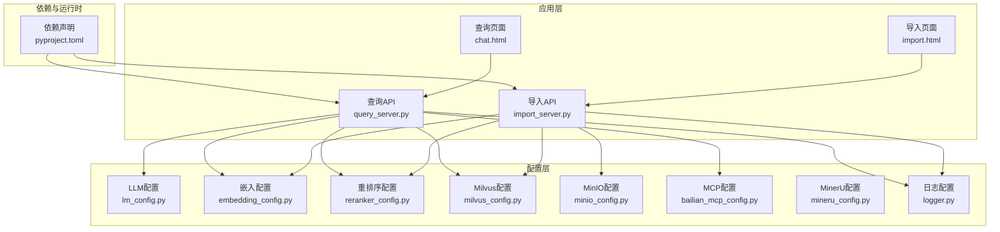
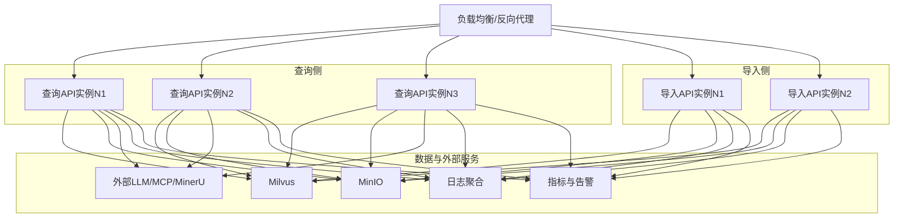
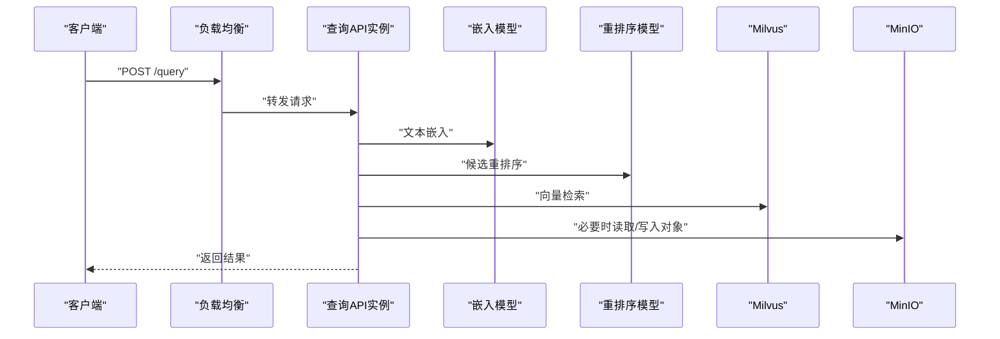
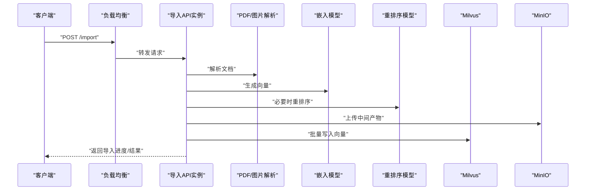
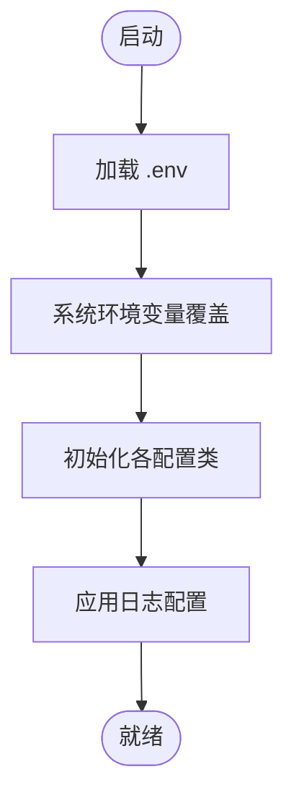
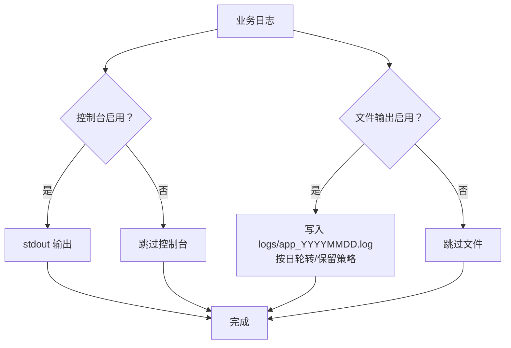
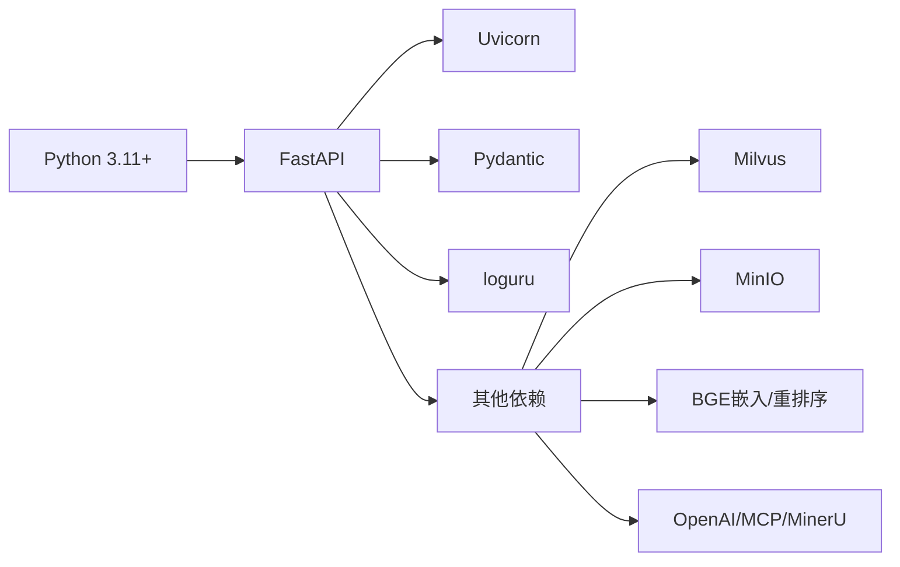

# 部署与运维

<cite>
**本文引用的文件**
- [pyproject.toml](file://pyproject.toml)
- [app/conf/lm_config.py](file://app/conf/lm_config.py)
- [app/conf/embedding_config.py](file://app/conf/embedding_config.py)
- [app/conf/reranker_config.py](file://app/conf/reranker_config.py)
- [app/conf/milvus_config.py](file://app/conf/milvus_config.py)
- [app/conf/minio_config.py](file://app/conf/minio_config.py)
- [app/conf/bailian_mcp_config.py](file://app/conf/bailian_mcp_config.py)
- [app/conf/mineru_config.py](file://app/conf/mineru_config.py)
- [app/core/logger.py](file://app/core/logger.py)
- [app/query_process/api/query_server.py](file://app/query_process/api/query_server.py)
- [app/import_process/api/import_server.py](file://app/import_process/api/import_server.py)
- [app/query_process/page/chat.html](file://app/query_process/page/chat.html)
- [app/import_process/page/import.html](file://app/import_process/page/import.html)
- [test/01-env和系统环境变量的优先级.py](file://test/01-env和系统环境变量的优先级.py)
- [test/02-日志测试.py](file://test/02-日志测试.py)
- [test/03-cuda测试.py](file://test/03-cuda测试.py)
- [test/04-test_graph_flow.py](file://test/04-test_graph_flow.py)
</cite>

## 目录
1. [简介](#简介)
2. [项目结构](#项目结构)
3. [核心组件](#核心组件)
4. [架构总览](#架构总览)
5. [详细组件分析](#详细组件分析)
6. [依赖关系分析](#依赖关系分析)
7. [性能考虑](#性能考虑)
8. [故障排除指南](#故障排除指南)
9. [结论](#结论)
10. [附录](#附录)

## 简介
本指南面向RAG Agent项目的生产部署与运维，覆盖Docker容器化、Kubernetes集群与传统服务器三种部署形态；给出高可用与负载均衡配置建议；说明监控与日志聚合、备份与恢复、配置管理与热更新、安全加固与访问控制、性能调优与容量规划、以及故障排除与应急响应操作手册。文档中所有技术细节均以仓库现有代码与配置为依据。

## 项目结构
RAG Agent采用Python FastAPI应用，围绕“导入流程”和“查询流程”两大API服务展开，同时集成嵌入、重排序、向量检索、对象存储与外部大模型服务等子系统。配置通过dotenv集中管理，日志由loguru统一输出。

图示来源
- [app/query_process/api/query_server.py](file://app/query_process/api/query_server.py)
- [app/import_process/api/import_server.py](file://app/import_process/api/import_server.py)
- [app/conf/lm_config.py](file://app/conf/lm_config.py)
- [app/conf/embedding_config.py](file://app/conf/embedding_config.py)
- [app/conf/reranker_config.py](file://app/conf/reranker_config.py)
- [app/conf/milvus_config.py](file://app/conf/milvus_config.py)
- [app/conf/minio_config.py](file://app/conf/minio_config.py)
- [app/conf/bailian_mcp_config.py](file://app/conf/bailian_mcp_config.py)
- [app/conf/mineru_config.py](file://app/conf/mineru_config.py)
- [app/core/logger.py](file://app/core/logger.py)
- [pyproject.toml](file://pyproject.toml)

章节来源
- [pyproject.toml:1-36](file://pyproject.toml#L1-L36)
- [app/query_process/api/query_server.py](file://app/query_process/api/query_server.py)
- [app/import_process/api/import_server.py](file://app/import_process/api/import_server.py)
- [app/core/logger.py:1-109](file://app/core/logger.py#L1-L109)

## 核心组件
- 配置体系：通过dotenv集中注入环境变量，各配置类以数据类封装，统一从环境变量读取，便于在不同运行环境中切换。
- 日志系统：基于loguru，支持控制台与文件双通道输出、异步写入、自动轮转与保留策略、调用栈位置修复。
- API服务：查询与导入两个FastAPI服务，分别提供问答与知识入库能力，前端页面用于演示与调试。
- 外部依赖：向量库Milvus、对象存储MinIO、嵌入与重排序模型、外部大模型服务（OpenAI/MCP/MinerU）。

章节来源
- [app/conf/lm_config.py:1-27](file://app/conf/lm_config.py#L1-L27)
- [app/conf/embedding_config.py:1-24](file://app/conf/embedding_config.py#L1-L24)
- [app/conf/reranker_config.py:1-21](file://app/conf/reranker_config.py#L1-L21)
- [app/conf/milvus_config.py:1-26](file://app/conf/milvus_config.py#L1-L26)
- [app/conf/minio_config.py:1-29](file://app/conf/minio_config.py#L1-L29)
- [app/conf/bailian_mcp_config.py:1-19](file://app/conf/bailian_mcp_config.py#L1-L19)
- [app/conf/mineru_config.py:1-20](file://app/conf/mineru_config.py#L1-L20)
- [app/core/logger.py:1-109](file://app/core/logger.py#L1-L109)

## 架构总览
下图展示生产环境典型拓扑：反向代理/负载均衡前置，后端为两套API服务（查询与导入），分别对接向量库、对象存储与外部大模型服务。日志与指标通过集中式采集器收集。

## 详细组件分析

### 查询API服务（生产部署要点）
- 部署形态
  - Docker：基于Python镜像构建，挂载.env与模型缓存目录，暴露HTTP端口。
  - Kubernetes：Deployment副本数≥2，Service ClusterIP，Ingress或LB暴露；持久卷挂载日志与模型缓存。
  - 传统服务器：PM2或Supervisor守护进程，systemd服务单元，日志切割与归档。
- 高可用与负载均衡
  - 健康检查：/health或/ready端点（需在FastAPI中实现），失败自动摘除。
  - 会话粘性：无状态设计，无需粘性会话；如需跨请求上下文，使用Redis会话存储。
- 性能与容量
  - 并发：根据CPU/GPU资源设置workers与threads；GPU推理建议单实例一卡。
  - 缓存：模型权重与临时文件使用持久卷缓存，减少冷启动时间。
- 监控与告警
  - 指标：UVicorn指标、自定义QPS/P95/P99、错误率、向量库/存储延迟。
  - 日志：stdout/stderr结合文件日志，统一采集至集中式日志平台。
  - 告警：阈值触发（错误率、P95、连接池耗尽、磁盘/内存/CPU过高）。

图示来源
- [app/query_process/api/query_server.py](file://app/query_process/api/query_server.py)
- [app/conf/lm_config.py:1-27](file://app/conf/lm_config.py#L1-L27)
- [app/conf/embedding_config.py:1-24](file://app/conf/embedding_config.py#L1-L24)
- [app/conf/reranker_config.py:1-21](file://app/conf/reranker_config.py#L1-L21)
- [app/conf/milvus_config.py:1-26](file://app/conf/milvus_config.py#L1-L26)
- [app/conf/minio_config.py:1-29](file://app/conf/minio_config.py#L1-L29)

章节来源
- [app/query_process/api/query_server.py](file://app/query_process/api/query_server.py)
- [app/conf/lm_config.py:1-27](file://app/conf/lm_config.py#L1-L27)
- [app/conf/embedding_config.py:1-24](file://app/conf/embedding_config.py#L1-L24)
- [app/conf/reranker_config.py:1-21](file://app/conf/reranker_config.py#L1-L21)
- [app/conf/milvus_config.py:1-26](file://app/conf/milvus_config.py#L1-L26)
- [app/conf/minio_config.py:1-29](file://app/conf/minio_config.py#L1-L29)

### 导入API服务（生产部署要点）
- 部署形态与高可用同查询侧。
- 关键注意
  - 大文件上传：MinIO接入，注意分块上传与断点续传；限制并发与单次大小。
  - 向量化与入库：批量写入Milvus，合理设置批大小与超时；失败重试与死信队列。
  - 资源隔离：导入任务独立于查询实例，避免互相抢占GPU/CPU。
- 监控与告警
  - 导入速率、向量入库延迟、对象存储写入成功率、重试次数。

图示来源
- [app/import_process/api/import_server.py](file://app/import_process/api/import_server.py)
- [app/conf/minio_config.py:1-29](file://app/conf/minio_config.py#L1-L29)
- [app/conf/milvus_config.py:1-26](file://app/conf/milvus_config.py#L1-L26)
- [app/conf/embedding_config.py:1-24](file://app/conf/embedding_config.py#L1-L24)
- [app/conf/reranker_config.py:1-21](file://app/conf/reranker_config.py#L1-L21)

章节来源
- [app/import_process/api/import_server.py](file://app/import_process/api/import_server.py)
- [app/conf/minio_config.py:1-29](file://app/conf/minio_config.py#L1-L29)
- [app/conf/milvus_config.py:1-26](file://app/conf/milvus_config.py#L1-L26)
- [app/conf/embedding_config.py:1-24](file://app/conf/embedding_config.py#L1-L24)
- [app/conf/reranker_config.py:1-21](file://app/conf/reranker_config.py#L1-L21)

### 配置与环境变量管理
- 配置加载顺序与优先级
  - 通过测试脚本验证：系统环境变量优先于.env文件；开发与生产应明确区分。
- 关键环境变量清单
  - LLM/MCP/MinerU：基础URL、API Key/Token、默认模型、温度等。
  - 向量库：连接地址、集合名称。
  - 对象存储：Endpoint、AccessKey、SecretKey、Bucket、目录、SSL开关。
  - 嵌入/重排序：模型路径、设备、半精度开关。
  - 日志：控制台开关/级别、文件开关/级别、保留策略。
- 热更新策略
  - 重启生效：日志级别、文件保留策略、LLM/Milvus/MinIO连接参数。
  - 无需重启：模型路径变更（需预下载并挂载持久卷）。

图示来源
- [test/01-env和系统环境变量的优先级.py](file://test/01-env和系统环境变量的优先级.py)
- [app/core/logger.py:1-109](file://app/core/logger.py#L1-L109)
- [app/conf/lm_config.py:1-27](file://app/conf/lm_config.py#L1-L27)
- [app/conf/milvus_config.py:1-26](file://app/conf/milvus_config.py#L1-L26)
- [app/conf/minio_config.py:1-29](file://app/conf/minio_config.py#L1-L29)
- [app/conf/embedding_config.py:1-24](file://app/conf/embedding_config.py#L1-L24)
- [app/conf/reranker_config.py:1-21](file://app/conf/reranker_config.py#L1-L21)
- [app/conf/bailian_mcp_config.py:1-19](file://app/conf/bailian_mcp_config.py#L1-L19)
- [app/conf/mineru_config.py:1-20](file://app/conf/mineru_config.py#L1-L20)

章节来源
- [test/01-env和系统环境变量的优先级.py](file://test/01-env和系统环境变量的优先级.py)
- [app/core/logger.py:1-109](file://app/core/logger.py#L1-L109)
- [app/conf/lm_config.py:1-27](file://app/conf/lm_config.py#L1-L27)
- [app/conf/milvus_config.py:1-26](file://app/conf/milvus_config.py#L1-L26)
- [app/conf/minio_config.py:1-29](file://app/conf/minio_config.py#L1-L29)
- [app/conf/embedding_config.py:1-24](file://app/conf/embedding_config.py#L1-L24)
- [app/conf/reranker_config.py:1-21](file://app/conf/reranker_config.py#L1-L21)
- [app/conf/bailian_mcp_config.py:1-19](file://app/conf/bailian_mcp_config.py#L1-L19)
- [app/conf/mineru_config.py:1-20](file://app/conf/mineru_config.py#L1-L20)

### 日志与监控
- 日志
  - 控制台与文件双通道，异步写入，按天轮转，UTF-8编码，自动清理过期文件。
  - 调用位置修复，确保业务模块真实文件名与行号。
- 监控
  - 指标：UVicorn内置指标、自定义QPS/P95/P99、错误率、外部依赖延迟。
  - 告警：阈值触发与趋势异常检测；结合SLA设定。
  - 日志聚合：stdout/stderr与文件日志统一采集，结构化字段便于检索。

图示来源
- [app/core/logger.py:1-109](file://app/core/logger.py#L1-L109)

章节来源
- [app/core/logger.py:1-109](file://app/core/logger.py#L1-L109)

### 备份与恢复
- 数据备份
  - Milvus：定期快照/备份，保留多个版本；备份文件异地存储。
  - MinIO：版本化存储与生命周期策略；定期校验与恢复演练。
  - MongoDB（历史记录）：逻辑备份与增量备份结合。
- 灾难恢复
  - RTO/RPO目标：根据业务SLA设定；分离热备与冷备。
  - 恢复流程：先恢复对象存储与向量库，再恢复应用；回滚策略与一致性检查。
- 维护流程
  - 计划停机窗口：滚动升级与配置变更；灰度发布。
  - 变更审批：配置变更与依赖升级需评审与测试。

### 安全加固与访问控制
- 网络与边界
  - 内外网隔离：API置于内网，只对LB/网关开放；最小权限网络策略。
  - TLS：终端TLS与服务间mTLS；证书轮换。
- 认证与授权
  - API Key/Token：外部服务鉴权；内部服务间使用JWT或双向TLS。
  - RBAC：基于角色的访问控制，最小权限原则。
- 配置与密钥
  - 密钥管理：密钥外置与轮换；禁用硬编码；只读权限。
  - 环境变量：敏感信息不落盘；审计与变更追踪。
- 输入校验与防护
  - 参数校验、长度/类型限制；SQL注入、命令注入、XSS防护（前端与后端）。

### 性能调优与容量规划
- 模型与硬件
  - GPU推理：单实例一卡，避免显存碎片；FP16提升吞吐。
  - CPU推理：线程池与并发限制；I/O密集场景优化。
- 应用层
  - 连接池：数据库/向量库/对象存储连接池上限与超时。
  - 缓存：热点数据与中间结果缓存；LRU与TTL。
  - 批处理：导入与检索批大小；背压与限流。
- 容量规划
  - 观察指标：QPS、P95/P99、错误率、资源利用率、队列长度。
  - 扩缩容：HPA/扩缩策略；多副本与亲和性调度。

### 故障排除与应急响应
- 常见问题
  - 模型加载失败：检查模型路径、设备与半精度配置；查看日志定位。
  - 向量库连接失败：检查URL、认证、网络连通性与防火墙。
  - 对象存储写入失败：检查Endpoint、凭据、Bucket权限与配额。
  - 外部LLM不可用：重试、熔断与降级；切换备用服务。
- 应急流程
  - 快速止损：隔离故障实例、切换流量、回滚变更。
  - 根因分析：日志检索、指标对比、依赖链路排查。
  - 复盘与改进：完善监控、告警与预案。

## 依赖关系分析
- 语言与框架
  - Python 3.11+，FastAPI + Uvicorn，Pydantic数据校验，loguru日志。
- 外部库与服务
  - 向量库：Milvus
  - 对象存储：MinIO
  - 嵌入与重排序：本地模型（BGE系列）
  - 大模型服务：OpenAI/MCP/MinerU
- 运行时依赖
  - CUDA/Torch（GPU推理）、NumPy、Pandas、Requests、Mongo、Neo4j等。

图示来源
- [pyproject.toml:1-36](file://pyproject.toml#L1-L36)

章节来源
- [pyproject.toml:1-36](file://pyproject.toml#L1-L36)

## 性能考虑
- 模型推理
  - FP16与张量并行（如支持）；批处理与流水线；缓存热点向量。
- I/O与网络
  - 连接池与超时；压缩传输；CDN加速静态资源。
- 资源调度
  - GPU亲和与隔离；CPU限额与突发；内存水位监控。
- 监控与基线
  - 建立性能基线与回归测试；容量与成本平衡。

## 故障排除指南
- 日志定位
  - 使用日志工具检索关键时间窗内的ERROR/WARNING；结合调用位置修复函数定位。
- 环境变量核对
  - 对比.env与系统环境变量，确认覆盖顺序与最终值。
- 依赖连通性
  - 使用curl或SDK直连Milvus/MinIO/LLM服务，验证认证与网络。
- 回归测试
  - 使用现有测试脚本快速验证导入与查询流程。

章节来源
- [app/core/logger.py:1-109](file://app/core/logger.py#L1-L109)
- [test/01-env和系统环境变量的优先级.py](file://test/01-env和系统环境变量的优先级.py)
- [test/02-日志测试.py](file://test/02-日志测试.py)
- [test/03-cuda测试.py](file://test/03-cuda测试.py)
- [test/04-test_graph_flow.py](file://test/04-test_graph_flow.py)

## 结论
本指南提供了RAG Agent在生产环境的完整部署与运维蓝图：从容器化与K8s编排，到高可用与负载均衡；从监控与日志、备份与恢复，到配置管理与安全加固；再到性能调优与应急响应。建议在上线前完成演练与演练复盘，持续优化。

## 附录
- 前端页面
  - 查询页面与导入页面可用于本地联调与演示，生产环境建议通过反向代理统一入口与静态资源托管。
- 测试脚本
  - 环境变量优先级、日志、CUDA与流程测试，有助于快速定位问题。

章节来源
- [app/query_process/page/chat.html](file://app/query_process/page/chat.html)
- [app/import_process/page/import.html](file://app/import_process/page/import.html)
- [test/01-env和系统环境变量的优先级.py](file://test/01-env和系统环境变量的优先级.py)
- [test/02-日志测试.py](file://test/02-日志测试.py)
- [test/03-cuda测试.py](file://test/03-cuda测试.py)
- [test/04-test_graph_flow.py](file://test/04-test_graph_flow.py)