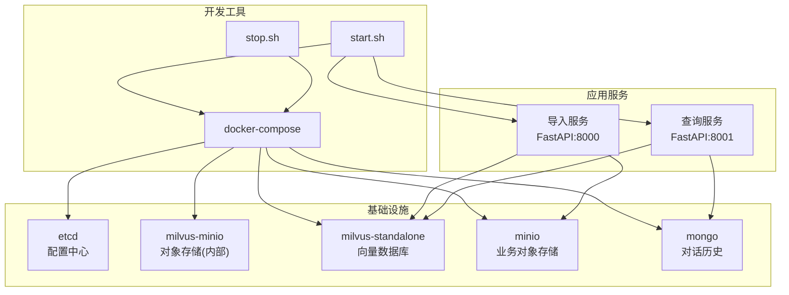
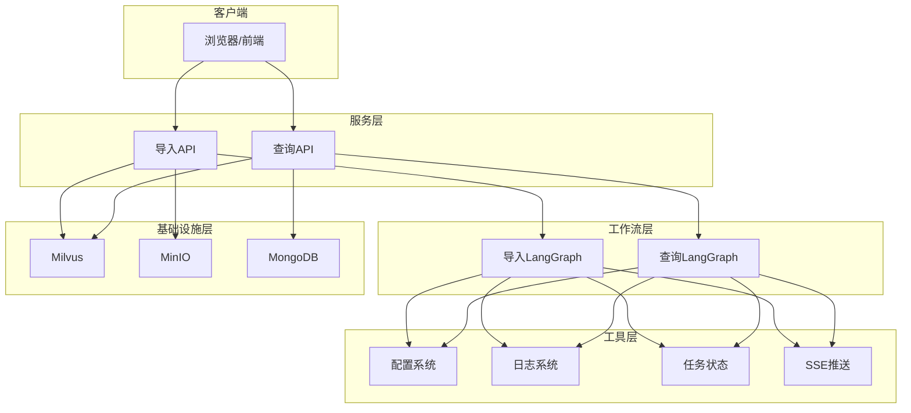
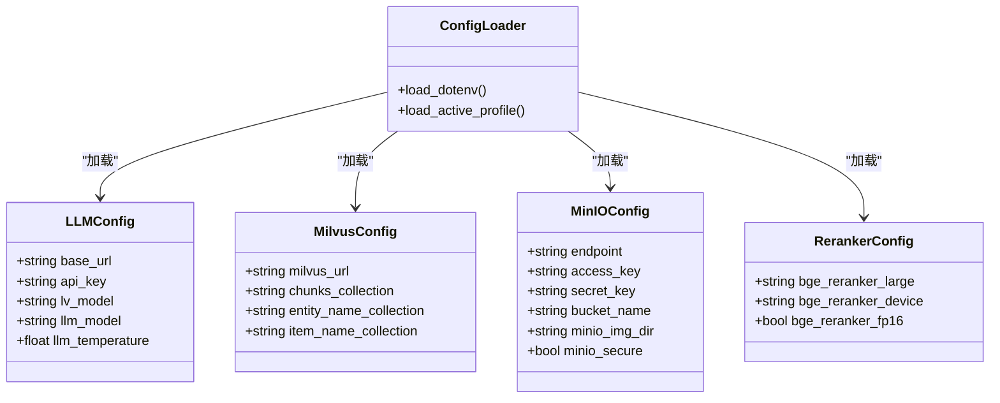
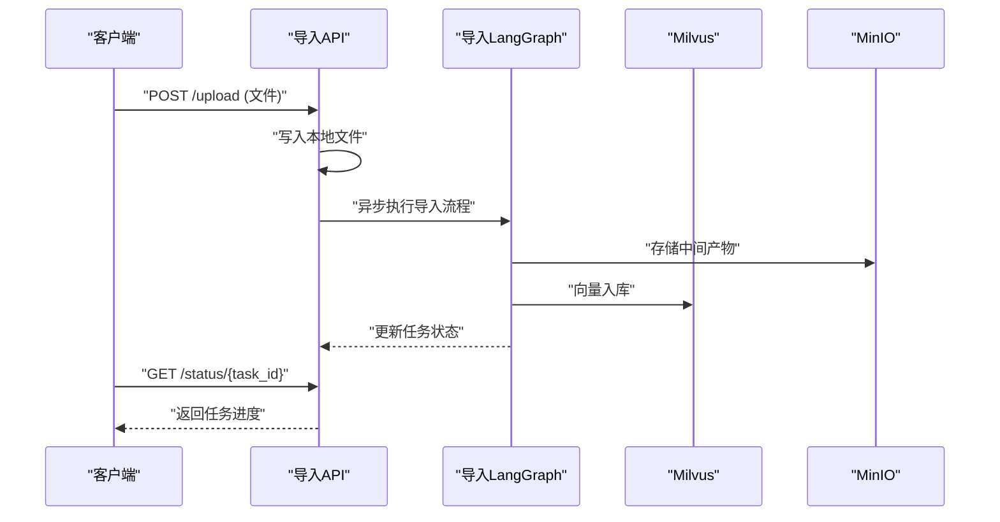
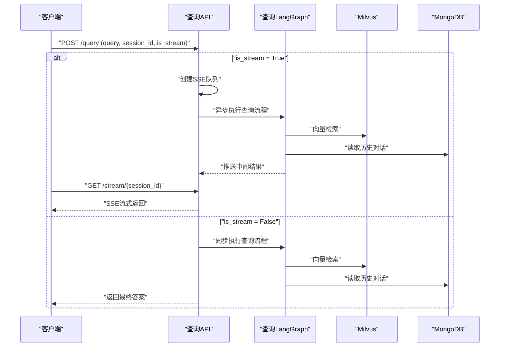
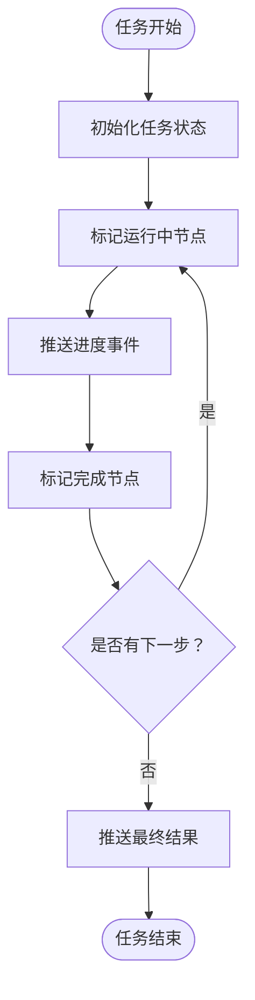
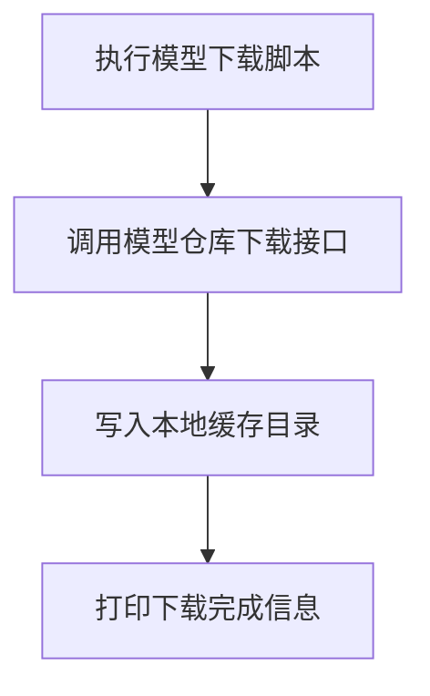
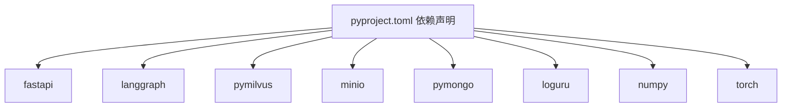

# 基础设施自动化

<cite>
**本文引用的文件**
- [docker-compose.yml](file://docker-compose.yml)
- [start.sh](file://scripts/start.sh)
- [stop.sh](file://scripts/stop.sh)
- [pyproject.toml](file://pyproject.toml)
- [lm_config.py](file://app/conf/lm_config.py)
- [milvus_config.py](file://app/conf/milvus_config.py)
- [minio_config.py](file://app/conf/minio_config.py)
- [reranker_config.py](file://app/conf/reranker_config.py)
- [import_server.py](file://app/import_process/api/import_server.py)
- [query_server.py](file://app/query_process/api/query_server.py)
- [path_util.py](file://app/utils/path_util.py)
- [logger.py](file://app/core/logger.py)
- [download_bgem3.py](file://app/tool/download_bgem3.py)
- [download_reranker.py](file://app/tool/download_reranker.py)
- [main_graph.py（导入流程）](file://app/import_process/agent/main_graph.py)
- [main_graph.py（查询流程）](file://app/query_process/agent/main_graph.py)
- [task_utils.py](file://app/utils/task_utils.py)
- [sse_utils.py](file://app/utils/sse_utils.py)
- [milvus_utils.py](file://app/clients/milvus_utils.py)
- [minio_utils.py](file://app/clients/minio_utils.py)
</cite>

## 目录
1. [简介](#简介)
2. [项目结构](#项目结构)
3. [核心组件](#核心组件)
4. [架构概览](#架构概览)
5. [详细组件分析](#详细组件分析)
6. [依赖关系分析](#依赖关系分析)
7. [性能考虑](#性能考虑)
8. [故障排查指南](#故障排查指南)
9. [结论](#结论)

## 简介
本项目是一个基于容器化与自动化脚本的RAG（检索增强生成）基础设施平台，提供本地开发环境一键启动能力，包含向量数据库（Milvus）、对象存储（MinIO）、文档数据库（MongoDB）以及两个FastAPI服务（导入服务与查询服务）。通过Docker Compose编排基础设施，Shell脚本负责服务生命周期管理，配置系统采用dotenv与环境变量驱动，日志系统基于loguru实现统一输出与清理。

## 项目结构
项目采用按功能域划分的目录组织方式：
- app：核心业务代码
  - clients：外部服务客户端封装（Milvus、MinIO等）
  - conf：配置管理（LLM、Milvus、MinIO、重排序器等）
  - core：通用工具（日志）
  - import_process：知识导入流程（API、LangGraph工作流、页面）
  - query_process：知识查询流程（API、LangGraph工作流、页面、SSE）
  - utils：通用工具（路径、任务状态、SSE）
  - lm：嵌入与重排序工具
  - tool：模型下载辅助脚本
- scripts：启动/停止脚本
- volumes：持久化数据目录占位
- 根目录：容器编排与项目配置

图表来源
- [docker-compose.yml:1-56](file://docker-compose.yml#L1-L56)
- [start.sh:1-19](file://scripts/start.sh#L1-L19)
- [stop.sh:1-15](file://scripts/stop.sh#L1-L15)

章节来源
- [docker-compose.yml:1-56](file://docker-compose.yml#L1-L56)
- [start.sh:1-19](file://scripts/start.sh#L1-L19)
- [stop.sh:1-15](file://scripts/stop.sh#L1-L15)

## 核心组件
- 容器编排与持久化
  - etcd：配置中心，提供集群元数据与锁服务
  - milvus-minio：Milvus内部使用的MinIO实例，提供向量数据存储
  - milvus-standalone：向量数据库服务，依赖etcd与milvus-minio
  - minio：业务用MinIO，提供文件上传与对象存储
  - mongo：文档数据库，存储对话历史
  - volumes：持久化挂载目录，确保数据不丢失

- 应用服务
  - 导入服务（端口8000）：接收文件上传，执行LangGraph导入流程，支持任务状态查询
  - 查询服务（端口8001）：接收查询请求，支持同步/流式返回，SSE长连接推送中间结果

- 配置系统
  - dotenv加载与环境变量读取，支持按APP_ENV切换不同环境配置
  - LLM、Milvus、MinIO、重排序器等配置类统一管理

- 工具与日志
  - 路径工具：自动推导项目根目录，支持多层级父目录访问
  - 日志工具：基于loguru，支持控制台/文件双输出、自动清理、异步安全
  - 任务状态工具：内存态任务追踪，支持中文节点名映射
  - SSE工具：基于队列的Server-Sent Events实现

章节来源
- [docker-compose.yml:1-56](file://docker-compose.yml#L1-L56)
- [import_server.py:1-172](file://app/import_process/api/import_server.py#L1-L172)
- [query_server.py:1-165](file://app/query_process/api/query_server.py#L1-L165)
- [path_util.py:1-54](file://app/utils/path_util.py#L1-L54)
- [logger.py:1-109](file://app/core/logger.py#L1-L109)
- [task_utils.py:1-187](file://app/utils/task_utils.py#L1-L187)
- [sse_utils.py:1-108](file://app/utils/sse_utils.py#L1-L108)

## 架构概览
系统采用“容器化基础设施 + 两套FastAPI服务 + LangGraph工作流”的分层架构：
- 基础设施层：通过Docker Compose编排，提供高可用的向量、对象与文档存储
- 服务层：导入/查询两个服务分别处理知识入库与问答检索
- 工作流层：LangGraph定义节点与边，实现可观察、可观测的处理流程
- 工具层：统一的配置、日志、任务与SSE工具支撑各模块

图表来源
- [import_server.py:1-172](file://app/import_process/api/import_server.py#L1-L172)
- [query_server.py:1-165](file://app/query_process/api/query_server.py#L1-L165)
- [main_graph.py（导入流程）:1-134](file://app/import_process/agent/main_graph.py#L1-L134)
- [main_graph.py（查询流程）:1-47](file://app/query_process/agent/main_graph.py#L1-L47)
- [milvus_utils.py:1-198](file://app/clients/milvus_utils.py#L1-L198)
- [minio_utils.py:1-43](file://app/clients/minio_utils.py#L1-L43)

## 详细组件分析

### 配置系统
配置系统通过dotenv加载与环境变量读取，支持按APP_ENV切换不同环境配置，确保开发与生产环境的灵活切换。

图表来源
- [lm_config.py:1-27](file://app/conf/lm_config.py#L1-L27)
- [milvus_config.py:1-29](file://app/conf/milvus_config.py#L1-L29)
- [minio_config.py:1-32](file://app/conf/minio_config.py#L1-L32)
- [reranker_config.py:1-21](file://app/conf/reranker_config.py#L1-L21)
- [path_util.py:49-54](file://app/utils/path_util.py#L49-L54)

章节来源
- [lm_config.py:1-27](file://app/conf/lm_config.py#L1-L27)
- [milvus_config.py:1-29](file://app/conf/milvus_config.py#L1-L29)
- [minio_config.py:1-32](file://app/conf/minio_config.py#L1-L32)
- [reranker_config.py:1-21](file://app/conf/reranker_config.py#L1-L21)
- [path_util.py:1-54](file://app/utils/path_util.py#L1-L54)

### 导入服务（导入流程）
导入服务负责接收文件上传，执行LangGraph导入流程，支持任务状态查询与异步处理。

图表来源
- [import_server.py:98-138](file://app/import_process/api/import_server.py#L98-L138)
- [main_graph.py（导入流程）:1-134](file://app/import_process/agent/main_graph.py#L1-L134)
- [milvus_utils.py:1-198](file://app/clients/milvus_utils.py#L1-L198)
- [minio_utils.py:1-43](file://app/clients/minio_utils.py#L1-L43)

章节来源
- [import_server.py:1-172](file://app/import_process/api/import_server.py#L1-L172)
- [main_graph.py（导入流程）:1-134](file://app/import_process/agent/main_graph.py#L1-L134)
- [milvus_utils.py:1-198](file://app/clients/milvus_utils.py#L1-L198)
- [minio_utils.py:1-43](file://app/clients/minio_utils.py#L1-L43)

### 查询服务（查询流程）
查询服务负责接收查询请求，支持同步/流式返回，通过SSE长连接推送中间结果。

图表来源
- [query_server.py:78-126](file://app/query_process/api/query_server.py#L78-L126)
- [main_graph.py（查询流程）:1-47](file://app/query_process/agent/main_graph.py#L1-L47)
- [milvus_utils.py:1-198](file://app/clients/milvus_utils.py#L1-L198)
- [minio_utils.py:1-43](file://app/clients/minio_utils.py#L1-L43)

章节来源
- [query_server.py:1-165](file://app/query_process/api/query_server.py#L1-L165)
- [main_graph.py（查询流程）:1-47](file://app/query_process/agent/main_graph.py#L1-L47)
- [milvus_utils.py:1-198](file://app/clients/milvus_utils.py#L1-L198)
- [minio_utils.py:1-43](file://app/clients/minio_utils.py#L1-L43)

### 任务状态与SSE推送
系统通过内存态任务追踪与SSE队列实现任务进度与中间结果的实时推送。

图表来源
- [task_utils.py:68-117](file://app/utils/task_utils.py#L68-L117)
- [sse_utils.py:54-108](file://app/utils/sse_utils.py#L54-L108)

章节来源
- [task_utils.py:1-187](file://app/utils/task_utils.py#L1-L187)
- [sse_utils.py:1-108](file://app/utils/sse_utils.py#L1-L108)

### 模型下载工具
提供模型下载辅助脚本，便于本地缓存模型文件。

图表来源
- [download_bgem3.py:1-5](file://app/tool/download_bgem3.py#L1-L5)
- [download_reranker.py:1-10](file://app/tool/download_reranker.py#L1-L10)

章节来源
- [download_bgem3.py:1-5](file://app/tool/download_bgem3.py#L1-L5)
- [download_reranker.py:1-10](file://app/tool/download_reranker.py#L1-L10)

## 依赖关系分析
项目依赖通过pip管理，核心依赖包括FastAPI、LangGraph、PyMilvus、MinIO、PyMongo、Loguru等。

图表来源
- [pyproject.toml:6-34](file://pyproject.toml#L6-L34)

章节来源
- [pyproject.toml:1-38](file://pyproject.toml#L1-L38)

## 性能考虑
- 容器编排优化
  - etcd参数调优：自动压缩模式、配额与快照参数，降低存储压力
  - Milvus端口映射与卷挂载，确保数据持久化与性能稳定
  - MinIO独立部署，避免与业务MinIO端口冲突
- 服务性能
  - 导入/查询服务采用异步处理与SSE推送，提升用户体验
  - LangGraph工作流支持流式执行，便于监控与调试
- 存储性能
  - Milvus使用稠密/稀疏混合向量检索，结合加权融合提升召回质量
  - MinIO桶策略简化，减少权限检查开销

## 故障排查指南
- 容器启动失败
  - 检查docker-compose日志，确认端口占用与卷挂载
  - 确认环境变量与配置文件加载顺序
- 服务无法访问
  - 检查端口映射与防火墙设置
  - 确认服务进程PID与监听地址
- 导入/查询异常
  - 查看导入/查询服务日志，定位LangGraph执行错误
  - 检查Milvus/MinIO/Mongo连接状态与权限
- 任务状态异常
  - 检查任务状态字典与SSE队列是否正确创建与清理
  - 确认任务ID与会话ID的一致性

章节来源
- [logger.py:1-109](file://app/core/logger.py#L1-L109)
- [task_utils.py:1-187](file://app/utils/task_utils.py#L1-L187)
- [sse_utils.py:1-108](file://app/utils/sse_utils.py#L1-L108)

## 结论
本项目通过容器化与自动化脚本实现了RAG基础设施的快速搭建与运维，配合统一的配置、日志与任务系统，提供了可扩展的知识导入与查询能力。建议在生产环境中进一步完善监控告警、备份策略与安全加固，以提升系统的稳定性与安全性。