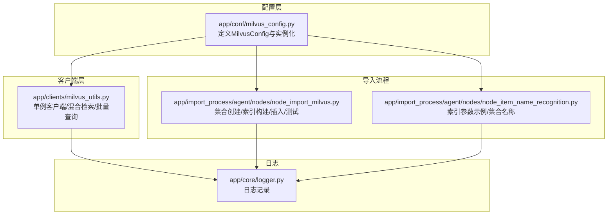
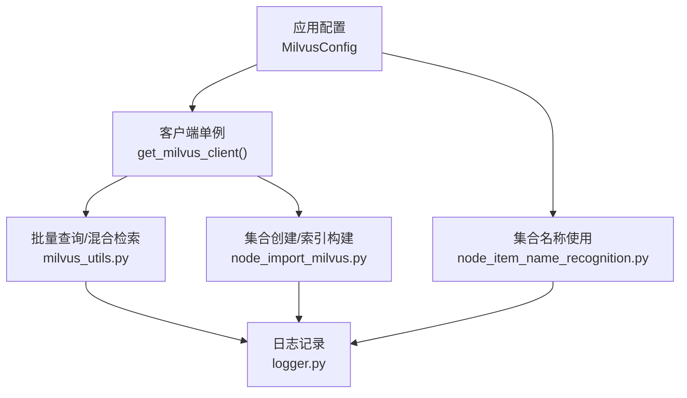
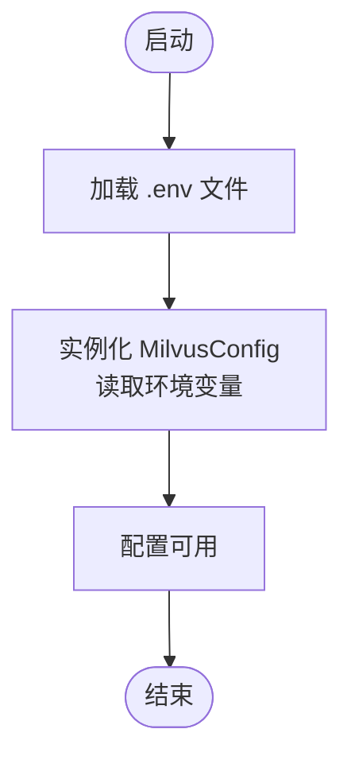
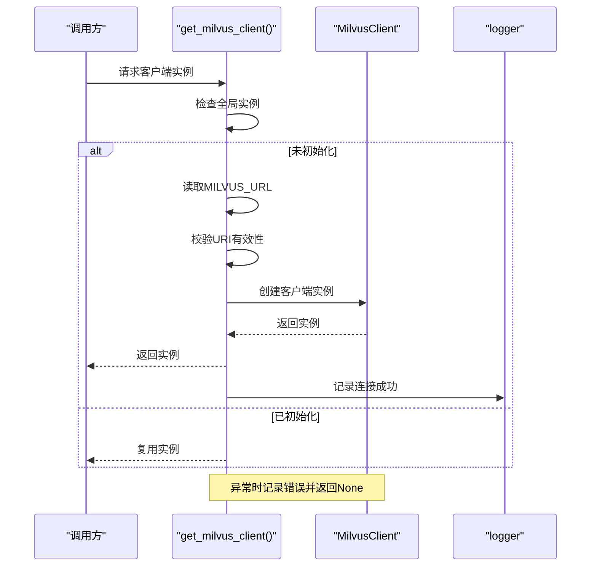
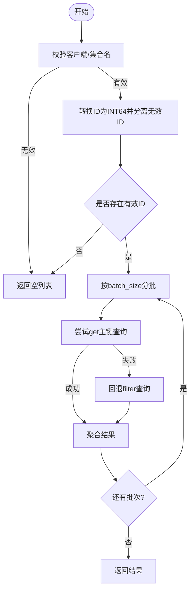
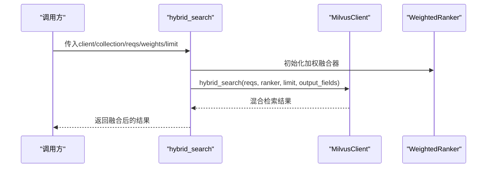
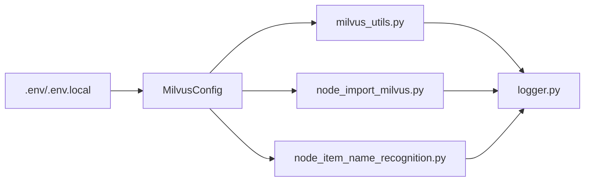

# 向量数据库配置

<cite>
**本文引用的文件**
- [milvus_config.py](file://app/conf/milvus_config.py)
- [milvus_utils.py](file://app/clients/milvus_utils.py)
- [node_import_milvus.py](file://app/import_process/agent/nodes/node_import_milvus.py)
- [node_item_name_recognition.py](file://app/import_process/agent/nodes/node_item_name_recognition.py)
- [logger.py](file://app/core/logger.py)
</cite>

## 目录
1. [简介](#简介)
2. [项目结构](#项目结构)
3. [核心组件](#核心组件)
4. [架构总览](#架构总览)
5. [详细组件分析](#详细组件分析)
6. [依赖分析](#依赖分析)
7. [性能考量](#性能考量)
8. [故障排查指南](#故障排查指南)
9. [结论](#结论)
10. [附录](#附录)

## 简介
本文件面向向量数据库（Milvus）的配置与使用，聚焦以下主题：
- 连接配置：地址、端口、数据库名称、集合名称等参数来源与约定
- 连接池与重连：单例客户端、异常处理与重试策略
- 超时与重试：当前实现与建议实践
- 向量索引参数：HNSW、稀疏倒排索引等参数说明与调优要点
- 查询性能优化：混合检索、评分归一化、返回字段裁剪
- 部署模式差异：单机版与分布式部署的配置差异与注意事项
- 连接测试与故障诊断：本地测试脚本与常见问题定位

## 项目结构
围绕 Milvus 的配置与使用，相关文件分布如下：
- 配置层：集中于配置类与环境变量加载
- 客户端层：封装 Milvus 客户端的单例与常用操作
- 导入流程：集合创建、索引构建、数据插入与幂等清理
- 日志层：统一的日志记录，便于问题定位



**图表来源**
- [milvus_config.py:12-26](file://app/conf/milvus_config.py#L12-L26)
- [milvus_utils.py:1-31](file://app/clients/milvus_utils.py#L1-L31)
- [node_import_milvus.py:14-78](file://app/import_process/agent/nodes/node_import_milvus.py#L14-L78)
- [node_item_name_recognition.py:207-223](file://app/import_process/agent/nodes/node_item_name_recognition.py#L207-L223)
- [logger.py](file://app/core/logger.py)

**章节来源**
- [milvus_config.py:1-26](file://app/conf/milvus_config.py#L1-L26)
- [milvus_utils.py:1-31](file://app/clients/milvus_utils.py#L1-L31)
- [node_import_milvus.py:14-78](file://app/import_process/agent/nodes/node_import_milvus.py#L14-L78)
- [node_item_name_recognition.py:207-223](file://app/import_process/agent/nodes/node_item_name_recognition.py#L207-L223)

## 核心组件
- MilvusConfig：集中管理 Milvus 连接地址与集合名称等配置项，来源于环境变量
- Milvus 客户端单例：避免重复创建连接，提供 get_milvus_client 获取实例
- 批量查询与回退策略：优先主键 get，失败回退 query
- 混合检索：稠密/稀疏向量分别检索并加权融合
- 集合创建与索引构建：HNSW、稀疏倒排索引等参数配置

**章节来源**
- [milvus_config.py:12-26](file://app/conf/milvus_config.py#L12-L26)
- [milvus_utils.py:10-31](file://app/clients/milvus_utils.py#L10-L31)
- [milvus_utils.py:52-114](file://app/clients/milvus_utils.py#L52-L114)
- [milvus_utils.py:117-156](file://app/clients/milvus_utils.py#L117-L156)
- [milvus_utils.py:158-198](file://app/clients/milvus_utils.py#L158-L198)
- [node_import_milvus.py:52-71](file://app/import_process/agent/nodes/node_import_milvus.py#L52-L71)
- [node_item_name_recognition.py:207-223](file://app/import_process/agent/nodes/node_item_name_recognition.py#L207-L223)

## 架构总览
下图展示 Milvus 配置、客户端与导入流程之间的交互关系。



**图表来源**
- [milvus_config.py:12-26](file://app/conf/milvus_config.py#L12-L26)
- [milvus_utils.py:10-31](file://app/clients/milvus_utils.py#L10-L31)
- [node_import_milvus.py:14-78](file://app/import_process/agent/nodes/node_import_milvus.py#L14-L78)
- [node_item_name_recognition.py:207-223](file://app/import_process/agent/nodes/node_item_name_recognition.py#L207-L223)
- [logger.py](file://app/core/logger.py)

## 详细组件分析

### 连接配置与环境变量
- 连接地址与集合名称均来自环境变量，通过配置类实例化后被客户端与导入流程共享
- 关键环境变量：
  - MILVUS_URL：Milvus 服务端连接地址（支持 URI 格式）
  - CHUNKS_COLLECTION：存储切片的集合名称
  - ENTITY_NAME_COLLECTION：预留集合名称
  - ITEM_NAME_COLLECTION：存储文档对应实体类的集合名称



**图表来源**
- [milvus_config.py:6-7](file://app/conf/milvus_config.py#L6-L7)
- [milvus_config.py:21-26](file://app/conf/milvus_config.py#L21-L26)

**章节来源**
- [milvus_config.py:12-26](file://app/conf/milvus_config.py#L12-L26)

### 客户端单例与连接生命周期
- 单例模式：首次调用时创建 MilvusClient 实例，后续复用
- 异常处理：连接失败或异常时记录错误日志并返回 None
- 回退策略：批量查询优先使用主键 get，失败回退到 filter 查询



**图表来源**
- [milvus_utils.py:10-31](file://app/clients/milvus_utils.py#L10-L31)

**章节来源**
- [milvus_utils.py:10-31](file://app/clients/milvus_utils.py#L10-L31)

### 批量查询与回退策略
- 输入：集合名、chunk_id 列表、输出字段、批次大小
- 步骤：
  1) 将 ID 转换为 INT64 类型并分离无效 ID
  2) 分批查询：优先 get，失败回退 query
  3) 结果聚合并返回



**图表来源**
- [milvus_utils.py:52-114](file://app/clients/milvus_utils.py#L52-L114)

**章节来源**
- [milvus_utils.py:52-114](file://app/clients/milvus_utils.py#L52-L114)

### 混合检索与评分融合
- 支持稠密/稀疏向量分别检索，使用 AnnSearchRequest 构建请求
- 使用 WeightedRanker 对两路结果进行加权融合，支持评分归一化
- 可配置返回字段与最终返回数量



**图表来源**
- [milvus_utils.py:117-156](file://app/clients/milvus_utils.py#L117-L156)
- [milvus_utils.py:158-198](file://app/clients/milvus_utils.py#L158-L198)

**章节来源**
- [milvus_utils.py:117-156](file://app/clients/milvus_utils.py#L117-L156)
- [milvus_utils.py:158-198](file://app/clients/milvus_utils.py#L158-L198)

### 集合创建与索引参数
- 稠密向量索引：HNSW，metric_type=COSINE，关键参数 M 与 efConstruction
- 稀疏向量索引：稀疏倒排索引，metric_type=IP，支持高效稀疏检索
- 参数建议参考注释中的经验范围，结合数据规模调整

```mermaid
classDiagram
class IndexParams {
+add_index(field_name, index_type, metric_type, params)
}
class DenseIndex {
+field_name : "dense_vector"
+index_type : "HNSW"
+metric_type : "COSINE"
+params : "{M, efConstruction}"
}
class SparseIndex {
+field_name : "sparse_vector"
+index_type : "SPARSE_INVERTED_INDEX"
+metric_type : "IP"
+params : "{inverted_index_algo}"
}
IndexParams --> DenseIndex : "添加稠密索引"
IndexParams --> SparseIndex : "添加稀疏索引"
```

**图表来源**
- [node_import_milvus.py:52-71](file://app/import_process/agent/nodes/node_import_milvus.py#L52-L71)
- [node_item_name_recognition.py:207-223](file://app/import_process/agent/nodes/node_item_name_recognition.py#L207-L223)

**章节来源**
- [node_import_milvus.py:52-71](file://app/import_process/agent/nodes/node_import_milvus.py#L52-L71)
- [node_item_name_recognition.py:207-223](file://app/import_process/agent/nodes/node_item_name_recognition.py#L207-L223)

### 部署模式差异（单机版与分布式）
- 单机版（standalone）：通常以单节点运行，适合开发与小规模测试
- 分布式（cluster）：多节点部署，具备更高的吞吐与可用性
- 配置差异要点：
  - 地址格式：单机版可能为本地地址，分布式需使用集群入口地址
  - 网络延迟：分布式环境下应适当增大超时阈值
  - 连接稳定性：分布式更易受网络波动影响，建议在客户端层做好异常处理与重试策略
- 本仓库未提供针对不同部署模式的差异化配置文件，实际部署时请依据 Milvus 官方文档与集群拓扑进行配置

[本节为通用指导，不直接分析具体文件，故无“章节来源”]

## 依赖分析
- 配置依赖：MilvusConfig 依赖环境变量与 .env 文件
- 客户端依赖：milvus_utils 依赖 MilvusConfig 与日志模块
- 导入流程依赖：node_import_milvus 与 node_item_name_recognition 依赖 MilvusConfig 与 Milvus 客户端



**图表来源**
- [milvus_config.py:6-7](file://app/conf/milvus_config.py#L6-L7)
- [milvus_config.py:21-26](file://app/conf/milvus_config.py#L21-L26)
- [milvus_utils.py:1-4](file://app/clients/milvus_utils.py#L1-L4)
- [node_import_milvus.py:14-18](file://app/import_process/agent/nodes/node_import_milvus.py#L14-L18)
- [node_item_name_recognition.py](file://app/import_process/agent/nodes/node_item_name_recognition.py#L338)

**章节来源**
- [milvus_config.py:6-7](file://app/conf/milvus_config.py#L6-L7)
- [milvus_config.py:21-26](file://app/conf/milvus_config.py#L21-L26)
- [milvus_utils.py:1-4](file://app/clients/milvus_utils.py#L1-L4)
- [node_import_milvus.py:14-18](file://app/import_process/agent/nodes/node_import_milvus.py#L14-L18)
- [node_item_name_recognition.py](file://app/import_process/agent/nodes/node_item_name_recognition.py#L338)

## 性能考量
- 连接复用：通过单例客户端减少连接开销
- 查询路径优化：优先主键 get，失败回退 filter，降低过滤成本
- 混合检索：合理设置权重与评分归一化，提升召回质量
- 索引参数：根据数据规模选择合适的 M 与 efConstruction，平衡构建时延与查询性能
- 返回字段裁剪：仅返回必要字段，减少网络与解析开销

[本节提供一般性建议，不直接分析具体文件，故无“章节来源”]

## 故障排查指南
- 连接失败
  - 检查 MILVUS_URL 是否正确配置
  - 查看日志中连接异常信息
- 查询异常
  - 批量查询时检查 chunk_id 类型转换与无效 ID
  - 观察 get 回退到 query 的日志提示
- 混合检索失败
  - 确认稠密/稀疏向量字段与索引一致
  - 检查权重与评分归一化设置
- 导入流程问题
  - 使用内置测试逻辑验证集合名称与连接状态
  - 幂等清理与加载集合确保数据一致性

**章节来源**
- [milvus_utils.py:22-24](file://app/clients/milvus_utils.py#L22-L24)
- [milvus_utils.py:102-103](file://app/clients/milvus_utils.py#L102-L103)
- [node_import_milvus.py:196-210](file://app/import_process/agent/nodes/node_import_milvus.py#L196-L210)

## 结论
本项目对 Milvus 的配置采用集中式环境变量管理，客户端层通过单例模式实现连接复用，并提供了批量查询与混合检索能力。索引参数在导入流程中明确配置，便于按需调优。建议在生产环境中结合部署模式完善超时与重试策略，并持续监控日志以快速定位问题。

[本节为总结性内容，不直接分析具体文件，故无“章节来源”]

## 附录

### 环境变量清单
- MILVUS_URL：Milvus 服务端连接地址
- CHUNKS_COLLECTION：切片集合名称
- ENTITY_NAME_COLLECTION：实体名称集合名称（预留）
- ITEM_NAME_COLLECTION：文档实体类集合名称

**章节来源**
- [milvus_config.py:21-26](file://app/conf/milvus_config.py#L21-L26)

### 连接测试与验证
- 导入节点测试：构造测试数据并执行导入流程，验证 chunk_id 生成与集合写入
- 连接检查：当缺失必要环境变量时打印提示信息

**章节来源**
- [node_import_milvus.py:165-210](file://app/import_process/agent/nodes/node_import_milvus.py#L165-L210)