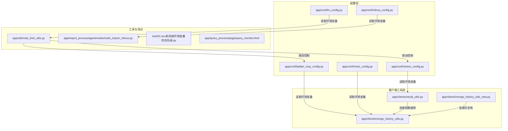
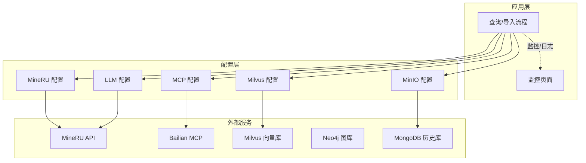
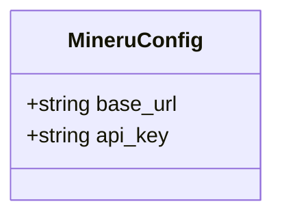
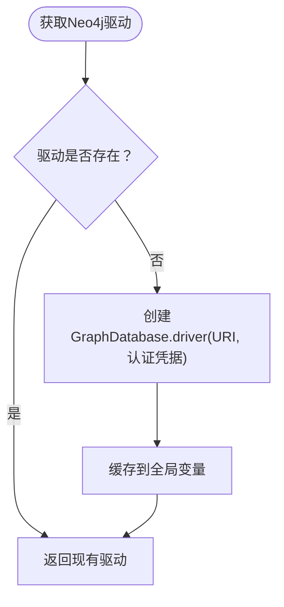
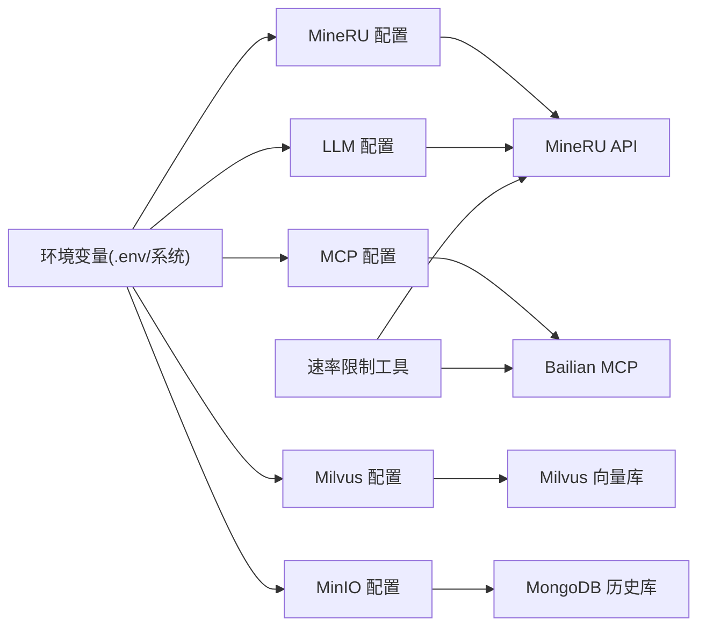

# 外部服务配置

<cite>
**本文引用的文件**
- [app/conf/mineru_config.py](file://app/conf/mineru_config.py)
- [app/conf/bailian_mcp_config.py](file://app/conf/bailian_mcp_config.py)
- [app/clients/neo4j_utils.py](file://app/clients/neo4j_utils.py)
- [app/clients/mongo_history_utils.py](file://app/clients/mongo_history_utils.py)
- [app/clients/mongo_history_utils_new.py](file://app/clients/mongo_history_utils_new.py)
- [app/conf/milvus_config.py](file://app/conf/milvus_config.py)
- [app/conf/lm_config.py](file://app/conf/lm_config.py)
- [app/conf/minio_config.py](file://app/conf/minio_config.py)
- [app/utils/rate_limit_utils.py](file://app/utils/rate_limit_utils.py)
- [app/import_process/agent/nodes/node_import_milvus.py](file://app/import_process/agent/nodes/node_import_milvus.py)
- [test/01-env和系统环境变量的优先级.py](file://test/01-env和系统环境变量的优先级.py)
- [app/query_process/page/query_monitor.html](file://app/query_process/page/query_monitor.html)
</cite>

## 目录
1. [简介](#简介)
2. [项目结构](#项目结构)
3. [核心组件](#核心组件)
4. [架构总览](#架构总览)
5. [详细组件分析](#详细组件分析)
6. [依赖分析](#依赖分析)
7. [性能考虑](#性能考虑)
8. [故障排查指南](#故障排查指南)
9. [结论](#结论)
10. [附录](#附录)

## 简介
本文件面向外部服务配置的综合文档，聚焦以下四类外部系统的配置与使用要点：
- MineRU API：提供基础URL与API密钥的配置方式
- Bailian MCP：提供基础URL与API密钥的配置方式
- Neo4j 图数据库：提供连接URI、用户名与密码的配置方式
- MongoDB 历史管理：提供连接URL与数据库名的配置方式，并内置单例连接与索引优化

文档还涵盖认证机制、连接参数、超时设置现状、服务发现与负载均衡建议、可用性监控与故障转移策略、配置验证与连接测试方法，以及多服务协同的最佳实践。

## 项目结构
与外部服务配置相关的关键文件分布如下：
- 配置类：位于 app/conf 下，集中定义各外部服务的配置项
- 客户端工具：位于 app/clients 下，封装连接与常用操作
- 速率限制工具：位于 app/utils，提供通用滑动窗口限流
- 导入流程测试：位于 app/import_process/agent/nodes，包含Milvus连接测试示例
- 环境变量优先级测试：位于 test，演示 .env 与系统环境变量的优先级
- 查询监控页面：位于 app/query_process/page，展示查询侧监控指标

图表来源
- [app/conf/mineru_config.py:1-20](file://app/conf/mineru_config.py#L1-L20)
- [app/conf/bailian_mcp_config.py:1-19](file://app/conf/bailian_mcp_config.py#L1-L19)
- [app/conf/milvus_config.py:1-26](file://app/conf/milvus_config.py#L1-L26)
- [app/conf/lm_config.py:1-26](file://app/conf/lm_config.py#L1-L26)
- [app/conf/minio_config.py:1-29](file://app/conf/minio_config.py#L1-L29)
- [app/clients/neo4j_utils.py:1-12](file://app/clients/neo4j_utils.py#L1-L12)
- [app/clients/mongo_history_utils.py:1-242](file://app/clients/mongo_history_utils.py#L1-L242)
- [app/clients/mongo_history_utils_new.py:1-248](file://app/clients/mongo_history_utils_new.py#L1-L248)
- [app/utils/rate_limit_utils.py:1-37](file://app/utils/rate_limit_utils.py#L1-L37)
- [app/import_process/agent/nodes/node_import_milvus.py:198-213](file://app/import_process/agent/nodes/node_import_milvus.py#L198-L213)
- [test/01-env和系统环境变量的优先级.py:1-18](file://test/01-env和系统环境变量的优先级.py#L1-L18)
- [app/query_process/page/query_monitor.html:1-142](file://app/query_process/page/query_monitor.html#L1-L142)

章节来源
- [app/conf/mineru_config.py:1-20](file://app/conf/mineru_config.py#L1-L20)
- [app/conf/bailian_mcp_config.py:1-19](file://app/conf/bailian_mcp_config.py#L1-L19)
- [app/clients/neo4j_utils.py:1-12](file://app/clients/neo4j_utils.py#L1-L12)
- [app/clients/mongo_history_utils.py:1-242](file://app/clients/mongo_history_utils.py#L1-L242)
- [app/clients/mongo_history_utils_new.py:1-248](file://app/clients/mongo_history_utils_new.py#L1-L248)
- [app/conf/milvus_config.py:1-26](file://app/conf/milvus_config.py#L1-L26)
- [app/conf/lm_config.py:1-26](file://app/conf/lm_config.py#L1-L26)
- [app/conf/minio_config.py:1-29](file://app/conf/minio_config.py#L1-L29)
- [app/utils/rate_limit_utils.py:1-37](file://app/utils/rate_limit_utils.py#L1-L37)
- [app/import_process/agent/nodes/node_import_milvus.py:198-213](file://app/import_process/agent/nodes/node_import_milvus.py#L198-L213)
- [test/01-env和系统环境变量的优先级.py:1-18](file://test/01-env和系统环境变量的优先级.py#L1-L18)
- [app/query_process/page/query_monitor.html:1-142](file://app/query_process/page/query_monitor.html#L1-L142)

## 核心组件
- MineRU API 配置：通过数据类封装基础URL与API令牌，从环境变量读取
- Bailian MCP 配置：通过数据类封装基础URL与API密钥，从环境变量读取
- Neo4j 图数据库：通过驱动工厂函数获取驱动实例，从环境变量读取URI、用户名与密码
- MongoDB 历史管理：通过单例工具类封装连接、集合与索引，从环境变量读取连接URL与数据库名；提供清空、保存、更新、查询等操作

章节来源
- [app/conf/mineru_config.py:11-20](file://app/conf/mineru_config.py#L11-L20)
- [app/conf/bailian_mcp_config.py:9-18](file://app/conf/bailian_mcp_config.py#L9-L18)
- [app/clients/neo4j_utils.py:4-12](file://app/clients/neo4j_utils.py#L4-L12)
- [app/clients/mongo_history_utils.py:21-83](file://app/clients/mongo_history_utils.py#L21-L83)

## 架构总览
下图展示了外部服务配置在系统中的位置与交互关系：

图表来源
- [app/conf/mineru_config.py:11-20](file://app/conf/mineru_config.py#L11-L20)
- [app/conf/bailian_mcp_config.py:9-18](file://app/conf/bailian_mcp_config.py#L9-L18)
- [app/conf/milvus_config.py:12-26](file://app/conf/milvus_config.py#L12-L26)
- [app/conf/lm_config.py:11-26](file://app/conf/lm_config.py#L11-L26)
- [app/conf/minio_config.py:10-29](file://app/conf/minio_config.py#L10-L29)
- [app/query_process/page/query_monitor.html:1-142](file://app/query_process/page/query_monitor.html#L1-L142)

## 详细组件分析

### MineRU API 配置
- 配置项
  - 基础URL：用于指向MineRU API的接入地址
  - API令牌：用于API鉴权
- 认证机制
  - 使用API令牌进行请求头注入（具体注入位置由调用方实现）
- 连接参数
  - 通过环境变量读取，未在配置类中显式设置超时参数
- 超时设置
  - 当前未在配置类中体现超时参数；如需超时控制，请在HTTP客户端处补充

图表来源
- [app/conf/mineru_config.py:11-20](file://app/conf/mineru_config.py#L11-L20)

章节来源
- [app/conf/mineru_config.py:11-20](file://app/conf/mineru_config.py#L11-L20)

### Bailian MCP 配置
- 配置项
  - 基础URL：用于指向Bailian MCP服务的基础地址
  - API密钥：用于服务鉴权
- 认证机制
  - 使用API密钥进行请求头注入（具体注入位置由调用方实现）
- 连接参数
  - 通过环境变量读取，未在配置类中显式设置超时参数
- 超时设置
  - 当前未在配置类中体现超时参数；如需超时控制，请在HTTP客户端处补充

图表来源
- [app/conf/bailian_mcp_config.py:9-18](file://app/conf/bailian_mcp_config.py#L9-L18)

章节来源
- [app/conf/bailian_mcp_config.py:9-18](file://app/conf/bailian_mcp_config.py#L9-L18)

### Neo4j 图数据库配置
- 连接参数
  - URI：图数据库连接地址
  - 用户名与密码：用于认证
- 认证机制
  - 使用用户名/密码进行认证
- 超时设置
  - 当前未在驱动初始化中显式设置超时参数；如需超时控制，请在驱动初始化处补充
- 单例与懒加载
  - 驱动采用全局单例，避免重复创建连接

图表来源
- [app/clients/neo4j_utils.py:4-12](file://app/clients/neo4j_utils.py#L4-L12)

章节来源
- [app/clients/neo4j_utils.py:4-12](file://app/clients/neo4j_utils.py#L4-L12)

### MongoDB 历史管理配置
- 连接参数
  - 连接URL：MongoDB连接串
  - 数据库名：目标数据库名称
- 认证机制
  - 通过连接URL或驱动初始化时的凭据进行认证（具体取决于部署形态）
- 超时设置
  - 当前未在驱动初始化中显式设置超时参数；如需超时控制，请在驱动初始化处补充
- 单例与索引
  - 采用单例模式，模块加载时尝试预创建实例；若失败则保留懒加载兜底
  - 在集合上创建复合索引以优化“按会话查询最新记录”的场景
- 核心操作
  - 清空历史、保存消息、批量更新关联商品、查询最近消息

图表来源
- [app/clients/mongo_history_utils.py:21-83](file://app/clients/mongo_history_utils.py#L21-L83)
- [app/clients/mongo_history_utils.py:87-221](file://app/clients/mongo_history_utils.py#L87-L221)

章节来源
- [app/clients/mongo_history_utils.py:21-83](file://app/clients/mongo_history_utils.py#L21-L83)
- [app/clients/mongo_history_utils.py:87-221](file://app/clients/mongo_history_utils.py#L87-L221)

### 配置验证与连接测试
- 环境变量优先级
  - 默认行为：系统环境变量优先于 .env 文件中的同名变量
  - 如需 .env 覆盖系统变量，需显式传入覆盖标志
- Milvus 连接测试
  - 在导入流程节点中提供了连接测试示例：校验必要环境变量是否存在，并断言生成的分片ID有效
- MongoDB 连接测试
  - 工具类在模块加载阶段尝试初始化单例实例；若失败仅记录警告日志，保留懒加载兜底

章节来源
- [test/01-env和系统环境变量的优先级.py:1-18](file://test/01-env和系统环境变量的优先级.py#L1-L18)
- [app/import_process/agent/nodes/node_import_milvus.py:198-213](file://app/import_process/agent/nodes/node_import_milvus.py#L198-L213)
- [app/clients/mongo_history_utils.py:64-83](file://app/clients/mongo_history_utils.py#L64-L83)

## 依赖分析
- 配置类依赖
  - 均通过数据类封装，从环境变量读取配置
- 客户端工具依赖
  - Neo4j 与MongoDB工具均依赖环境变量提供连接参数
- 速率限制工具
  - 通用滑动窗口限流器，可用于控制对外部服务的请求频率

图表来源
- [app/conf/mineru_config.py:11-20](file://app/conf/mineru_config.py#L11-L20)
- [app/conf/bailian_mcp_config.py:9-18](file://app/conf/bailian_mcp_config.py#L9-L18)
- [app/conf/milvus_config.py:12-26](file://app/conf/milvus_config.py#L12-L26)
- [app/conf/lm_config.py:11-26](file://app/conf/lm_config.py#L11-L26)
- [app/conf/minio_config.py:10-29](file://app/conf/minio_config.py#L10-L29)
- [app/utils/rate_limit_utils.py:1-37](file://app/utils/rate_limit_utils.py#L1-L37)

章节来源
- [app/conf/mineru_config.py:11-20](file://app/conf/mineru_config.py#L11-L20)
- [app/conf/bailian_mcp_config.py:9-18](file://app/conf/bailian_mcp_config.py#L9-L18)
- [app/conf/milvus_config.py:12-26](file://app/conf/milvus_config.py#L12-L26)
- [app/conf/lm_config.py:11-26](file://app/conf/lm_config.py#L11-L26)
- [app/conf/minio_config.py:10-29](file://app/conf/minio_config.py#L10-L29)
- [app/utils/rate_limit_utils.py:1-37](file://app/utils/rate_limit_utils.py#L1-L37)

## 性能考虑
- 连接池与单例
  - Neo4j与MongoDB工具均采用单例模式，减少重复连接带来的资源消耗
- 索引优化
  - MongoDB历史集合创建复合索引，优化“按会话查询最新记录”的查询性能
- 速率限制
  - 使用滑动窗口限流器控制对外部服务的请求频率，避免触发第三方限流

章节来源
- [app/clients/neo4j_utils.py:4-12](file://app/clients/neo4j_utils.py#L4-L12)
- [app/clients/mongo_history_utils.py:45-49](file://app/clients/mongo_history_utils.py#L45-L49)
- [app/utils/rate_limit_utils.py:7-37](file://app/utils/rate_limit_utils.py#L7-L37)

## 故障排查指南
- 环境变量优先级
  - 系统环境变量默认优先于 .env 中的同名变量；如需 .env 覆盖，请显式启用覆盖标志
- MongoDB 初始化失败
  - 模块加载阶段失败仅记录警告日志，可通过懒加载兜底；建议检查连接URL与数据库名
- Milvus 连接测试
  - 导入流程节点提供测试步骤：校验必要环境变量与生成的分片ID有效性
- 查询监控
  - 监控页面提供查询摘要与明细，便于观察成功率、延迟与状态变化

章节来源
- [test/01-env和系统环境变量的优先级.py:1-18](file://test/01-env和系统环境变量的优先级.py#L1-L18)
- [app/clients/mongo_history_utils.py:64-83](file://app/clients/mongo_history_utils.py#L64-L83)
- [app/import_process/agent/nodes/node_import_milvus.py:198-213](file://app/import_process/agent/nodes/node_import_milvus.py#L198-L213)
- [app/query_process/page/query_monitor.html:87-139](file://app/query_process/page/query_monitor.html#L87-L139)

## 结论
- 配置层通过数据类与环境变量实现了清晰的外部服务参数管理
- 客户端工具层提供了单例连接与常用操作封装，提升了稳定性与可维护性
- 速率限制工具为多服务协同提供了统一的流量控制手段
- 建议在HTTP客户端层补充超时参数，并结合监控页面持续观测服务表现

## 附录
- 多服务协同最佳实践
  - 统一使用环境变量管理参数，明确 .env 与系统变量的优先级策略
  - 在HTTP客户端层统一注入鉴权头与超时设置
  - 对外部服务调用增加滑动窗口限流，避免触发第三方限流
  - 通过监控页面持续观测查询成功率与延迟，及时发现异常