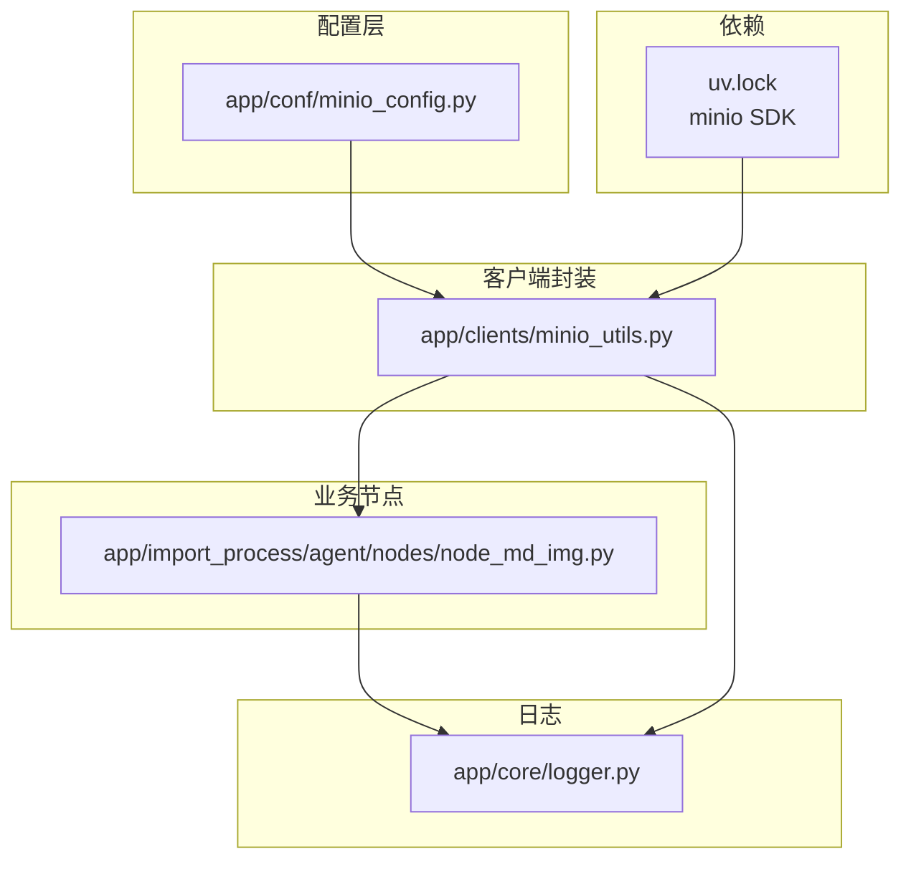
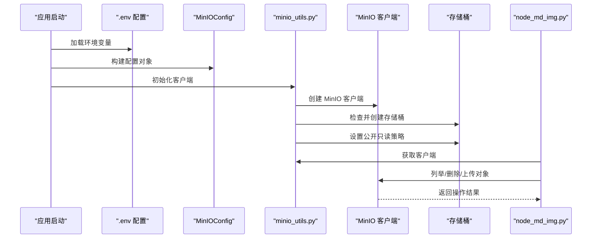
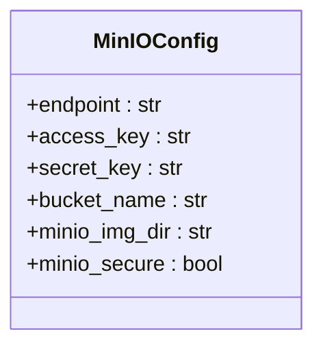
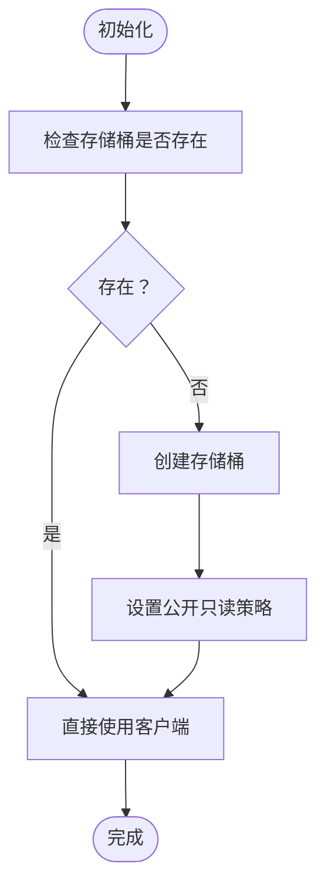
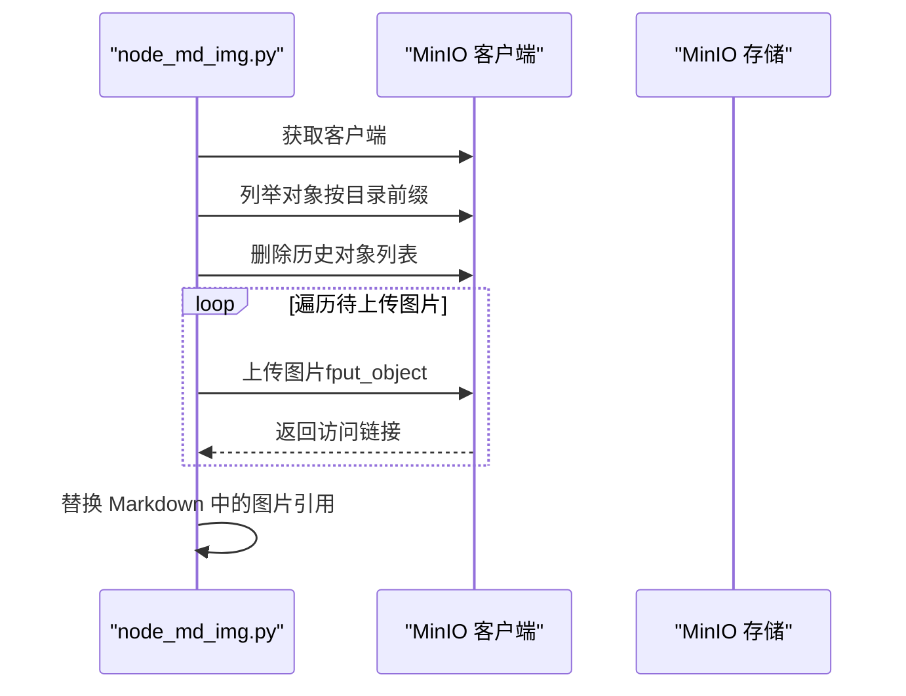
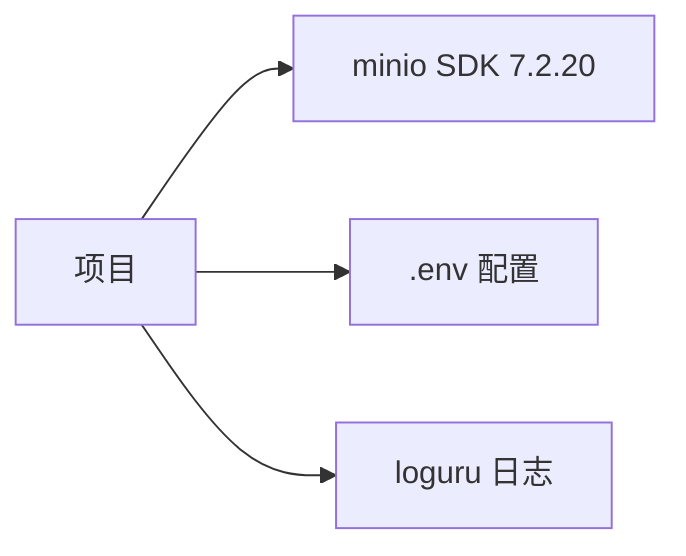

# 对象存储配置

<cite>
**本文档引用的文件**
- [minio_config.py](file://app/conf/minio_config.py)
- [minio_utils.py](file://app/clients/minio_utils.py)
- [node_md_img.py](file://app/import_process/agent/nodes/node_md_img.py)
- [logger.py](file://app/core/logger.py)
- [uv.lock](file://uv.lock)
</cite>

## 目录
1. [简介](#简介)
2. [项目结构](#项目结构)
3. [核心组件](#核心组件)
4. [架构概览](#架构概览)
5. [详细组件分析](#详细组件分析)
6. [依赖分析](#依赖分析)
7. [性能考虑](#性能考虑)
8. [故障排查指南](#故障排查指南)
9. [结论](#结论)

## 简介
本文件面向对象存储配置，聚焦于 MinIO 对象存储在项目中的配置与使用实践。内容涵盖：
- MinIO 配置参数详解（端点、访问密钥、秘密密钥、安全连接、存储桶、图片目录等）
- 存储桶管理与权限控制
- 文件上传下载流程与图片处理链路
- 不同部署形态（云/本地）的配置差异与注意事项
- 连接测试与数据完整性验证方法

## 项目结构
与 MinIO 相关的关键文件分布如下：
- 配置层：app/conf/minio_config.py
- 客户端封装：app/clients/minio_utils.py
- 图片处理与上传：app/import_process/agent/nodes/node_md_img.py
- 日志工具：app/core/logger.py
- 依赖声明：uv.lock（包含 minio Python SDK）

**图表来源**
- [minio_config.py:1-29](file://app/conf/minio_config.py#L1-L29)
- [minio_utils.py:1-43](file://app/clients/minio_utils.py#L1-L43)
- [node_md_img.py:1-281](file://app/import_process/agent/nodes/node_md_img.py#L1-L281)
- [logger.py:1-109](file://app/core/logger.py#L1-L109)
- [uv.lock:1900-1914](file://uv.lock#L1900-L1914)

**章节来源**
- [minio_config.py:1-29](file://app/conf/minio_config.py#L1-L29)
- [minio_utils.py:1-43](file://app/clients/minio_utils.py#L1-L43)
- [node_md_img.py:1-281](file://app/import_process/agent/nodes/node_md_img.py#L1-L281)
- [logger.py:1-109](file://app/core/logger.py#L1-L109)
- [uv.lock:1900-1914](file://uv.lock#L1900-L1914)

## 核心组件
- MinIO 配置类：集中管理 MinIO 服务端点、凭证、默认存储桶、图片目录与安全标志位。
- MinIO 客户端封装：负责创建客户端实例、自动创建存储桶、设置公开只读策略，并提供获取客户端的工厂方法。
- 图片处理节点：实现 Markdown 中图片的识别、删除旧对象、上传新对象、生成访问链接与替换内容的完整流程。
- 日志工具：统一的日志输出与格式化，便于问题定位与审计。

**章节来源**
- [minio_config.py:10-29](file://app/conf/minio_config.py#L10-L29)
- [minio_utils.py:13-43](file://app/clients/minio_utils.py#L13-L43)
- [node_md_img.py:219-281](file://app/import_process/agent/nodes/node_md_img.py#L219-L281)
- [logger.py:46-83](file://app/core/logger.py#L46-L83)

## 架构概览
整体交互流程：应用启动时加载 .env 并构建 MinIOConfig；随后通过 minio_utils.py 初始化 MinIO 客户端，必要时创建存储桶并设置策略；业务节点在需要时获取客户端执行上传/删除/列举等操作。

**图表来源**
- [minio_config.py:22-29](file://app/conf/minio_config.py#L22-L29)
- [minio_utils.py:13-43](file://app/clients/minio_utils.py#L13-L43)
- [node_md_img.py:229-265](file://app/import_process/agent/nodes/node_md_img.py#L229-L265)

## 详细组件分析

### MinIO 配置类（MinIOConfig）
- 字段说明
  - endpoint：MinIO 服务地址（包含协议与端口）
  - access_key：访问密钥
  - secret_key：秘密密钥
  - bucket_name：默认存储桶名称
  - minio_img_dir：图片存放目录前缀
  - minio_secure：是否启用 HTTPS（布尔值）
- 数据来源：通过 python-dotenv 从 .env 文件读取并绑定到配置对象
- 关键行为：布尔型 secure 字段通过字符串比较转换为布尔值

**图表来源**
- [minio_config.py:11-18](file://app/conf/minio_config.py#L11-L18)

**章节来源**
- [minio_config.py:10-29](file://app/conf/minio_config.py#L10-L29)

### MinIO 客户端封装（minio_utils.py）
- 客户端初始化
  - 使用 endpoint、access_key、secret_key 构造 MinIO 客户端
  - secure 参数用于控制 HTTP/HTTPS，默认为 False（HTTP）
- 存储桶管理
  - 若存储桶不存在则创建
  - 设置公开只读策略：允许匿名用户对桶内对象执行 GetObject 操作
- 客户端获取
  - 提供 get_minio_client 工厂方法以供其他模块使用

**图表来源**
- [minio_utils.py:27-40](file://app/clients/minio_utils.py#L27-L40)

**章节来源**
- [minio_utils.py:13-43](file://app/clients/minio_utils.py#L13-L43)

### 图片处理与上传（node_md_img.py）
- 功能概述
  - 清理指定 stem 下的历史图片对象
  - 上传当前 Markdown 中使用的图片到 MinIO
  - 生成可访问的图片链接并替换 Markdown 内容中的图片引用
- 关键流程
  - 获取 MinIO 客户端
  - 列举并删除历史对象
  - 逐个上传图片并记录访问链接
  - 汇总结果并替换 Markdown 中的图片引用

**图表来源**
- [node_md_img.py:229-274](file://app/import_process/agent/nodes/node_md_img.py#L229-L274)

**章节来源**
- [node_md_img.py:219-281](file://app/import_process/agent/nodes/node_md_img.py#L219-L281)

### 日志工具（logger.py）
- 功能要点
  - 基于 loguru 实现，支持控制台与文件双输出
  - 通过 .env 控制输出开关、级别与保留策略
  - 自动定位业务模块真实调用位置，便于问题定位
- 在 MinIO 相关模块中的作用
  - 记录客户端初始化、存储桶创建、对象上传/删除等关键事件
  - 错误与异常统一记录，便于排障

**章节来源**
- [logger.py:46-83](file://app/core/logger.py#L46-L83)

## 依赖分析
- MinIO 官方 Python SDK
  - 项目通过 uv.lock 明确依赖 minio==7.2.20
  - 该版本包含必要的依赖（如 urllib3、pycryptodome 等），确保 HTTPS 与加密功能正常
- 环境变量加载
  - 通过 python-dotenv 在配置类中提前加载 .env，保证后续读取的配置值有效

**图表来源**
- [uv.lock:1900-1914](file://uv.lock#L1900-L1914)
- [minio_config.py:6-7](file://app/conf/minio_config.py#L6-L7)

**章节来源**
- [uv.lock:1900-1914](file://uv.lock#L1900-L1914)
- [minio_config.py:6-7](file://app/conf/minio_config.py#L6-L7)

## 性能考虑
- 传输安全与性能权衡
  - secure=False 默认使用 HTTP，简化部署但牺牲安全性；生产环境建议改为 HTTPS（secure=True）
  - HTTPS 会增加 CPU 开销，需结合带宽与并发量评估
- 存储桶策略
  - 公开只读策略适用于静态资源访问场景，减少鉴权开销
  - 若需更细粒度控制，可调整策略或采用签名 URL
- 上传策略
  - 大文件建议分片上传（需根据 SDK 支持情况扩展）
  - 合理设置并发与超时，避免阻塞主线程
- 缓存与 CDN
  - 对热点图片可配合 CDN 加速访问
- 日志级别
  - 生产环境建议提升日志级别，降低 IO 压力

## 故障排查指南
- 连接失败
  - 检查 endpoint 是否可达，端口是否开放
  - 确认 access_key 与 secret_key 正确性
  - 如使用 HTTPS，确认证书有效且客户端信任
- 权限不足
  - 确认存储桶策略允许 GetObject
  - 检查用户/租户权限范围
- 存储桶不存在
  - 确认初始化逻辑已执行
  - 检查 region 与存储桶命名规范
- 上传失败
  - 查看日志中上传异常的具体原因
  - 确认对象名与目录前缀拼接正确
- 数据完整性
  - 上传后可通过列出对象并比对数量与前缀确认
  - 可对关键对象生成校验和并在客户端侧验证

**章节来源**
- [minio_utils.py:27-40](file://app/clients/minio_utils.py#L27-L40)
- [node_md_img.py:242-265](file://app/import_process/agent/nodes/node_md_img.py#L242-L265)
- [logger.py:46-83](file://app/core/logger.py#L46-L83)

## 结论
本项目对 MinIO 的配置与使用遵循“配置集中、客户端封装、业务解耦”的设计原则。通过 .env 驱动的配置类与客户端封装，实现了存储桶的自动创建与公开只读策略设置；业务节点专注于图片处理与上传替换，形成清晰的职责边界。生产环境中建议启用 HTTPS、细化权限策略并引入缓存与监控，以获得更高的安全性与稳定性。