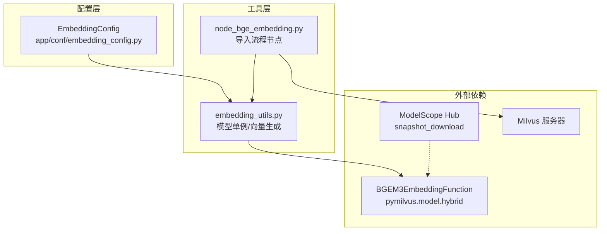
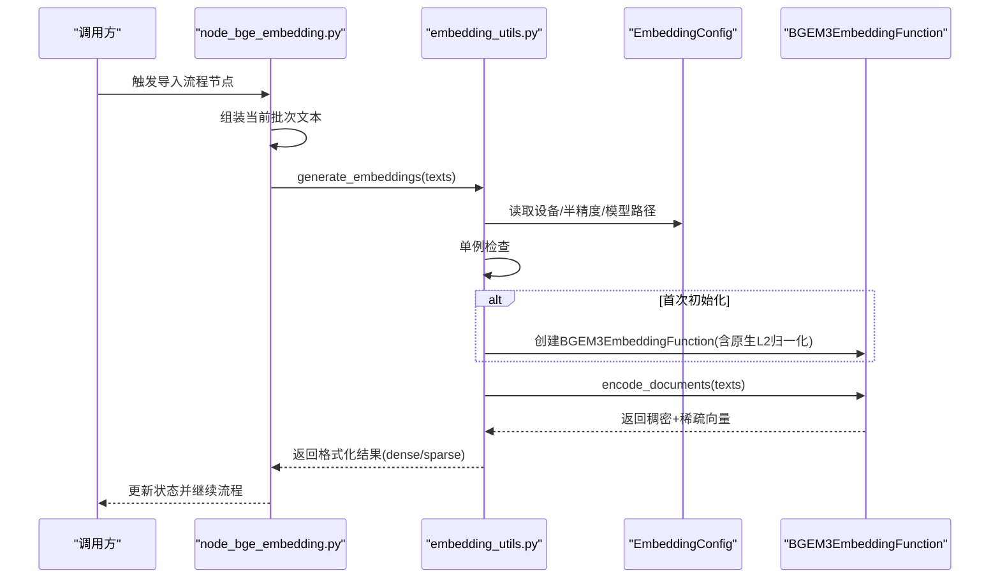
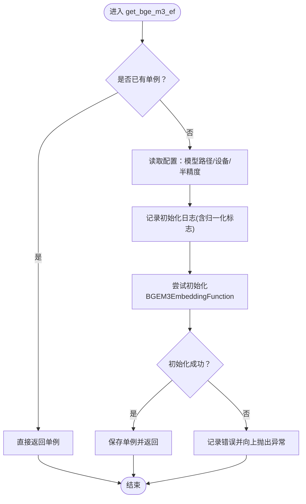
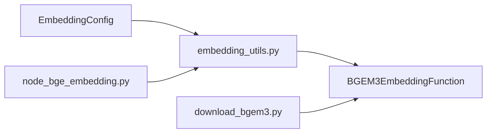

# 嵌入模型配置

<cite>
**本文档引用的文件**
- [embedding_config.py](file://app/conf/embedding_config.py)
- [embedding_utils.py](file://app/lm/embedding_utils.py)
- [node_bge_embedding.py](file://app/import_process/agent/nodes/node_bge_embedding.py)
- [download_bgem3.py](file://app/tool/download_bgem3.py)
- [milvus_config.py](file://app/conf/milvus_config.py)
- [03-cuda测试.py](file://test/03-cuda测试.py)
</cite>

## 目录
1. [简介](#简介)
2. [项目结构](#项目结构)
3. [核心组件](#核心组件)
4. [架构总览](#架构总览)
5. [详细组件分析](#详细组件分析)
6. [依赖关系分析](#依赖关系分析)
7. [性能考虑](#性能考虑)
8. [故障排除指南](#故障排除指南)
9. [结论](#结论)

## 简介
本文件面向嵌入模型配置，聚焦于BGE-M3混合向量（稠密+稀疏）嵌入的配置与使用。文档涵盖以下主题：
- BGE-M3嵌入模型的关键配置参数：模型路径、设备选择、半精度开关等
- 向量维度、归一化策略与Milvus检索适配
- 模型加载机制、单例缓存与内存管理
- 不同硬件环境（CPU/GPU）的最佳实践
- 模型验证与常见问题排查

## 项目结构
与嵌入模型配置相关的核心文件分布如下：
- 配置层：app/conf/embedding_config.py 定义BGE-M3相关配置项
- 工具层：app/lm/embedding_utils.py 提供模型单例、向量生成与格式适配
- 流程节点：app/import_process/agent/nodes/node_bge_embedding.py 将向量注入导入流程
- 模型下载：app/tool/download_bgem3.py 提供离线/本地模型下载示例
- Milvus配置：app/conf/milvus_config.py 与向量检索相关联
- 环境检测：test/03-cuda测试.py 用于验证CUDA可用性

图表来源
- [embedding_config.py:1-24](file://app/conf/embedding_config.py#L1-L24)
- [embedding_utils.py:1-108](file://app/lm/embedding_utils.py#L1-L108)
- [node_bge_embedding.py:1-84](file://app/import_process/agent/nodes/node_bge_embedding.py#L1-L84)
- [download_bgem3.py:1-5](file://app/tool/download_bgem3.py#L1-L5)
- [milvus_config.py:1-26](file://app/conf/milvus_config.py#L1-L26)

章节来源
- [embedding_config.py:1-24](file://app/conf/embedding_config.py#L1-L24)
- [embedding_utils.py:1-108](file://app/lm/embedding_utils.py#L1-L108)
- [node_bge_embedding.py:1-84](file://app/import_process/agent/nodes/node_bge_embedding.py#L1-L84)
- [download_bgem3.py:1-5](file://app/tool/download_bgem3.py#L1-L5)
- [milvus_config.py:1-26](file://app/conf/milvus_config.py#L1-L26)

## 核心组件
- 配置对象 EmbeddingConfig：封装模型路径、仓库标识、设备、半精度等关键参数，并通过环境变量加载
- 模型单例 get_bge_m3_ef：延迟初始化BGEM3EmbeddingFunction，启用原生L2归一化，适配Milvus内积检索
- 向量生成 generate_embeddings：对文本列表生成混合向量，返回稠密嵌套列表与稀疏字典列表
- 导入流程节点 node_bge_embedding：在导入阶段按批处理生成向量并写回状态
- 模型下载工具 download_bgem3.py：提供本地/离线模型下载示例

章节来源
- [embedding_config.py:9-24](file://app/conf/embedding_config.py#L9-L24)
- [embedding_utils.py:8-48](file://app/lm/embedding_utils.py#L8-L48)
- [embedding_utils.py:51-96](file://app/lm/embedding_utils.py#L51-L96)
- [node_bge_embedding.py:10-84](file://app/import_process/agent/nodes/node_bge_embedding.py#L10-L84)
- [download_bgem3.py:1-5](file://app/tool/download_bgem3.py#L1-L5)

## 架构总览
BGE-M3嵌入配置与使用遵循“配置驱动 + 单例懒加载 + 批处理”的架构模式：
- 配置层通过环境变量读取参数，形成EmbeddingConfig实例
- 工具层在首次调用时创建BGEM3EmbeddingFunction单例，开启原生L2归一化
- 流程节点按固定批大小对文本进行向量化，将结果写入导入状态
- Milvus配置与向量检索相关联，确保向量格式与检索策略一致

图表来源
- [node_bge_embedding.py:50-77](file://app/import_process/agent/nodes/node_bge_embedding.py#L50-L77)
- [embedding_utils.py:8-48](file://app/lm/embedding_utils.py#L8-L48)
- [embedding_utils.py:51-96](file://app/lm/embedding_utils.py#L51-L96)
- [embedding_config.py:18-24](file://app/conf/embedding_config.py#L18-L24)

## 详细组件分析

### 配置参数详解
- 模型路径 bge_m3_path
  - 作用：指定本地模型目录或可访问的模型路径；若为空则使用默认仓库标识
  - 默认行为：未设置时使用远程仓库标识，首次使用时自动下载
- 仓库标识 bge_m3
  - 作用：远程仓库标识（如模型仓库名称），用于自动下载
- 设备选择 bge_device
  - 可选值：CPU或GPU设备名（如cuda:0）
  - 默认值：CPU
- 半精度开关 bge_fp16
  - 作用：是否启用半精度以降低显存占用、提升推理速度
  - 默认值：关闭

章节来源
- [embedding_config.py:11-24](file://app/conf/embedding_config.py#L11-L24)

### 模型加载机制与缓存策略
- 单例模式
  - 首次调用时创建BGEM3EmbeddingFunction实例，后续调用直接复用，避免重复加载
- 原生归一化
  - 启用normalize_embeddings=True，使稠密与稀疏向量均被L2归一化，适配Milvus内积检索
- 自动下载与本地路径
  - 若未提供本地路径，将使用远程仓库标识自动下载；也可通过工具脚本预下载至本地目录

图表来源
- [embedding_utils.py:8-48](file://app/lm/embedding_utils.py#L8-L48)

章节来源
- [embedding_utils.py:5-48](file://app/lm/embedding_utils.py#L5-L48)

### 向量生成与格式适配
- 输入输出
  - 输入：文本列表（单文本也需封装为列表）
  - 输出：包含键 dense 与 sparse 的字典
    - dense：嵌套列表，每条文本对应一个稠密向量
    - sparse：字典列表，每个元素为“特征索引: 权重”的映射
- 类型与序列化适配
  - 稀疏索引与权重分别转换为Python原生类型，确保可哈希与JSON序列化
- 异常处理
  - 对空列表/非列表输入进行校验，异常向上抛出，便于调用方重试或降级

章节来源
- [embedding_utils.py:51-96](file://app/lm/embedding_utils.py#L51-L96)

### 导入流程中的批处理
- 批大小 batch_size
  - 固定为5，按批次对文本进行向量化
- 文本构造
  - 将 item_name 与 content 组合为统一文本，保证核心词前置
- 结果写回
  - 将 dense_vector 与 sparse_vector 写入最终状态，供后续写入Milvus使用

章节来源
- [node_bge_embedding.py:53-77](file://app/import_process/agent/nodes/node_bge_embedding.py#L53-L77)

### 模型下载与本地化
- 工具脚本提供基于ModelScope的snapshot_download示例
- 可指定cache_dir以控制模型下载位置

章节来源
- [download_bgem3.py:1-5](file://app/tool/download_bgem3.py#L1-L5)

## 依赖关系分析
- 外部依赖
  - BGEM3EmbeddingFunction：来自pymilvus.model.hybrid，负责混合向量编码
  - ModelScope Hub：用于远程模型下载
- 内部依赖
  - embedding_config 提供配置
  - embedding_utils 依赖配置并创建模型单例
  - node_bge_embedding 依赖工具函数进行向量生成

图表来源
- [embedding_config.py:18-24](file://app/conf/embedding_config.py#L18-L24)
- [embedding_utils.py:1-4](file://app/lm/embedding_utils.py#L1-L4)
- [node_bge_embedding.py:6](file://app/import_process/agent/nodes/node_bge_embedding.py#L6)
- [download_bgem3.py:1-5](file://app/tool/download_bgem3.py#L1-L5)

章节来源
- [embedding_config.py:18-24](file://app/conf/embedding_config.py#L18-L24)
- [embedding_utils.py:1-4](file://app/lm/embedding_utils.py#L1-L4)
- [node_bge_embedding.py:6](file://app/import_process/agent/nodes/node_bge_embedding.py#L6)
- [download_bgem3.py:1-5](file://app/tool/download_bgem3.py#L1-L5)

## 性能考虑
- 设备选择
  - GPU（如cuda:0）可显著提升吞吐，建议在具备CUDA能力的环境中启用
  - CPU适合小规模或低资源环境，但吞吐较低
- 半精度（fp16）
  - 在支持的设备上启用可减少显存占用并提升速度
- 批处理大小
  - 当前固定为5，可根据上下文窗口与显存情况调整
- 单例缓存
  - 避免重复初始化，减少冷启动开销，提高批量处理效率
- 归一化与检索
  - 原生L2归一化使内积（IP）等价于余弦相似度，有利于Milvus检索性能

章节来源
- [embedding_config.py:14-15](file://app/conf/embedding_config.py#L14-L15)
- [embedding_utils.py:21-23](file://app/lm/embedding_utils.py#L21-L23)
- [embedding_utils.py:101-104](file://app/lm/embedding_utils.py#L101-L104)
- [node_bge_embedding.py:53](file://app/import_process/agent/nodes/node_bge_embedding.py#L53)

## 故障排除指南
- CUDA可用性验证
  - 使用测试脚本确认PyTorch与CUDA状态
- 模型初始化失败
  - 检查设备名称与半精度设置是否匹配硬件能力
  - 确认网络可达或本地模型路径正确
- 向量生成异常
  - 确认输入为非空列表
  - 查看日志中“生成向量入参不合法”提示
- Milvus检索不匹配
  - 确认使用了原生L2归一化的向量
  - 检查Milvus集合字段与向量类型匹配

章节来源
- [03-cuda测试.py:1-8](file://test/03-cuda测试.py#L1-L8)
- [embedding_utils.py:46-48](file://app/lm/embedding_utils.py#L46-L48)
- [embedding_utils.py:59-61](file://app/lm/embedding_utils.py#L59-L61)
- [embedding_utils.py:36-43](file://app/lm/embedding_utils.py#L36-L43)

## 结论
本配置体系围绕BGE-M3混合向量嵌入提供了清晰的参数化入口与稳健的运行机制：
- 通过EmbeddingConfig集中管理关键参数，结合环境变量实现灵活部署
- 采用单例与原生归一化策略，兼顾性能与检索适配
- 在导入流程中以固定批大小进行高效向量化，便于后续Milvus入库
- 提供模型下载与CUDA验证工具，辅助本地化与硬件验证