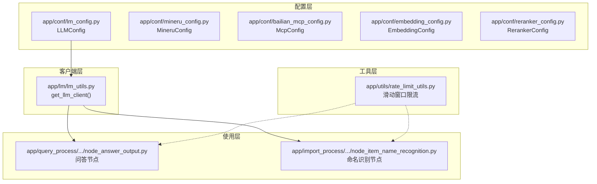
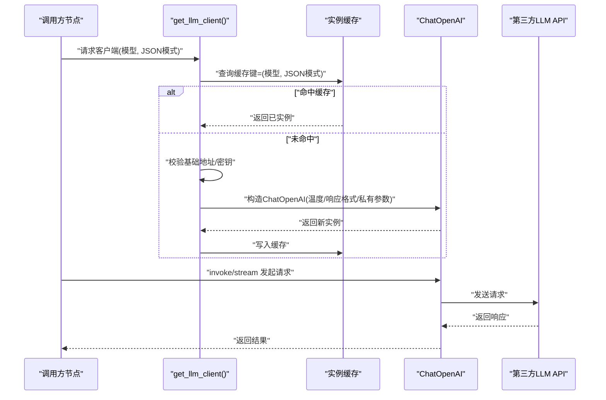
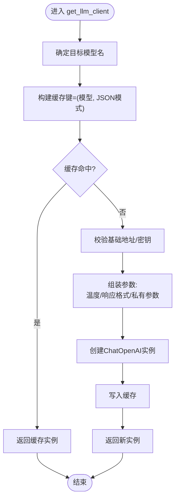
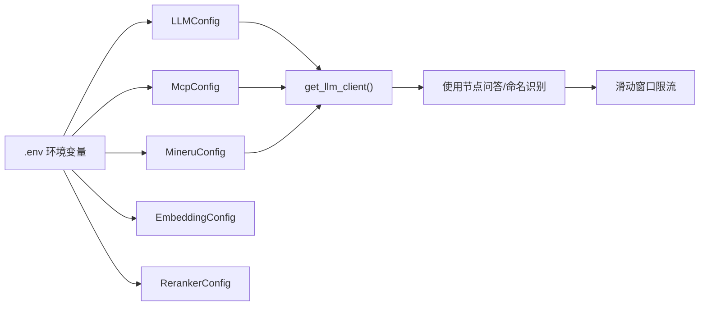

# 语言模型配置

<cite>
**本文引用的文件**
- [app/conf/lm_config.py](file://app/conf/lm_config.py)
- [app/conf/mineru_config.py](file://app/conf/mineru_config.py)
- [app/conf/bailian_mcp_config.py](file://app/conf/bailian_mcp_config.py)
- [app/conf/embedding_config.py](file://app/conf/embedding_config.py)
- [app/conf/reranker_config.py](file://app/conf/reranker_config.py)
- [app/lm/lm_utils.py](file://app/lm/lm_utils.py)
- [app/query_process/agent/nodes/node_answer_output.py](file://app/query_process/agent/nodes/node_answer_output.py)
- [app/import_process/agent/nodes/node_item_name_recognition.py](file://app/import_process/agent/nodes/node_item_name_recognition.py)
- [app/utils/rate_limit_utils.py](file://app/utils/rate_limit_utils.py)
</cite>

## 目录
1. [简介](#简介)
2. [项目结构](#项目结构)
3. [核心组件](#核心组件)
4. [架构总览](#架构总览)
5. [详细组件分析](#详细组件分析)
6. [依赖分析](#依赖分析)
7. [性能考量](#性能考量)
8. [故障排查指南](#故障排查指南)
9. [结论](#结论)
10. [附录](#附录)

## 简介
本文件面向语言模型（LLM）配置与使用，聚焦以下主题：
- 模型提供商选择与API适配
- API密钥与基础地址管理
- 请求参数调优（温度、响应格式等）
- 不同提供商配置差异与迁移方法
- 性能优化与资源限制
- 可用性检查与降级策略

本项目采用统一的LLM客户端工厂与配置加载机制，支持OpenAI兼容API（如千问、即梦等），并通过环境变量集中管理密钥与基础地址。

## 项目结构
围绕LLM配置与使用的相关文件组织如下：
- 配置层：集中于 app/conf，包含LLM、向量检索、重排序等配置对象
- 客户端层：app/lm/lm_utils.py 提供统一的LLM客户端工厂
- 使用层：多个Agent节点通过 get_llm_client 获取客户端并发起调用
- 限流工具：app/utils/rate_limit_utils.py 提供滑动窗口限流

图表来源
- [app/conf/lm_config.py:1-27](file://app/conf/lm_config.py#L1-L27)
- [app/conf/mineru_config.py:1-20](file://app/conf/mineru_config.py#L1-L20)
- [app/conf/bailian_mcp_config.py:1-19](file://app/conf/bailian_mcp_config.py#L1-L19)
- [app/conf/embedding_config.py:1-24](file://app/conf/embedding_config.py#L1-L24)
- [app/conf/reranker_config.py:1-21](file://app/conf/reranker_config.py#L1-L21)
- [app/lm/lm_utils.py:1-99](file://app/lm/lm_utils.py#L1-L99)
- [app/query_process/agent/nodes/node_answer_output.py:105-135](file://app/query_process/agent/nodes/node_answer_output.py#L105-L135)
- [app/import_process/agent/nodes/node_item_name_recognition.py:120-137](file://app/import_process/agent/nodes/node_item_name_recognition.py#L120-L137)
- [app/utils/rate_limit_utils.py:1-37](file://app/utils/rate_limit_utils.py#L1-L37)

章节来源
- [app/conf/lm_config.py:1-27](file://app/conf/lm_config.py#L1-L27)
- [app/lm/lm_utils.py:1-99](file://app/lm/lm_utils.py#L1-L99)

## 核心组件
- LLMConfig：统一加载并暴露LLM所需的关键配置项，包括基础地址、API密钥、默认模型、默认温度等
- MineruConfig：提供MinerU服务的基础地址与令牌
- McpConfig：提供DashScope MCP（如通义万相）的流式基础地址与API密钥
- EmbeddingConfig/RerankerConfig：分别承载本地嵌入与重排序模型的路径、设备与精度等配置
- get_llm_client：基于LangChain ChatOpenAI的客户端工厂，负责实例缓存、参数组装与异常包装

章节来源
- [app/conf/lm_config.py:11-26](file://app/conf/lm_config.py#L11-L26)
- [app/conf/mineru_config.py:11-20](file://app/conf/mineru_config.py#L11-L20)
- [app/conf/bailian_mcp_config.py:9-18](file://app/conf/bailian_mcp_config.py#L9-L18)
- [app/conf/embedding_config.py:9-24](file://app/conf/embedding_config.py#L9-L24)
- [app/conf/reranker_config.py:9-21](file://app/conf/reranker_config.py#L9-L21)
- [app/lm/lm_utils.py:12-73](file://app/lm/lm_utils.py#L12-L73)

## 架构总览
LLM调用链路由“配置加载 → 客户端工厂 → LangChain ChatOpenAI → 第三方API”构成；客户端工厂支持：
- 模型名优先级：调用参数 > 配置文件 > 默认模型
- JSON输出模式：通过 response_format 强制返回结构化JSON
- 国产模型私有参数透传：如启用/禁用思考链等
- 全局缓存：按(模型名, JSON模式)键复用实例，降低初始化开销

图表来源
- [app/lm/lm_utils.py:17-73](file://app/lm/lm_utils.py#L17-L73)
- [app/query_process/agent/nodes/node_answer_output.py:112-134](file://app/query_process/agent/nodes/node_answer_output.py#L112-L134)

## 详细组件分析

### LLM配置对象（LLMConfig）
- 职责：集中加载OPENAI_BASE_URL、OPENAI_API_KEY、VL_MODEL、LLM_DEFAULT_MODEL、LLM_DEFAULT_TEMPERATURE等环境变量，形成统一的LLM配置入口
- 关键点：
  - OPENAI_BASE_URL：适配OpenAI或国产兼容API的基础地址
  - OPENAI_API_KEY：API密钥
  - LLM_DEFAULT_MODEL：默认模型名
  - LLM_DEFAULT_TEMPERATURE：默认采样温度
- 使用方式：客户端工厂通过 lm_config 读取上述字段

章节来源
- [app/conf/lm_config.py:11-26](file://app/conf/lm_config.py#L11-L26)

### 客户端工厂（get_llm_client）
- 职责：按需创建并缓存ChatOpenAI实例，统一对接OpenAI兼容API
- 核心行为：
  - 模型名优先级：model 参数 > 配置文件默认 > 内置默认模型
  - JSON模式：当 json_mode=True 时，设置 response_format 为 json_object
  - 国产模型私有参数：extra_body 透传（例如禁用思考链）
  - 温度：temperature=默认温度或0.1（低温度保证确定性）
  - 异常处理：对LangChain层异常进行包装并抛出友好错误
  - 缓存：_llm_client_cache 按(模型名, JSON模式)键缓存实例
- 错误处理：
  - 缺少API密钥或基础地址时，立即抛出明确异常
  - LangChain初始化失败时，包装为更易诊断的异常

图表来源
- [app/lm/lm_utils.py:17-73](file://app/lm/lm_utils.py#L17-L73)

章节来源
- [app/lm/lm_utils.py:12-73](file://app/lm/lm_utils.py#L12-L73)

### 使用示例（问答节点与命名识别节点）
- 问答节点：通过 get_llm_client 获取模型，支持流式与非流式两种调用路径
- 命名识别节点：同样通过 get_llm_client 获取模型，构造System/Human消息并调用

章节来源
- [app/query_process/agent/nodes/node_answer_output.py:112-134](file://app/query_process/agent/nodes/node_answer_output.py#L112-L134)
- [app/import_process/agent/nodes/node_item_name_recognition.py:124-131](file://app/import_process/agent/nodes/node_item_name_recognition.py#L124-L131)

### 其他相关配置
- MineruConfig：提供MinerU服务的基础地址与令牌，便于对接不同推理后端
- McpConfig：提供DashScope MCP（如通义万相）的流式基础地址与API密钥
- EmbeddingConfig/RerankerConfig：本地嵌入与重排序模型的路径、设备与半精度开关等

章节来源
- [app/conf/mineru_config.py:11-20](file://app/conf/mineru_config.py#L11-L20)
- [app/conf/bailian_mcp_config.py:9-18](file://app/conf/bailian_mcp_config.py#L9-L18)
- [app/conf/embedding_config.py:9-24](file://app/conf/embedding_config.py#L9-L24)
- [app/conf/reranker_config.py:9-21](file://app/conf/reranker_config.py#L9-L21)

## 依赖分析
- 配置到客户端：各配置对象（LLMConfig/McPConfig/MineruConfig/EmbeddingConfig/RerankerConfig）被客户端工厂或使用节点间接依赖
- 客户端到LangChain：get_llm_client 依赖 LangChain ChatOpenAI
- 使用节点到客户端：问答节点与命名识别节点通过 get_llm_client 调用LLM
- 限流工具：使用节点可结合滑动窗口限流工具控制请求频率

图表来源
- [app/conf/lm_config.py:20-26](file://app/conf/lm_config.py#L20-L26)
- [app/conf/mineru_config.py:17-20](file://app/conf/mineru_config.py#L17-L20)
- [app/conf/bailian_mcp_config.py:15-18](file://app/conf/bailian_mcp_config.py#L15-L18)
- [app/lm/lm_utils.py:9,16](file://app/lm/lm_utils.py#L9,L16)
- [app/utils/rate_limit_utils.py:7-37](file://app/utils/rate_limit_utils.py#L7-L37)

章节来源
- [app/conf/lm_config.py:20-26](file://app/conf/lm_config.py#L20-L26)
- [app/lm/lm_utils.py:9,16](file://app/lm/lm_utils.py#L9,L16)
- [app/utils/rate_limit_utils.py:7-37](file://app/utils/rate_limit_utils.py#L7-L37)

## 性能考量
- 客户端缓存：按(模型名, JSON模式)键缓存实例，避免重复初始化，显著降低延迟与资源占用
- 温度设置：默认温度较低（0.1）以提升输出稳定性；高温度会增大不确定性与资源消耗
- JSON模式：开启 response_format=json_object 可简化结构化解析，但可能影响生成速度
- 设备与精度：EmbeddingConfig/RerankerConfig 支持设备与半精度开关，合理配置可平衡性能与精度
- 限流策略：结合滑动窗口限流工具，控制单位时间请求数，避免触发第三方API限流

章节来源
- [app/lm/lm_utils.py:12-14](file://app/lm/lm_utils.py#L12-L14)
- [app/lm/lm_utils.py:60](file://app/lm/lm_utils.py#L60)
- [app/lm/lm_utils.py:51-54](file://app/lm/lm_utils.py#L51-L54)
- [app/conf/embedding_config.py:18-24](file://app/conf/embedding_config.py#L18-L24)
- [app/conf/reranker_config.py:16-21](file://app/conf/reranker_config.py#L16-L21)
- [app/utils/rate_limit_utils.py:7-37](file://app/utils/rate_limit_utils.py#L7-L37)

## 故障排查指南
- 配置缺失
  - 现象：初始化客户端时报错，提示缺少API密钥或基础地址
  - 处理：检查 .env 中 OPENAI_API_KEY 与 OPENAI_BASE_URL 是否正确配置
- LangChain初始化失败
  - 现象：客户端创建阶段抛出异常
  - 处理：确认基础地址与密钥有效，检查网络连通性与第三方服务状态
- 输出格式问题
  - 现象：期望结构化JSON但返回非JSON
  - 处理：调用时开启 json_mode=True，确保响应格式为 json_object
- 限流导致阻塞
  - 现象：请求被阻塞等待
  - 处理：调整滑动窗口参数或降低并发，避免超过第三方API配额

章节来源
- [app/lm/lm_utils.py:40-43](file://app/lm/lm_utils.py#L40-L43)
- [app/lm/lm_utils.py:66-67](file://app/lm/lm_utils.py#L66-L67)
- [app/lm/lm_utils.py:51-54](file://app/lm/lm_utils.py#L51-L54)
- [app/utils/rate_limit_utils.py:25-30](file://app/utils/rate_limit_utils.py#L25-L30)

## 结论
本项目的LLM配置与使用遵循“集中配置 + 工厂封装 + 缓存复用”的设计，既满足OpenAI兼容API的灵活接入，又兼顾国产模型的私有参数适配。通过合理的温度、响应格式与限流策略，可在保证质量的同时提升性能与稳定性。迁移至不同提供商时，主要调整基础地址与密钥，模型名与通用参数保持一致，即可实现平滑切换。

## 附录
- 环境变量清单（示例）
  - OPENAI_BASE_URL：LLM基础地址
  - OPENAI_API_KEY：LLM API密钥
  - VL_MODEL：多模态模型名
  - LLM_DEFAULT_MODEL：默认模型名
  - LLM_DEFAULT_TEMPERATURE：默认温度
  - MINERU_BASE_URL / MINERU_API_TOKEN：MinerU服务地址与令牌
  - MCP_DASHSCOPE_BASE_URL_STREAMABLE：MCP流式基础地址
  - BGE_*：本地嵌入与重排序模型相关路径、设备与精度开关

章节来源
- [app/conf/lm_config.py:20-26](file://app/conf/lm_config.py#L20-L26)
- [app/conf/mineru_config.py:17-20](file://app/conf/mineru_config.py#L17-L20)
- [app/conf/bailian_mcp_config.py:15-18](file://app/conf/bailian_mcp_config.py#L15-L18)
- [app/conf/embedding_config.py:18-24](file://app/conf/embedding_config.py#L18-L24)
- [app/conf/reranker_config.py:16-21](file://app/conf/reranker_config.py#L16-L21)