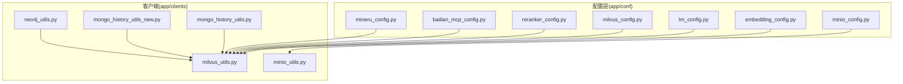
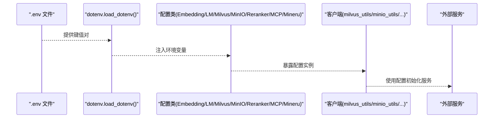
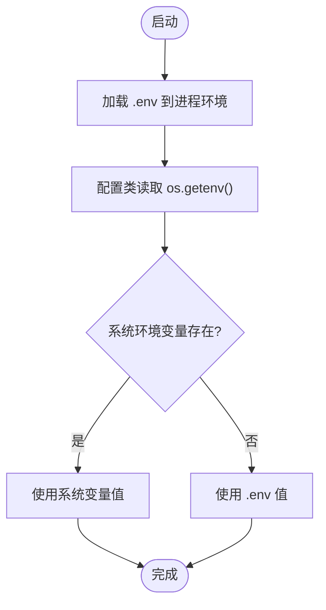
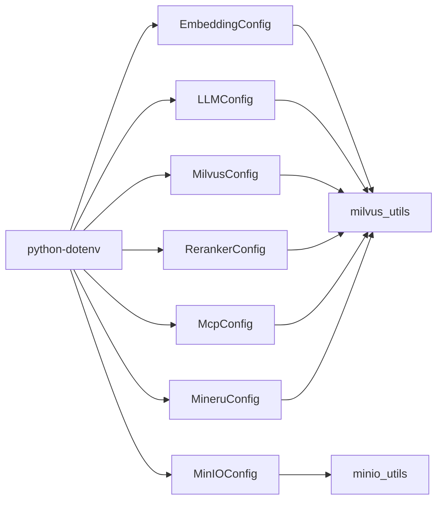

# 配置管理

<cite>
**本文引用的文件**
- [embedding_config.py](file://app/conf/embedding_config.py)
- [lm_config.py](file://app/conf/lm_config.py)
- [milvus_config.py](file://app/conf/milvus_config.py)
- [minio_config.py](file://app/conf/minio_config.py)
- [reranker_config.py](file://app/conf/reranker_config.py)
- [bailian_mcp_config.py](file://app/conf/bailian_mcp_config.py)
- [mineru_config.py](file://app/conf/mineru_config.py)
- [milvus_utils.py](file://app/clients/milvus_utils.py)
- [minio_utils.py](file://app/clients/minio_utils.py)
- [mongo_history_utils.py](file://app/clients/mongo_history_utils.py)
- [mongo_history_utils_new.py](file://app/clients/mongo_history_utils_new.py)
- [neo4j_utils.py](file://app/clients/neo4j_utils.py)
- [01-env和系统环境变量的优先级.py](file://test/01-env和系统环境变量的优先级.py)
- [pyproject.toml](file://pyproject.toml)
- [uv.lock](file://uv.lock)
</cite>

## 目录
1. [简介](#简介)
2. [项目结构](#项目结构)
3. [核心组件](#核心组件)
4. [架构总览](#架构总览)
5. [详细组件分析](#详细组件分析)
6. [依赖分析](#依赖分析)
7. [性能考虑](#性能考虑)
8. [故障排查指南](#故障排查指南)
9. [结论](#结论)
10. [附录](#附录)

## 简介
本文件系统性梳理 RAG Agent 的配置管理体系，覆盖配置文件层次与优先级、配置项定义与取值范围、热更新与运行时修改支持现状、外部服务配置最佳实践、配置验证与错误处理机制，以及配置迁移与版本兼容策略。目标是帮助开发者与运维人员快速理解并正确使用配置系统。

## 项目结构
配置系统采用“按功能域分层”的组织方式：
- app/conf：集中存放各子系统的配置类与默认值来源（环境变量）
- app/clients：各外部服务客户端通过导入配置类进行初始化
- test：包含环境变量优先级的验证脚本
- pyproject.toml / uv.lock：声明依赖与锁定版本

图示来源
- [milvus_utils.py:1-30](file://app/clients/milvus_utils.py#L1-L30)
- [minio_utils.py:1-30](file://app/clients/minio_utils.py#L1-L30)
- [mongo_history_utils.py:1-50](file://app/clients/mongo_history_utils.py#L1-L50)
- [mongo_history_utils_new.py:1-50](file://app/clients/mongo_history_utils_new.py#L1-L50)
- [neo4j_utils.py:1-20](file://app/clients/neo4j_utils.py#L1-L20)

章节来源
- [pyproject.toml:1-36](file://pyproject.toml#L1-L36)
- [uv.lock:1-200](file://uv.lock#L1-L200)

## 核心组件
- 配置类：以数据类封装配置项，构造函数直接从环境变量读取值；部分布尔值做了兼容处理（如 1/True/true/True 均视为 True）
- 环境变量加载：在每个配置文件顶部调用 dotenv.load_dotenv()，确保 os.getenv 能读取到 .env 中的键值
- 客户端集成：各外部服务客户端通过导入配置类完成初始化，形成“配置驱动服务”的模式

章节来源
- [embedding_config.py:1-24](file://app/conf/embedding_config.py#L1-L24)
- [lm_config.py:1-27](file://app/conf/lm_config.py#L1-L27)
- [milvus_config.py:1-26](file://app/conf/milvus_config.py#L1-L26)
- [minio_config.py:1-29](file://app/conf/minio_config.py#L1-L29)
- [reranker_config.py:1-21](file://app/conf/reranker_config.py#L1-L21)
- [bailian_mcp_config.py:1-19](file://app/conf/bailian_mcp_config.py#L1-L19)
- [mineru_config.py:1-20](file://app/conf/mineru_config.py#L1-L20)

## 架构总览
配置系统遵循“环境变量优先于默认值”的原则，通过 dotenv 在应用启动阶段一次性加载 .env，随后各配置类从环境变量中读取值。客户端模块仅依赖配置类，不直接接触 .env 文件，从而实现清晰的职责分离与可测试性。

图示来源
- [embedding_config.py:5-8](file://app/conf/embedding_config.py#L5-L8)
- [lm_config.py:5-8](file://app/conf/lm_config.py#L5-L8)
- [milvus_config.py:5-8](file://app/conf/milvus_config.py#L5-L8)
- [minio_config.py:5-8](file://app/conf/minio_config.py#L5-L8)
- [reranker_config.py:5-8](file://app/conf/reranker_config.py#L5-L8)
- [bailian_mcp_config.py:5-8](file://app/conf/bailian_mcp_config.py#L5-L8)
- [mineru_config.py:5-8](file://app/conf/mineru_config.py#L5-L8)

## 详细组件分析

### 环境变量与优先级机制
- 加载时机：每个配置文件在模块导入时调用 dotenv.load_dotenv()，确保 os.getenv 可读取 .env
- 优先级规则：默认使用 os.getenv 的行为，即系统环境变量覆盖 .env 中同名键（可通过传入 override=True 改变 .env 优先级）
- 测试验证：test/01-env和系统环境变量的优先级.py 展示了 override=False 时系统变量优先，override=True 时 .env 优先

图示来源
- [01-env和系统环境变量的优先级.py:1-18](file://test/01-env和系统环境变量的优先级.py#L1-L18)

章节来源
- [01-env和系统环境变量的优先级.py:1-18](file://test/01-env和系统环境变量的优先级.py#L1-L18)

### 各配置项与取值范围
以下为各配置类的关键字段与取值要点（基于配置类定义与客户端使用处的常见约定）：

- EmbeddingConfig（嵌入模型）
  - 字段：bge_m3_path（本地模型路径）、bge_m3（模型仓库标识）、bge_device（cuda:0/cpu）、bge_fp16（布尔）
  - 取值建议：bge_device 推荐 cuda:0（GPU可用时），bge_fp16 在 GPU 上可开启以节省显存
  - 来源：embedding_config.py

- LLMConfig（大模型服务）
  - 字段：base_url（服务地址）、api_key（鉴权密钥）、lv_model（视觉语言模型标识）、llm_model（默认模型名）、llm_temperature（采样温度）
  - 取值建议：llm_temperature 通常 0~1，越小越稳定，越大越发散
  - 来源：lm_config.py

- MilvusConfig（向量数据库）
  - 字段：milvus_url（服务地址）、chunks_collection（文档块集合）、entity_name_collection（预留实体名集合）、item_name_collection（实体名集合）
  - 取值建议：集合名需与导入流程一致，milvus_url 为可访问的 Milvus 地址
  - 来源：milvus_config.py

- MinIOConfig（对象存储）
  - 字段：endpoint（服务地址+端口）、access_key、secret_key、bucket_name（默认存储桶）、minio_img_dir（图片目录）、minio_secure（是否启用 HTTPS）
  - 取值建议：minio_secure 与 endpoint 协同（https 开头应为 True）
  - 来源：minio_config.py

- RerankerConfig（重排序模型）
  - 字段：bge_reranker_large（本地模型路径）、bge_reranker_device（设备）、bge_reranker_fp16（布尔）
  - 取值建议：与 EmbeddingConfig 类似，GPU 可开启 fp16
  - 来源：reranker_config.py

- McpConfig（MCP 服务）
  - 字段：mcp_base_url（服务地址）、api_key（鉴权密钥）
  - 取值建议：与上游服务一致的鉴权方式
  - 来源：bailian_mcp_config.py

- MineruConfig（Mineru 服务）
  - 字段：base_url（服务地址）、api_key（鉴权密钥）
  - 取值建议：与上游服务一致的鉴权方式
  - 来源：mineru_config.py

章节来源
- [embedding_config.py:10-24](file://app/conf/embedding_config.py#L10-L24)
- [lm_config.py:12-27](file://app/conf/lm_config.py#L12-L27)
- [milvus_config.py:13-26](file://app/conf/milvus_config.py#L13-L26)
- [minio_config.py:11-29](file://app/conf/minio_config.py#L11-L29)
- [reranker_config.py:9-21](file://app/conf/reranker_config.py#L9-L21)
- [bailian_mcp_config.py:10-19](file://app/conf/bailian_mcp_config.py#L10-L19)
- [mineru_config.py:12-20](file://app/conf/mineru_config.py#L12-L20)

### 外部服务配置最佳实践
- 向量数据库（Milvus）
  - 使用 MilvusConfig 初始化客户端，确保 milvus_url 可达且集合名与导入流程一致
  - 客户端使用示例：milvus_utils.py 通过导入 milvus_config 获取 milvus_url 并建立连接

- 对象存储（MinIO）
  - 使用 MinIOConfig 初始化客户端，endpoint 与 minio_secure 需匹配（http/https）
  - 客户端使用示例：minio_utils.py 通过导入 minio_config 获取 endpoint/access_key/secret_key/bucket_name

- 历史数据库（MongoDB）
  - mongo_history_utils.py 与 mongo_history_utils_new.py 通过 dotenv 加载 .env，再从 os.getenv 读取 MONGO_URL、MONGO_DB_NAME 等
  - 建议：将敏感信息放入 .env，避免硬编码

- 图数据库（Neo4j）
  - neo4j_utils.py 直接从 os.getenv 读取 NEO4J_URI、NEO4J_USERNAME、NEO4J_PASSWORD，建议同样放入 .env

章节来源
- [milvus_utils.py:1-30](file://app/clients/milvus_utils.py#L1-L30)
- [minio_utils.py:1-30](file://app/clients/minio_utils.py#L1-L30)
- [mongo_history_utils.py:1-50](file://app/clients/mongo_history_utils.py#L1-L50)
- [mongo_history_utils_new.py:1-50](file://app/clients/mongo_history_utils_new.py#L1-L50)
- [neo4j_utils.py:1-20](file://app/clients/neo4j_utils.py#L1-L20)

### 配置热更新与运行时修改
- 当前状态：各配置类在模块导入时一次性读取环境变量并实例化，未提供运行时动态刷新机制
- 建议方案：
  - 引入配置中心或监听 .env 文件变更后重建配置实例
  - 对于关键参数（如服务地址、鉴权密钥），可在客户端层增加“重新初始化”接口
  - 注意：热更新需保证线程安全与一致性，避免并发场景下的配置漂移

章节来源
- [embedding_config.py:5-8](file://app/conf/embedding_config.py#L5-L8)
- [lm_config.py:5-8](file://app/conf/lm_config.py#L5-L8)
- [milvus_config.py:5-8](file://app/conf/milvus_config.py#L5-L8)
- [minio_config.py:5-8](file://app/conf/minio_config.py#L5-L8)
- [reranker_config.py:5-8](file://app/conf/reranker_config.py#L5-L8)
- [bailian_mcp_config.py:5-8](file://app/conf/bailian_mcp_config.py#L5-L8)
- [mineru_config.py:5-8](file://app/conf/mineru_config.py#L5-L8)

### 配置验证与错误处理
- 现状：未见显式的配置校验与错误处理逻辑
- 建议：
  - 在配置类构造时增加参数校验（如 URL 格式、布尔值映射、必填项检查）
  - 对缺失关键配置抛出明确异常，便于定位问题
  - 对敏感字段（如 API Key）在日志中脱敏输出

章节来源
- [milvus_utils.py:1-30](file://app/clients/milvus_utils.py#L1-L30)
- [minio_utils.py:1-30](file://app/clients/minio_utils.py#L1-L30)
- [mongo_history_utils.py:1-50](file://app/clients/mongo_history_utils.py#L1-L50)
- [mongo_history_utils_new.py:1-50](file://app/clients/mongo_history_utils_new.py#L1-L50)
- [neo4j_utils.py:1-20](file://app/clients/neo4j_utils.py#L1-L20)

### 配置迁移与版本兼容
- 依赖锁定：pyproject.toml 与 uv.lock 明确了 Python 版本与第三方依赖，有助于版本兼容
- 迁移建议：
  - 新增配置项时保留默认值，避免破坏既有部署
  - 对于删除或重命名的配置项，提供迁移脚本与兼容层
  - 在 CI 中加入环境变量优先级与配置加载的回归测试

章节来源
- [pyproject.toml:1-36](file://pyproject.toml#L1-L36)
- [uv.lock:1-200](file://uv.lock#L1-L200)

## 依赖分析
- 配置类依赖：dotenv（用于加载 .env）、os（读取环境变量）
- 客户端依赖：各配置类作为外部依赖被导入，形成“配置驱动服务”的解耦架构
- 外部服务：Milvus、MinIO、MongoDB、Neo4j 等均通过配置类提供的参数初始化

图示来源
- [embedding_config.py:1-8](file://app/conf/embedding_config.py#L1-L8)
- [lm_config.py:1-8](file://app/conf/lm_config.py#L1-L8)
- [milvus_config.py:1-8](file://app/conf/milvus_config.py#L1-L8)
- [minio_config.py:1-8](file://app/conf/minio_config.py#L1-L8)
- [reranker_config.py:1-8](file://app/conf/reranker_config.py#L1-L8)
- [bailian_mcp_config.py:1-8](file://app/conf/bailian_mcp_config.py#L1-L8)
- [mineru_config.py:1-8](file://app/conf/mineru_config.py#L1-L8)

## 性能考虑
- 环境变量读取成本极低，配置类初始化在进程启动时完成，对运行时性能影响可忽略
- 建议：将大型模型（如 BGE-M3、reranker）尽量部署在 GPU 上，合理开启 fp16 以提升吞吐

## 故障排查指南
- 症状：服务无法连接
  - 检查 .env 中对应服务的地址与鉴权字段是否正确
  - 使用 test/01-env和系统环境变量的优先级.py 验证优先级是否符合预期
- 症状：模型推理失败
  - 检查 bge_device 与 bge_fp16 设置是否与硬件能力匹配
- 症状：对象存储上传/下载异常
  - 检查 endpoint 与 minio_secure 是否匹配，bucket 名称是否存在

章节来源
- [01-env和系统环境变量的优先级.py:1-18](file://test/01-env和系统环境变量的优先级.py#L1-L18)
- [milvus_utils.py:1-30](file://app/clients/milvus_utils.py#L1-L30)
- [minio_utils.py:1-30](file://app/clients/minio_utils.py#L1-L30)

## 结论
当前配置系统以 dotenv 为核心，通过数据类集中管理各子系统配置，实现了清晰的职责分离与较低的耦合度。建议后续补充配置校验、错误处理与热更新能力，以进一步提升稳定性与可维护性。

## 附录
- 配置项清单与取值建议
  - EmbeddingConfig：bge_m3_path、bge_m3、bge_device、bge_fp16
  - LLMConfig：base_url、api_key、lv_model、llm_model、llm_temperature
  - MilvusConfig：milvus_url、chunks_collection、entity_name_collection、item_name_collection
  - MinIOConfig：endpoint、access_key、secret_key、bucket_name、minio_img_dir、minio_secure
  - RerankerConfig：bge_reranker_large、bge_reranker_device、bge_reranker_fp16
  - McpConfig：mcp_base_url、api_key
  - MineruConfig：base_url、api_key