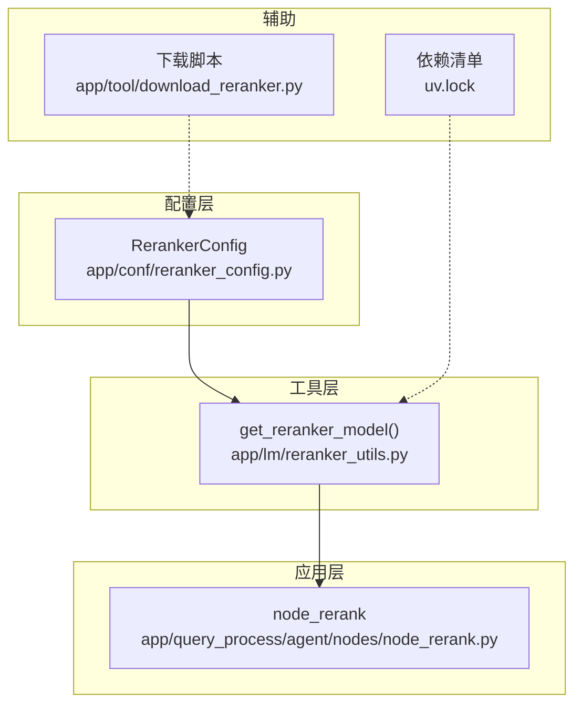
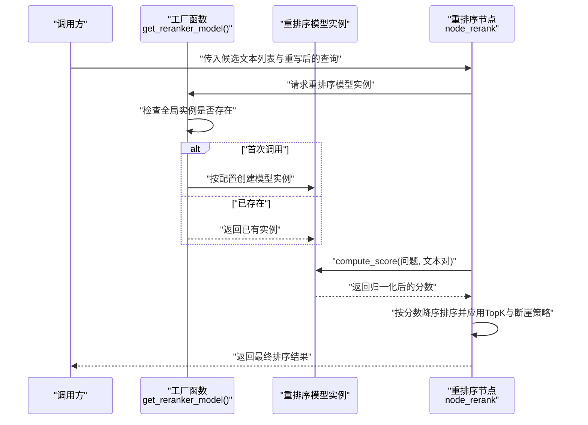
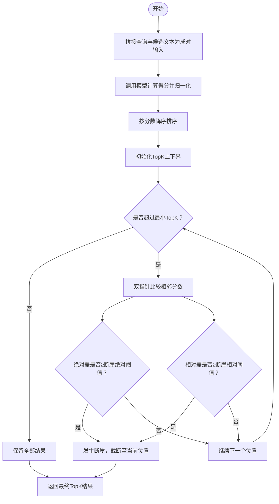
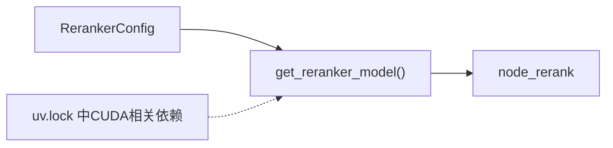

# 重排序模型配置

<cite>
**本文档引用的文件**
- [app/conf/reranker_config.py](file://app/conf/reranker_config.py)
- [app/lm/reranker_utils.py](file://app/lm/reranker_utils.py)
- [app/query_process/agent/nodes/node_rerank.py](file://app/query_process/agent/nodes/node_rerank.py)
- [app/tool/download_reranker.py](file://app/tool/download_reranker.py)
- [uv.lock](file://uv.lock)
</cite>

## 目录
1. [简介](#简介)
2. [项目结构](#项目结构)
3. [核心组件](#核心组件)
4. [架构总览](#架构总览)
5. [详细组件分析](#详细组件分析)
6. [依赖分析](#依赖分析)
7. [性能考虑](#性能考虑)
8. [故障排查指南](#故障排查指南)
9. [结论](#结论)
10. [附录](#附录)

## 简介
本文件面向“BGE重排序模型”的配置与使用，聚焦以下目标：
- 说明重排序模型的配置参数（模型路径、设备选择、半精度开关等）
- 文档化重排序算法的参数调优（TopK上限/下限、断崖绝对阈值、断崖相对阈值等）
- 解释重排序性能优化与内存管理策略
- 提供不同应用场景下的配置建议与效果对比
- 给出模型验证与结果质量评估方法

## 项目结构
围绕重排序功能的相关文件组织如下：
- 配置层：集中于重排序配置类与环境变量映射
- 工具层：提供单例化的重排序模型实例获取
- 应用层：在查询流程中调用重排序，并进行二次筛选（TopK与断崖）

图表来源
- [app/conf/reranker_config.py:1-21](file://app/conf/reranker_config.py#L1-L21)
- [app/lm/reranker_utils.py:1-14](file://app/lm/reranker_utils.py#L1-L14)
- [app/query_process/agent/nodes/node_rerank.py:82-266](file://app/query_process/agent/nodes/node_rerank.py#L82-L266)
- [app/tool/download_reranker.py:1-10](file://app/tool/download_reranker.py#L1-L10)
- [uv.lock:609-671](file://uv.lock#L609-L671)

章节来源
- [app/conf/reranker_config.py:1-21](file://app/conf/reranker_config.py#L1-L21)
- [app/lm/reranker_utils.py:1-14](file://app/lm/reranker_utils.py#L1-L14)
- [app/query_process/agent/nodes/node_rerank.py:82-266](file://app/query_process/agent/nodes/node_rerank.py#L82-L266)
- [app/tool/download_reranker.py:1-10](file://app/tool/download_reranker.py#L1-L10)
- [uv.lock:609-671](file://uv.lock#L609-L671)

## 核心组件
- 重排序配置类：封装模型路径、设备、半精度等关键参数，统一从环境变量读取并实例化
- 重排序模型工厂：提供全局单例的重排序模型实例，避免重复初始化带来的资源浪费
- 重排序节点：负责将查询与候选文本组合成成对输入，调用模型计算得分，归一化后排序，并基于断崖与TopK策略进行二次筛选

章节来源
- [app/conf/reranker_config.py:9-21](file://app/conf/reranker_config.py#L9-L21)
- [app/lm/reranker_utils.py:6-14](file://app/lm/reranker_utils.py#L6-L14)
- [app/query_process/agent/nodes/node_rerank.py:82-160](file://app/query_process/agent/nodes/node_rerank.py#L82-L160)

## 架构总览
重排序模块遵循“配置-工厂-节点”三层协作：
- 配置层：从环境变量读取参数，构造配置对象
- 工具层：根据配置创建/复用模型实例
- 应用层：在查询流程中调用模型，产出带分数的排序结果，并进行TopK与断崖过滤

图表来源
- [app/lm/reranker_utils.py:6-14](file://app/lm/reranker_utils.py#L6-L14)
- [app/query_process/agent/nodes/node_rerank.py:82-160](file://app/query_process/agent/nodes/node_rerank.py#L82-L160)

## 详细组件分析

### 配置参数与环境变量映射
- 参数项
  - 模型路径：指向本地模型目录，用于初始化重排序模型
  - 设备：指定模型运行设备（如CPU/GPU），影响推理速度与显存占用
  - 半精度：布尔开关，启用后可降低显存占用并提升吞吐，但可能牺牲少量精度
- 环境变量
  - BGE_RERANKER_LARGE：模型路径
  - BGE_RERANKER_DEVICE：设备标识
  - BGE_RERANKER_FP16：半精度开关（支持字符串/数值形式的1/true等）
- 加载机制
  - 在模块导入时提前加载.env文件，确保后续读取到正确的环境变量

章节来源
- [app/conf/reranker_config.py:6-21](file://app/conf/reranker_config.py#L6-L21)

### 重排序模型工厂
- 功能要点
  - 单例模式：全局仅创建一次模型实例，避免重复初始化
  - 参数透传：将配置中的模型路径、设备、半精度参数传递给底层模型
- 性能意义
  - 减少IO与初始化开销，提升批量处理效率；在高并发场景下尤为明显

章节来源
- [app/lm/reranker_utils.py:4-14](file://app/lm/reranker_utils.py#L4-L14)

### 重排序节点与二次筛选
- 输入输出
  - 输入：重写后的查询与候选文本列表
  - 输出：按重排序模型打分降序排列的结果，并进行TopK与断崖过滤
- 关键步骤
  - 成对拼接：将查询与每个候选文本组成一对输入
  - 计算得分：调用模型compute_score，开启归一化以获得0-1范围的稳定分数
  - 排序：按分数降序排序
  - 二次筛选：基于断崖与TopK策略动态截断，兼顾召回质量与响应效率
- 二次筛选参数（默认值）
  - 最大TopK：最多保留的条目数量
  - 最小TopK：至少保留的条目数量
  - 断崖绝对阈值：相邻分数差超过该值即视为断崖
  - 断崖相对阈值：相邻分数差相对于前一项的相对比例阈值

图表来源
- [app/query_process/agent/nodes/node_rerank.py:82-160](file://app/query_process/agent/nodes/node_rerank.py#L82-L160)

章节来源
- [app/query_process/agent/nodes/node_rerank.py:82-160](file://app/query_process/agent/nodes/node_rerank.py#L82-L160)

### 模型下载与本地缓存
- 下载行为
  - 使用模型库快照下载接口，将模型缓存到本地目录
  - 缓存目录可自定义，便于离线部署与加速启动
- 使用建议
  - 在部署前预先下载并校验模型完整性
  - 将缓存目录纳入版本管理或自动化部署流程

章节来源
- [app/tool/download_reranker.py:1-10](file://app/tool/download_reranker.py#L1-L10)

## 依赖分析
- 外部依赖
  - 模型推理框架：FlagReranker（由配置与工厂传参驱动）
  - CUDA生态：项目中包含大量NVIDIA相关依赖，表明可利用GPU加速推理
- 内部耦合
  - 配置层与工具层：配置类为工厂函数提供参数来源
  - 工具层与应用层：工厂函数为节点提供模型实例
- 循环依赖
  - 未发现循环依赖，模块职责清晰

图表来源
- [app/conf/reranker_config.py:9-21](file://app/conf/reranker_config.py#L9-L21)
- [app/lm/reranker_utils.py:6-14](file://app/lm/reranker_utils.py#L6-L14)
- [uv.lock:609-671](file://uv.lock#L609-L671)

章节来源
- [app/conf/reranker_config.py:9-21](file://app/conf/reranker_config.py#L9-L21)
- [app/lm/reranker_utils.py:6-14](file://app/lm/reranker_utils.py#L6-L14)
- [uv.lock:609-671](file://uv.lock#L609-L671)

## 性能考虑
- 模型初始化与单例
  - 通过单例避免重复初始化，显著降低冷启动时间与资源消耗
- 设备与半精度
  - 在具备CUDA能力的环境中，优先选择GPU设备以提升吞吐
  - 启用半精度可在保证可用精度的前提下减少显存占用，提高批处理规模
- 归一化与排序
  - 归一化后的分数范围稳定，有利于后续TopK与断崖策略的一致性
- 二次筛选策略
  - 动态TopK与断崖过滤可有效去除尾部噪声，缩短下游处理链路
- 批处理与内存
  - 将候选文本成对拼接后一次性计算得分，减少多次调用开销
  - 若候选规模较大，可结合外部批处理策略或分页截断，避免内存峰值过高

章节来源
- [app/lm/reranker_utils.py:6-14](file://app/lm/reranker_utils.py#L6-L14)
- [app/query_process/agent/nodes/node_rerank.py:82-160](file://app/query_process/agent/nodes/node_rerank.py#L82-L160)
- [uv.lock:609-671](file://uv.lock#L609-L671)

## 故障排查指南
- 环境变量未生效
  - 确认.env文件路径与键名正确，且在模块导入前已加载
  - 检查布尔值映射逻辑（支持字符串/数值形式）
- 模型路径无效
  - 确认本地模型目录完整且包含所需文件
  - 如需重新下载，参考模型下载脚本
- 设备不可用
  - 检查设备标识是否与实际硬件匹配（如CUDA设备号）
  - 在无GPU环境下可切换至CPU设备
- 半精度异常
  - 部分设备或驱动版本可能不完全支持半精度，可关闭该选项
- 排序结果异常
  - 确认候选文本与查询拼接逻辑正确
  - 检查归一化开关与二次筛选参数是否符合预期
- 性能瓶颈
  - 观察是否因重复初始化导致的额外开销
  - 调整设备与半精度策略，评估吞吐与延迟权衡

章节来源
- [app/conf/reranker_config.py:6-21](file://app/conf/reranker_config.py#L6-L21)
- [app/tool/download_reranker.py:1-10](file://app/tool/download_reranker.py#L1-L10)
- [app/query_process/agent/nodes/node_rerank.py:82-160](file://app/query_process/agent/nodes/node_rerank.py#L82-L160)

## 结论
本配置体系以简洁明确的参数映射与单例工厂为核心，配合节点级的二次筛选策略，在保证质量的同时兼顾性能与稳定性。通过合理设置设备与半精度、调优TopK与断崖阈值，可在不同场景下取得更优的召回与响应表现。

## 附录

### 参数对照表
- 模型路径：BGE_RERANKER_LARGE
- 设备：BGE_RERANKER_DEVICE
- 半精度：BGE_RERANKER_FP16（支持1/true等）
- 二次筛选参数（默认值）
  - 最大TopK：RERANK_MAX_TOPK
  - 最小TopK：RERANK_MIN_TOPK
  - 断崖绝对阈值：RERANK_GAP_ABS
  - 断崖相对阈值：RERANK_GAP_RATIO

章节来源
- [app/conf/reranker_config.py:16-20](file://app/conf/reranker_config.py#L16-L20)
- [app/query_process/agent/nodes/node_rerank.py:14-20](file://app/query_process/agent/nodes/node_rerank.py#L14-L20)

### 应用场景与配置建议
- 高精度检索（如法律/医疗问答）
  - 建议：启用GPU设备与半精度；适当提高最大TopK；适度收紧断崖相对阈值以保留更细粒度差异
- 低延迟服务（如在线客服）
  - 建议：启用GPU设备；关闭半精度以换取更稳的精度；降低最大TopK；适度放宽断崖阈值以减少截断
- 资源受限环境（如边缘设备）
  - 建议：使用CPU设备；关闭半精度；减小最大TopK；严格控制候选规模

### 效果评估方法
- 模型验证
  - 使用本地测试入口对典型查询与候选样本进行端到端验证，确认打分非零且顺序合理
- 结果质量评估
  - 人工抽样评估TopK内命中率与相关性
  - 对比不同阈值组合下的召回与精确率曲线，选择帕累托最优点

章节来源
- [app/query_process/agent/nodes/node_rerank.py:211-266](file://app/query_process/agent/nodes/node_rerank.py#L211-L266)