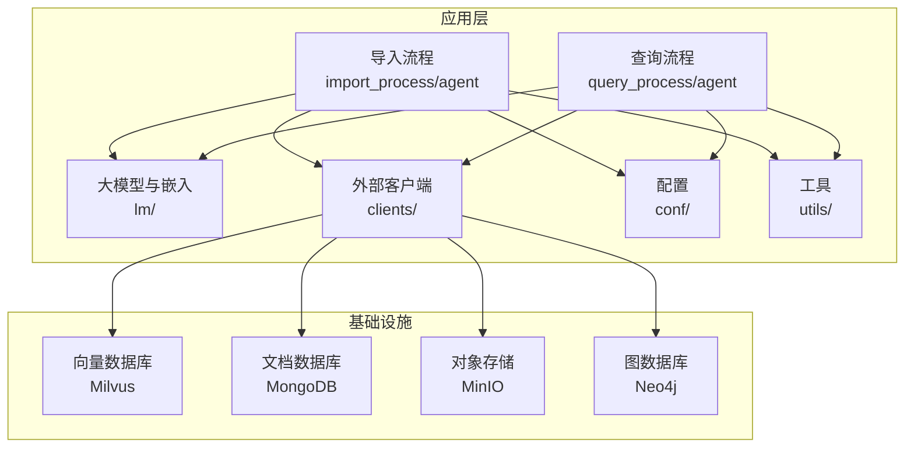
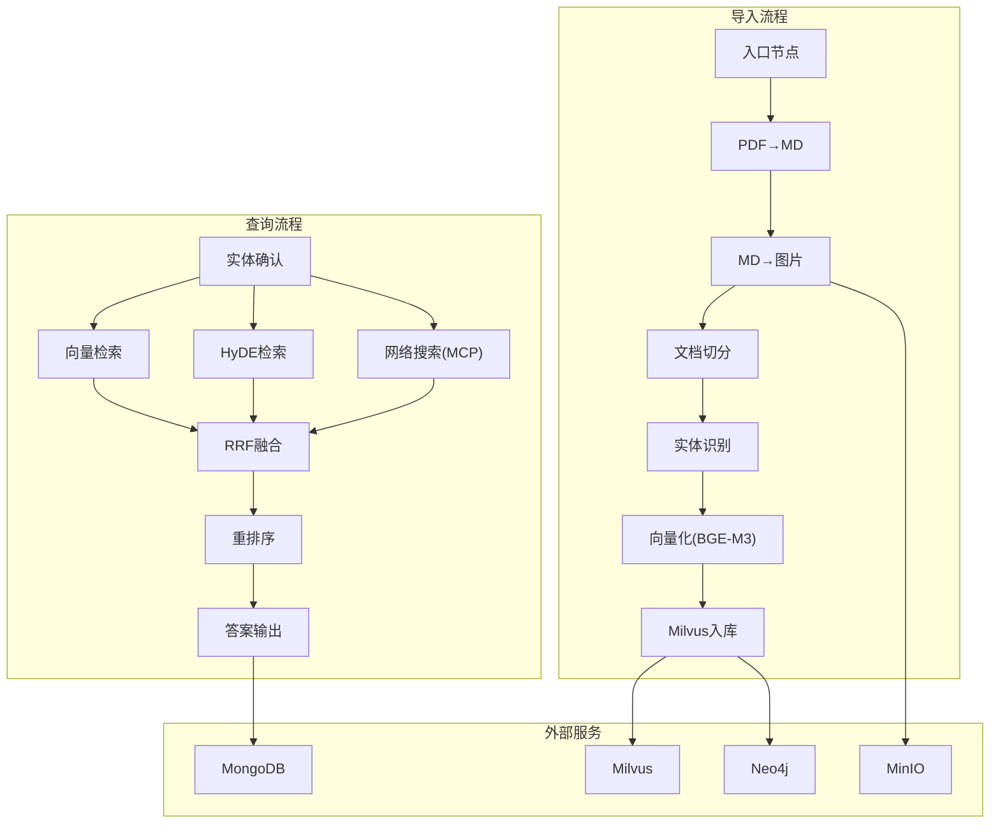
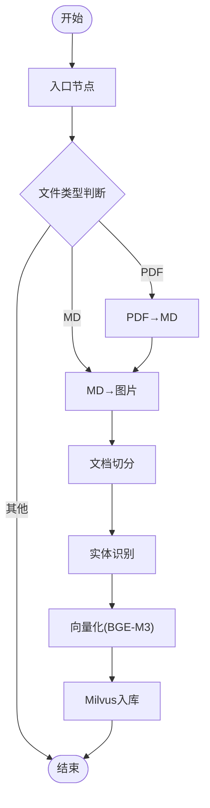
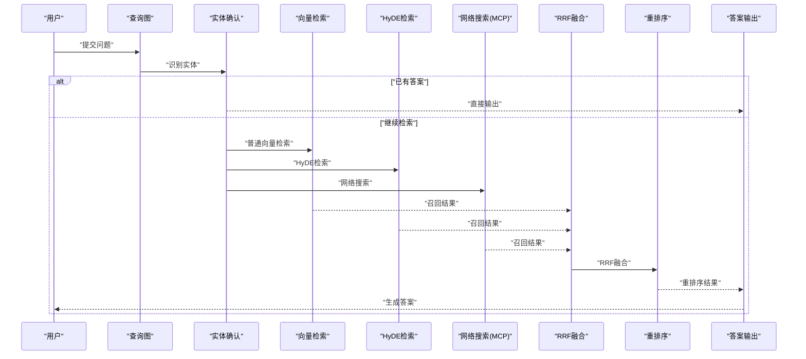
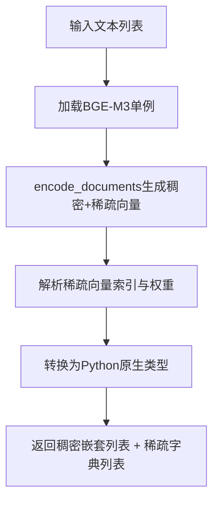
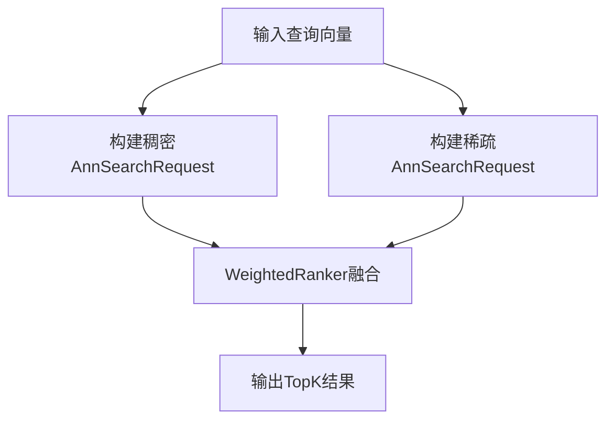
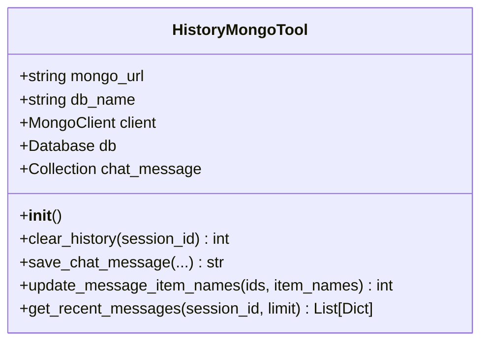
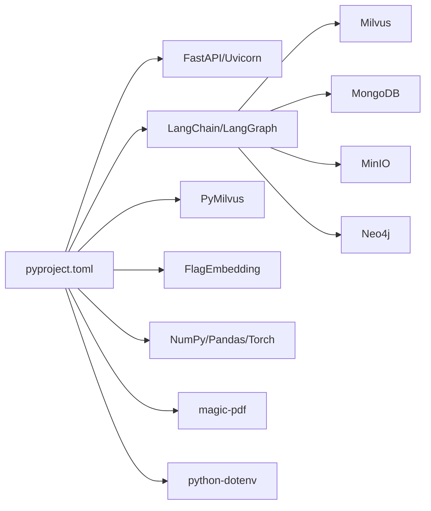

# 项目概述

<cite>
**本文引用的文件**
- [pyproject.toml](file://pyproject.toml)
- [项目要总结内容.txt](file://项目要总结内容.txt)
- [docs/项目要总结内容.txt](file://docs/项目要总结内容.txt)
- [app/import_process/导入过程记录文档.txt](file://app/import_process/导入过程记录文档.txt)
- [app/import_process/agent/main_graph.py](file://app/import_process/agent/main_graph.py)
- [app/query_process/agent/main_graph.py](file://app/query_process/agent/main_graph.py)
- [app/import_process/agent/state.py](file://app/import_process/agent/state.py)
- [app/query_process/agent/state.py](file://app/query_process/agent/state.py)
- [app/lm/embedding_utils.py](file://app/lm/embedding_utils.py)
- [app/lm/reranker_utils.py](file://app/lm/reranker_utils.py)
- [app/clients/milvus_utils.py](file://app/clients/milvus_utils.py)
- [app/clients/mongo_history_utils.py](file://app/clients/mongo_history_utils.py)
- [app/conf/embedding_config.py](file://app/conf/embedding_config.py)
- [app/conf/lm_config.py](file://app/conf/lm_config.py)
- [app/conf/milvus_config.py](file://app/conf/milvus_config.py)
- [app/conf/reranker_config.py](file://app/conf/reranker_config.py)
</cite>

## 目录
1. [简介](#简介)
2. [项目结构](#项目结构)
3. [核心组件](#核心组件)
4. [架构总览](#架构总览)
5. [详细组件分析](#详细组件分析)
6. [依赖分析](#依赖分析)
7. [性能考虑](#性能考虑)
8. [故障排查指南](#故障排查指南)
9. [结论](#结论)
10. [附录](#附录)

## 简介
本项目是一个基于 RAG（检索增强生成）的智能问答与知识管理平台，围绕“导入—检索—生成”闭环构建。系统通过 LangGraph 将导入与查询两大流程编排为可扩展的状态机图，结合多模态嵌入、稀疏/稠密混合向量检索、重排序与多路召回策略，实现高准确率的知识问答与知识入库。

RAG 的基本思想是：在生成答案前，先从知识库中检索最相关的片段，再将这些片段与用户问题一起作为上下文输入到大模型，从而提升回答的准确性与可溯源性。本项目在导入侧完成 PDF/Markdown 的解析、切分、实体识别与向量化入库，在查询侧实现多路召回（向量、HyDE、网络搜索）、RRF 融合与重排序，最终生成答案。

## 项目结构
项目采用按功能域划分的层次化组织方式：
- app/clients：外部服务客户端封装（Milvus、Mongo、MinIO、Neo4j 等）
- app/conf：各类配置对象（Embedding、LLM、Milvus、重排序器等）
- app/core：通用工具与日志
- app/import_process：知识导入流程（LangGraph 状态图与节点）
- app/query_process：查询流程（LangGraph 状态图与节点）
- app/lm：大模型与嵌入相关工具
- app/utils：通用工具（速率限制、SSE、任务调度等）
- app/tool：模型下载辅助工具
- docs 与项目要总结内容：知识整理与要点提炼

图表来源
- [app/import_process/agent/main_graph.py:1-134](file://app/import_process/agent/main_graph.py#L1-L134)
- [app/query_process/agent/main_graph.py:1-47](file://app/query_process/agent/main_graph.py#L1-L47)
- [app/clients/milvus_utils.py:1-198](file://app/clients/milvus_utils.py#L1-L198)
- [app/clients/mongo_history_utils.py:1-242](file://app/clients/mongo_history_utils.py#L1-L242)

章节来源
- [pyproject.toml:1-36](file://pyproject.toml#L1-L36)
- [项目要总结内容.txt:1-22](file://项目要总结内容.txt#L1-L22)
- [docs/项目要总结内容.txt:1-22](file://docs/项目要总结内容.txt#L1-L22)

## 核心组件
- 导入流程（Import Graph）
  - 通过 LangGraph 将 PDF/Markdown 解析、切分、实体识别、向量化、Milvus 入库串联为状态图。
  - 关键节点：入口、PDF→MD、MD→图片、切分、实体识别、向量化、Milvus 入库。
- 查询流程（Query Graph）
  - 多路召回（普通向量、HyDE、Web 搜索）+ RRF 融合 + 重排序 + 答案生成。
  - 关键节点：实体确认、三路召回、RRF、重排序、答案输出。
- 嵌入与重排序
  - BGE-M3 混合向量（稠密+稀疏），Milvus IP/COSINE 混合检索与加权融合。
  - BGE 重排序器进行细粒度重排。
- 外部服务集成
  - Milvus：向量检索与入库
  - MongoDB：历史对话持久化
  - MinIO/Neo4j：按需扩展（在客户端工具中提供封装）

章节来源
- [app/import_process/agent/main_graph.py:1-134](file://app/import_process/agent/main_graph.py#L1-L134)
- [app/query_process/agent/main_graph.py:1-47](file://app/query_process/agent/main_graph.py#L1-L47)
- [app/lm/embedding_utils.py:1-108](file://app/lm/embedding_utils.py#L1-L108)
- [app/lm/reranker_utils.py:1-14](file://app/lm/reranker_utils.py#L1-L14)
- [app/clients/milvus_utils.py:1-198](file://app/clients/milvus_utils.py#L1-L198)
- [app/clients/mongo_history_utils.py:1-242](file://app/clients/mongo_history_utils.py#L1-L242)

## 架构总览
系统采用“流程编排 + 多模态嵌入 + 向量检索 + 外部服务”的分层架构：
- 流程编排：LangGraph 将导入与查询拆分为可组合的状态图，节点间通过 TypedDict 状态传递数据。
- 多模态嵌入：BGE-M3 生成稠密+稀疏混合向量，适配 Milvus 的 IP/COSINE 检索。
- 检索与融合：混合检索（稠密+稀疏）+ RRF 融合 + 重排序，提升召回质量。
- 外部服务：Milvus 存储向量与元数据；MongoDB 存储对话历史；MinIO/Neo4j 可扩展为对象存储与图谱。

图表来源
- [app/import_process/agent/main_graph.py:1-134](file://app/import_process/agent/main_graph.py#L1-L134)
- [app/query_process/agent/main_graph.py:1-47](file://app/query_process/agent/main_graph.py#L1-L47)
- [app/clients/milvus_utils.py:1-198](file://app/clients/milvus_utils.py#L1-L198)
- [app/clients/mongo_history_utils.py:1-242](file://app/clients/mongo_history_utils.py#L1-L242)

## 详细组件分析

### 导入流程（Import Graph）
- 状态定义：ImportGraphState 覆盖任务控制、路径、内容数据与数据库相关字段，提供默认状态工厂。
- 节点职责：
  - 入口：根据文件类型路由到 PDF→MD 或 MD→图片路径
  - PDF→MD：将 PDF 转换为 Markdown
  - MD→图片：提取图片并保存
  - 文档切分：将 Markdown 切分为可向量化的片段
  - 实体识别：识别文档主体名称，增强检索
  - 向量化：使用 BGE-M3 生成稠密+稀疏向量
  - Milvus 入库：将向量与元数据写入集合
- 控制流：条件边根据文件类型动态路由，静态边串联后续步骤，最终结束。

图表来源
- [app/import_process/agent/main_graph.py:19-65](file://app/import_process/agent/main_graph.py#L19-L65)
- [app/import_process/agent/state.py:5-91](file://app/import_process/agent/state.py#L5-L91)

章节来源
- [app/import_process/agent/main_graph.py:1-134](file://app/import_process/agent/main_graph.py#L1-L134)
- [app/import_process/agent/state.py:1-99](file://app/import_process/agent/state.py#L1-L99)
- [app/import_process/导入过程记录文档.txt:1-20](file://app/import_process/导入过程记录文档.txt#L1-L20)

### 查询流程（Query Graph）
- 状态定义：QueryGraphState 覆盖会话、原始问题、各路召回结果、RRF 融合、重排序与最终答案，提供默认状态工厂与复制函数。
- 节点职责：
  - 实体确认：识别商品名称等关键实体
  - 向量检索：普通向量检索
  - HyDE 检索：基于假设文档的向量检索
  - 网络搜索（MCP）：通过 MCP 服务器进行网络检索
  - RRF 融合：将多路召回结果按权重融合
  - 重排序：使用重排序器细化排序
  - 答案输出：组装 Prompt 并生成最终答案
- 控制流：实体确认后根据是否有答案决定直接输出或进入多路召回；随后统一汇聚到 RRF、重排序与答案输出。

图表来源
- [app/query_process/agent/main_graph.py:12-47](file://app/query_process/agent/main_graph.py#L12-L47)
- [app/query_process/agent/state.py:5-81](file://app/query_process/agent/state.py#L5-L81)

章节来源
- [app/query_process/agent/main_graph.py:1-47](file://app/query_process/agent/main_graph.py#L1-L47)
- [app/query_process/agent/state.py:1-97](file://app/query_process/agent/state.py#L1-L97)

### 嵌入与重排序（BGE-M3 与重排序器）
- BGE-M3 混合向量
  - 单例模式加载模型，支持本地路径或远程仓库标识
  - 输出稠密+稀疏向量，自动 L2 归一化，适配 Milvus IP/COSINE 检索
  - 稀疏向量索引与权重转换为 Python 原生类型，确保 JSON 序列化与 Milvus 入库兼容
- 重排序器
  - 单例模式加载 BGE 重排序器，支持设备与半精度配置

图表来源
- [app/lm/embedding_utils.py:51-97](file://app/lm/embedding_utils.py#L51-L97)
- [app/lm/reranker_utils.py:6-14](file://app/lm/reranker_utils.py#L6-L14)

章节来源
- [app/lm/embedding_utils.py:1-108](file://app/lm/embedding_utils.py#L1-L108)
- [app/lm/reranker_utils.py:1-14](file://app/lm/reranker_utils.py#L1-L14)
- [app/conf/embedding_config.py:1-24](file://app/conf/embedding_config.py#L1-L24)
- [app/conf/reranker_config.py:1-21](file://app/conf/reranker_config.py#L1-L21)

### Milvus 客户端与混合检索
- 客户端单例：避免重复连接，提供 get 方法与回退 query 方法
- ID 转换：将 chunk_id 转为 INT64，分离无效 ID
- 混合搜索：分别构造稠密/稀疏 AnnSearchRequest，使用 WeightedRanker 融合，支持归一化评分与自定义权重
- 批量查询：按 batch_size 分批查询，提升稳定性与性能

图表来源
- [app/clients/milvus_utils.py:117-155](file://app/clients/milvus_utils.py#L117-L155)
- [app/clients/milvus_utils.py:158-195](file://app/clients/milvus_utils.py#L158-L195)

章节来源
- [app/clients/milvus_utils.py:1-198](file://app/clients/milvus_utils.py#L1-L198)
- [app/conf/milvus_config.py:1-26](file://app/conf/milvus_config.py#L1-L26)

### MongoDB 历史对话工具
- 单例模式：模块加载时尝试初始化，失败时懒加载兜底
- 功能：清空历史、保存/更新消息、批量更新商品名称、查询最近消息
- 索引：复合索引（session_id, ts），支持按会话快速检索最新记录

图表来源
- [app/clients/mongo_history_utils.py:21-84](file://app/clients/mongo_history_utils.py#L21-L84)

章节来源
- [app/clients/mongo_history_utils.py:1-242](file://app/clients/mongo_history_utils.py#L1-L242)

## 依赖分析
- 技术栈与选择理由
  - FastAPI + Uvicorn：高性能异步 Web 框架，适合 API 与 SSE 场景
  - LangChain/LangGraph：统一的大模型接入与流程编排框架，便于多路召回与状态管理
  - PyMilvus：官方 Milvus 客户端，支持混合向量与 WeightedRanker 融合
  - FlagEmbedding：提供高效的重排序器，适合细粒度排序
  - NumPy/Pandas/Torch：数值计算与深度学习基础
  - magic-pdf：高质量 PDF→Markdown 转换
  - python-dotenv：环境变量集中管理，便于配置迁移
- 外部依赖
  - Milvus：向量检索与入库
  - MongoDB：对话历史持久化
  - MinIO/Neo4j：对象存储与图谱（按需扩展）

图表来源
- [pyproject.toml:9-35](file://pyproject.toml#L9-L35)

章节来源
- [pyproject.toml:1-36](file://pyproject.toml#L1-L36)
- [项目要总结内容.txt:5-16](file://项目要总结内容.txt#L5-L16)
- [docs/项目要总结内容.txt:5-16](file://docs/项目要总结内容.txt#L5-L16)

## 性能考虑
- 模型加载与缓存
  - BGE-M3 与重排序器均采用单例模式，避免重复初始化带来的资源与时间开销
- 向量化与入库
  - 输出向量格式适配 Milvus 与 JSON 序列化，减少类型转换成本
  - 批量查询按 batch_size 分批，降低单次请求压力
- 检索融合
  - WeightedRanker 融合与可选归一化评分，平衡不同向量空间的评分尺度
- I/O 与并发
  - FastAPI/Uvicorn 提供异步能力，结合 SSE 支持流式输出
  - LangGraph 流式执行，便于可观测与调试

## 故障排查指南
- Milvus 连接失败
  - 检查 MILVUS_URL 环境变量是否正确；查看连接日志与异常堆栈
- 向量生成异常
  - 确认输入为非空列表；检查 BGE-M3 模型路径/设备/半精度配置
- 重排序器初始化失败
  - 校验 BGE 重排序器路径与设备配置
- MongoDB 写入/查询异常
  - 查看索引创建与权限；确认会话 ID 与时间戳字段一致性
- 导入流程卡顿
  - 关注 LangGraph 流式输出节点进度；检查 PDF→MD/切分/实体识别等步骤耗时

章节来源
- [app/clients/milvus_utils.py:16-31](file://app/clients/milvus_utils.py#L16-L31)
- [app/lm/embedding_utils.py:46-48](file://app/lm/embedding_utils.py#L46-L48)
- [app/lm/reranker_utils.py:8-13](file://app/lm/reranker_utils.py#L8-L13)
- [app/clients/mongo_history_utils.py:52-56](file://app/clients/mongo_history_utils.py#L52-L56)

## 结论
本项目以 LangGraph 为核心，将导入与查询两大流程模块化、可视化地编排，结合 BGE-M3 混合向量与 Milvus 的混合检索、RRF 融合与重排序，形成高准确率的 RAG 系统。通过单例化模型与客户端、批量化处理与流式输出，兼顾性能与可维护性。配合 MongoDB 的历史对话持久化与可扩展的外部服务集成，系统具备良好的工程落地能力。

## 附录
- RAG 面试常见问题（摘自项目资料）
  - RAG 的概念与宏观步骤
  - 项目中 RAG 的具体步骤
  - 五点保证召回准确性的措施
  - 核心技术栈：多路召回、LangChain、LangGraph、大模型（LLM/Embedding/Rerank/VLM）、第三方工具（Milvus、MinIO、MongoDB、OpenAI MCP、百炼、MinerU）
  - 项目节点与步骤梳理（参考导入过程记录文档）

章节来源
- [项目要总结内容.txt:3-18](file://项目要总结内容.txt#L3-L18)
- [docs/项目要总结内容.txt:3-18](file://docs/项目要总结内容.txt#L3-L18)
- [app/import_process/导入过程记录文档.txt:1-20](file://app/import_process/导入过程记录文档.txt#L1-L20)